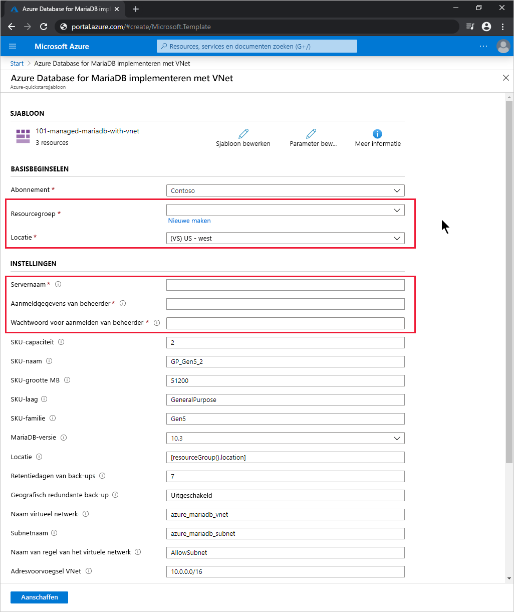

# <a name="quickstart-use-an-arm-template-to-create-an-azure-database-for-mariadb-server"></a>Quickstart: Een ARM-sjabloon gebruiken om een Azure Database for MariaDB-server te maken

Azure Database for MariaDB is een beheerde service waarmee u MariaDB-databases met hoge beschikbaarheid in de cloud kunt uitvoeren, beheren en schalen. In deze quickstart gebruikt u een Azure Resource Manager-sjabloon (ARM-sjabloon) om een Azure Database for MariaDB - enkele server te maken in Azure Portal, PowerShell of Azure CLI.

[!INCLUDE [About Azure Resource Manager](../../includes/resource-manager-quickstart-introduction.md)]

Als uw omgeving voldoet aan de vereisten en u benkend bent met het gebruik van ARM-sjablonen, selecteert u de knop **Implementeren naar Azure**. De sjabloon wordt in Azure Portal geopend.

[](https://portal.azure.com/#create/Microsoft.Template/uri/https%3a%2f%2fraw.githubusercontent.com%2fAzure%2fazure-quickstart-templates%2fmaster%2f101-managed-mariadb-with-vnet%2fazuredeploy.json)

## <a name="prerequisites"></a>Vereisten

# <a name="portal"></a>[Portal](#tab/azure-portal)

Een Azure-account met een actief abonnement. [Maak er gratis een](https://azure.microsoft.com/free/).

# <a name="powershell"></a>[PowerShell](#tab/PowerShell)

* Een Azure-account met een actief abonnement. [Maak er gratis een](https://azure.microsoft.com/free/).
* Als u de code lokaal wilt uitvoeren, [Azure PowerShell](/powershell/azure/).

# <a name="cli"></a>[CLI](#tab/CLI)

* Een Azure-account met een actief abonnement. [Maak er gratis een](https://azure.microsoft.com/free/).
* Als u de code lokaal wilt uitvoeren, [Azure CLI](/cli/azure/).

---

## <a name="review-the-template"></a>De sjabloon controleren

U maakt een Azure Database for MariaDB-server met een gedefinieerde set reken- en opslagresources. Zie [Prijscategorieën in Azure Database for MariaDB](concepts-pricing-tiers.md) voor meer informatie. De server wordt gemaakt binnen een [Azure-resourcegroep](../azure-resource-manager/management/overview.md).

De sjabloon die in deze quickstart wordt gebruikt, komt uit [Azure-quickstartsjablonen](https://azure.microsoft.com/resources/templates/101-managed-mariadb-with-vnet/).

:::code language="json" source="~/quickstart-templates/101-managed-mariadb-with-vnet/azuredeploy.json":::

In de sjabloon zijn vijf Azure-resources gedefinieerd:

* [**Microsoft.Network/virtualNetworks**](/azure/templates/microsoft.network/virtualnetworks)
* [**Microsoft.Network/virtualNetworks/subnets**](/azure/templates/microsoft.network/virtualnetworks/subnets)
* [**Microsoft.DBforMariaDB/servers**](/azure/templates/microsoft.dbformariadb/servers)
* [**Microsoft.DBforMariaDB/servers/virtualNetworkRules**](/azure/templates/microsoft.dbformariadb/servers/virtualnetworkrules)
* [**Microsoft.DBforMariaDB/servers/firewallRules**](/azure/templates/microsoft.dbformariadb/servers/firewallrules)

Meer Azure Database for MariaDB-sjabloonvoorbeelden vindt u in [Azure-quickstartsjablonen](https://azure.microsoft.com/resources/templates/?resourceType=Microsoft.Dbformariadb&pageNumber=1&sort=Popular).

## <a name="deploy-the-template"></a>De sjabloon implementeren

# <a name="portal"></a>[Portal](#tab/azure-portal)

Selecteer de volgende koppeling om de Azure Database for MariaDB-serversjabloon te implementeren in Azure Portal:

[](https://portal.azure.com/#create/Microsoft.Template/uri/https%3a%2f%2fraw.githubusercontent.com%2fAzure%2fazure-quickstart-templates%2fmaster%2f101-managed-mariadb-with-vnet%2fazuredeploy.json)

Doe het volgende op de pagina **Azure Database for MariaDB implementeren met VNet**:

1. Selecteer voor **Resourcegroep** de optie **Nieuwe maken**, voer een naam in voor de nieuwe resourcegroep en selecteer **OK**.

2. Als u een nieuwe resourcegroep hebt gemaakt, selecteert u een **Locatie** voor de resourcegroep en de nieuwe server.

3. Voer gegevens bij **Servernaam**, **Aanmelden beheerder** en  **Wachtwoord aanmelden beheerder** in.

    

4. Wijzig desgewenst de andere standaardinstellingen:

    * **Abonnement**: het Azure abonnement dat u wilt gebruiken voor de server.
    * **SKU-capaciteit**: de capaciteit van de vCore, die *2* (de standaardinstelling), *4*, *8*, *16*, *32* of *64* kan zijn.
    * **SKU-naam**: het voorvoegsel van de SKU-laag, de SKU-familie en de SKU-capaciteit, verbonden door middel van onderstrepingstekens, zoals *B_Gen5_1*, *GP_Gen5_2* (de standaardinstelling) of *MO_Gen5_32*.
    * **SKU-grootte MB**: de opslaggrootte, in megabytes, van de Azure Database for MariaDB-server (standaard *51200*).
    * **SKU-laag**: de implementatielaag, zoals *Basic*, *GeneralPurpose* (de standaardinstelling) of *MemoryOptimized*.
    * **SKU-familie**: *Gen4* of *Gen5* (de standaardinstelling), wat de hardwaregeneratie voor de serverimplementatie aangeeft.
    * **MariaDB-versie**: de versie van de MariaDB-server die u wilt implementeren, zoals *10.2* of *10.3* (de standaardinstelling).
    * **Retentiedagen van back-ups**: de gewenste periode voor het bewaren van geo-redundante back-ups, in dagen (standaard *7*).
    * **Geografisch redundante back-up**: *Ingeschakeld* of *Uitgeschakeld* (de standaardinstelling), afhankelijk van de vereisten voor geo-herstel na noodgevallen (geo-DR).
    * **Naam van virtueel netwerk**: de naam van het virtuele netwerk (standaard *azure_mariadb_vnet*).
    * **Subnetnaam**: de naam van het subnet (standaard *azure_mariadb_subnet*).
    * **Naam van regel van het virtuele netwerk**: de naam van de regel van het virtuele netwerk waarmee het subnet wordt toegestaan (standaard *AllowSubnet*).
    * **Adresvoorvoegsel VNet**: het adresvoorvoegsel voor het virtuele netwerk (standaard *10.0.0.0/16*).
    * **Subnetvoorvoegsel**: het adresvoorvoegsel voor het subnet (standaard *10.0.0.0/16*).

5. Lees de voorwaarden en schakel vervolgens het selectievakje **Ik ga akkoord met de bovenstaande voorwaarden** in.

6. Selecteer **Aankoop**.

# <a name="powershell"></a>[PowerShell](#tab/PowerShell)

Gebruik de volgende interactieve code om een nieuwe Azure Database for MariaDB-server te maken met behulp van de sjabloon. De code vraagt u om de naam van de nieuwe server, de naam en de locatie van een nieuwe resourcegroep en een naam en wachtwoord voor een beheerdersaccount op te geven.

Als u de code in Azure Cloud Shell wilt uitvoeren, selecteert u **Probeer het nu** in de linkerbovenhoek van een willekeurig codeblok.

```azurepowershell-interactive
$serverName = Read-Host -Prompt "Enter a name for the new Azure Database for MariaDB server"
$resourceGroupName = Read-Host -Prompt "Enter a name for the new resource group where the server will exist"
$location = Read-Host -Prompt "Enter an Azure region (for example, centralus) for the resource group"
$adminUser = Read-Host -Prompt "Enter the Azure Database for MariaDB server's administrator account name"
$adminPassword = Read-Host -Prompt "Enter the administrator password" -AsSecureString

New-AzResourceGroup -Name $resourceGroupName -Location $location # Use this command when you need to create a new resource group for your deployment
New-AzResourceGroupDeployment -ResourceGroupName $resourceGroupName `
    -TemplateUri https://raw.githubusercontent.com/Azure/azure-quickstart-templates/master/101-managed-mariadb-with-vnet/azuredeploy.json `
    -serverName $serverName `
    -administratorLogin $adminUser `
    -administratorLoginPassword $adminPassword

Read-Host -Prompt "Press [ENTER] to continue: "
```

# <a name="cli"></a>[CLI](#tab/CLI)

Gebruik de volgende interactieve code om een nieuwe Azure Database for MariaDB-server te maken met behulp van de sjabloon. De code vraagt u om de naam van de nieuwe server, de naam en de locatie van een nieuwe resourcegroep en een naam en wachtwoord voor een beheerdersaccount op te geven.

Als u de code in Azure Cloud Shell wilt uitvoeren, selecteert u **Probeer het nu** in de linkerbovenhoek van een willekeurig codeblok.

```azurecli-interactive
read -p "Enter a name for the new Azure Database for MariaDB server:" serverName &&
read -p "Enter a name for the new resource group where the server will exist:" resourceGroupName &&
read -p "Enter an Azure region (for example, centralus) for the resource group:" location &&
read -p "Enter the Azure Database for MariaDB server's administrator account name:" adminUser &&
read -p "Enter the administrator password:" adminPassword &&
params='serverName='$serverName' administratorLogin='$adminUser' administratorLoginPassword='$adminPassword &&
az group create --name $resourceGroupName --location $location &&
az deployment group create --resource-group $resourceGroupName --parameters $params --template-uri https://raw.githubusercontent.com/Azure/azure-quickstart-templates/master/101-managed-mariadb-with-vnet/azuredeploy.json &&
read -p "Press [ENTER] to continue: "
```

---

## <a name="review-deployed-resources"></a>Geïmplementeerde resources bekijken

# <a name="portal"></a>[Portal](#tab/azure-portal)

Volg deze stappen om een overzicht van uw nieuwe Azure Database for MariaDB-server te bekijken:

1. Zoek en selecteer **Azure Database for MariaDB-servers** in de [Azure Portal](https://portal.azure.com).

2. Selecteer uw nieuwe server in de lijst met databases. De pagina **Overzicht** voor uw nieuwe Azure Database for MariaDB-server wordt weergegeven.

# <a name="powershell"></a>[PowerShell](#tab/PowerShell)

Voer de volgende interactieve code uit om details te bekijken van uw Azure Database for MariaDB-server. U moet de naam van de nieuwe server invoeren.

```azurepowershell-interactive
$serverName = Read-Host -Prompt "Enter the name of your Azure Database for MariaDB server"
Get-AzResource -ResourceType "Microsoft.DbForMariaDB/servers" -Name $serverName | ft
Read-Host -Prompt "Press [ENTER] to continue: "
```

# <a name="cli"></a>[CLI](#tab/CLI)

Voer de volgende interactieve code uit om details te bekijken van uw Azure Database for MariaDB-server. U moet de naam en de resourcegroep van de nieuwe server opgeven.

```azurecli-interactive
read -p "Enter your Azure Database for MariaDB server name: " serverName &&
read -p "Enter the resource group where the Azure Database for MariaDB server exists: " resourcegroupName &&
az resource show --resource-group $resourcegroupName --name $serverName --resource-type "Microsoft.DbForMariaDB/servers" &&
read -p "Press [ENTER] to continue: "
```

---

## <a name="clean-up-resources"></a>Resources opschonen

Als de resourcegroep niet meer nodig is, verwijdert u deze. Hierdoor worden ook de resources in de resourcegroep verwijderd.

# <a name="portal"></a>[Portal](#tab/azure-portal)

1. Zoek en selecteer [Resourcegroepen](https://portal.azure.com) in **Azure Portal**.

2. Kies in de lijst met resourcegroepen de naam van uw resourcegroep.

3. Selecteer op de pagina **Overzicht** van uw resourcegroep de optie **Resourcegroep verwijderen**.

4. Typ de naam van de resourcegroep in het bevestigingsvenster. Selecteer vervolgens **Verwijderen**.

# <a name="powershell"></a>[PowerShell](#tab/PowerShell)

```azurepowershell-interactive
$resourceGroupName = Read-Host -Prompt "Enter the Resource Group name"
Remove-AzResourceGroup -Name $resourceGroupName
Read-Host -Prompt "Press [ENTER] to continue: "
```

# <a name="cli"></a>[CLI](#tab/CLI)

```azurecli-interactive
read -p "Enter the Resource Group name: " resourceGroupName &&
az group delete --name $resourceGroupName &&
read -p "Press [ENTER] to continue: "
```

---

## <a name="next-steps"></a>Volgende stappen

Zie voor een stapsgewijze zelfstudie die u door het proces van het maken van een ARM-sjabloon leidt:

> [!div class="nextstepaction"]
> [Zelfstudie: Uw eerste ARM-sjabloon maken en implementeren](../azure-resource-manager/templates/template-tutorial-create-first-template.md)
