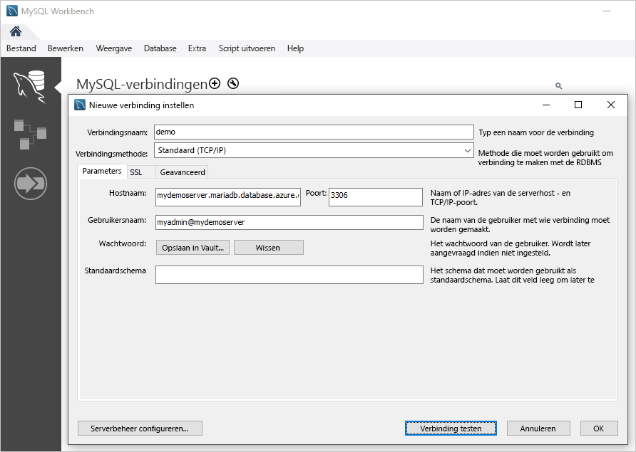

# <a name="quickstart-create-an-azure-database-for-mariadb-server-using-powershell"></a>Quickstart: Een Azure Database for MariaDB-server maken met behulp van PowerShell

In deze quickstart wordt beschreven hoe u met PowerShell een Azure Database for MariaDB-server maakt in een Azure-resourcegroep. U kunt PowerShell gebruiken om Azure-resources interactief of in scripts te maken en te beheren.

## <a name="prerequisites"></a>Vereisten

Als u nog geen Azure-abonnement hebt, maakt u een [gratis account](https://azure.microsoft.com/free/) voordat u begint.

Als u PowerShell lokaal wilt gebruiken, moet u voor dit artikel de Az-module van PowerShell installeren en verbinding maken met uw Azure-account met behulp van de cmdlet [Connect-AzAccount](https://docs.microsoft.com/powershell/module/az.accounts/connect-azaccount). Zie [Azure PowerShell installeren](https://docs.microsoft.com/powershell/azure/install-az-ps) voor meer informatie over het installeren van de Az-module van PowerShell.

> [!IMPORTANT]
> Hoewel de PowerShell-module Az.MariaDb in preview is, moet u deze afzonderlijk van de Az-module van PowerShell installeren met behulp van de volgende opdracht: `Install-Module -Name Az.MariaDb -AllowPrerelease`.
> Zodra de PowerShell-module Az.MariaDb algemeen beschikbaar is, wordt het onderdeel van toekomstige releases van Az PowerShell en is de module systeemeigen beschikbaar vanuit Azure Cloud Shell.

Als dit de eerste keer is dat u de Azure Database for MariaDB-service gebruikt, moet u de **Microsoft.DBforMariaDB** resourceprovider registreren.

```azurepowershell-interactive
Register-AzResourceProvider -ProviderNamespace Microsoft.DBforMariaDB
```

[!INCLUDE [cloud-shell-try-it](../../includes/cloud-shell-try-it.md)]

Als u meerdere Azure-abonnementen hebt, kiest u het juiste abonnement waarin de resource moet worden gefactureerd. Selecteer een specifieke abonnementen-id met behulp van de cmdlet [set-AzContext](https://docs.microsoft.com/powershell/module/az.accounts/set-azcontext).

```azurepowershell-interactive
Set-AzContext -SubscriptionId 00000000-0000-0000-0000-000000000000
```

## <a name="create-a-resource-group"></a>Een resourcegroep maken

Maak een [Azure-resourcegroep](https://docs.microsoft.com/azure/azure-resource-manager/resource-group-overview) met de cmdlet [New-AzResourceGroup](https://docs.microsoft.com/powershell/module/az.resources/new-azresourcegroup). Een resourcegroep is een logische container waarin Azure-resources worden geïmplementeerd en groepsgewijs worden beheerd.

In het volgende voorbeeld wordt een resourcegroep met de naam **myresourcegroup** gemaakt in de regio **US – West**.

```azurepowershell-interactive
New-AzResourceGroup -Name myresourcegroup -Location westus
```

## <a name="create-an-azure-database-for-mariadb-server"></a>Een Azure Database for MariaDB-server maken

Maak een Azure Database for MariaDB-server met de `New-AzMariaDbServer` cmdlet. Een server kan meerdere databases beheren. Een aparte database wordt doorgaans gebruikt voor elk project of voor elke gebruiker.

De volgende tabel bevat een lijst met veelgebruikte parameters en voorbeeldwaarden voor de `New-AzMariaDbServer` cmdlet.

|        **Instelling**         | **Voorbeeldwaarde** |                                                                                                                                                             **Beschrijving**                                                                                                                                                              |
| -------------------------- | ---------------- | ---------------------------------------------------------------------------------------------------------------------------------------------------------------------------------------------------------------------------------------------------------------------------------------------------------------------------------------- |
| Naam                       | mydemoserver     | Kies een globaal unieke naam in Azure ter identificatie van de Azure Database for MariaDB-server. De naam mag alleen letters, cijfers en het koppelteken (-) bevatten. Alle hoofdletters die worden opgegeven, worden automatisch omgezet in kleine letters tijdens het aanmaakproces. en moet 3 tot 63 tekens lang zijn. |
| ResourceGroupName          | myResourceGroup  | Geef de naam op van de Azure-resourcegroep.                                                                                                                                                                                                                                                                                            |
| Sku                        | GP_Gen5_2        | De naam van de SKU. Volgt de verkorte notatie voor conventie **prijscategorie\_ compute-generatie\_vCores**. Zie de sectie onder deze tabel voor meer informatie over de Sku-parameter.                                                                                                                                           |
| BackupRetentionDay         | 7                | Hoe lang een back-up moet worden bewaard. De eenheid is dagen. Het bereik is 7-35.                                                                                                                                                                                                                                                                       |
| GeoRedundantBackup         | Ingeschakeld          | Of geografisch redundante back-ups moeten worden ingeschakeld voor deze server. Deze waarde kan niet worden ingeschakeld voor servers in de prijscategorie Basic en kan niet worden gewijzigd nadat de server is gemaakt. Toegestane waarden: Ingeschakeld, Uitgeschakeld.                                                                                                      |
| Locatie                   | westus           | De Azure-regio voor de server.                                                                                                                                                                                                                                                                                                         |
| SslEnforcement             | Ingeschakeld          | Of SSL moet worden ingeschakeld voor deze server. Toegestane waarden: Ingeschakeld, Uitgeschakeld.                                                                                                                                                                                                                                                 |
| StorageInMb                | 51.200            | De opslagcapaciteit van de server (eenheid is MB). Een geldige StorageInMb is minimaal 5120 MB en heeft toenames van 1024 MB. Zie [Azure Database for MariaDB prijscategorieën](./concepts-pricing-tiers.md) voor meer informatie over de opslaglimieten.                                                                               |
| Versie                    | 5.7              | De hoofdversie van MariaDB.                                                                                                                                                                                                                                                                                                                 |
| AdministratorUserName      | myadmin          | De gebruikersnaam voor aanmelding als beheerder. De aanmeldingsnaam van de beheerder mag niet **azure_superuser**, **admin**, **administrator**, **root**, **guest** of **public** zijn.                                                                                                                                                                                            |
| AdministratorLoginPassword | `<securestring>` | Het wachtwoord van de beheerder-gebruiker in de vorm van een veilige tekenreeks. Dit wachtwoord moet tussen 8 en 128 tekens bevatten. Uw wachtwoord moet tekens bevatten uit drie van de volgende categorieën: Nederlandse hoofdletters, Nederlandse kleine letters, cijfers en niet-alfanumerieke tekens.                                       |

De parameterwaarde voor de **Sku** volgt de conventie **prijscategorie\_compute-generatie\_vCores** zoals is te zien in de volgende voorbeelden.

- `-Sku B_Gen5_1` komt overeen met Basic, Gen 5 en 1 vCore. Deze optie is de kleinst beschikbare SKU.
- `-Sku GP_Gen5_32` komt overeen met Algemeen gebruik, Gen 5 en 32 vCores.
- `-Sku MO_Gen5_2` komt overeen met Geoptimaliseerd voor geheugen, Gen 5 en 2 vCores.

Voor meer informatie over geldige **Sku**-waarden per regio en voor de categorieën, zie [Azure Database for MariaDB prijscategorieën](./concepts-pricing-tiers.md).

In het volgende voorbeeld wordt een MariaDB-server gemaakt in de regio **US – West**. De server heeft de naam **mydemoserver** en bevindt zich in de resourcegroep **myresourcegroup**. De severbeheerder kan zich aanmelden met **myadmin**. De server is een Gen 5-server in de prijscategorie Algemeen en beschikt over twee vCores. Daarnaast is geografisch redundante back-ups ingeschakeld. Noteer het wachtwoord dat in de eerste regel van het voorbeeld wordt gebruikt, aangezien dit het wachtwoord voor het beheerdersaccount van de MariaDB-server is.

> [!TIP]
> Een servernaam wordt toegewezen aan een DNS-naam en moet wereldwijd uniek zijn in Azure.

```azurepowershell-interactive
$Password = Read-Host -Prompt 'Please enter your password' -AsSecureString
New-AzMariaDbServer -Name mydemoserver -ResourceGroupName myresourcegroup -Sku GP_Gen5_2 -GeoRedundantBackup Enabled -Location westus -AdministratorUsername myadmin -AdministratorLoginPassword $Password
```

Overweeg het gebruik van de prijscategorie Basic als lichte reken- en I/O-capaciteit voldoende is voor uw workload.

> [!IMPORTANT]
> Servers die zijn gemaakt in de prijscategorie Basic, kunnen later niet meer worden geschaald voor algemeen gebruik of worden geoptimaliseerd voor het geheugen. Daarnaast is het niet mogelijk om geo-replicatie te gebruiken.

## <a name="configure-a-firewall-rule"></a>Een firewallregel configureren

Maak een firewallregel op Azure Database for MariaDB-serverniveau voor Azure Database met de `New-AzMariaDbFirewallRule` cmdlet. Een firewallregel op serverniveau stelt een externe toepassing, zoals het `mysql` opdrachtregelprogramma of MariaDB Workbench, in staat om via de Azure Database for MariaDB-servicefirewall verbinding te maken met uw server.

In het volgende voorbeeld wordt een firewallregel met de naam **AllowMyIP** gemaakt, die verbindingen van een specifiek IP-adres, 192.168.0.1, toestaat. Vervang dit door een IP-adres of een bereik van IP-adressen dat overeenkomt met de locatie van waaruit u verbinding maakt.

```azurepowershell-interactive
New-AzMariaDbFirewallRule -Name AllowMyIP -ResourceGroupName myresourcegroup -ServerName mydemoserver -StartIPAddress 192.168.0.1 -EndIPAddress 192.168.0.1
```

> [!NOTE]
> Verbindingen met Azure Database for MariaDB communiceren via poort 3306. Als u verbinding probeert te maken vanuit een bedrijfsnetwerk, wordt uitgaand verkeer via poort 3306 mogelijk niet toegestaan. In dit scenario kunt u alleen verbinding maken met uw server als uw IT-afdeling poort 3306 opent.

## <a name="configure-ssl-settings"></a>SSL-instellingen configureren

Standaard worden SSL-verbindingen tussen uw server en clienttoepassingen afgedwongen. Deze standaardinstelling zorgt voor beveiliging van gegevens _in beweging_ door de gegevensstroom via internet te versleutelen. Voor deze snelstart schakelen we SSL-verbindingen uit voor uw server. Zie [Configure SSL connectivity in your application to securely connect to Azure Database for MariaDB](./howto-configure-ssl.md) (SSL-connectiviteit in uw toepassing configureren om veilig verbinding te maken met Azure Database for MariaDB) voor meer informatie.

> [!WARNING]
> Dit wordt afgeraden voor productieservers.

In het volgende voorbeeld wordt SSL op uw Azure Database for MariaDB-server uitgeschakeld.

```azurepowershell-interactive
Update-AzMariaDbServer -Name mydemoserver -ResourceGroupName myresourcegroup -SslEnforcement Disabled
```

## <a name="get-the-connection-information"></a>De verbindingsgegevens ophalen

Als u verbinding met uw server wilt maken, moet u hostgegevens en toegangsreferenties opgeven. Gebruik het volgende voorbeeld om de verbindingsgegevens te bepalen. Noteer de waarden voor **FullyQualifiedDomainName** en de **AdministratorLogin**.

```azurepowershell-interactive
Get-AzMariaDbServer -Name mydemoserver -ResourceGroupName myresourcegroup |
  Select-Object -Property FullyQualifiedDomainName, AdministratorLogin
```

```Output
FullyQualifiedDomainName                    AdministratorLogin
------------------------                    ------------------
mydemoserver.mariadb.database.azure.com       myadmin
```

## <a name="connect-to-the-server-using-the-mysql-command-line-tool"></a>Verbinding maken met de server met het opdrachtregelprogramma mysql

Maak verbinding met de server met behulp van het `mysql`opdrachtregelprogramma. Zie [MySQL Community Downloads](https://dev.mysql.com/downloads/shell/) als u het opdrachtregelprogramma wilt downloaden en installeren. U kunt ook een vooraf geïnstalleerde versie openen van het `mysql` opdrachtregelhulpprogramma in Azure Cloud Shell door de knop **Proberen**in een codevoorbeeld in dit artikel te selecteren. Andere manieren om toegang te krijgen tot Azure Cloud Shell zijn de selectie van de knop **> _** in de werkbalk rechtsboven in de Azure portal of een bezoek aan [shell.azure.com](https://shell.azure.com/).

1. Verbinding maken met de server met het `mysql`opdrachtregelprogramma.

   ```azurepowershell-interactive
   mysql -h <servername>.mariadb.database.azure.com -u myadmin@<servername> -p
   ```

1. Bekijk de status van de server.

   ```sql
   mysql> status
   ```

   ```Output
   C:\Users\>mysql -h mydemoserver.mariadb.database.azure.com -u myadmin@mydemoserver -p
   Enter password: *************
   Welcome to the MySQL monitor.  Commands end with ; or \g.
   Your MySQL connection id is 64793
   Server version: 5.6.42.0 MariaDB Server

   Copyright (c) 2000, 2020, Oracle and/or its affiliates. All rights reserved.

   Oracle is a registered trademark of Oracle Corporation and/or its
   affiliates. Other names may be trademarks of their respective
   owners.

   Type 'help;' or '\h' for help. Type '\c' to clear the current input statement.

   mysql> status
   --------------
   /usr/bin/mysql  Ver 14.14 Distrib 5.7.29, for Linux (x86_64) using  EditLine wrapper

   Connection id:          64793
   Current database:
   Current user:           myadmin@myipaddress
   SSL:                    Cipher in use is ECDHE-RSA-AES256-GCM-SHA384
   Current pager:          stdout
   Using outfile:          ''
   Using delimiter:        ;
   Server version:         5.6.42.0 MariaDB Server
   Protocol version:       10
   Connection:             mydemoserver.mariadb.database.azure.com via TCP/IP
   Server characterset:    latin1
   Db     characterset:    latin1
   Client characterset:    utf8
   Conn.  characterset:    utf8
   TCP port:               3306
   Uptime:                 17 min 4 sec

   Threads: 19  Questions: 482  Slow queries: 0  Opens: 50  Flush tables: 3  Open tables: 12  Queries per second avg: 0.470
   --------------

   mysql>
   ```

Zie [hoofdstuk 4.5.1 in de Engelstalige naslaghandleiding van MySQL 5.7](https://dev.mysql.com/doc/refman/5.7/en/mysql.html) voor aanvullende opdrachten.

## <a name="connect-to-the-server-using-mariadb-workbench"></a>Verbinding maken met de server met MariaDB Workbench

1. Start de toepassing MySQL Workbench op uw clientcomputer. Als u MySQL Workbench wilt downloaden en installeren, gaat u naar [MySQL Workbench downloaden](https://dev.mysql.com/downloads/workbench/).

1. Voer in het dialoogvenster **Nieuwe verbinding instellen** de volgende gegevens in op het tabblad **Parameters**:

   

    |    **Instelling**    |            **Voorgestelde waarde**            |                      **Beschrijving**                       |
    | ----------------- | ----------------------------------------- | ---------------------------------------------------------- |
    | Verbindingsnaam   | Mijn verbinding                             | Geef een label op voor deze verbinding                        |
    | Verbindingsmethode | Standard (TCP/IP)                         | TCP/IP-protocol gebruiken om verbinding te maken met Azure Database for MariaDB |
    | Hostnaam          | `mydemoserver.mariadb.database.azure.com` | De servernaam die u eerder hebt genoteerd                           |
    | Poort              | 3306                                      | De standaardpoort voor MariaDB                                 |
    | Gebruikersnaam          | myadmin@mydemoserver                      | De aanmeldgegevens van een serverbeheerder die u eerder hebt genoteerd                |
    | Wachtwoord          | *************                             | Gebruik het wachtwoord voor het beheerdersaccount dat u eerder hebt geconfigureerd      |

1. Klik op de knop **Verbinding testen** om te controleren of alle parameters juist zijn geconfigureerd.

1. Selecteer de verbinding om verbinding te maken met de server.

## <a name="clean-up-resources"></a>Resources opschonen

Als u deze resources uit deze quickstart niet voor een andere quickstart of zelfstudie nodig hebt, kunt u ze verwijderen door het volgende voorbeeld uit te voeren.

> [!CAUTION]
> In het volgende voorbeeld worden de opgegeven resourcegroep en alle resources erin verwijderd.
> Als resources buiten het bereik van deze quickstart in de opgegeven resourcegroep bestaan, worden ze ook verwijderd.

```azurepowershell-interactive
Remove-AzResourceGroup -Name myresourcegroup
```

Als u alleen de server wilt verwijderen die u in deze quickstart hebt gemaakt zonder de resourcegroep te verwijderen, gebruikt u de `Remove-AzMariaDbServer` cmdlet.

```azurepowershell-interactive
Remove-AzMariaDbServer -Name mydemoserver -ResourceGroupName myresourcegroup
```

## <a name="next-steps"></a>Volgende stappen

> [!div class="nextstepaction"]
> [Een Azure Database for MariaDB ontwerpen met PowerShell](tutorial-design-database-using-powershell.md)
