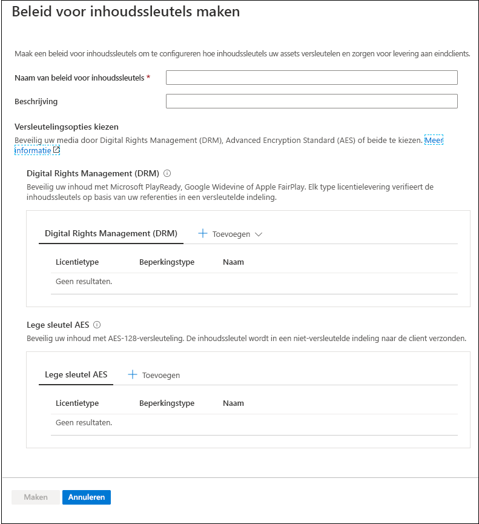
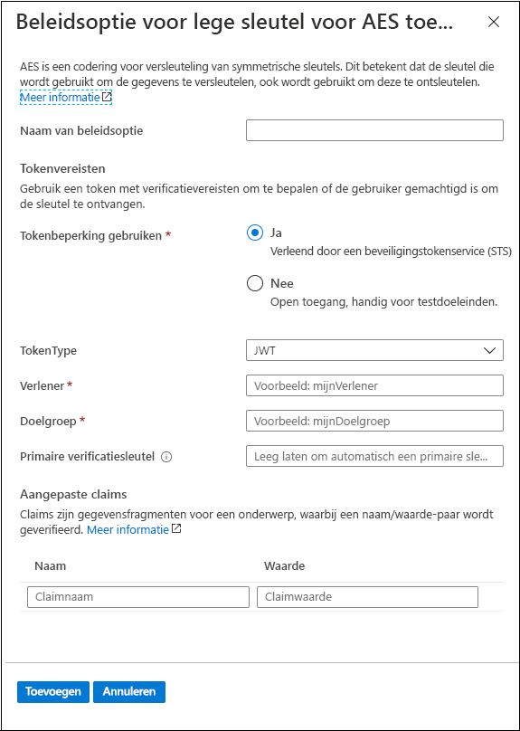
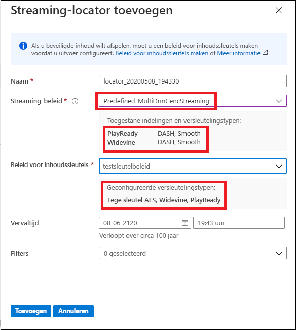

# Quickstart: De portal gebruiken om inhoud te versleutelen

[!INCLUDE [media services api v3 logo](./includes/v3-hr.md)]

Met Azure Media Services kunt u uw media beveiligen vanaf het moment dat deze uw computer verlaten en ze worden opgeslagen, verwerkt en afgeleverd. Met Media Services kunt u uw live en on-demand inhoud dynamisch versleutelen met Advanced Encryption Standard (AES-128) of een van de drie belangrijkste Digital Rights Management-systemen (DRM): Microsoft PlayReady, Google Widevine en Apple FairPlay. Media Services biedt ook een service voor het leveren van AES-sleutels en DRM-licenties (PlayReady, Widevine en FairPlay) aan geautoriseerde klanten. 
 
Als u versleutelingsopties (indien van toepassing) wilt opgeven voor uw stream, gebruikt u een **streamingbeleid** en koppelt u het aan uw streaming-locator. U maakt het **beleid voor inhoudssleutels** om te configureren hoe de inhoudssleutel (die beveiligde toegang tot uw **assets** biedt) aan eindklanten wordt geleverd. U moet de vereisten (beperkingen) instellen voor inhoudssleutelbeleid waaraan moet worden voldaan voor het leveren van sleutels met de opgegeven configuratie aan klanten. 

> [!NOTE]
> Het beleid voor inhoudssleutels is niet nodig voor het wissen van streams of downloaden.

Wanneer een stream wordt aangevraagd door een speler, gebruikt Media Services de opgegeven sleutel om uw inhoud dynamisch te versleutelen met AES clear key of DRM-versleuteling. Voor het ontsleutelen van de stream vraagt de speler de sleutel aan bij Media Services-sleutelleveringsservice of de sleutelleveringsservice die u hebt opgegeven. De service evalueert het door u opgegeven **inhoudssleutelbeleid** voor de sleutel om te bepalen of de gebruiker is gemachtigd om de sleutel op te halen.

In deze quickstart wordt getoond hoe u een beleid voor inhoudssleutels maakt waarin u opgeeft welke versleuteling moet worden toegepast op een asset wanneer het wordt gestreamd. In de quickstart staat ook hoe u de geconfigureerde versleuteling instelt voor uw asset.

### Aanbevolen om te lezen

* [Dynamische versleuteling en sleutellevering](content-protection-overview.md)
* [Streaming-locators](streaming-locators-concept.md)
* [Beleid voor streaming](streaming-policy-concept.md)
* [Beleid voor inhoudssleutels](content-key-policy-concept.md)

## Vereisten

Upload en verwerk uw inhoud zoals beschreven in [manage assets in the Azure portal](manage-assets-quickstart.md) (assets beheren in de Azure-portal)

## Een beleid voor inhoudssleutels maken

Maak het **beleid voor inhoudssleutels** om te configureren hoe de inhoudssleutel (die beveiligde toegang tot uw **assets** biedt) aan eindclients wordt geleverd.

1. Meld u aan bij [Azure Portal](https://portal.azure.com/).
1. Zoek en klik op uw Media Services-account.
1. Selecteer **Beleidsregels voor inhoudssleutels (nieuw)** .
1. Klik boven in het venster op **+ Beleid voor inhoudssleutels toevoegen** bovenaan het venster. 

Het venster **Een beleid voor inhoudssleutels maken** wordt weergegeven. In dit venster kiest u versleutelingsopties. U kunt ervoor kiezen om uw media te beveiligen door Digital Rights Management (DRM), de Advanced Encryption Standard (AES) of beide te kiezen.  

Of u nu een van de DRM-opties of een lege sleutel van AES-128 kiest, u wordt aangeraden om op te geven hoe u de beperkingen wilt configureren. U kunt ervoor kiezen om een open of tokenbeperking te hebben. Zie [Toegang tot inhoud beheren](content-protection-overview.md#controlling-content-access) voor een gedetailleerde toelichting.

### Een DRM-inhoudssleutel toevoegen

U kunt ervoor kiezen om uw inhoud te beveiligen met Microsoft PlayReady, Google Widevine of Apple FairPlay. Elk type licentielevering verifieert de inhoudssleutels op basis van uw referenties in een versleutelde indeling.

#### Licentiesjablonen

Zie het volgende voor meer informatie over licentiesjablonen:

* [Google Widevine-licentiesjabloon](widevine-license-template-overview.md)

    > [!NOTE]
    > U kunt een lege licentiesjabloon zonder waarden maken, alleen met {}. Vervolgens wordt er een licentiesjabloon gemaakt met de standaardinstellingen. De standaardinstellingen zijn in de meeste gevallen prima.
* [Vereisten voor en configuratie van Apple FairPlay-licenties](fairplay-license-overview.md)
* [PlayReady-licentiesjabloon](playready-license-template-overview.md)

### AES clear key toevoegen

U kunt ook een AES-128 clear key-versleuteling toevoegen aan uw inhoud. De inhoudssleutel wordt in een niet-versleutelde indeling naar de client verzonden.

## Een streaming-locator voor uw asset maken

1. Zoek en klik op uw Media Services-account.
1. Selecteer **Assets (nieuw)** .
1. Selecteer in de lijst met assets de asset die u wilt versleutelen.  
1. Klik in de sectie **Streaming-locator** voor de geselecteerde asset op **+ Een streaming-locator toevoegen**. 
1. Selecteer een **streamingbeleid** dat is afgestemd op het **beleid voor inhoudssleutel** dat u hebt geconfigureerd.

    In het onderwerp [Beleid voor streaming](streaming-policy-concept.md) vindt u meer informatie over welk streamingbeleid aansluit of welk beleid voor inhoudssleutels.
1. Wanneer u het juiste streamingbeleid selecteert, kunt u in de vervolgkeuzelijst het beleid voor inhoudssleutels selecteren.
1. Selecteer **Toevoegen** om de streaming-locator toe te voegen aan uw asset.

    Hiermee wordt de asset gepubliceerd en worden de streaming-URL's gegenereerd.

## Resources opruimen

Als u de andere quickstarts wilt proberen, moet u de gemaakte resources bewaren. Anders gaat u naar de Azure-portal, bladert u naar de resourcegroepen, selecteert u de resourcegroep waaronder u deze quickstart hebt uitgevoerd en verwijdert u alle resources.

## Volgende stappen

[Assets beheren](manage-assets-quickstart.md)
