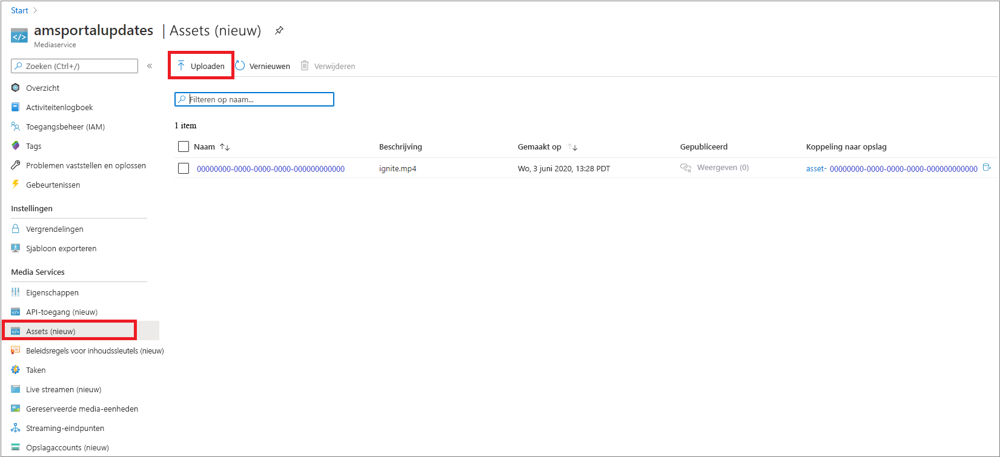
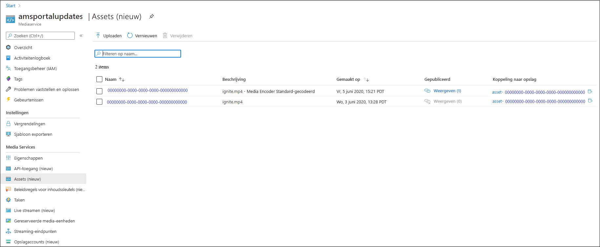
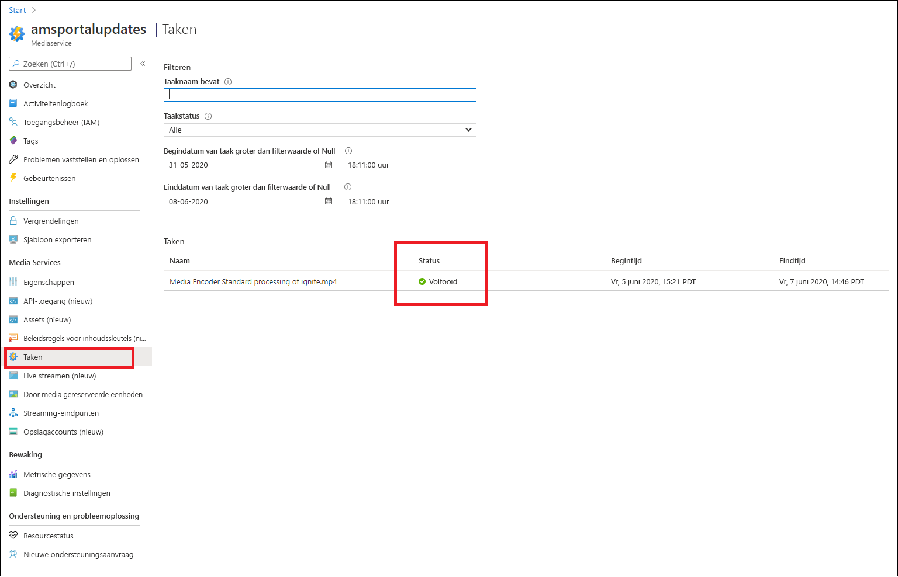
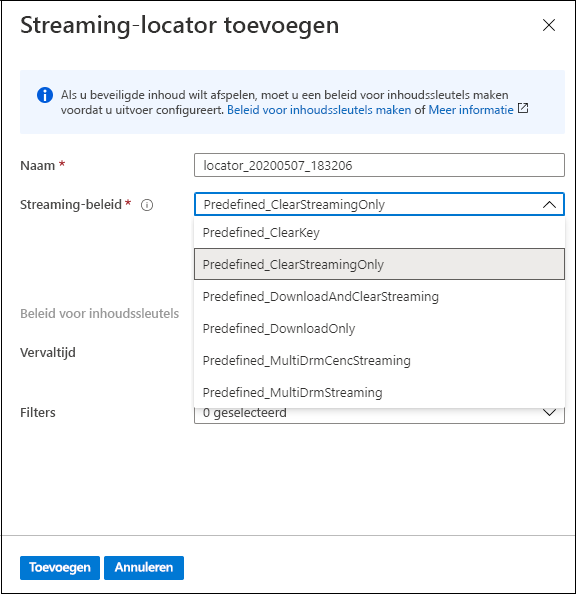
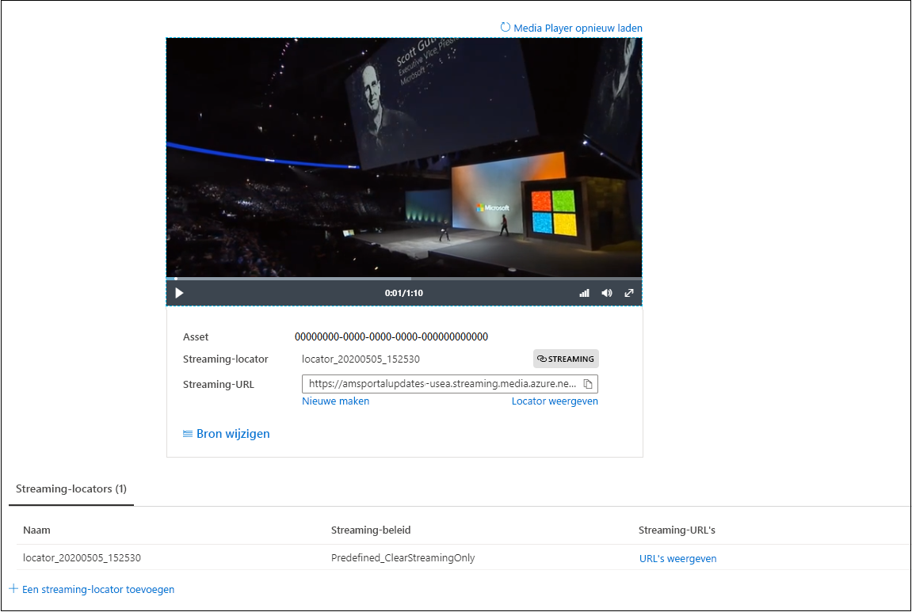

# Quickstart: Inhoud uploaden, coderen en streamen met de portal

In deze quickstart ziet u hoe u Azure Portal kunt gebruiken om inhoud te uploaden, coderen en streamen met Azure Media Services.

> [!NOTE]
> Zorg ervoor dat u [de beperkingen van Azure Portal voor Media Services v3](frequently-asked-questions.md#what-are-the-azure-portal-limitations-for-media-services-v3) controleert.
  
## Overzicht

* Als u wilt beginnen met het versleutelen, coderen, analyseren en streamen van media-inhoud in Azure, moet u een Media Services-account maken en uw digitale mediabestand van hoge kwaliteit uploaden naar een **asset**. 
    
    > [!NOTE]
    > Als uw video eerder is geüpload naar het Media Services-account met behulp van de Media Services v3-API of als de inhoud is gegenereerd op basis van live-uitvoer, zijn de knoppen **Coderen**, **Analyseren** of **Versleutelen** niet zichtbaar in Azure Portal. Gebruik de Media Services v3-API's om deze taken uit te voeren.

    Bekijk het volgende: 

  * [Uploaden naar en opslaan in de cloud](storage-account-concept.md)
  * [Het concept van assets](assets-concept.md)
* Wanneer u uw digitale mediabestand van hoge kwaliteit hebt geüpload naar een asset (een invoerasset), kunt u het verwerken (coderen of analyseren). De verwerkte inhoud gaat naar een andere asset (uitvoerasset). 
    * [Codeer](encoding-concept.md) uw geüploade bestand in indelingen die kunnen worden afgespeeld via een groot aantal verschillende browsers en apparaten.
    * [Analyseer](analyzing-video-audio-files-concept.md) uw geüploade bestand. 

        Momenteel kunt u bij gebruik van Azure Portal het volgende doen: TTML- en WebVTT-ondertitelingsbestanden genereren. Bestanden in deze indelingen kunnen worden gebruikt om audio- en videobestanden toegankelijk te maken voor mensen met een gehoorbeperking. U kunt ook trefwoorden uit uw inhoud extraheren.

        Voor een uitgebreide ervaring waarmee u inzichten kunt extraheren uit uw video- en audiobestanden gebruikt u Media Services v3-standaardinstellingen (zoals beschreven in [Zelfstudie: Video's analyseren met Media Services v3](analyze-videos-tutorial-with-api.md)).  Als u gedetailleerdere inzichten wilt, gebruikt u [Video Indexer](../video-indexer/index.yml) rechtstreeks.    
* Zodra uw inhoud is verwerkt, kunt u media-inhoud leveren aan clientspelers. Om video's in de uitvoerasset beschikbaar te maken voor clients om af te spelen, moet u een **streaming-locator** maken. Bij het maken van de **streaming-locator** moet u een **beleid voor streaming** opgeven. Met **beleid voor streaming** kunt u streamingprotocollen en versleutelingsopties voor uw **streaming-locators** definiëren (indien aanwezig).
    
    Bekijk:

    * [Streaming-locators](streaming-locators-concept.md)
    * [Beleid voor streaming](streaming-policy-concept.md)
    * [Verpakking en levering](dynamic-packaging-overview.md)
    * [Filters](filters-concept.md)
* U kunt uw inhoud beveiligen door deze te versleutelen met Advanced Encryption Standard (AES-128) of/en een van de drie belangrijkste DRM-systemen: Microsoft PlayReady, Google Widevine en Apple FairPlay. In de quickstart [Inhoud versleutelen met Azure Portal](encrypt-content-quickstart.md) ziet u hoe u inhoudsbeveiliging kunt configureren.
        
## Vereisten

[!INCLUDE [quickstarts-free-trial-note](../../../includes/quickstarts-free-trial-note.md)]

[Een Azure Media Services-account maken](create-account-howto.md#use-the-azure-portal)

## Uploaden

1. Meld u aan bij [Azure Portal](https://portal.azure.com/).
1. Zoek uw Media Services-account en klik erop.
1. Selecteer **Assets (nieuw)** .
1. Druk boven in het venster op **Uploaden**. 
1. Sleep een bestand en zet het neer of blader naar een bestand dat u wilt uploaden.

Als u naar uw assetsvenster gaat, ziet u dat er een nieuwe asset is toegevoegd aan de lijst:

## Coderen

1. Selecteer **Assets (nieuw)** .
1. Selecteer uw nieuwe asset (toegevoegd in de laatste stap).
1. Klik boven in het venster op **Coderen**.

    Door op deze knop te klikken wordt de coderingstaak gestart. Wanneer het proces is voltooid, is er een uitvoerasset gegenereerd dat de gecodeerde inhoud bevat.

Als u naar uw assetsvenster gaat, ziet u dat de uitvoerasset is toegevoegd aan de lijst:

## De voortgang van de taak controleren

Navigeer naar **Taken** om de status van de taak weer te geven. De taak doorloopt meestal de volgende statussen: Gepland, In wachtrij, Verwerken, Voltooid (de eindstatus). Als bij de taak een fout is opgetreden, krijgt u de status Fout.

## Publiceren en streamen

Als u een asset wilt publiceren, moet u nu een streaming-locator toevoegen aan uw asset.

### Streaming-locator 

1. Druk in de sectie **Streaming-locator** op **+ Een streaming-locator toevoegen**.
    Hiermee wordt de asset gepubliceerd en worden de streaming-URL's gegenereerd.

    > [!NOTE]
    > Als u de stream wilt versleutelen, moet u beleid voor inhoudssleutels maken en dit instellen op de streaming-locator. Zie [Inhoud versleutelen met Azure Portal](encrypt-content-quickstart.md) voor meer informatie.
1. In het venster **Streaming-locator toevoegen** kiest u vooraf gedefinieerd beleid voor streaming. Zie [Beleid voor streaming](streaming-policy-concept.md) voor gedetailleerde informatie

    

Zodra de asset is gepubliceerd, kunt u deze rechtstreeks naar de portal streamen. 

Of kopieer de streaming-URL en gebruik deze in uw clientspeler.

> [!NOTE]
> Zorg ervoor dat uw [streaming-eindpunt](streaming-endpoint-concept.md) wordt uitgevoerd. Wanneer u voor het eerst een Media Service-account maakt, wordt het standaardstreaming-eindpunt gemaakt en heeft het de status Gestopt. U moet het dus starten voordat u uw inhoud kunt streamen. U wordt alleen gefactureerd wanneer uw streaming-eindpunt wordt uitgevoerd.

## Resources opruimen

Als u de andere quickstarts wilt proberen, moet u de gemaakte resources bewaren. Anders gaat u naar de Azure-portal, bladert u naar de resourcegroepen, selecteert u de resourcegroep waaronder u deze quickstart hebt uitgevoerd en verwijdert u alle resources.

## Volgende stappen

[De portal gebruiken om inhoud te versleutelen](encrypt-content-quickstart.md)
