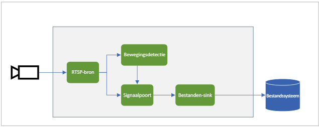
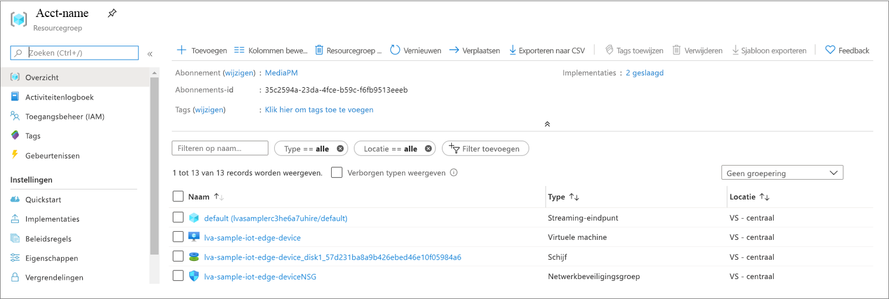
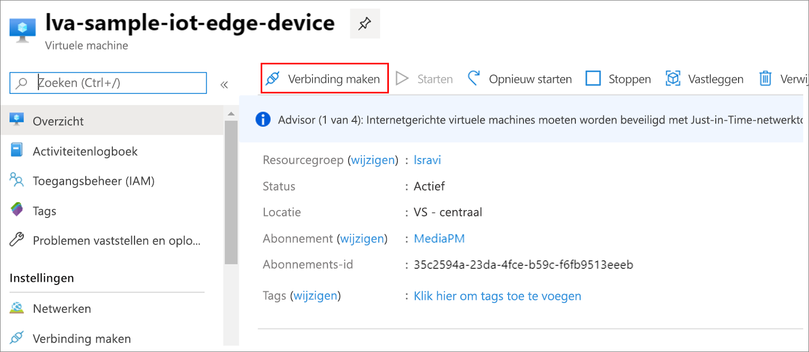

# <a name="quickstart-detect-motion-and-record-video-on-edge-devices"></a>Quickstart: Beweging detecteren en video opnemen op Edge-apparaten
 
In deze quickstart leert u hoe u Live Video Analytics in IoT Edge kunt gebruiken om de live-videofeed van een (gesimuleerde) IP-camera te analyseren. U ontdekt hoe u kunt detecteren of er beweging is en zo ja, een MP4-videoclip kunt opnemen naar het lokale bestandssysteem op het edge-apparaat. In deze quickstart wordt er een Azure VM gebruikt als IoT Edge-apparaat alsook een gesimuleerde live-videostream. 

Dit artikel is gebaseerd op voorbeeldcode die is geschreven in C#. Het is gebaseerd op de quickstart [Beweging detecteren en gebeurtenissen verzenden](detect-motion-emit-events-quickstart.md). 

## <a name="prerequisites"></a>Vereisten

* Een Azure-account met een actief abonnement. [Maak gratis een account](https://azure.microsoft.com/free/?WT.mc_id=A261C142F) als u nog geen account hebt.
* [Visual Studio Code](https://code.visualstudio.com/) met de volgende extensies:
    * [Azure IoT Tools](https://marketplace.visualstudio.com/items?itemName=vsciot-vscode.azure-iot-tools)
    * [C#](https://marketplace.visualstudio.com/items?itemName=ms-dotnettools.csharp)
* [.NET Core 3.1 SDK](https://dotnet.microsoft.com/download/dotnet-core/3.1).
* Als u de quickstart [Beweging detecteren en gebeurtenissen verzenden](detect-motion-emit-events-quickstart.md) nog niet hebt voltooid, volg dan deze stappen:
     1. [Azure-resources instellen](detect-motion-emit-events-quickstart.md#set-up-azure-resources)
     1. [De ontwikkelomgeving instellen](detect-motion-emit-events-quickstart.md#set-up-your-development-environment)
     1. [Het IoT Edge-implementatiemanifest genereren en implementeren](detect-motion-emit-events-quickstart.md#generate-and-deploy-the-deployment-manifest)
     1. [Het bewaken van gebeurtenissen voorbereiden](detect-motion-emit-events-quickstart.md#prepare-to-monitor-events)

> [!TIP]
> Tijdens de installatie van de Azure IoT Tools wordt u mogelijk gevraagd om Docker te installeren. U mag dit negeren.

## <a name="review-the-sample-video"></a>De voorbeeldvideo bekijken
Terwijl u de Azure-resources voor deze quickstart instelt wordt een (korte) video van een parkeerplaats gekopieerd naar de virtuele Linux-machine in Azure die wordt gebruikt als het IoT Edge-apparaat. Dit videobestand wordt gebruikt voor het simuleren van een livestream voor deze zelfstudie.

Open een toepassing zoals [VLC media player](https://www.videolan.org/vlc/), druk op Ctrl+N en kopieer [deze koppeling](https://lvamedia.blob.core.windows.net/public/lots_015.mkv) naar de video van de parkeerplaats om met afspelen te beginnen. Na ongeveer 5 seconden ziet u een witte auto over de parkeerplaats rijden.

Voer de volgende stappen uit om Live Video Analytics te gebruiken in IoT Edge om de beweging van de auto te detecteren en een videoclip op te nemen die na ongeveer 5 seconden begint.

## <a name="overview"></a>Overzicht



Het voorgaande diagram laat zien hoe de signalen in deze quickstart stromen. [Een Edge-module](https://github.com/Azure/live-video-analytics/tree/master/utilities/rtspsim-live555) simuleert een IP-camera die als host fungeert voor een RTSP-server (Real-Time Streaming Protocol). Een [RTSP-bron](media-graph-concept.md#rtsp-source)knooppunt haalt de video-feed van deze server, en verstuurt videoframes naar het knooppunt van de [bewegingsdetectieprocessor](media-graph-concept.md#motion-detection-processor). De RTSP-bron verzendt diezelfde videoframes naar een [signaalpoortprocessor](media-graph-concept.md#signal-gate-processor)knoop punt, dat gesloten blijft totdat het wordt geactiveerd door een gebeurtenis.

Wanneer de bewegingsdetectieprocessor beweging detecteert in de video, verzendt deze een gebeurtenis naar het signaalpoortprocessorknooppunt waardoor dit wordt geactiveerd. De poort wordt geopend gedurende de geconfigureerde tijd, waarin videoframes worden verzonden naar het [bestandssink](media-graph-concept.md#file-sink)knooppunt. Dit sinkknooppunt registreert de video als een MP4-bestand in het lokale bestandssysteem van uw edge-apparaat. Het bestand wordt opgeslagen op de geconfigureerde locatie.

In deze quickstart gaat u het volgende doen:

1. De mediagrafiek maken en implementeren.
1. De resultaten interpreteren.
1. Resources opschonen.

## <a name="examine-and-edit-the-sample-files"></a>De voorbeeld bestanden bekijken en bewerken
Als een van de vereisten voor deze quickstart hebt u de voorbeeldcode naar een map gedownload. Volg deze stappen om de voorbeeldcode te bekijken e te bewerken.

1. Ga naar *src/edge* in Visual Studio Code. U ziet het bestand *.env* en enkele implementatiesjabloonbestanden.

    Het implementatiesjabloon verwijst naar de implementatiemanifest voor het edge-apparaat, waar voor sommige eigenschappen variabelen worden gebruikt. Het *.env*-bestand bevat de waarden voor die variabelen.
1. Ga naar de map *src/cloud-to-device-console-app*. Hier ziet u het bestand *appsettings.json* en enkele andere bestanden:
    * ***c2d-console-app.csproj***: het projectbestand voor Visual Studio Code.
    * ***operations.json***: de lijst met bewerkingen die u het programma wilt laten uitvoeren.
    * ***Program.cs***: de voorbeeldprogrammacode. Deze code:

        * De app-instellingen laden.
        * Roept directe methoden aan die worden weergegeven door de module Live Video Analytics in IoT Edge. U kunt de module gebruiken om live-videostreams te analyseren door de bijbehorende [directe methoden](direct-methods.md) aan te roepen. 
        * Pauzeert, zodat u de uitvoer van het programma kunt controleren in het **TERMINAL**-venster en de gebeurtenissen die zijn gegenereerd door de module kunt controleren in het **UITVOER**-venster.
        * Roept directe methoden aan om resources op te schonen.

1. Bewerk het bestand *operations.json*:
    * Wijzig de link naar de graaftopologie:

        `"topologyUrl" : "https://raw.githubusercontent.com/Azure/live-video-analytics/master/MediaGraph/topologies/evr-motion-files/topology.json"`
    * Bewerk onder `GraphInstanceSet` de naam van de graaftopologie zodat deze overeenkomt met de waarde in de voorgaande link:
    
      `"topologyName" : "EVRToFilesOnMotionDetection"`

    * Bewerk de RTSP-URL zodat deze naar het videobestand wijst:

        `"value": "rtsp://rtspsim:554/media/lots_015.mkv"`

    * Bewerk de naam onder `GraphTopologyDelete`:

        `"name": "EVRToFilesOnMotionDetection"`

## <a name="review---check-the-modules-status"></a>Controle: bekijk de status van de modules

Vouw bij de stap [Het IoT Edge-implementatiemanifest genereren en implementeren](detect-motion-emit-events-quickstart.md#generate-and-deploy-the-deployment-manifest) in Visual Studio Code het knooppunt **lva-sample-device** onder **AZURE IOT HUB** uit (in de sectie linksonder). U ziet dat de volgende modules zijn geïmplementeerd:

* De Live Video Analytics-module met de naam **lvaEdge**
* De **rtspsim**-module, die een RTSP-server simuleert en fungeert als de bron van een live-videofeed

  


## <a name="review---prepare-for-monitoring-events"></a>Controle: de bewaking van gebeurtenissen voorbereiden
Zorg ervoor dat u de stappen hebt voltooid om [De bewaking van gebeurtenissen voor te bereiden](detect-motion-emit-events-quickstart.md#prepare-to-monitor-events).


## <a name="run-the-sample-program"></a>Het voorbeeldprogramma uitvoeren

1. Start een foutopsporingssessie door de toets F5 te selecteren. Het **TERMINAL**-venster geeft enkele berichten weer.
1. De code *operations.json* roept de directe methodes `GraphTopologyList` en `GraphInstanceList` aan. Als u na de vorige quickstarts resources hebt opgeschoond, worden er lege lijsten geretourneerd en wordt het proces gepauzeerd. Druk op de Enter-toets.

    ```
    --------------------------------------------------------------------------
    Executing operation GraphTopologyList
    -----------------------  Request: GraphTopologyList  --------------------------------------------------
    {
      "@apiVersion": "1.0"
    }
    ---------------  Response: GraphTopologyList - Status: 200  ---------------
    {
      "value": []
    }
    --------------------------------------------------------------------------
    Executing operation WaitForInput
    Press Enter to continue
    ```

    In het **TERMINAL**-venster wordt de volgende set aanroepen van directe methoden weergegeven:

     * Een aanroep van `GraphTopologySet` waarin gebruik wordt gemaakt van de `topologyUrl` 
     * Een aanroep van `GraphInstanceSet` waarin gebruik wordt gemaakt van de volgende hoofdtekst:

         ```
         {
           "@apiVersion": "1.0",
           "name": "Sample-Graph",
           "properties": {
             "topologyName": "EVRToFilesOnMotionDetection",
             "description": "Sample graph description",
             "parameters": [
               {
                 "name": "rtspUrl",
                 "value": "rtsp://rtspsim:554/media/lots_015.mkv"
               },
               {
                 "name": "rtspUserName",
                 "value": "testuser"
               },
               {
                 "name": "rtspPassword",
                 "value": "testpassword"
               }
             ]
           }
         }
         ```
     * Een aanroep van `GraphInstanceActivate` waarmee de instantie van de grafiek en de videostroom worden gestart
     * Een tweede aanroep van `GraphInstanceList` waarmee wordt weergegeven dat de instantie van de grafiek wordt uitgevoerd
1. De uitvoer in het **TERMINAL**-venster wordt gepauzeerd bij `Press Enter to continue`. Druk nog niet op Enter. Schuif omhoog om de nettoladingen voor het JSON-antwoord te zien voor de directe methoden die u hebt aangeroepen.
1. Schakel naar het **UITVOER**-venster in Visual Studio Code. Er zijn berichten te zien die door de module Live Video Analytics in IoT Edge worden verzonden naar de IoT-hub. In de volgende sectie van deze quickstart worden deze berichten besproken.

1. Het uitvoeren van de mediagrafiek wordt vervolgd en de resultaten worden afgedrukt. Via de RTSP-simulator wordt de bronvideo continu herhaald. Als u de mediagrafiek wilt stoppen, keert u terug naar het **TERMINAL**-venster en drukt u op Enter. 

    Met de volgende reeks aanroepen worden de resources opgeschoond:
     * Met een aanroep van `GraphInstanceDeactivate` wordt de instantie van de grafiek gedeactiveerd.
     * Met een aanroep van `GraphInstanceDelete` wordt de instantie verwijderd.
     * Met een aanroep van `GraphTopologyDelete` wordt de topologie verwijderd.
     * Met een aanroep van `GraphTopologyList` wordt ten slotte aangegeven dat de lijst nu leeg is.

## <a name="interpret-results"></a>Resultaten interpreteren 
Wanneer u de mediagrafiek uitvoert, gaan de resultaten van het knooppunt van de bewegingsdetectorprocessor via het knooppunt van de IoT Hub-sink naar de IoT-hub. De berichten die u ziet in het **UITVOER**-venster van Visual Studio Code bevatten een sectie `body` en een sectie `applicationProperties`. Zie [IoT Hub-berichten maken en lezen](https://docs.microsoft.com/azure/iot-hub/iot-hub-devguide-messages-construct) voor meer informatie.

In de volgende berichten worden de eigenschappen van de toepassing en de inhoud van de hoofdtekst bepaald door de module Live Video Analytics.

### <a name="mediasessionestablished-event"></a>MediaSessionEstablished-gebeurtenis

Wanneer een mediagrafiek wordt geïnstantieerd, probeert het RTSP-bronknooppunt verbinding te maken met de RTSP-server die wordt uitgevoerd in de rtspsim-live555-container. Als het lukt om de verbinding tot stand te brengen, wordt de volgende gebeurtenis afgedrukt.

```
[IoTHubMonitor] [05:37:21 AM] Message received from [lva-sample-device/lvaEdge]:
{  
"body": {
"sdp": "SDP:\nv=0\r\no=- 1586450538111534 1 IN IP4 xxx.xxx.xxx.xxx\r\ns=Matroska video+audio+(optional)subtitles, streamed by the LIVE555 Media Server\r\ni=media/camera-300s.mkv\r\nt=0 0\r\na=tool:LIVE555 Streaming Media v2020.03.06\r\na=type:broadcast\r\na=control:*\r\na=range:npt=0-300.000\r\na=x-qt-text-nam:Matroska video+audio+(optional)subtitles, streamed by the LIVE555 Media Server\r\na=x-qt-text-inf:media/camera-300s.mkv\r\nm=video 0 RTP/AVP 96\r\nc=IN IP4 0.0.0.0\r\nb=AS:500\r\na=rtpmap:96 H264/90000\r\na=fmtp:96 packetization-mode=1;profile-level-id=4D0029;sprop-parameter-sets={SPS}\r\na=control:track1\r\n"  
},  
"applicationProperties": {  
    "dataVersion": "1.0",  
    "topic": "/subscriptions/{subscriptionID}/resourceGroups/{name}/providers/microsoft.media/mediaservices/hubname",  
    "subject": "/graphInstances/Sample-Graph-1/sources/rtspSource",  
    "eventType": "Microsoft.Media.MediaGraph.Diagnostics.MediaSessionEstablished",  
    "eventTime": "2020-05-21T05:37:21.398Z",
    }  
}
```

In de voorgaande uitvoer geldt het volgende: 

* Het bericht is een diagnostische gebeurtenis, `MediaSessionEstablished`. Het geeft aan dat het RTSP-bronknooppunt (het onderwerp) is verbonden met de RTSP-simulator en is begonnen met het ontvangen van een (gesimuleerde) livefeed.
* In `applicationProperties` verwijst `subject` naar het knooppunt in de graaftopologie vanwaaruit het bericht is gegenereerd. In dit geval is het bericht afkomstig van het RTSP-bronknooppunt.
* In `applicationProperties` geeft `eventType` aan dat deze gebeurtenis een diagnostische gebeurtenis is.
* De waarde `eventTime` is het tijdstip waarop de gebeurtenis heeft plaatsgevonden.
* De `body`-sectie bevat gegevens over de diagnostische gebeurtenis. In dit geval bevatten de gegevens de details van [Session Description Protocol (SDP)](https://en.wikipedia.org/wiki/Session_Description_Protocol).

### <a name="recordingstarted-event"></a>RecordingStarted-gebeurtenis

Het processorknooppunt van de signaalpoort wordt geactiveerd wanneer er beweging wordt gedetecteerd, en het bestandssinkknooppunt begint een MP4-bestand te schrijven in de mediagrafiek. Het bestandssinkknooppunt verzendt een operationele gebeurtenis. Het `type` is ingesteld op `motion` om aan te geven dat het om een resultaat van de bewegingsdetectieprocessor gaat. De waarde `eventTime` is het tijdstip (UTC) waarop de beweging heeft plaatsgevonden. Bekijk de sectie [Overzicht](#overview) van deze quickstart voor meer informatie over dit proces.

Hier volgt een voorbeeld van dit bericht:

```
[IoTHubMonitor] [05:37:27 AM] Message received from [lva-sample-device/lvaEdge]:
{
  "body": {
    "outputType": "filePath",
    "outputLocation": "/var/media/sampleFilesFromEVR-filesinkOutput-20200521T053726Z.mp4"
  },
  "applicationProperties": {
    "topic": "/subscriptions/{subscriptionID}/resourceGroups/{name}/providers/microsoft.media/mediaservices/hubname",  
    "subject": "/graphInstances/Sample-Graph-1/sinks/fileSink",
    "eventType": "Microsoft.Media.Graph.Operational.RecordingStarted",
    "eventTime": "2020-05-21T05:37:27.713Z",
    "dataVersion": "1.0"
  }
}
```

In het voorgaande bericht geldt het volgende: 

* In `applicationProperties` verwijst `subject` naar het knooppunt in de mediagraaf vanwaaruit het bericht is gegenereerd. In dit geval is het bericht afkomstig van het bestandssinkknooppunt.
* In `applicationProperties` geeft `eventType` aan dat deze gebeurtenis operationeel is.
* De waarde `eventTime` is het tijdstip waarop de gebeurtenis heeft plaatsgevonden. Dit tijdstip is 5 tot 6 seconden na 1 en na het begin van de videostroom. Dit tijdstip komt overeen met het punt op 5 seconden toen de [auto het parkeerterrein kwam oprijden](#review-the-sample-video).
* De sectie `body` bevat gegevens over de operationele gebeurtenis. In dit geval bestaan de gegevens uit `outputType` en `outputLocation`.
* De variabele `outputType` geeft aan dat dit gegevens zijn over het bestandspad.
* De waarde `outputLocation` is de locatie van het MP4-bestand in de edge-module.

### <a name="recordingstopped-and-recordingavailable-events"></a>RecordingStopped- en RecordingAvailable-gebeurtenissen

Als u de eigenschappen van het signaalpoortprocessorknoopunt in de [graaftopologie](https://github.com/Azure/live-video-analytics/blob/master/MediaGraph/topologies/evr-motion-files/topology.json) bekijkt, ziet u dat de activeringstijden zijn ingesteld op 5 seconden. Ongeveer 5 seconden nadat de `RecordingStarted`-gebeurtenis is ontvangen, krijgt u:

* Een `RecordingStopped`-gebeurtenis, waarmee wordt aangegeven dat de opname is gestopt.
* Een `RecordingAvailable`-event, waarmee wordt aangegeven dat het MP4-bestand nu kan worden bekeken.

De twee gebeurtenissen worden doorgaans enkele seconden na elkaar verzonden.

## <a name="play-the-mp4-clip"></a>De MP4-clip afspelen

De MP4-bestanden worden naar een map op het edge-apparaat geschreven die u in het *.env*-bestand hebt geconfigureerd met behulp van deze sleutel: OUTPUT_VIDEO_FOLDER_ON_DEVICE. Als u de standaardwaarde hebt gebruikt, bevinden de resultaten zich in de map */home/lvaadmin/samples/output/* .

Om de MP4-clip af te spelen:

1. Ga naar uw resourcegroep, zoek de VM en maak vervolgens verbinding met behulp van Azure Bastion.

    
    
    

1. Meld u aan met de aanmeldingsgegevens die zijn gegenereerd bij het [instellen van uw Azure-resources](detect-motion-emit-events-quickstart.md#set-up-azure-resources). 
1. Ga met de opdrachtprompt naar de betreffende map. De standaardlocatie is */home/lvaadmin/samples/output*. U vindt de MP4-bestanden in de map.

     

1. Gebruik [Secure Copy (SCP)](https://docs.microsoft.com/azure/virtual-machines/linux/copy-files-to-linux-vm-using-scp) om de bestanden naar uw lokale machine te kopiëren. 
1. Speel de bestanden af met [VLC media player](https://www.videolan.org/vlc/) of een andere MP4-speler.

## <a name="clean-up-resources"></a>Resources opschonen

Als u de andere quickstarts wilt proberen, bewaar dan resources die u hebt gemaakt. Anders gaat u in Azure Portal naar de resourcegroepen, selecteert u de resourcegroep waar u deze quickstart hebt uitgevoerd en verwijdert u vervolgens alle resources.

## <a name="next-steps"></a>Volgende stappen

* Volg de quickstart [Live Video Analytics uitvoeren met uw eigen model](use-your-model-quickstart.md) om AI toe te passen op live-videofeeds.
* Bekijk extra uitdagingen voor gevorderde gebruikers:

    * Gebruik een [IP-camera](https://en.wikipedia.org/wiki/IP_camera) die RTSP ondersteunt in plaats van de RTSP-simulator. U vindt IP-camera's die RTSP ondersteunen op de pagina met [ONVIF-compatibele](https://www.onvif.org/conformant-products) producten. Zoek naar apparaten die voldoen aan de profielen G, S of T.
    * Gebruik een AMD64- of x64-apparaat met Linux in plaats van een virtuele Linux-machine in Azure. Dit apparaat moet zich in hetzelfde netwerk als de IP-camera bevinden. Volg de instructies in [Azure IoT Edge-runtime installeren op Linux](https://docs.microsoft.com/azure/iot-edge/how-to-install-iot-edge-linux). Volg vervolgens de instructies in [Uw eerste IoT Edge-module implementeren op een virtueel Linux-apparaat](https://docs.microsoft.com/azure/iot-edge/quickstart-linux) om het apparaat te registreren bij Azure IoT Hub.
