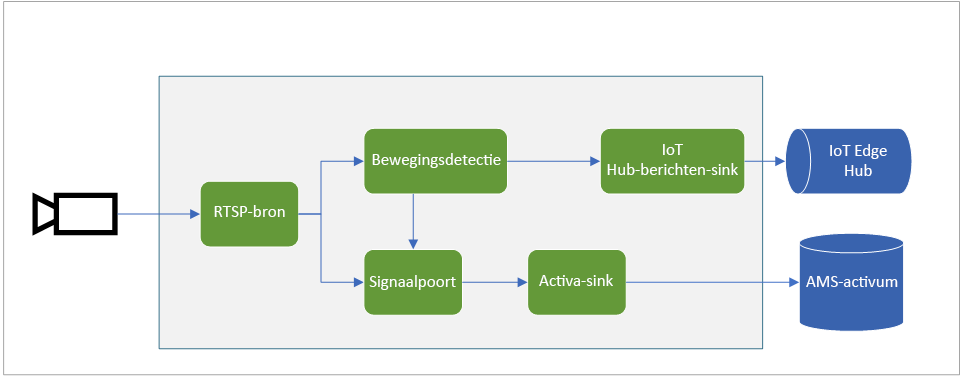
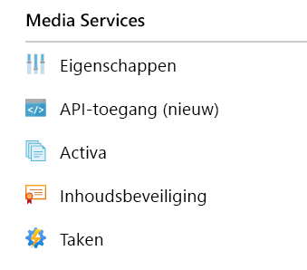
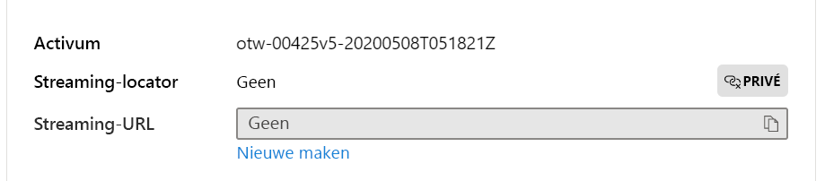

# <a name="quickstart-detect-motion-record-video-to-media-services"></a>Quickstart: Beweging detecteren, video opnemen in Media Services

Dit artikel begeleidt u bij de stappen voor het gebruik van Live Video Analytics in IoT Edge voor [opname op basis van gebeurtenissen](event-based-video-recording-concept.md). Er wordt gebruikgemaakt van een virtuele Linux-machine in Azure als IoT Edge-apparaat en van een gesimuleerde live-videostream. Deze videostream wordt geanalyseerd op aanwezigheid van bewegende objecten. Wanneer er beweging wordt gedetecteerd, worden gebeurtenissen verzonden naar Azure IoT Hub en wordt het relevante deel van de videostream als een asset vastgelegd in Azure Media Services.

Dit artikel is gebaseerd op de [Quickstart Aan de slag](get-started-detect-motion-emit-events-quickstart.md).

## <a name="prerequisites"></a>Vereisten

* Een Azure-account met een actief abonnement. [Gratis een account maken](https://azure.microsoft.com/free/?WT.mc_id=A261C142F)
* [Visual Studio Code](https://code.visualstudio.com/) op uw computer met een [extensie van Azure IoT Tools](https://marketplace.visualstudio.com/items?itemName=vsciot-vscode.azure-iot-tools).
* Ga verder met de volgende stappen als u de [Quickstart Aan de slag](get-started-detect-motion-emit-events-quickstart.md) eerder niet hebt voltooid:
    * [Azure-resources instellen](get-started-detect-motion-emit-events-quickstart.md#set-up-azure-resources)
    * [Modules implementeren](get-started-detect-motion-emit-events-quickstart.md#deploy-modules-on-your-edge-device)
    * [Visual Studio Code configureren](get-started-detect-motion-emit-events-quickstart.md#configure-the-azure-iot-tools-extension)

## <a name="review-the-sample-video"></a>De voorbeeldvideo bekijken

Als onderdeel van de bovenstaande stappen voor het instellen van de Azure-resources, wordt een (korte) video van een parkeerplaats gekopieerd naar de virtuele Linux-machine in Azure die wordt gebruikt als het IoT Edge-apparaat. Dit videobestand wordt gebruikt voor het simuleren van een livestream voor deze zelfstudie.

U kunt een toepassing als [VLC Player](https://www.videolan.org/vlc/) gebruiken, deze starten, op Control+N drukken en [deze](https://lvamedia.blob.core.windows.net/public/lots_015.mkv) koppeling naar de video over de parkeerplaats plakken om met afspelen te beginnen. Na ongeveer 5 seconden ziet u een witte auto over de parkeerplaats rijden.

Wanneer u de onderstaande stappen hebt uitgevoerd, hebt u Live Video Analytics in IoT Edge gebruikt om de beweging van de auto te detecteren en een videoclip op te nemen die na ongeveer vijf seconden begint. In het onderstaande diagram ziet u de visuele weergave van de totale stroom.



## <a name="use-direct-methods"></a>Directe methoden gebruiken

U kunt de module gebruiken om live-videostreams te analyseren door directe methoden aan te roepen. Lees [Directe methoden voor Live Video Analytics in IoT Edge](direct-methods.md) om inzicht te krijgen in alle directe methoden van de module. 

### <a name="invoke-graphtopologylist"></a>GraphTopologyList aanroepen
In deze stap worden alle [graaftopologieën](media-graph-concept.md#media-graph-topologies-and-instances) in de module opgesomd.

1. Klik met de rechtermuisknop op de module lvaEdge en selecteer Module Directe methode aanroepen in het contextmenu.
1. Er verschijnt een bewerkingsvak middenin het bovenste deel van het Visual Studio Code-venster. Voer GraphTopologyList in het invoervak in en druk op Enter.
1. Kopieer vervolgens de onderstaande JSON-nettolading, plak deze in het bewerkingsvak en druk op Enter.
    
    ```
    {
        "@apiVersion" : "1.0"
    }
    ```

    Binnen een paar seconden ziet u het venster Uitvoer in Visual Studio Code verschijnen met het volgende antwoord
    
    ```
    [DirectMethod] Invoking Direct Method [GraphTopologyList] to [lva-sample-device/lvaEdge] ...
    [DirectMethod] Response from [lva-sample-device/lvaEdge]:
    {
      "status": 200,
      "payload": {
        "value": []
      }
    }
    ```
    
    Het bovenstaande antwoord wordt verwacht omdat er geen graaftopologieën zijn gemaakt.

### <a name="invoke-graphtopologyset"></a>GraphTopologySet aanroepen

Als u dezelfde stappen gebruikt als voor het aanroepen van GraphTopologyList, kunt u GraphTopologySet aanroepen om een [graaftopologie](media-graph-concept.md#media-graph-topologies-and-instances) in te stellen met behulp van de volgende JSON als nettolading. U maakt een graaftopologie met de naam EVRtoAssetsOnMotionDetecion.

```
{
    "@apiVersion": "1.0",
    "name": "EVRtoAssetsOnMotionDetecion",
    "properties": {
      "description": "Event-based video recording to Assets based on motion events",
      "parameters": [
        {
            "name": "rtspUserName",
            "type": "String",
            "description": "rtsp source user name.",
            "default": "dummyUserName"
        },
        {
            "name": "rtspPassword",
            "type": "String",
            "description": "rtsp source password.",
            "default" : "dummyPassword"
        },
        {
            "name": "rtspUrl",
            "type": "String",
            "description": "rtsp Url"
        },
        {
            "name": "motionSensitivity",
            "type": "String",
            "description": "motion detection sensitivity",
            "default" : "medium"
        },
        {
            "name": "hubSinkOutputName",
            "type": "String",
            "description": "hub sink output name",
            "default" : "iothubsinkoutput"
        }                              
    ],         

      "sources": [
        {
          "@type": "#Microsoft.Media.MediaGraphRtspSource",
          "name": "rtspSource",
          "endpoint": {
            "@type": "#Microsoft.Media.MediaGraphUnsecuredEndpoint",
            "url": "${rtspUrl}",
            "credentials": {
              "@type": "#Microsoft.Media.MediaGraphUsernamePasswordCredentials",
              "username": "${rtspUserName}",
              "password": "${rtspPassword}"
            }
          }
        }
      ],
      "processors": [
        {
          "@type": "#Microsoft.Media.MediaGraphMotionDetectionProcessor",
          "name": "motionDetection",
          "sensitivity": "${motionSensitivity}",
          "inputs": [
            {
              "nodeName": "rtspSource"
            }
          ]
        },
        {
          "@type": "#Microsoft.Media.MediaGraphSignalGateProcessor",
          "name": "signalGateProcessor",
          "inputs": [
            {
              "nodeName": "motionDetection"
            },
            {
              "nodeName": "rtspSource"
            }
          ],
          "activationEvaluationWindow": "PT1S",
          "activationSignalOffset": "PT0S",
          "minimumActivationTime": "PT30S",
          "maximumActivationTime": "PT30S"
        }
      ],
      "sinks": [
        {
          "@type": "#Microsoft.Media.MediaGraphAssetSink",
          "name": "assetSink",
          "assetNamePattern": "sampleAssetFromEVR-LVAEdge-${System.DateTime}",
          "segmentLength": "PT0M30S",
          "localMediaCacheMaximumSizeMiB": "2048",
          "localMediaCachePath": "/var/lib/azuremediaservices/tmp/",
          "inputs": [
            {
              "nodeName": "signalGateProcessor"
            }
          ]
        },
        {
          "@type": "#Microsoft.Media.MediaGraphIoTHubMessageSink",
          "name": "hubSink",
          "hubOutputName": "${hubSinkOutputName}",
          "inputs": [
            {
              "nodeName": "motionDetection"
            }
          ]
        }
      ]
    }
}
```

De bovenstaande JSON-nettolading resulteert in een graaftopologie die vijf parameters definieert (waarvan vier met standaardwaarden). De topologie heeft één bronknooppunt ([RTSP-bron](media-graph-concept.md#rtsp-source)), twee processorknooppunten ([bewegingsdetectieprocessor](media-graph-concept.md#motion-detection-processor), een [signaalpoortprocessor](media-graph-concept.md#signal-gate-processor), en twee sinkknooppunten (IoT Hub-sink en [assetsink](media-graph-concept.md#asset-sink)). De visuele weergave van de topologie wordt hierboven weergegeven.

Binnen een paar seconden ziet u in het venster Uitvoer het volgende antwoord verschijnen.

```
[DirectMethod] Invoking Direct Method [GraphTopologySet] to [lva-sample-device/lvaEdge] ...
[DirectMethod] Response from [lva-sample-device/lvaEdge]:
{
  "status": 201,
  "payload": {
    "systemData": {
      "createdAt": "2020-05-12T22:05:31.603Z",
      "lastModifiedAt": "2020-05-12T22:05:31.603Z"
    },
    "name": "EVRtoAssetsOnMotionDetecion",
    "properties": {
      "description": "Event-based video recording to assets based on motion events",
      "parameters": [
        {
          "name": "rtspUserName",
          "type": "String",
          "description": "rtsp source user name.",
          "default": "dummyUserName"
        },
        {
          "name": "rtspPassword",
          "type": "String",
          "description": "rtsp source password.",
          "default": "dummyPassword"
        },
        {
          "name": "rtspUrl",
          "type": "String",
          "description": "rtsp Url"
        },
        {
          "name": "motionSensitivity",
          "type": "String",
          "description": "motion detection sensitivity",
          "default": "medium"
        },
        {
          "name": "hubSinkOutputName",
          "type": "String",
          "description": "hub sink output name",
          "default": "iothubsinkoutput"
        }
      ],
      "sources": [
        {
          "@type": "#Microsoft.Media.MediaGraphRtspSource",
          "name": "rtspSource",
          "transport": "Tcp",
          "endpoint": {
            "@type": "#Microsoft.Media.MediaGraphUnsecuredEndpoint",
            "url": "${rtspUrl}",
            "credentials": {
              "@type": "#Microsoft.Media.MediaGraphUsernamePasswordCredentials",
              "username": "${rtspUserName}",
              "password": "${rtspPassword}"
            }
          }
        }
      ],
      "processors": [
        {
          "@type": "#Microsoft.Media.MediaGraphMotionDetectionProcessor",
          "sensitivity": "${motionSensitivity}",
          "name": "motionDetection",
          "inputs": [
            {
              "nodeName": "rtspSource",
              "outputSelectors": []
            }
          ]
        },
        {
          "@type": "#Microsoft.Media.MediaGraphSignalGateProcessor",
          "activationEvaluationWindow": "PT1S",
          "activationSignalOffset": "PT0S",
          "minimumActivationTime": "PT30S",
          "maximumActivationTime": "PT30S",
          "name": "signalGateProcessor",
          "inputs": [
            {
              "nodeName": "motionDetection",
              "outputSelectors": []
            },
            {
              "nodeName": "rtspSource",
              "outputSelectors": []
            }
          ]
        }
      ],
      "sinks": [
        {
          "@type": "#Microsoft.Media.MediaGraphAssetSink",
          "localMediaCachePath": "/var/lib/azuremediaservices/tmp/",
          "localMediaCacheMaximumSizeMiB": "2048",
          "segmentLength": "PT0M30S",
          "assetNamePattern": "sampleAssetFromEVR-LVAEdge-${System.DateTime}",
          "name": "assetSink",
          "inputs": [
            {
              "nodeName": "signalGateProcessor",
              "outputSelectors": []
            }
          ]
        },
        {
          "@type": "#Microsoft.Media.MediaGraphIoTHubMessageSink",
          "hubOutputName": "${hubSinkOutputName}",
          "name": "hubSink",
          "inputs": [
            {
              "nodeName": "motionDetection",
              "outputSelectors": []
            }
          ]
        }
      ]
    }
  }
}
```

De geretourneerde status is 201, wat aangeeft dat er een nieuwe graaftopologie is gemaakt. Probeer de volgende directe methoden uit als de volgende stappen:

* Roep GraphTopologySet opnieuw aan en controleer of de geretourneerde statuscode 200 is. Statuscode 200 geeft aan dat een bestaande graaftopologie is bijgewerkt.
* Roep GraphTopologySet opnieuw aan, maar wijzig de tekenreeks voor de beschrijving. Controleer of de statuscode in het antwoord 200 is en of de beschrijving is bijgewerkt naar de nieuwe waarde.
* Roep GraphTopologyList aan zoals beschreven in de vorige sectie en controleer of de graaftopologie EVRtoAssetsOnMotionDetecion nu in de geretourneerde nettolading wordt weergegeven.

### <a name="invoke-graphtopologyget"></a>GraphTopologyGet aanroepen

Roep nu GraphTopologyGet aan met de volgende nettolading
```

{
    "@apiVersion" : "1.0",
    "name" : "EVRtoAssetsOnMotionDetecion"
}
```

Binnen een paar seconden moet in het venster Uitvoer het volgende antwoord verschijnen

```
[DirectMethod] Invoking Direct Method [GraphTopologyGet] to [lva-sample-device/lvaEdge] ...
[DirectMethod] Response from [lva-sample-device/lvaEdge]:
{
  "status": 200,
  "payload": {
    "systemData": {
      "createdAt": "2020-05-12T22:05:31.603Z",
      "lastModifiedAt": "2020-05-12T22:05:31.603Z"
    },
    "name": "EVRtoAssetsOnMotionDetecion",
    "properties": {
      "description": "Event-based video recording to Assets based on motion events",
      "parameters": [
        {
          "name": "rtspUserName",
          "type": "String",
          "description": "rtsp source user name.",
          "default": "dummyUserName"
        },
        {
          "name": "rtspPassword",
          "type": "String",
          "description": "rtsp source password.",
          "default": "dummyPassword"
        },
        {
          "name": "rtspUrl",
          "type": "String",
          "description": "rtsp Url"
        },
        {
          "name": "motionSensitivity",
          "type": "String",
          "description": "motion detection sensitivity",
          "default": "medium"
        },
        {
          "name": "hubSinkOutputName",
          "type": "String",
          "description": "hub sink output name",
          "default": "iothubsinkoutput"
        }
      ],
      "sources": [
        {
          "@type": "#Microsoft.Media.MediaGraphRtspSource",
          "name": "rtspSource",
          "transport": "Tcp",
          "endpoint": {
            "@type": "#Microsoft.Media.MediaGraphUnsecuredEndpoint",
            "url": "${rtspUrl}",
            "credentials": {
              "@type": "#Microsoft.Media.MediaGraphUsernamePasswordCredentials",
              "username": "${rtspUserName}",
              "password": "${rtspPassword}"
            }
          }
        }
      ],
      "processors": [
        {
          "@type": "#Microsoft.Media.MediaGraphMotionDetectionProcessor",
          "sensitivity": "${motionSensitivity}",
          "name": "motionDetection",
          "inputs": [
            {
              "nodeName": "rtspSource",
              "outputSelectors": []
            }
          ]
        },
        {
          "@type": "#Microsoft.Media.MediaGraphSignalGateProcessor",
          "activationEvaluationWindow": "PT1S",
          "activationSignalOffset": "PT0S",
          "minimumActivationTime": "PT30S",
          "maximumActivationTime": "PT30S",
          "name": "signalGateProcessor",
          "inputs": [
            {
              "nodeName": "motionDetection",
              "outputSelectors": []
            },
            {
              "nodeName": "rtspSource",
              "outputSelectors": []
            }
          ]
        }
      ],
      "sinks": [
        {
          "@type": "#Microsoft.Media.MediaGraphAssetSink",
          "localMediaCachePath": "/var/lib/azuremediaservices/tmp/",
          "localMediaCacheMaximumSizeMiB": "2048",
          "segmentLength": "PT0M30S",
          "assetNamePattern": "sampleAssetFromEVR-LVAEdge-${System.DateTime}",
          "name": "assetSink",
          "inputs": [
            {
              "nodeName": "signalGateProcessor",
              "outputSelectors": []
            }
          ]
        },
        {
          "@type": "#Microsoft.Media.MediaGraphIoTHubMessageSink",
          "hubOutputName": "${hubSinkOutputName}",
          "name": "hubSink",
          "inputs": [
            {
              "nodeName": "motionDetection",
              "outputSelectors": []
            }
          ]
        }
      ]
    }
  }
}
```

Let op de volgende eigenschappen in de nettolading van het antwoord:

* Statuscode is 200. Dit geeft aan dat de bewerking is geslaagd.
* De nettolading heeft de tijdstempels 'created' en 'lastModified'.

### <a name="invoke-graphinstanceset"></a>GraphInstanceSet aanroepen

Maak vervolgens een graafexemplaar die verwijst naar de bovenstaande graaftopologie. Zoals [hier](media-graph-concept.md#media-graph-topologies-and-instances) wordt beschreven, kunt u met graafexemplaren live-videostreams van talloze camera's analyseren met dezelfde graaftopologie.

Roep nu de directe methode voor GraphInstanceSet aan met de volgende nettolading:

```
{
    "@apiVersion" : "1.0",
    "name" : "Sample-Graph-2",
    "properties" : {
        "topologyName" : "EVRtoAssetsOnMotionDetecion",
        "description" : "Sample graph description",
        "parameters" : [
            { "name" : "rtspUrl", "value" : "rtsp://rtspsim:554/media/lots_015.mkv" }
        ]
    }
}
```

Houd rekening met het volgende:

* In de bovenstaande nettolading wordt de naam van de graaftopologie (EVRtoAssetsOnMotionDetecion) opgegeven waarvoor het graafexemplaar moet worden gemaakt.
* De nettolading bevat een parameterwaarde voor rtspUrl, die geen standaardwaarde heeft in de nettolading van de topologie.

Binnen een paar seconden ziet u in het venster Uitvoer het volgende antwoord verschijnen:

```
[DirectMethod] Invoking Direct Method [GraphInstanceSet] to [lva-sample-device/lvaEdge] ...
[DirectMethod] Response from [lva-sample-device/lvaEdge]:
{
  "status": 201,
  "payload": {
    "systemData": {
      "createdAt": "2020-05-12T23:30:20.666Z",
      "lastModifiedAt": "2020-05-12T23:30:20.666Z"
    },
    "name": "Sample-Graph-2",
    "properties": {
      "state": "Inactive",
      "description": "Sample graph description",
      "topologyName": "EVRtoAssetsOnMotionDetecion",
      "parameters": [
        {
          "name": "rtspUrl",
          "value": "rtsp://rtspsim:554/media/lots_015.mkv"
        }
      ]
    }
  }
}
```

Let op de volgende eigenschappen in de nettolading van het antwoord:

* De statuscode is 201, wat aangeeft dat er een nieuw exemplaar is gemaakt.
* De status is Inactief en geeft aan dat het exemplaar van de grafiek is gemaakt maar niet is geactiveerd. Zie de statussen voor [mediagraaf](media-graph-concept.md) voor meer informatie.

Probeer de volgende directe methoden uit als de volgende stappen:

* Roep GraphInstanceSet opnieuw aan met dezelfde nettolading en houd er rekening mee dat de geretourneerde statuscode nu 200 is.
* Roep GraphInstanceSet opnieuw aan, maar met een andere beschrijving en let op de bijgewerkte beschrijving in de nettolading van het antwoord, waarmee wordt aangegeven dat het exemplaar van de grafiek is bijgewerkt.
* Roep GraphInstanceSet aan maar wijzig de naam in Sample-Graph-3 en bekijk de nettolading van het antwoord. Er wordt een nieuw exemplaar van de graaf gemaakt (dat wil zeggen, de statuscode is 201). Vergeet niet om dergelijke dubbele instanties op te schonen wanneer u klaar bent met de quickstart.

### <a name="prepare-for-monitoring-events"></a>Bewakingsgebeurtenissen voorbereiden

De mediagraaf die u hebt gemaakt, maakt gebruik van het knooppunt van de bewegingsdetectieprocessor om beweging te detecteren. Dergelijke gebeurtenissen worden doorgegeven aan de IoT Hub. Volg deze stappen om u voor te bereiden op het observeren van dergelijke gebeurtenissen

1. Open het deelvenster Explorer in Visual Studio Code en zoek Azure IoT Hub in de linkerbenedenhoek.
1. Apparaatknooppunt uitvouwen
1. Klik met de rechtermuisknop op lva-sample-device en kies de optie Bewaking van ingebouwde gebeurtenisbewaking starten

    
    
    Binnen een paar seconden ziet u in het venster Uitvoer de volgende berichten:

    ```
    [IoTHubMonitor] Start monitoring message arrived in built-in endpoint for all devices ...
    [IoTHubMonitor] Created partition receiver [0] for consumerGroup [$Default]
    [IoTHubMonitor] Created partition receiver [1] for consumerGroup [$Default]
    [IoTHubMonitor] Created partition receiver [2] for consumerGroup [$Default]
    [IoTHubMonitor] Created partition receiver [3] for consumerGroup [$Default]
    ```

### <a name="invoke-graphinstanceactivate"></a>GraphInstanceActivate aanroepen

Activeer nu het graafexemplaar, waarmee de stroom van livevideo via de module wordt gestart. Roep de directe methode voor GraphInstanceActivate aan met de volgende nettolading:

```
{
    "@apiVersion" : "1.0",
    "name" : "Sample-Graph-2"
}
```

Binnen een paar seconden moet in het venster Uitvoer het volgende antwoord verschijnen

```
[DirectMethod] Invoking Direct Method [GraphInstanceActivate] to [lva-sample-device/lvaEdge] ...
[DirectMethod] Response from [lva-sample-device/lvaEdge]:
{
  "status": 200,
  "payload": null
}
```

Statuscode 200 in de nettolading van het antwoord geeft aan dat het graafexemplaar is geactiveerd.

### <a name="invoke-graphinstanceget"></a>GraphInstanceGet aanroepen

Roep nu de directe methode voor GraphInstanceGet aan met de volgende nettolading:

```
{
    "@apiVersion" : "1.0",
    "name" : "Sample-Graph-2"
}
```

Binnen een paar seconden moet in het venster Uitvoer het volgende antwoord verschijnen

```
[DirectMethod] Invoking Direct Method [GraphInstanceGet] to [lva-sample-device/lvaEdge] ...
[DirectMethod] Response from [lva-sample-device/lvaEdge]:
{
  "status": 200,
  "payload": {
    "systemData": {
      "createdAt": "2020-05-12T23:30:20.666Z",
      "lastModifiedAt": "2020-05-12T23:30:20.666Z"
    },
    "name": "Sample-Graph-2",
    "properties": {
      "state": "Active",
      "description": "Sample graph description",
      "topologyName": "EVRtoAssetsOnMotionDetecion",
      "parameters": [
        {
          "name": "rtspUrl",
          "value": "rtsp://rtspsim:554/media/lots_015.mkv"
        }
      ]
    }
  }
}
```

Let op de volgende eigenschappen in de nettolading van het antwoord:

* Statuscode is 200. Dit geeft aan dat de bewerking is geslaagd.
* De status is Actief, wat aangeeft dat het graafexemplaar nu de status Actief heeft.

## <a name="observe-results"></a>Resultaten bekijken

Het graafexemplaar dat u hierboven hebt gemaakt en geactiveerd, maakt gebruik van het knooppunt van de bewegingsdetectieprocessor om beweging in de inkomende live-videostream te detecteren en verzendt gebeurtenissen naar de IoT Hub-sink. Deze gebeurtenissen worden vervolgens doorgegeven aan de IoT Hub, en kunnen nu worden waargenomen. In het venster Uitvoer ziet u de volgende berichten

```
[IoTHubMonitor] [4:33:04 PM] Message received from [lva-sample-device/lvaEdge]:
{
  "body": {
    "sdp": "SDP:\nv=0\r\no=- 1589326384077235 1 IN IP4 XXX.XX.XX.XXX\r\ns=Matroska video+audio+(optional)subtitles, streamed by the LIVE555 Media Server\r\ni=media/lots_015.mkv\r\nt=0 0\r\na=tool:LIVE555 Streaming Media v2020.04.12\r\na=type:broadcast\r\na=control:*\r\na=range:npt=0-73.000\r\na=x-qt-text-nam:Matroska video+audio+(optional)subtitles, streamed by the LIVE555 Media Server\r\na=x-qt-text-inf:media/lots_015.mkv\r\nm=video 0 RTP/AVP 96\r\nc=IN IP4 0.0.0.0\r\nb=AS:500\r\na=rtpmap:96 H264/90000\r\na=fmtp:96 packetization-mode=1;profile-level-id=640028;sprop-parameter-sets=XXXXXXXXXXXXXXXXXXXXXXXXXXXXXXXXXXX\r\na=control:track1\r\n"
  },
  "applicationProperties": {
    "topic": "/subscriptions/{subscriptionId}/resourceGroups/{resourceGroupName}/providers/microsoft.media/mediaservices/{amsAccountName}",
    "subject": "/graphInstances/Sample-Graph-2/sources/rtspSource",
    "eventType": "Microsoft.Media.Graph.Diagnostics.MediaSessionEstablished",
    "eventTime": "2020-05-12T23:33:04.077Z",
    "dataVersion": "1.0"
  }
}
[IoTHubMonitor] [4:33:09 PM] Message received from [lva-sample-device/lvaEdge]:
{
  "body": {
    "timestamp": 143039375044290,
    "inferences": [
      {
        "type": "motion",
        "motion": {
          "box": {
            "l": 0.48954,
            "t": 0.140741,
            "w": 0.075,
            "h": 0.058824
          }
        }
      }
    ]
  },
  "applicationProperties": {
    "topic": "/subscriptions/{subscriptionId}/resourceGroups/{resourceGroupName}/providers/microsoft.media/mediaservices/{amsAccountName}",
    "subject": "/graphInstances/Sample-Graph-2/processors/md",
    "eventType": "Microsoft.Media.Graph.Analytics.Inference",
    "eventTime": "2020-05-12T23:33:09.381Z",
    "dataVersion": "1.0"
  }
}
```

Let op de volgende eigenschappen in de bovenstaande berichten

* Elk bericht bevat een sectie 'body' en een sectie 'applicationProperties'. Lees het artikel [IoT Hub-bericht maken en lezen](../../iot-hub/iot-hub-devguide-messages-construct.md) om te begrijpen wat deze secties voorstellen.
* Het eerste bericht is een diagnostische gebeurtenis, MediaSessionEstablished, die aangeeft dat het RTSP-bronknooppunt (subject) verbinding kan maken met de RTSP-simulator en een (gesimuleerde) live-feed kan gaan ontvangen.
* 'subject' in applicationProperties verwijst naar het knooppunt in de graaftopologie van waaruit het bericht is gegenereerd. In dit geval is het bericht afkomstig van het RTSP-bronknooppunt.
* 'eventType' in applicationProperties geeft aan dat dit een diagnostische gebeurtenis is.
* 'eventTime' geeft de tijd aan waarop de gebeurtenis heeft plaatsgevonden.
* 'body' bevat gegevens over de diagnostische gebeurtenis: het is het [SDP](https://en.wikipedia.org/wiki/Session_Description_Protocol)-bericht.
* Het tweede bericht is een analytische gebeurtenis. U kunt controleren of deze ongeveer vijf seconden na het MediaSessionEstablished-bericht is verzonden, wat overeenkomt met de vertraging tussen het begin van de video en wanneer de auto over de parkeerplaats rijdt.
* Het 'subject' in applicationProperties verwijst naar het knooppunt van de bewegingsdetectieprocessor in de graaf, waardoor dit bericht is gegenereerd
* De gebeurtenis is een deductiegebeurtenis en daarom bevat de hoofdtekst ('body') de gegevens 'timestamp' en 'inferences'.
* De sectie 'inferences' geeft aan dat het 'type' 'motion' is en dat er aanvullende gegevens zijn over de gebeurtenis 'motion'.

Het volgende bericht dat wordt weergegeven, is het volgende.

```
[IoTHubMonitor] [4:33:10 PM] Message received from [lva-sample-device/lvaEdge]:
{
  "body": {
    "outputType": "assetName",
    "outputLocation": "sampleAssetFromEVR-LVAEdge-20200512T233309Z"
  },
  "applicationProperties": {
    "topic": "/subscriptions/{subscriptionId}/resourceGroups/{resourceGroupName}/providers/microsoft.media/mediaservices/{amsAccountName}",
    "subject": "/graphInstances/Sample-Graph-2/sinks/assetSink",
    "eventType": "Microsoft.Media.Graph.Operational.RecordingStarted",
    "eventTime": "2020-05-12T23:33:10.392Z",
    "dataVersion": "1.0"
  }
}
```

* Het derde bericht is een operationele gebeurtenis. U kunt controleren of deze bijna direct na het bericht over bewegingsdetectie is verzonden. Deze fungeerde als trigger voor het starten van de opname.
* Het 'subject' in applicationProperties verwijst naar het knooppunt van de assetsink in de graaf, waardoor dit bericht is gegenereerd.
* De hoofdtekst ('body') bevat informatie over de uitvoerlocatie, in dit geval de naam van de Azure Media Services-asset waarin de video is opgenomen. Noteer deze waarde, u gebruikt deze later in de quickstart.

In de topologie is het knooppunt van de signaalpoortprocessor geconfigureerd met activeringstijden van dertig seconden. Dit betekent dat de graaftopologie ongeveer dertig seconden aan video in de asset vastlegt. Terwijl er video wordt opgenomen, blijft het knooppunt van de bewegingsdetectieprocessor deductiegebeurtenissen verzenden, die worden weergegeven in het venster Uitvoer. Na enige tijd wordt het volgende bericht weergegeven.

```
[IoTHubMonitor] [4:33:31 PM] Message received from [lva-sample-device/lvaEdge]:
{
  "body": {
    "outputType": "assetName",
    "outputLocation": "sampleAssetFromEVR-LVAEdge-20200512T233309Z"
  },
  "applicationProperties": {
    "topic": "/subscriptions/{subscriptionId}/resourceGroups/{resourceGroupName}/providers/microsoft.media/mediaservices/{amsAccountName}",
    "subject": "/graphInstances/Sample-Graph-2/sinks/assetSink",
    "eventType": "Microsoft.Media.Graph.Operational.RecordingAvailable",
    "eventTime": "2020-05-12T23:33:31.051Z",
    "dataVersion": "1.0"
  }
}
```

* Dit bericht is ook een operationele gebeurtenis. De gebeurtenis, RecordingAvailable, geeft aan dat er voldoende gegevens zijn weggeschreven naar de asset opdat afspeelapparaten of clients de video kunnen gaan afspelen
* Het 'subject' in applicationProperties verwijst naar het knooppunt van de assetsink in de graaf, waardoor dit bericht is gegenereerd
* De hoofdtekst ('body') bevat informatie over de uitvoerlocatie, in dit geval de naam van de Azure Media Services-asset waarin de video is opgenomen.

Als u het graafexemplaar blijft uitvoeren, ziet u het volgende bericht.

```
[IoTHubMonitor] [4:33:40 PM] Message received from [lva-sample-device/lvaEdge]:
{
  "body": {
    "outputType": "assetName",
    "outputLocation": "sampleAssetFromEVR-LVAEdge-20200512T233309Z"
  },
  "applicationProperties": {
    "topic": "/subscriptions/{subscriptionId}/resourceGroups/{resourceGroupName}/providers/microsoft.media/mediaservices/{amsAccountName}",
    "subject": "/graphInstances/Sample-Graph-2/sinks/assetSink",
    "eventType": "Microsoft.Media.Graph.Operational.RecordingStopped",
    "eventTime": "2020-05-12T23:33:40.014Z",
    "dataVersion": "1.0"
  }
}
```

* Dit bericht is ook een operationele gebeurtenis. De gebeurtenis, RecordingStopped, geeft aan dat de opname is gestopt.
* Merk op dat er circa dertig seconden zijn verstreken sinds de gebeurtenis RecordingStarted, wat overeenkomt met de waarden voor de activeringstijden in het knooppunt van de signaalpoortprocessor.
* Het 'subject' in applicationProperties verwijst naar het knooppunt van de assetsink in de graaf, waardoor dit bericht is gegenereerd.
* De hoofdtekst ('body') bevat informatie over de uitvoerlocatie, in dit geval de naam van de Azure Media Services-asset waarin de video is opgenomen.

Als u het graafexemplaar blijft uitvoeren, bereikt de TRSP-simulator het eind van het videobestand en stopt (of de verbinding wordt verbroken). Het knooppunt van de RTSP-bron maakt vervolgens opnieuw verbinding met de simulator, waarna het proces zich herhaalt.
    
## <a name="invoke-additional-direct-methods-to-clean-up"></a>Aanvullende directe methoden aanroepen om op te schonen

Roep nu directe methoden aan voor het deactiveren en verwijderen van het graafexemplaar (in die volgorde).

### <a name="invoke-graphinstancedeactivate"></a>GraphInstanceDeactivate aanroepen

Roep de directe methode voor GraphInstanceDeactivate aan met de volgende nettolading:

```
{
    "@apiVersion" : "1.0",
    "name" : "Sample-Graph-2"
}
```

Binnen een paar seconden moet in het venster Uitvoer het volgende antwoord verschijnen.

```
[DirectMethod] Invoking Direct Method [GraphInstanceDeactivate] to [lva-sample-device/lvaEdge] ...
[DirectMethod] Response from [lva-sample-device/lvaEdge]:
{
  "status": 200,
  "payload": null
}
```

Statuscode 200 geeft aan dat het graafexemplaar is gedeactiveerd.

Voer de volgende stappen uit:

* Roep GraphInstanceGet aan, zoals in de eerdere secties is aangegeven en bekijk de waarde van 'state'.

### <a name="invoke-graphinstancedelete"></a>GraphInstanceDelete aanroepen

Roep de directe methode voor GraphInstanceDelete aan met de volgende nettolading

```
{
    "@apiVersion" : "1.0",
    "name" : "Sample-Graph-2"
}
```

Binnen een paar seconden moet in het venster Uitvoer het volgende antwoord verschijnen:

```
[DirectMethod] Invoking Direct Method [GraphInstanceDelete] to [lva-sample-device/lvaEdge] ...
[DirectMethod] Response from [lva-sample-device/lvaEdge]:
{
  "status": 200,
  "payload": null
}
```

Statuscode 200 in het antwoord geeft aan dat het graafexemplaar is verwijderd.

### <a name="invoke-graphtopologydelete"></a>GraphTopologyDelete aanroepen

Roep de directe methode voor GraphTopologyDelete aan met de volgende nettolading:

```
{
    "@apiVersion" : "1.0",
    "name" : "EVRtoAssetsOnMotionDetecion"
}
```

Binnen een paar seconden moet in het venster Uitvoer het volgende antwoord verschijnen

```
[DirectMethod] Invoking Direct Method [GraphTopologyDelete] to [lva-sample-device/lvaEdge] ...
[DirectMethod] Response from [lva-sample-device/lvaEdge]:
{
  "status": 200,
  "payload": null
}
```

Statuscode 200 geeft aan dat de MediaGraph-topologie is verwijderd.

Probeer de volgende directe methoden uit als de volgende stappen:

* Roep GraphTopologyList aan en merk op dat deze module geen graaftopologieën bevat.
* Roep GraphInstanceList aan met dezelfde nettolading als GraphTopologyList en merk op dat er geen graafexemplaren worden opgesomd.

## <a name="playing-back-the-recorded-video"></a>De opgenomen video afspelen

Vervolgens kunt u de Azure-portal gebruiken om de video af te spelen die u hebt opgenomen.

1. Meld u aan bij de [Azure-portal](https://portal.azure.com/) en typ 'Media Services' in het zoekvak.
1. Zoek uw Azure Media Services-account en open het.
1. Selecteer de vermelding Assets in de lijst Media Services.

    
1. Als het gebruik van deze quickstart de eerste keer is dat u gebruikmaakt van Azure Media Services, staan alleen de assets vermeld die met deze quickstart zijn gegenereerd en kunt u de oudste kiezen.
1. Als dat niet zo is, gebruikt u de naam van de asset die als outputLocation is verstrekt in de operationele gebeurtenissen hierboven.
1. Klik op de pagina met details die wordt weergegeven, op de koppeling Nieuwe maken, vlak onder het tekstvak Streaming-URL.

    
1. In het deelvenster dat wordt geopend voor Streaminglocator toevoegen, accepteert u de standaardwaarden en drukt u onderaan op Toevoegen.
1. Op de pagina met de details, moet nu in de videospeler het eerste videoframe worden geladen. U kunt nu op de afspeelknop drukken. Controleer of u het gedeelte van de video ziet waarin de auto over de parkeerplaats rijdt.

    

> [!NOTE]
> Aangezien de gesimuleerde livevideo begint wanneer u de graaf activeert, zijn de tijdwaarden niet relevant en worden ze niet weergegeven via de snelkoppeling voor de videospeler. In de zelfstudie over continu opnemen en afspelen van video kunt u zien hoe u de tijdstempels kunt weergeven.

## <a name="clean-up-resources"></a>Resources opschonen

Als u deze toepassing verder niet gaat gebruiken, verwijdert u de resources die u in deze quickstart hebt gemaakt.

## <a name="next-steps"></a>Volgende stappen

* Meer informatie over het programmatisch aanroepen van [directe methoden](direct-methods.md) in Live Video Analytics in IoT Edge.
* Meer informatie over diagnostische berichten.    
