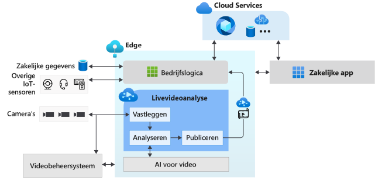

# Wat is Live Video Analytics in IoT Edge? (preview)

Live Video Analytics op IoT Edge biedt een platform voor het bouwen van intelligente videotoepassingen die de edge en de cloud overbruggen. Het platform biedt de mogelijkheid om live video vast te leggen, te registreren en te analyseren. Bovendien kunnen de resultaten (video en/of videoanalyses) worden gepubliceerd naar Azure-services (in de cloud en/of de edge). Het platform kan worden gebruikt om IoT-oplossingen te verbeteren met videoanalyse. De functionaliteit van Live Video Analytics op IoT Edge kan worden gecombineerd met andere Azure IoT Edge-modules zoals Stream Analytics op IoT Edge, Cognitive Services op IoT Edge en Azure-services in the cloud zoals Media Services, Event Hub, Cognitive Services enzovoort om krachtige hybride (bijvoorbeeld edge + cloud) applicaties te bouwen.

Live Video Analytics op IoT Edge is ontworpen als een uitbreidbaar platform, zodat u er verschillende edge-modules voor videoanalyse (zoals Cognitive Services-containers, aangepaste edge-modules die door u zijn gebouwd met opensource machine learning-modellen of aangepaste modellen die zijn getraind met uw eigen gegevens) op kunt aansluiten en ze gebruiken om livevideo te analyseren zonder dat u zich zorgen hoeft te maken over de complexiteit van het bouwen en uitvoeren van een pijplijn voor livevideo.

## Ontwikkeling van IoT-oplossingen versnellen 

IoT-oplossingen die videoanalyse combineren met signalen van andere IoT-sensoren en/of bedrijfsgegevens kunnen u helpen bij het automatiseren of semi-automatiseren van zakelijke beslissingen, wat resulteert in verbeteringen van de productiviteit. Met Live Video Analytics in IoT Edge kunt u dergelijke oplossingen sneller bouwen. U kunt zich richten op het bouwen van de modules voor videoanalyse en de logica die specifiek is voor uw bedrijf. Het platform neemt de complexiteit weg van het beheren en uitvoeren van een videopijplijn.

Met Live Video Analytics van IoT Edge kunt u uw [CCTV-camera's](https://en.wikipedia.org/wiki/Closed-circuit_television_camera) blijven gebruiken met uw bestaande [videobeheersystemen (VMS)](https://en.wikipedia.org/wiki/Video_management_system) en los hiervan apps voor videoanalyse bouwen. Live Video Analytics van IoT Edge kan worden gebruikt in combinatie met SDK's voor Computer Vision en toolkits om geavanceerde IoT-oplossingen te bouwen. In het onderstaande diagram wordt dit inzichtelijk gemaakt.

## Ondersteunde omgevingen

Linux x86-64- en ARM64-omgevingen worden ondersteund.
> [!NOTE]
> Ondersteuning voor ARM64-apparaten is beschikbaar in builds `1.0.4` en nieuwer.
> Ondersteuning voor de uitvoering van Azure IoT Edge-runtime op ARM64-apparaten vindt u in [openbare preview](https://azure.microsoft.com/support/legal/preview-supplemental-terms/).

## Aan de slag

Lees de volgende conceptartikelen en probeer een quickstart voor het uitvoeren van bewegingsdetectie uit op een live video-feed.

### Concepten

* [Mediagrafiek](media-graph-concept.md)
* [Video-opname](video-recording-concept.md)
* [Video afspelen](video-playback-concept.md)
* [Continue video-opname](continuous-video-recording-concept.md)
* [Video-opname op basis van gebeurtenissen](event-based-video-recording-concept.md)
* [Live Video Analytics zonder video-opname](analyze-live-video-concept.md)

## Volgende stappen

* Volg het artikel [Quickstart: Run Live Video Analytics with your own model](use-your-model-quickstart.md) (Live Video Analytics uitvoeren met uw eigen model) om te zien hoe u bewegingsdetectie kunt uitvoeren in een live video-feed.
* Bekijk de [terminologie](terminology.md)
* Verken [open source-materiaal voor Live Video Analytics](https://github.com/Azure/live-video-analytics)

