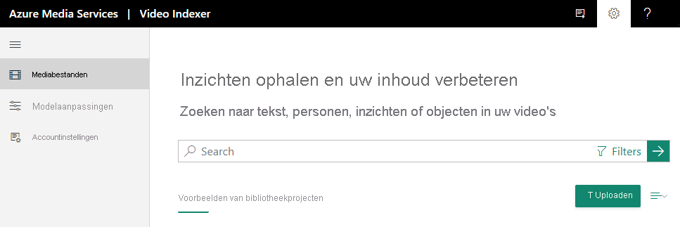

# Snelstart: hoe je je aanmeldt en je eerste video uploadt

Met deze snelle start u zich aanmelden bij de website van Video Indexer en hoe u uw eerste video uploadt.

Wanneer u een Video Indexer-account maakt, kunt u kiezen uit een gratis proefversie (waarmee u een bepaald aantal gratis minuten indexering krijgt) of een betaalde optie (zonder quotumlimiet). Bij de gratis proefversie biedt Video Indexer websitegebruikers maximaal 600 minuten aan gratis indexering en API-gebruikers maximaal 2400 minuten gratis indexering. Met de betaalde optie maakt u een Video Indexer-account dat is [verbonden met uw Azure-abonnement en een Azure Media Services-account.](connect-to-azure.md) U betaalt zowel voor de geïndexeerde minuten als voor kosten verbonden aan het Azure Media Services-account. 

## Registreren voor Video Indexer

Als u wilt gaan ontwikkelen met Video Indexer, gaat u naar de website van [Video Indexer](https://www.videoindexer.com) en registreert u zich.

> [!NOTE]
> Zodra u Video Indexer gaat gebruiken, worden al uw opgeslagen gegevens en geüploade inhoud in rust versleuteld met een door Microsoft beheerde sleutel.

## Een video met behulp van de Video Indexer-website uploaden

### Ondersteunde bestandsindelingen voor videoindexer

Zie het artikel [invoercontainer/bestandsindelingen](../latest/media-encoder-standard-formats.md#input-containerfile-formats) voor een lijst met bestandsindelingen die u gebruiken met Video Indexer.

### Een video uploaden

1. Registreer u op de [Video Indexer](https://www.videoindexer.ai/)-website.
2. Als u een video wilt uploaden, drukt u op de knop of link **Uploaden**.

    > [!NOTE]
    > De naam van de video mag niet groter zijn dan 80 tekens.

    

    Zodra uw video is geüpload, start Video Indexer met het indexeren en analyseren van de video.

     

    Wanneer Video Indexer klaar is met analyseren, ontvangt u een melding met een link naar uw video en een korte beschrijving van wat is gevonden in uw video. Bijvoorbeeld: mensen, onderwerpen, OCR's.

## Zie ook

Zie [Video's uploaden en indexeren](upload-index-videos.md) voor meer informatie.

Nadat u een video hebt geüpload en geïndexeerd, u de website [Video Indexer](video-indexer-view-edit.md) of [Video Indexer Developer Portal](video-indexer-use-apis.md) gebruiken om de inzichten van de video te bekijken. 

[API's gebruiken](video-indexer-use-apis.md)

## Volgende stappen

Voor een gedetailleerde introductie u terecht in ons [introductielab.](https://github.com/Azure-Samples/media-services-video-indexer/blob/master/IntroToVideoIndexer.md) 

Aan het einde van de workshop heb je een goed begrip van het soort informatie dat kan worden gehaald uit video- en audio-inhoud, ben je meer voorbereid om kansen met betrekking tot content intelligence te identificeren, video-AI op Azure te pitchen en verschillende scenario's op Video Indexer.

