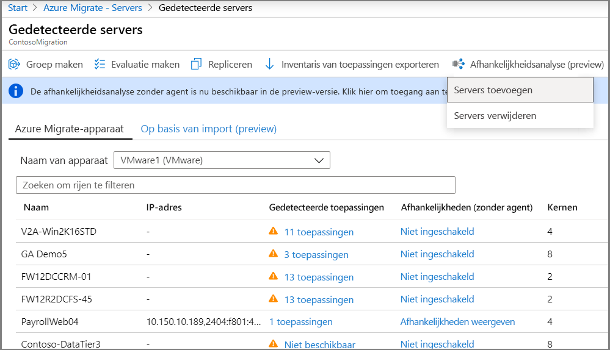
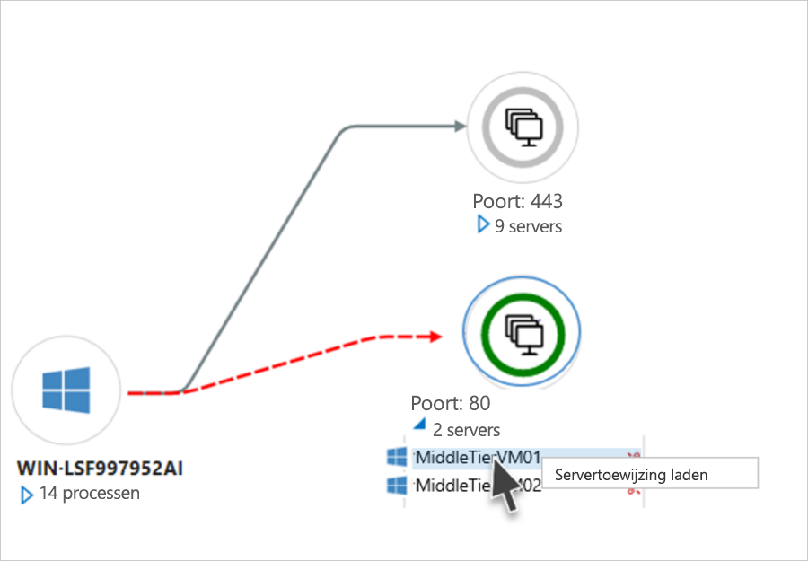
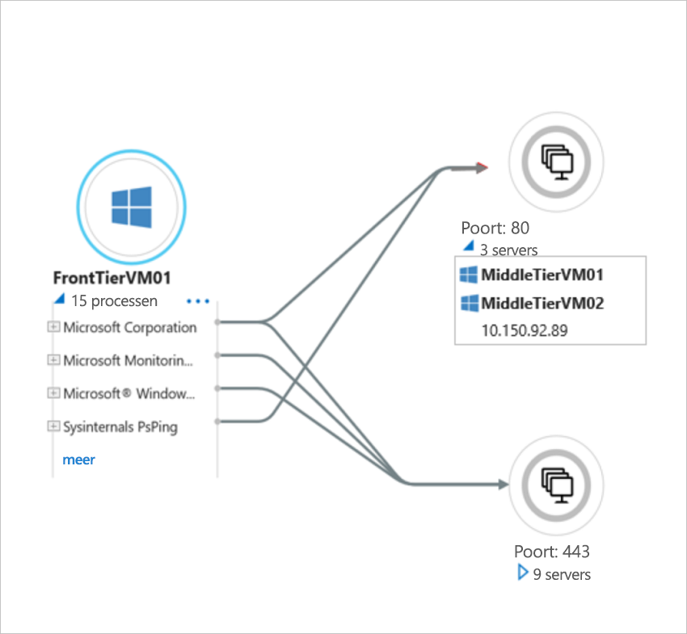
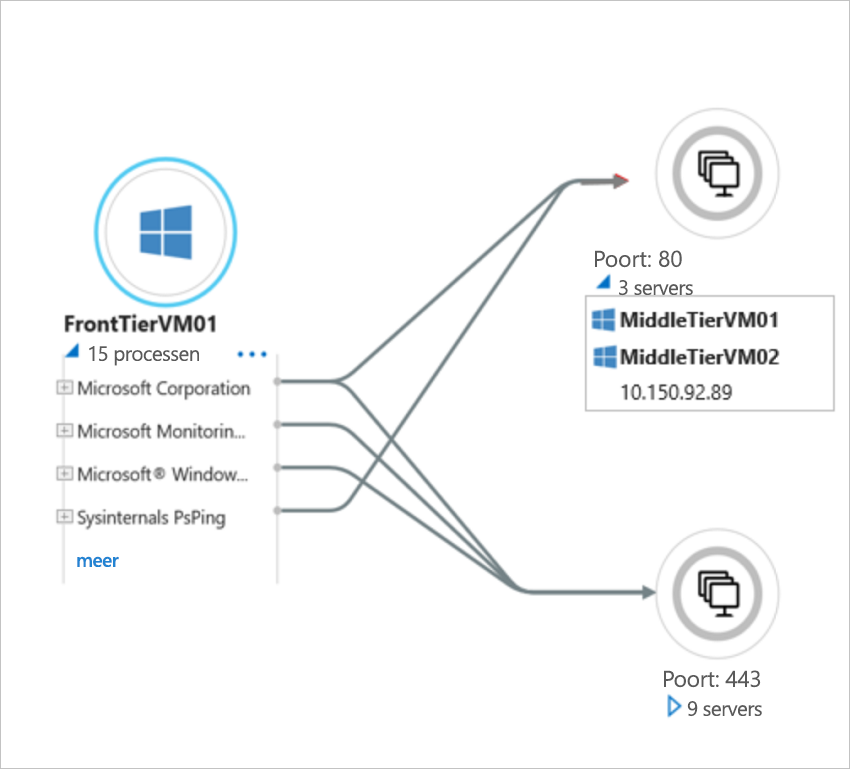

# Visualisatie van de afhankelijkheid van agents instellen 

In dit artikel wordt beschreven hoe u analyse van agentloze afhankelijkheden instelt in Azure Migrate: Server Assessment. [Afhankelijkheids analyse](concepts-dependency-visualization.md) helpt u bij het identificeren en begrijpen van afhankelijkheden tussen computers die u wilt beoordelen en die u wilt migreren naar Azure.

> [!IMPORTANT]
> Visualisatie van de afhankelijkheid van agents is momenteel alleen beschikbaar als preview-versie voor VMware-Vm's, gedetecteerd met het Azure Migrate: Server assessment tool.
> Functies zijn mogelijk beperkt of onvolledig.
> Deze preview wordt gedekt door de klant ondersteuning en kan worden gebruikt voor werk belastingen voor de productie.
> Zie voor meer informatie [aanvullende gebruiks voorwaarden voor Microsoft Azure-previews](https://azure.microsoft.com/support/legal/preview-supplemental-terms/).

## Voordat u begint

- [Meer informatie over](concepts-dependency-visualization.md#agentless-analysis) afhankelijkheids analyse zonder agent.
- [Bekijk](migrate-support-matrix-vmware.md#agentless-dependency-analysis-requirements) de vereisten voor en ondersteuning voor het instellen van de visualisatie van agentloze afhankelijkheden voor virtuele VMware-machines
- Zorg ervoor dat u een Azure Migrate project hebt [gemaakt](how-to-add-tool-first-time.md) .
- Als u al een project hebt gemaakt, moet u ervoor zorgen dat u het Azure Migrate: Server Assessment Tool hebt [toegevoegd](how-to-assess.md) .
- Zorg ervoor dat u een [Azure migrate apparaat](migrate-appliance.md) hebt ingesteld om uw on-premises machines te detecteren. Meer informatie over het instellen van een apparaat voor [VMware](how-to-set-up-appliance-vmware.md) -vm's. Het apparaat detecteert on-premises machines en verstuurt meta gegevens en prestatie gegevens naar Azure Migrate: Server evaluatie.

## Huidige beperkingen

- Nu kunt u een server niet toevoegen aan of verwijderen uit een groep in de weer gave afhankelijkheids analyse.
- Een afhankelijkheids toewijzing voor een groep servers is momenteel niet beschikbaar.
- De afhankelijkheids gegevens kunnen momenteel niet worden gedownload in de indeling tabellair.

## Een gebruikers account maken voor detectie

Stel een gebruikers account in zodat de server evaluatie toegang kan krijgen tot de virtuele machine voor detectie. [Meer informatie](migrate-support-matrix-vmware.md#agentless-dependency-analysis-requirements) over account vereisten.

## Het gebruikers account toevoegen aan het apparaat

Voeg het gebruikers account toe aan het apparaat.

1. Open de app voor het beheren van apparaten. 
2. Navigeer naar het deel venster **vCenter-gegevens opgeven** .
3. Klik in **toepassing en afhankelijkheden van Vm's detecteren**op **referenties toevoegen**
3. Kies het **besturings systeem**, geef een beschrijvende naam op voor het account en het**wacht woord** voor de **gebruikers naam**/
6. Klik op **Opslaan**.
7. Klik op **opslaan en detectie starten**.

    

## Detectie van afhankelijkheid starten

Kies de computers waarop u detectie van afhankelijkheden wilt inschakelen.

1. Klik in **Azure migrate: Server evaluatie**op **gedetecteerde servers**.
2. Klik op het pictogram **afhankelijkheids analyse** .
3. Klik op **servers toevoegen**.
3. Kies op de pagina **servers toevoegen** het apparaat dat de relevante computers detecteert.
4. Selecteer de machines in de lijst met computers.
5. Klik op **servers toevoegen**.

    

U kunt afhankelijkheden ongeveer zes uur na het starten van de detectie van afhankelijkheden visualiseren.

## Afhankelijkheden visualiseren

1. Klik in **Azure migrate: Server evaluatie**op **gedetecteerde servers**.
2. Zoek naar de computer die u wilt weer geven.
3. Klik in de kolom **afhankelijkheden** op **afhankelijkheden weer geven**
4. Wijzig de tijds periode waarvoor u de kaart wilt weer geven met de vervolg keuzelijst **tijd duur** .
5. Vouw de **client** groep uit om de machines met een afhankelijkheid op de geselecteerde computer weer te geven.
6. Vouw de **poort** groep uit om de computers weer te geven die een afhankelijkheid hebben van de geselecteerde computer.
7. Als u wilt navigeren naar de kaart weergave van een van de afhankelijke machines, klikt u op de computer naam > **Server toewijzing laden**

    

    

8. Vouw de geselecteerde machine uit om details op proces niveau weer te geven voor elke afhankelijkheid.

    

> [!NOTE]
> Proces informatie voor een afhankelijkheid is niet altijd beschikbaar. Als deze niet beschikbaar is, wordt de afhankelijkheid weer gegeven met het proces dat is gemarkeerd als ' onbekend proces '.

## Detectie van afhankelijkheid stoppen

Kies de computers waarop u de detectie van afhankelijkheden wilt stoppen.

1. Klik in **Azure migrate: Server evaluatie**op **gedetecteerde servers**.
2. Klik op het pictogram **afhankelijkheids analyse** .
3. Klik op **servers verwijderen**.
3. Kies op de pagina **servers verwijderen** het **apparaat** dat de vm's detecteert waarop u de detectie van de afhankelijkheid wilt stoppen.
4. Selecteer de machines in de lijst met computers.
5. Klik op **servers verwijderen**.

## Volgende stappen

[Groepeert de machines](how-to-create-a-group.md) voor evaluatie.
