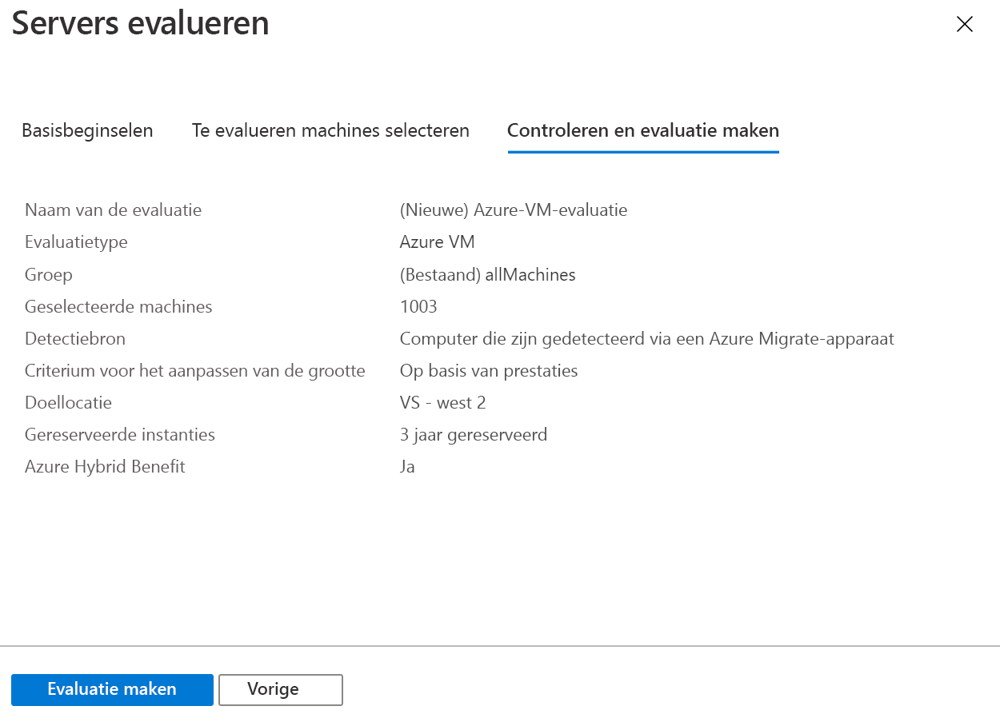

# <a name="assess-vmware-vms-by-using-azure-migrate-server-assessment"></a>Virtuele VMware-machines beoordelen met behulp van Azure Migrate server-evaluatie

Dit artikel laat u zien hoe u on-premises virtuele VMware-machines (Vm's) kunt beoordelen met behulp van het hulp programma voor Server evaluatie in Azure Migrate.

[Azure migrate](migrate-services-overview.md) biedt een hub aan hulpprogram ma's waarmee u apps, infra structuur en werk belastingen op Microsoft Azure kunt detecteren, evalueren en migreren. De hub bevat Azure Migrate-hulpprogram ma's en ISV-aanbiedingen (Independent Software Vendor) van micro soft-partners.

Deze zelf studie is de tweede in een serie die laat zien hoe u virtuele VMware-machines kunt beoordelen en migreren naar Azure. In deze zelfstudie leert u het volgende:
> [!div class="checklist"]
> * Stel een Azure Migrate project in.
> * Stel een Azure Migrate apparaat in dat on-premises wordt uitgevoerd om Vm's te beoordelen.
> * Start doorlopende detectie van on-premises Vm's. Het apparaat verzendt configuratie-en prestatie gegevens voor gedetecteerde Vm's naar Azure.
> * Gedetecteerde Vm's groeperen en evalueren van de VM-groep.
> * Bekijk de evaluatie.

> [!NOTE]
> In zelf studies ziet u het eenvoudigste installatiepad voor een scenario, zodat u snel een haalbaarheids test kunt instellen. Zelf studies gebruiken waar mogelijk standaard opties en worden niet alle mogelijke instellingen en paden weer gegeven. Raadpleeg de artikelen met procedures voor gedetailleerde instructies.

Als u nog geen abonnement op Azure hebt, maak dan een [gratis account](https://azure.microsoft.com/pricing/free-trial/) aan voordat u begint.

## <a name="prerequisites"></a>Vereisten

[Voltooi de eerste zelf studie](tutorial-prepare-vmware.md) in deze serie. Als dat niet het geval is, werken de instructies in deze zelf studie niet.

In de eerste zelf studie hebt u het volgende gedaan:

- [Azure-machtigingen instellen](tutorial-prepare-vmware.md#prepare-azure) voor Azure Migrate.
- [VMware voorbereiden](tutorial-prepare-vmware.md#prepare-for-vmware-vm-assessment) voor evaluatie:
   - [Verifiëren](migrate-support-matrix-vmware.md#vmware-requirements) VMware-instellingen.
   - Stel machtigingen in VMware in om een virtuele VMware-machine te maken met een eicellen-sjabloon.
   - Stel een [account in voor de detectie van vm's](migrate-support-matrix-vmware.md#vmware-requirements). 
   - [Vereiste poorten](migrate-support-matrix-vmware.md#port-access) beschikbaar maken.
   - Houd rekening met de [url's die nodig zijn](migrate-replication-appliance.md#url-access) voor toegang tot Azure.

## <a name="set-up-an-azure-migrate-project"></a>Een Azure Migrate project instellen

Stel als volgt een nieuw Azure Migrate project in:

1. Zoek in de Azure-portal in **Alle services** naar **Azure Migrate**.
1. Onder **Services** selecteert u **Azure Migrate**.
1. Selecteer in **overzicht**onder **servers detecteren, evalueren en migreren**de optie **servers beoordelen en migreren**.

   

1. Selecteer **hulp middelen toevoegen**bij **aan de slag**.
1. Selecteer in **Project migreren** uw Azure-abonnement en maak een resourcegroep als u er nog geen hebt.     
1. Geef in **Project Details**de project naam en het geografie op waarin u het project wilt maken. Azië, Europa, het Verenigd Konink rijk en Verenigde Staten worden ondersteund.

   Het geografische gebied voor het project wordt alleen gebruikt om de metagegevens op te slaan die worden verzameld van on-premises virtuele machines. Wanneer u een migratie uitvoert, kunt u elke gewenste doelregio selecteren.

   

1. Selecteer **Next**.
1. Selecteer in **hulp programma voor beoordeling selecteren**de optie **Azure migrate: Server evaluatie** > **volgende**.

   

1. In **Migratieprogramma selecteren** selecteert u **Het toevoegen van een migratieprogramma voorlopig overslaan** > **Volgende**.
1. Controleer de instellingen in **hulp middelen voor beoordeling en toevoegen**en selecteer **hulp middelen toevoegen**.
1. Wacht een paar minuten tot het Azure Migrate-project is geïmplementeerd. U wordt naar de projectpagina geleid. Als u het project niet ziet, kunt u het openen vanuit **Servers** in het Azure Migrate-dashboard.

## <a name="set-up-the-appliance-vm"></a>De toestel-VM instellen

Azure Migrate server-evaluatie voert een Lightweight VMware VM-apparaat uit. Dit apparaat voert VM-detectie uit en verzamelt de meta gegevens en prestatie gegevens van de virtuele machine.

Als u het apparaat wilt instellen, kunt u het volgende doen:

- Down load een bestand met een eicellen-sjabloon en importeer het naar vCenter Server.
- Maak het apparaat en controleer of het verbinding kan maken met Azure Migrate server beoordeling.
- Configureer het apparaat voor de eerste keer en registreer het bij het Azure Migrate-project.

U kunt meerdere toestellen instellen voor één Azure Migrate project. Op alle apparaten ondersteunt server evaluatie de detectie van Maxi maal 35.000 Vm's. Het kan Maxi maal 10.000 servers per apparaat detecteren.

### <a name="download-the-ova-template"></a>De eicellen-sjabloon downloaden

1. In **migratie doelen** > **servers** > **Azure migrate: Server evaluatie**selecteert u **detecteren**.
1. In **computers detecteren** > **zijn uw machines gevirtualiseerd?** selecteert u **Ja, met VMware vSphere Hyper Visor**.
1. Selecteer **downloaden** om het bestand met de sjabloon voor de eicellen te downloaden.

   

### <a name="verify-security"></a>Beveiliging controleren

Controleer of het bestand van de eicellen veilig is voordat u het implementeert:

1. Open op de machine waarop u het bestand hebt gedownload een opdrachtvenster voor beheerders.
1. Voer de volgende opdracht uit om de hash voor het bestand eicellen te genereren:
  
   ```C:\>CertUtil -HashFile <file_location> [Hashing Algorithm]```
   
   Gebruiksvoorbeeld: ```C:\>CertUtil -HashFile C:\AzureMigrate\AzureMigrate.ova SHA256```

Voor versie 2.19.07.30 moet de gegenereerde hash overeenkomen met deze waarden:

**Algoritme** | **Hash-waarde**
--- | ---
MD5 | c06ac2a2c0f870d3b274a0b7a73b78b1
SHA256 | 4ce4faa3a78189a09a26bfa5b817c7afcf5b555eb46999c2fad9d2ebc808540c

### <a name="create-the-appliance-vm"></a>De apparaat-VM maken

Importeer het gedownloade bestand en maak een virtuele machine:

1. Selecteer in de vSphere-client console **File** > **OVF-sjabloon implementeren**.

   

1. Geef in de wizard OVF-sjabloon implementeren > **bron**de locatie op van het bestand van de eicellen.
1. Geef bij **naam** en **locatie**een beschrijvende naam op voor de virtuele machine. Selecteer het inventaris object waarin de VM wordt gehost.
1. Geef in **host/cluster**de host of het cluster op waarop de virtuele machine wordt uitgevoerd.
1. Geef in **opslag**de opslag bestemming voor de virtuele machine op.
1. Geef in **Schijfindeling** het schijftype en de schijfgrootte op.
1. Geef bij **netwerk toewijzing**het netwerk op waarmee de virtuele machine verbinding maakt. Het netwerk heeft Internet connectiviteit nodig om meta gegevens te verzenden naar Azure Migrate server beoordeling.
1. Controleer en bevestig de instellingen en selecteer vervolgens **volt ooien**.

### <a name="verify-appliance-access-to-azure"></a>Toestel toegang tot Azure controleren

Zorg ervoor dat de virtuele machine van het apparaat verbinding kan maken met [Azure-url's](migrate-appliance.md#url-access).

### <a name="configure-the-appliance"></a>Het apparaat configureren

Stel het apparaat in met behulp van de volgende stappen:

1. Klik in de vSphere-client console met de rechter muisknop op de virtuele machine en selecteer vervolgens **console openen**.
1. Geef de taal, de tijd zone en het wacht woord op voor het apparaat.
1. Open een browser op een computer die verbinding kan maken met de virtuele machine en open de URL van de Web-App van het apparaat: **https:// *-apparaatnaam of IP-adres*: 44368**.

   U kunt de app ook vanuit het toestel bureau blad openen door de snelkoppeling naar de app te selecteren.
1. Ga als volgt te werk in de web-app > vereisten in te **stellen**:
   - **Licentie**: accepteer de licentie voorwaarden en lees de informatie van derden.
   - **Connectiviteit**: de app controleert of de virtuele machine toegang heeft tot internet. Als de virtuele machine gebruikmaakt van een proxy:
     - Selecteer **proxy-instellingen**en geef het proxy adres en de luister poort op in de vorm http://ProxyIPAddress of http://ProxyFQDN.
     - Geef referenties op als de proxy verificatie nodig heeft.
     - Houd er rekening mee dat alleen een HTTP-proxy wordt ondersteund.
   - **Tijd synchronisatie**: de tijd op het apparaat moet zijn gesynchroniseerd met internet tijd zodat de detectie goed werkt.
   - **Updates installeren**: het apparaat zorgt ervoor dat de meest recente updates worden geïnstalleerd.
   - **VdDK installeren**: het apparaat controleert of VMware VSphere Virtual Disk Development Kit (vddk) is geïnstalleerd. Als dat niet het geval is, downloadt u VDDK 6,7 van VMware en extraheert u de gedownloade zip-inhoud naar de opgegeven locatie op het apparaat.

     Azure Migrate server migratie gebruikt de VDDK om computers te repliceren tijdens de migratie naar Azure.       

### <a name="register-the-appliance-with-azure-migrate"></a>Het apparaat registreren bij Azure Migrate

1. Selecteer **Aanmelden**. Als deze niet wordt weer gegeven, controleert u of de pop-upblokkering in de browser is uitgeschakeld.
1. Meld u op het tabblad Nieuw aan met behulp van uw Azure-gebruikers naam en-wacht woord.
   
   Aanmelden met een pincode wordt niet ondersteund.
1. Nadat u zich hebt aangemeld, gaat u terug naar de web-app.
1. Selecteer het abonnement waarin het Azure Migrate project is gemaakt en selecteer vervolgens het project.
1. Geef een naam op voor het apparaat. De naam moet alfanumeriek zijn met 14 tekens of minder.
1. Selecteer **Registreren**.

## <a name="start-continuous-discovery"></a>Continue detectie starten

Het apparaat moet verbinding maken met vCenter Server om de configuratie-en prestatie gegevens van de virtuele machines te detecteren.

### <a name="specify-vcenter-server-details"></a>vCenter Server-gegevens opgeven
1. Geef in **vCenter Server Details opgeven**de naam (FQDN) of het IP-adres van de vCenter Server instantie op. U kunt de standaard poort verlaten of een aangepaste poort opgeven waarop vCenter Server luistert.
1. Geef bij **gebruikers naam** en **wacht woord**de vCenter Server account referenties op die het apparaat gebruikt voor het detecteren van vm's op het vCenter Server exemplaar. 

   Zorg ervoor dat het account de [vereiste machtigingen voor detectie](migrate-support-matrix-vmware.md#vmware-requirements)heeft. U kunt [de detectie bereiken](tutorial-assess-vmware.md#set-the-scope-of-discovery) door de toegang tot het vCenter-account te beperken.
1. Selecteer **verbinding valideren** om te controleren of het apparaat verbinding kan maken met vCenter Server.

### <a name="specify-vm-credentials"></a>VM-referenties opgeven
Voor de detectie van toepassingen, functies en onderdelen, en voor het visualiseren van afhankelijkheden van de virtuele machines, kunt u VM-referenties opgeven die toegang hebben tot de VMware-Vm's. U kunt één referentie toevoegen voor Windows-Vm's en één referentie voor Linux-Vm's. Meer [informatie](https://docs.microsoft.com/azure/migrate/migrate-support-matrix-vmware) over de benodigde toegangs machtigingen.

> [!NOTE]
> Deze invoer is optioneel, maar u hebt deze nodig als u de detectie van toepassingen en de visualisatie van de afhankelijkheid van agents wilt inschakelen.

1. In **toepassingen en afhankelijkheden detecteren op vm's**, selecteert u **referenties toevoegen**.
1. Maak een selectie voor het **besturings systeem**.
1. Geef een beschrijvende naam op voor de referentie.
1. Geef in **gebruikers naam** en **wacht woord**een account op met ten minste gast toegang op de vm's.
1. Selecteer **Toevoegen**.

Nadat u het vCenter Server-exemplaar en de VM-referenties (optioneel) hebt opgegeven, selecteert u **opslaan en detectie starten** om de detectie van de on-premises omgeving te starten.

Het duurt ongeveer 15 minuten voor de meta gegevens van gedetecteerde Vm's die in de portal worden weer gegeven. De detectie van geïnstalleerde toepassingen, functies en onderdelen kan enige tijd duren. De duur is afhankelijk van het aantal virtuele machines dat wordt gedetecteerd. Voor 500 Vm's duurt het ongeveer 1 uur voordat de toepassings voorraad wordt weer gegeven in de Azure Migrate Portal.

### <a name="set-the-scope-of-discovery"></a>Het detectie bereik instellen

Detectie kan worden beperkt door de toegang te beperken tot het vCenter-account dat wordt gebruikt voor detectie. U kunt het bereik instellen op vCenter Server Data Centers, clusters, een map met clusters, hosts, een map van hosts of afzonderlijke Vm's.

Voer de volgende procedures uit om het bereik in te stellen.

#### <a name="1-create-a-vcenter-user-account"></a>1. een vCenter-gebruikers account maken
1.  Meld u aan bij de vSphere-webclient als de vCenter Server beheerder.
1.  Selecteer **beheer** > **SSO-gebruikers en-groepen**en selecteer vervolgens het tabblad **gebruikers** .
1.  Selecteer het pictogram **nieuwe gebruiker** .
1.  Vul de vereiste gegevens in om een nieuwe gebruiker te maken en selecteer vervolgens **OK**.

#### <a name="2-define-a-new-role-with-required-permission"></a>2. Definieer een nieuwe rol met de vereiste machtiging
Deze procedure is vereist voor server migratie zonder agent.
1.  Meld u aan bij de vSphere-webclient als de vCenter Server beheerder.
1.  Blader naar **beheer** > **Role Manager**.
1.  Selecteer uw vCenter Server-exemplaar in de vervolg keuzelijst.
1.  Selecteer **rol maken**.
1.  Voer een naam in voor de nieuwe rol (bijvoorbeeld <em>Azure_Migrate</em>).
1.  Wijs [machtigingen](https://docs.microsoft.com/azure/migrate/migrate-support-matrix-vmware) toe aan de nieuw gedefinieerde rol.
1.  Selecteer **OK**.

#### <a name="3-assign-permissions-on-vcenter-objects"></a>3. machtigingen toewijzen voor vCenter-objecten

Er zijn twee benaderingen voor het toewijzen van machtigingen voor inventaris objecten in vCenter aan het vCenter-gebruikers account waaraan een rol is toegewezen.

Voor Server evaluatie moet u de rol **alleen-lezen** Toep assen op het vCenter-gebruikers account voor alle bovenliggende objecten waar de vm's worden gehost die moeten worden gedetecteerd. Alle bovenliggende objecten worden opgenomen: host, map van hosts, cluster en map van clusters in de hiërarchie tot aan het Data Center. Deze machtigingen worden door gegeven aan onderliggende objecten in de hiërarchie.

Op dezelfde manier voor server migratie moet u een door de gebruiker gedefinieerde rol Toep assen op de vCenter-gebruikers account voor alle bovenliggende objecten waar de virtuele machines worden [gehost die moeten](https://docs.microsoft.com/azure/migrate/migrate-support-matrix-vmware) worden gemigreerd. Deze rol kan <em>Azure _Migrate</em>.


De alternatieve methode is het toewijzen van het gebruikers account en de rol op het datacenter niveau en het door geven van deze aan de onderliggende objecten. Geef vervolgens voor elk object (zoals een virtuele machine) het account een rol voor **toegang** , die u niet wilt detecteren/migreren. 

Deze alternatieve configuratie is omslachtig. Het biedt onbedoelde toegangs controles, omdat voor elk nieuw onderliggend object ook automatisch toegang wordt verleend die wordt overgenomen van de bovenliggende. Daarom wordt u aangeraden de eerste benadering te gebruiken.

> [!NOTE]
> Op dit moment kunnen server evaluatie geen Vm's detecteren als het vCenter-account toegang heeft verleend op het niveau van de vCenter-VM-map. Als u uw detectie op basis van VM-mappen wilt beperken, kunt u dit doen met behulp van de volgende procedure. Hiermee zorgt u ervoor dat het vCenter-account alleen-lezen toegang heeft dat is toegewezen op een VM-niveau.
>
> 1. Wijs alleen-lezen machtigingen toe op alle virtuele machines in de VM-mappen die u wilt bereiken voor de detectie.
> 1. Ken alleen-lezen toegang toe aan alle bovenliggende objecten waarbij de Vm's worden gehost. Alle bovenliggende objecten (host, map van hosts, cluster, map met clusters) in de hiërarchie tot aan het Data Center worden opgenomen. U hoeft de machtigingen niet door te geven aan alle onderliggende objecten.
> 1. Gebruik de referenties voor detectie door het Data Center als **verzamelings bereik**te selecteren. Het op rollen gebaseerde toegangs beheer dat is ingesteld, zorgt ervoor dat de bijbehorende vCenter-gebruiker alleen toegang heeft tot Tenant-specifieke Vm's.
>
> Houd er rekening mee dat mappen van hosts en clusters worden ondersteund.

### <a name="verify-vms-in-the-portal"></a>VM's verifiëren in de portal

Na de detectie kunt u controleren of de virtuele machines worden weer gegeven in de Azure Portal:

1. Open het Azure Migrate dash board.
1. Selecteer in **Azure migrate-Servers** > **Azure migrate: Server evaluatie**het pictogram dat het aantal voor **gedetecteerde servers**weergeeft.

## <a name="set-up-an-assessment"></a>Een evaluatie instellen

U kunt twee soorten evaluaties maken met behulp van Azure Migrate server-evaluatie:

**Evaluatie** | **Details** | **Gegevens**
--- | --- | ---
**Op basis van prestaties** | Evaluaties op basis van verzamelde prestatie gegevens | **Aanbevolen VM-grootte**: op basis van gegevens van CPU en geheugen gebruik.<br/><br/> **Aanbevolen schijf type (Standard of Premium Managed disk)** : op basis van de IOPS en door Voer van de on-premises schijven.
**Als on-premises** | Evaluaties op basis van on-premises grootte | **Aanbevolen VM-grootte**: op basis van de on-PREMISes VM-grootte.<br/><br> **Aanbevolen schijf type**: op basis van de instelling voor het opslag type die u voor de evaluatie selecteert.

## <a name="run-an-assessment"></a>Een evaluatie uitvoeren

Voer een evaluatie als volgt uit:

1. Bekijk de [Aanbevolen procedures](best-practices-assessment.md) voor het maken van evaluaties.
1. Selecteer op het tabblad **servers** in de tegel **Azure migrate: Server bepaling** de optie **evalueren**.

   

1. Geef in **servers beoordelen**een naam op voor de evaluatie.
1. Selecteer **alles weer geven**en controleer de eigenschappen van de evaluatie.

   

1. In **een groep selecteren of maken**, selecteert u **nieuwe maken**en geeft u een groeps naam op. Een groep verzamelt een of meer Vm's samen voor evaluatie.
1. Selecteer op **computers toevoegen aan de groep**de optie vm's die u aan de groep wilt toevoegen.
1. Selecteer **evaluatie maken** om de groep te maken en de evaluatie uit te voeren.

   

1. Nadat de evaluatie is gemaakt, bekijkt u deze in **Servers** > **Azure migrate: Server evaluatie** > - **evaluaties**.
1. Selecteer **evaluatie exporteren** om deze te downloaden als een Excel-bestand.

## <a name="review-an-assessment"></a>Een evaluatie controleren

Een evaluatie beschrijft:

- **Azure-gereedheid**: of vm's geschikt zijn voor migratie naar Azure.
- **Schatting van maandelijkse kosten**: de geschatte maandelijkse reken-en opslag kosten voor het uitvoeren van de virtuele machines in Azure.
- **Schatting maandelijkse opslag kosten**: geschatte kosten voor schijf opslag na migratie.

Een evaluatie weer geven:

1. In **migratie doelen** > **servers**selecteert u **evaluaties** in **Azure migrate: Server evaluatie**.
1. Selecteer in **beoordelingen**een evaluatie om deze te openen.

   

### <a name="review-azure-readiness"></a>Azure-gereedheid controleren

1. Controleer in **Azure Readiness**of de vm's gereed zijn voor migratie naar Azure.
1. Controleer de status van de virtuele machine:
    - **Gereed voor Azure**: wordt gebruikt wanneer Azure MIGRATE een VM-grootte en kosten ramingen voor vm's in de beoordeling aanbeveelt.
    - **Klaar met voor waarden**: toont problemen en voorgestelde herbemiddeling.
    - **Niet gereed voor Azure**: toont problemen en voorgestelde herbemiddeling.
    - **Gereedheid onbekend**: wordt gebruikt wanneer Azure migrate de gereedheid niet kan beoordelen vanwege Beschik baarheid van gegevens.

1. Selecteer een **Azure Readiness** -status. U kunt details van de VM-gereedheid weer geven. U kunt ook inzoomen op de details van de virtuele machine, met inbegrip van compute-, opslag-en netwerk instellingen.

### <a name="review-cost-details"></a>Details van kosten bekijken

In de evaluatie samenvatting worden de geschatte reken-en opslag kosten van het uitvoeren van Vm's in azure weer gegeven. De kosten worden geaggregeerd voor alle virtuele machines in de geraamde groep. U kunt inzoomen om de details van de kosten voor specifieke Vm's te bekijken.

> [!NOTE]
> Schattingen van kosten zijn gebaseerd op de grootte aanbevelingen voor een machine, de schijven en de bijbehorende eigenschappen. Schattingen zijn voor het uitvoeren van de on-premises Vm's als IaaS Vm's. Azure Migrate server-evaluatie houdt geen rekening met PaaS-of SaaS-kosten.

De geaggregeerde opslag kosten voor de geschatte groep worden gesplitst over verschillende typen opslag schijven. 

### <a name="review-confidence-rating"></a>Betrouwbaarheidsclassificatie controleren

Azure Migrate server-beoordeling wijst een betrouwbaarheids classificatie toe aan een evaluatie op basis van prestaties, van 1 ster (laagste) tot 5 sterren (hoogste).


De betrouwbaarheids classificatie helpt u bij het schatten van de betrouw baarheid van de aanbevelingen van de evaluatie grootte. De classificatie is gebaseerd op de beschik baarheid van gegevens punten die nodig zijn om de evaluatie te berekenen:

**Beschik baarheid van gegevens punt** | **Betrouwbaarheidsclassificatie**
--- | ---
0%-20% | 1 ster
21%-40% | 2 sterren
41%-60% | 3 sterren
61%-80% | 4 sterren
81%-100% | 5 sterren

[Meer informatie over best practices](best-practices-assessment.md#best-practices-for-confidence-ratings) voor betrouwbaarheids classificaties.

## <a name="next-steps"></a>Volgende stappen

In deze zelf studie stelt u een Azure Migrate apparaat in. U hebt ook een evaluatie gemaakt en geëvalueerd.

Voor informatie over het migreren van virtuele VMware-machines naar Azure met behulp van Azure Migrate server migratie, gaat u door naar de derde zelf studie in de reeks:

> [!div class="nextstepaction"]
> [Virtuele VMware-machines migreren](./tutorial-migrate-vmware.md)
