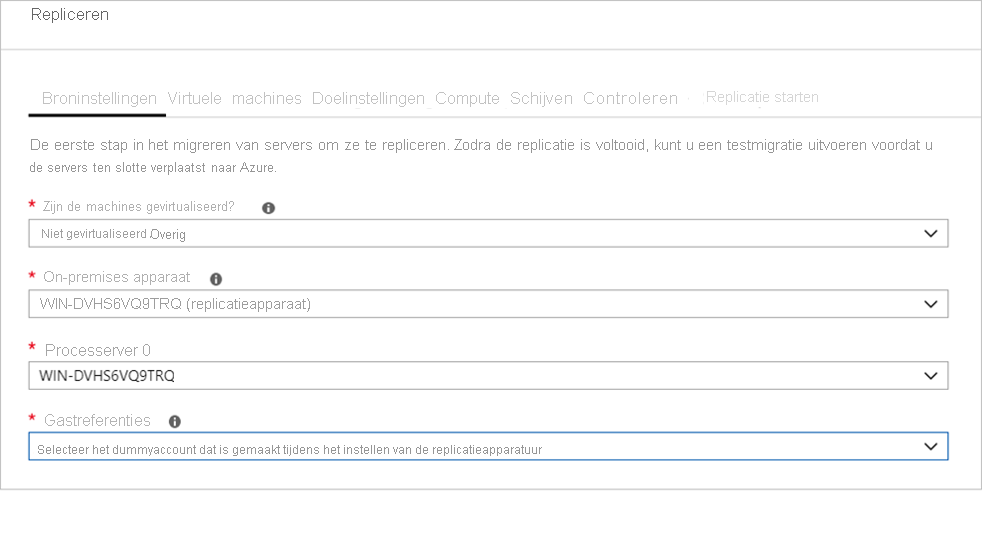

# <a name="migrate-machines-as-physical-servers-to-azure"></a>Machines als fysieke servers migreren naar Azure

In dit artikel ziet u hoe u machines als fysieke servers naar Azure migreert met het hulpprogramma Azure Migrate:Server Migration. Machines migreren door ze te behandelen als fysieke servers is handig in een aantal scenario's:

- On-premises fysieke servers migreren.
- VM's migreren die zijn gevirtualiseerd door platforms zoals Xen of KVM.
- Hyper-V- of VMware-VM's migreren, als u om de een of andere reden het standaardmigratieproces voor [Hyper-V-](tutorial-migrate-hyper-v.md)- of [VMware](server-migrate-overview.md)-migratie niet kunt gebruiken.
- VM's migreren die in privéclouds worden uitgevoerd.
- VM's migreren die worden uitgevoerd in openbare clouds, zoals Amazon Web Services (AWS) of Google Cloud Platform (GCP).


Deze zelfstudie is de derde in een serie die laat zien hoe u fysieke servers kunt evalueren en migreren naar Azure. In deze zelfstudie leert u het volgende:

> [!div class="checklist"]
> * Bereid u voor op het gebruik van Azure met Azure Migrate:Server Migration.
> * Controleer de vereisten voor de machines die u wilt migreren en bereid een machine voor op het replicatieapparaat van Azure Migrate waarmee machines worden gedetecteerd en gemigreerd naar Azure.
> * Voeg het hulpprogramma Azure Migrate Server Migration toe in de Azure Migrate-hub.
> * Stel het replicatieapparaat in.
> * Installeer de Mobility-service op de machines die u wilt migreren.
> * Schakel replicatie in.
> * Voer een testmigratie uit om te controleren of alles goed werkt.
> * Voer een volledige migratie naar Azure uit.

> [!NOTE]
> In zelfstudies ziet u het eenvoudigste implementatiepad voor een scenario, zodat u snel een haalbaarheidstest kunt instellen. Waar mogelijk maken zelfstudies gebruik van standaardopties en niet alle mogelijke instellingen en paden worden weergegeven. Raadpleeg de procedures voor Azure Migrate voor gedetailleerde instructies.

Als u nog geen abonnement op Azure hebt, maak dan een [gratis account](https://azure.microsoft.com/pricing/free-trial/) aan voordat u begint.


## <a name="prerequisites"></a>Vereisten

Voordat u aan deze zelfstudie begint, dient u eerst:

[Bekijk](./agent-based-migration-architecture.md) de migratiearchitectuur.

## <a name="prepare-azure"></a>Azure voorbereiden

Bereid Azure voor op een migratie met Server Migration.

**Taak** | **Details**
--- | ---
**Maak een Azure Migrate-project** | Uw Azure-account heeft Inzender- of Eigenaarsmachtigingen nodig om een project te maken.
**Machtigingen verifiëren voor uw Azure-account** | U hebt voor uw Azure-account machtigingen nodig om een virtuele machine te maken en naar een beheerde Azure-schijf te schrijven.


### <a name="assign-permissions-to-create-project"></a>Machtigingen toewijzen voor het maken van een project

1. Open in de Azure-portal het abonnement en selecteer **Toegangsbeheer (IAM)** .
2. In **Toegang controleren**, zoekt u het relevante account en klikt u hierop om machtigingen weer te geven.
3. U moet de machtigingen **Inzender** of **Eigenaar** hebben.
    - Als u net pas een gratis Azure-account hebt gemaakt, bent u de eigenaar van uw abonnement.
    - Als u niet de eigenaar van het abonnement bent, kunt u met de eigenaar samenwerken om de rol toe te wijzen.


### <a name="assign-azure-account-permissions"></a>Machtigingen voor Azure-accounts toewijzen

Wijs de rol van Inzender voor virtuele machines toe aan het Azure-account. Deze biedt machtigingen voor het volgende:

- Het maken van een VM in de geselecteerde resourcegroep.
- Het maken van een VM in het geselecteerde virtuele netwerk.
- Schrijf naar een door Azure beheerde schijf. 

### <a name="create-an-azure-network"></a>Een Azure-netwerk maken

[Stel](../virtual-network/manage-virtual-network.md#create-a-virtual-network) een virtueel Azure-netwerk (VNet) in. Wanneer u repliceert naar Azure, worden virtuele Azure-machines gemaakt en gekoppeld aan het Azure VNet dat u opgeeft wanneer u de migratie instelt.

## <a name="prepare-for-migration"></a>Voorbereiden op migratie

Ter voorbereiding op de migratie van fysieke servers moet u de fysieke serverinstellingen verifiëren en de implementatie van een replicatieapparaat voorbereiden.

### <a name="check-machine-requirements-for-migration"></a>De machinevereisten voor migratie controleren

Controleer of de machines aan de vereisten voor migratie naar Azure voldoen. 

> [!NOTE]
> Wanneer u fysieke machines gaat migreren, wordt voor Azure Migrate:Server Migration dezelfde replicatiearchitectuur gebruikt als voor op agents gebaseerd herstel na noodgevallen in de Azure Site Recovery-service, en een aantal onderdelen deelt dezelfde codebasis. Bepaalde inhoud wordt mogelijk gekoppeld aan Site Recovery-documentatie.

1. [Controleer](migrate-support-matrix-physical-migration.md#physical-server-requirements) de vereisten voor fysieke servers.
2. Controleer of de on-premises machines die u naar Azure repliceert, voldoen aan de [VM-vereisten voor Azure](migrate-support-matrix-physical-migration.md#azure-vm-requirements).
3. U moet enkele wijzigingen doorvoeren aan virtuele machines voordat u ze naar Azure migreert.
    - Voor sommige besturingssystemen worden deze wijzigingen automatisch door Azure Migrate aangebracht. 
    - Het is belangrijk dat u deze wijzigingen aanbrengt voordat u begint met de migratie. Als u de virtuele machine migreert voordat u de wijzigingen doorvoert, start de VM mogelijk niet op in Azure. Controleer de voor [Windows](prepare-for-migration.md#windows-machines) en [Linux](prepare-for-migration.md#linux-machines) vereiste wijzigingen.

### <a name="prepare-a-machine-for-the-replication-appliance"></a>Een machine voorbereiden voor het replicatieapparaat

Azure Migrate:Server Migration gebruikt het replicatieapparaat om machines naar Azure te repliceren. Met het replicatieapparaat worden de volgende onderdelen uitgevoerd.

- **Configuratieserver**: De configuratieserver coördineert de communicatie tussen on-premises en Azure, en beheert de gegevensreplicatie.
- **Processerver**: De processerver fungeert als replicatiegateway. Deze ontvangt replicatiegegevens, optimaliseert de gegevens met caching, compressie en versleuteling, en verzendt ze naar het account voor cacheopslag in Azure. 

Bereid de implementatie van het apparaat als volgt voor:

- U bereidt een machine voor die het replicatieapparaat gaat hosten. [Bekijk](migrate-replication-appliance.md#appliance-requirements) de machinevereisten.
- Het replicatieapparaat maakt gebruik van MySQL. Bekijk de [opties](migrate-replication-appliance.md#mysql-installation) voor het installeren van MySQL op het apparaat.
- Controleer de vereiste Azure-URL's voor het replicatieapparaat om toegang te krijgen tot [openbare](migrate-replication-appliance.md#url-access) clouds en [overheidsclouds](migrate-replication-appliance.md#azure-government-url-access).
- Controleer de toegangsvereisten [poort] (migrate-replication-appliance.md#port-access) voor het replicatieapparaat.

> [!NOTE]
> Het replicatieapparaat mag niet worden geïnstalleerd op een bronmachine die u wilt repliceren of op het detectie- en beoordelingsapparaat voor Azure Migrate dat u eerder hebt geïnstalleerd.

## <a name="add-the-server-migration-tool"></a>Het hulpprogramma Server Migration toevoegen

Stel een Azure Migrate-project in en voeg daarna het hulpprogramma Server Migration eraan toe.

1. Zoek in de Azure-portal in **Alle services** naar **Azure Migrate**.
2. Onder **Services** selecteert u **Azure Migrate**.
3. Klik in **Overzicht** op **Servers evalueren en migreren**.
4. Klik onder **Servers detecteren, evalueren en migreren** op **Servers evalueren en migreren**.

    

5. Klik in **Servers detecteren, evalueren en migreren** op **Hulpprogramma's toevoegen**.
6. Selecteer in **Project migreren** uw Azure-abonnement en maak een resourcegroep als u er nog geen hebt.
7. Geef in **Projectdetails** de projectnaam en geografie op waarin u het project wilt maken en klik op **Volgende**. Bekijk ondersteunde geografische regio's voor [openbare](migrate-support-matrix.md#supported-geographies-public-cloud) clouds en [overheidsclouds](migrate-support-matrix.md#supported-geographies-azure-government).

    

8. Selecteer in **Evaluatieprogramma selecteren** de optie **Het toevoegen van een evaluatieprogramma voorlopig overslaan** > **Volgende**.
9. Selecteer in **Migratieprogramma selecteren** de optie **Azure Migrate: Server Migration** > **Volgende**.
10. Controleer in **Beoordelen en hulpprogramma's toevoegen** de instellingen en klik op **Hulpmiddelen toevoegen**
11. Nadat u het hulpprogramma hebt toegevoegd, wordt het weergegeven in het Azure Migrate-project > **Servers** > **Migratieprogramma's**.

## <a name="set-up-the-replication-appliance"></a>Het replicatieapparaat instellen

De eerste stap van de migratie is het instellen van het replicatieapparaat. Als u het apparaat voor de migratie van fysieke servers wilt instellen, downloadt u het installatiebestand voor het apparaat. Vervolgens voert u het uit op de [machine die u hebt voorbereid](#prepare-a-machine-for-the-replication-appliance). Na de installatie van het apparaat registreert u het met Azure Migrate Server Migration.


### <a name="download-the-replication-appliance-installer"></a>Het installatieprogramma voor het replicatieapparaat downloaden

1. In het Azure Migrate-project > **Servers**, in **Azure Migrate: Server Migration**, klikt u op **Ontdekken**.

    

3. In **Machines ontdekken** > **Zijn uw machines gevirtualiseerd?** selecteert u **Niet gevirtualiseerd/Anders**.
4. Selecteer in **Doelregio** de Azure-regio waarnaar u de machines wilt migreren.
5. Selecteer **Bevestig dat de doelregio voor migratie regionaam is**.
6. Klik op **Resources maken**. Hiermee maakt u een Azure Site Recovery-kluis op de achtergrond.
    - Als u migratie al hebt ingesteld met Azure Migrate Server Migration, kunt u deze doeloptie niet configureren, omdat er eerder resources zijn ingesteld.    
    - U kunt de doelregio voor dit project niet wijzigen nadat u op deze knop hebt geklikt.
    - Alle volgende migraties zijn naar deze regio.

7. Selecteer in **Wilt u een nieuw replicatieapparaat installeren?** **Een replicatieapparaat installeren**.
9. Download in **De software voor het replicatie apparaat downloaden en installeren** het installatieprogramma voor het apparaat en de registratiesleutel. U moet de sleutel opgeven om het apparaat te kunnen registreren. De sleutel blijft na de download vijf dagen geldig.

    

10. Kopieer het installatiebestand voor het apparaat en het sleutelbestand naar de Windows Server 2016-machine die u hebt gemaakt voor het apparaat.
11. Wanneer de installatie is voltooid, wordt de wizard Apparaat configureren automatisch gestart (u kunt de wizard ook handmatig starten met behulp van de cspsconfigtool-snelkoppeling die op het bureaublad van het apparaat is gemaakt). Gebruik het tabblad Accounts beheren van de wizard om accountgegevens toe te voegen die moeten worden gebruikt voor de push-installatie van de Mobility-service. In deze zelfstudie wordt de Mobility-service handmatig geïnstalleerd op de te repliceren bron-VM's. Daarom moet u in deze stap een dummyaccount maken en doorgaan. U kunt de volgende gegevens opgeven voor het maken van het dummy-account: 'guest' als de beschrijvende naam, 'username' als de gebruikersnaam en 'password' als het wachtwoord voor het account. U gebruikt dit dummy-account in de fase waarin u de replicatie gaat inschakelen. 

12. Nadat het apparaat na de installatie opnieuw is opgestart in **Machines detecteren**, selecteert u het nieuwe apparaat in **Configuratieserver selecteren** en klikt u op **Registratie voltooien**. Bij het voltooien van de registratie worden enkele laatste taken uitgevoerd om het replicatieapparaat voor te bereiden.

    

Het kan na voltooiing van de registratie enige tijd duren dat de gedetecteerde VM's worden weergegeven in Azure Migrate Server Migration. Als er VM's worden gedetecteerd, neemt het aantel **Gedetecteerde servers** toe.


## <a name="install-the-mobility-service"></a>De Mobility-service installeren

U moet de agent Mobility-service installeren op de machines die u wilt migreren. De installatieprogramma's voor de agent zijn beschikbaar op het replicatieapparaat. Na het vinden van het juiste installatie programma installeert u de agent op elke computer die u wilt migreren. Doe dit als volgt:

1. Meld u aan bij het replicatieapparaat.
2. Ga naar **%ProgramData%\ASR\home\svsystems\pushinstallsvc\repository**.
3. Zoek het installatieprogramma voor het besturingssysteem en de versie van de machine. Controleer [ondersteunde besturingssystemen](../site-recovery/vmware-physical-azure-support-matrix.md#replicated-machines). 
4. Kopieer het installatiebestand naar de machine die u wilt migreren.
5. Zorg ervoor dat u over de wachtwoordzin beschikt die werd gegenereerd bij het implementeren van het apparaat.
    - Sla het bestand op in een tijdelijk tekstbestand op de machine.
    - U kunt de wachtwoordzin op het replicatieapparaat verkrijgen. Voer vanaf de opdrachtregel **C:\ProgramData\ASR\home\svsystems\bin\genpassphrase.exe-v** uit om de huidige wachtwoordzin weer te geven.
    - Genereer de wachtwoordzin niet opnieuw. Hierdoor wordt de verbinding verbroken en moet u het replicatieapparaat opnieuw registreren.


### <a name="install-on-windows"></a>Installeren in Windows

1. Pak de inhoud van het installatiebestand als volgt uit naar een lokale map (bijvoorbeeld C:\Temp) op de machine:

    ```
    ren Microsoft-ASR_UA*Windows*release.exe MobilityServiceInstaller.exe
    MobilityServiceInstaller.exe /q /x:C:\Temp\Extracted
    cd C:\Temp\Extracted
    ```
2. Voer het installatieprogramma van de Mobility-service uit:
    ```
   UnifiedAgent.exe /Role "MS" /Silent
    ```
3. Registreer de agent bij het replicatieapparaat:
    ```
    cd C:\Program Files (x86)\Microsoft Azure Site Recovery\agent
    UnifiedAgentConfigurator.exe  /CSEndPoint <replication appliance IP address> /PassphraseFilePath <Passphrase File Path>
    ```

### <a name="install-on-linux"></a>Installeren in Linux

1. Pak de inhoud van de tarball van het installatieprogramma als volgt uit naar een lokale map (bijvoorbeeld /tmp/MobSvcInstaller) op de machine:
    ```
    mkdir /tmp/MobSvcInstaller
    tar -C /tmp/MobSvcInstaller -xvf <Installer tarball>
    cd /tmp/MobSvcInstaller
    ```
2. Download het script van het installatieprogramma:
    ```
    sudo ./install -r MS -q
    ```
3. Registreer de agent bij het replicatieapparaat:
    ```
    /usr/local/ASR/Vx/bin/UnifiedAgentConfigurator.sh -i <replication appliance IP address> -P <Passphrase File Path>
    ```

## <a name="replicate-machines"></a>Machines repliceren

Selecteer nu machines voor de migratie. 

> [!NOTE]
> U kunt maximaal 10 machines tegelijk repliceren. Als u meer wilt repliceren, repliceert u ze in batches van 10.

1. In het Azure Migrate-project > **Servers**, **Azure Migrate: Servermigratie** klikt u op **Repliceren**.

    

2. Selecteer in **Repliceren** > **Broninstellingen** > **Zijn uw machines gevirtualiseerd?** **Niet gevirtualiseerd/Overige**.
3. In **On-premises apparaat** selecteert u de naam van het Azure Migrate-apparaat dat u instelt.
4. Selecteer in **Processerver** de naam van het replicatieapparaat.
6. Selecteer bij **Gastreferenties** het dummy-account dat eerder is gemaakt tijdens het [configureren van het installatieprogramma voor de replicatiefunctie](#download-the-replication-appliance-installer) om de Mobility-service handmatig te installeren (push-installatie wordt niet ondersteund). Klik vervolgens op **Volgende: Virtuele machines**.   

    

7. Houd bij **Virtuele machines** in **Migratie-instellingen importeren uit een evaluatie?** de standaardinstelling **Nee, ik geef de migratie-instellingen handmatig op** aan.
8. Controleer elke virtuele machine die u wilt migreren. Klik vervolgens op **Volgende: Doelinstellingen**.

    


9. Selecteer in **Doelinstellingen** het abonnement en de doelregio waarnaar u migreert en geef de resourcegroep op waarin de Azure-VM's na de migratie moeten worden geplaatst.
10. Selecteer in **Virtual Network** het Azure VNet/subnet waaraan de Azure-VM's na migratie worden toegevoegd.
11. Selecteer in **Beschikbaarheidsopties**:
    -  Beschikbaarheidszone, om de gemigreerde computer vast te maken aan een specifieke beschikbaarheidszone in de regio. Gebruik deze optie om servers te distribueren die een toepassingslaag met meerdere knooppunten in de beschikbaarheidszones vormen. Als u deze optie selecteert, moet u op het tabblad Compute de beschikbaarheidszone opgeven die moet worden gebruikt voor elk van de geselecteerde computers. Deze optie is alleen beschikbaar als de doelregio die voor de migratie is geselecteerd, ondersteuning biedt voor beschikbaarheidszones
    -  Beschikbaarheidsset, om de gemigreerde machine in een beschikbaarheidsset te plaatsen. De doelresourcegroep die is geselecteerd, moet een of meer beschikbaarheidssets bevatten om deze optie te kunnen gebruiken.
    - Er is geen optie voor infrastructuurredundantie vereist als u geen van deze beschikbaarheidsconfiguraties nodig hebt voor de gemigreerde computers.
12. In **Azure Hybrid Benefit**:

    - Selecteer **Nee** als u Azure Hybrid Benefit niet wilt toepassen. Klik op **Volgende**.
    - Selecteer **Ja** als u Windows Server-computers hebt die worden gedekt met actieve softwareverzekering of Windows Server-abonnementen en u het voordeel wilt toepassen op de machines die u migreert. Klik op **Volgende**.

    

13. Controleer bij **Compute** naam, grootte, type besturingssysteemschijf en beschikbaarheidsconfiguratie van de VM (indien geselecteerd in de vorige stap). VM's moeten voldoen aan de [Azure-vereisten](migrate-support-matrix-physical-migration.md#azure-vm-requirements).

    - **VM-grootte**: Als u evaluatie-aanbevelingen gebruikt, bevat het vervolgkeuzemenu voor de VM-grootte de aanbevolen grootte. Anders kiest Azure Migrate een grootte op basis van de dichtstbijzijnde overeenkomst in het Azure-abonnement. U kunt ook handmatig een grootte kiezen in **Azure VM-grootte**.
    - **Besturingssysteemschijf**: Geef de besturingssysteemschijf (opstarten) voor de VM op. De besturingssysteemschijf is de schijf die de bootloader en het installatieprogramma van het besturingssysteem bevat.
    - **Beschikbaarheidszone**: Geef de beschikbaarheidszone op die moet worden gebruikt.
    - **Beschikbaarheidsset**: Geef de beschikbaarheidsset op die moet worden gebruikt.

> [!NOTE]
> Als u een andere beschikbaarheidsoptie wilt selecteren voor een set virtuele machines, gaat u naar stap 1 en herhaalt u de stappen door andere beschikbaarheidsopties te selecteren na het starten van de replicatie voor één set virtuele machines.

   

13. Geef in **Schijven** op of de VM-schijven moeten worden gerepliceerd in Azure en selecteer het schijftype (standaard SSD/HDD of premium beheerde schijven) in Azure. Klik op **Volgende**.
    - U kunt schijven uitsluiten van replicatie.
    - Als u schijven uitsluit, zijn deze na migratie niet beschikbaar in de Azure-VM. 

    


14. Controleer in **Replicatie controleren en beginnen** de instellingen en klik op **Repliceren** om de eerste replicatie van de servers te beginnen.

> [!NOTE]
> U kunt de replicatie-instellingen op elk gewenst moment bijwerken voordat de replicatie begint, **Beheren** > **Machines repliceren**. De instellingen kunnen niet meer worden gewijzigd nadat de replicatie is begonnen.


## <a name="track-and-monitor"></a>Bijhouden en controleren

- Wanneer u op **Repliceren** klikt, wordt een taak voor het starten van de replicatie gestart. 
- Wanneer deze taak is voltooid, beginnen de machines hun initiële replicatie naar Azure.
- Nadat de initiële replicatie is voltooid, begint de deltareplicatie. Incrementele wijzigingen van on-premises schijven worden periodiek gerepliceerd naar de replicaschijven in Azure.


U kunt de taakstatus volgen in de portalmeldingen.

U kunt de replicatiestatus controleren door te klikken op **Replicerende servers** in **Azure Migrate: Server Migration**.


## <a name="run-a-test-migration"></a>Een testmigratie uitvoeren


Wanneer de deltareplicatie begint, kunt u een testmigratie voor de virtuele machines uitvoeren voordat u een volledige migratie naar Azure uitvoert. We raden u ten zeerste aan om dit ten minste één keer te doen voor elke machine voordat u deze migreert.

- Bij het uitvoeren van een testmigratie wordt gecontroleerd of de migratie werkt zoals verwacht, zonder dat dit van invloed is op de on-premises machines - die operationeel blijven - en u door kunt gaan met repliceren. 
- Met een testmigratie wordt de migratie gesimuleerd door een Azure-VM te maken met behulp van gerepliceerde gegevens (die meestal worden gemigreerd naar een niet-productie-VNet in uw Azure-abonnement).
- U kunt de gerepliceerde Azure-VM gebruiken om de migratie te valideren, apps te testen en problemen op te lossen voordat u de volledige migratie uitvoert.

Ga als volgt te werk om een testmigratie uit te voeren:


1. In **Migratiedoelen** > **Servers** > **Azure Migrate: Servermigratie** klikt u op **Gemigreerde servers testen**.

     

2. Klik met de rechtermuisknop op de te testen VM en klik vervolgens op **Migratie testen**.

    

3. Selecteer in **Migratie testen** het Azure Vnet waarin de Azure-VM zich na migratie bevindt. We raden u aan geen productie-VNet te gebruiken.
4. De taak **Migratie testen** wordt gestart. Houd de taak in portalmeldingen in de gaten.
5. Nadat de migratie is voltooid, bekijkt u de gemigreerde Azure-VM in **Virtuele machines** in de Azure-portal. De machinenaam heeft het achtervoegsel **-Test**.
6. Nadat de test is afgerond, klikt u met de rechtermuisknop op de Azure-VM in **Machines repliceren** en klikt u op **Testmigratie opschonen**.

    


## <a name="migrate-vms"></a>Virtuele machines migreren

Nadat u hebt geverifieerd dat de testmigratie naar verwachting werkt, kunt u de on-premises machines migreren.

1. In het Azure Migrate-project > **Servers** > **Azure Migrate: Servermigratie** klikt u op **Servers repliceren**.

    

2. Klik in **Machines repliceren** met de rechtermuisknop op de VM > **Migreren**.
3. In **Migreren** > **Virtuele machines afsluiten en geplande migratie uitvoeren zonder gegevensverlies** selecteert u **Ja** > **OK**.
    - Als u de VM niet wilt afsluiten, selecteert u **Nee**
    
    Opmerking: Voor de migratie van de fysieke server is het aan te bevelen om de toepassing te downloaden als onderdeel van het migratievenster (laat de toepassingen geen enkele verbinding accepteren). Initieer vervolgens de migratie (de server moet geactiveerd blijven, zodat de resterende wijzigingen kunnen worden gesynchroniseerd) voordat de migratie is voltooid.

4. Er wordt een migratietaak gestart voor de VM. Volg de taak in Azure-meldingen.
5. Nadat de taak is afgerond, kunt u de VM bekijken en beheren vanaf de pagina **Virtuele machines**.

## <a name="complete-the-migration"></a>Migratie voltooien

1. Nadat de migratie is voltooid, klikt u met de rechtermuisknop op de VM > **Migratie stoppen**. Er gebeurt nu het volgende:
    - De replicatie van de on-premises machine wordt gestopt.
    - De machine wordt verwijderd uit het aantal **Replicerende servers** in Azure Migrate: Server Migration.
    - De informatie over de replicatiestatus voor de machine wordt opgeschoond.
2. Installeer de Azure VM [Windows](../virtual-machines/extensions/agent-windows.md)- of [Linux](../virtual-machines/extensions/agent-linux.md)-agent op de gemigreerde computers.
3. Voer correcties van de app uit na de migratie, zoals updates van de databaseverbindingsreeksen en webserverconfiguraties.
4. Voer acceptatietesten van de toepassing en de migratie uit op de gemigreerde toepassing die nu wordt uitgevoerd in Azure.
5. Leid het verkeer naar het gemigreerde Azure VM-exemplaar.
6. Verwijder de on-premises VM's uit uw lokale VM-inventaris.
7. Verwijder de on-premises VM's uit de lokale back-ups.
8. Werk eventuele interne documentatie bij met de nieuwe locatie en het nieuwe IP-adres van de Azure VM's. 

## <a name="post-migration-best-practices"></a>Best practices na de migratie

- Voor grotere flexibiliteit:
    - Houd uw gegevens veilig door back-ups van virtuele Azure VM‘s te maken met behulp van de Azure Backup-service. [Meer informatie](../backup/quick-backup-vm-portal.md).
    - Houd workloads continu beschikbaar door Azure VM‘s naar een secundaire regio te repliceren met Site Recovery. [Meer informatie](../site-recovery/azure-to-azure-tutorial-enable-replication.md).
- Voor betere beveiliging:
    - Vergrendel en beperk de toegang van binnenkomend verkeer met [Just-in-time-beheer van Azure Security Center](../security-center/security-center-just-in-time.md).
    - Beperk het netwerkverkeer naar beheereindpunten met [Netwerkbeveiligingsgroepen](../virtual-network/security-overview.md).
    - Implementeer [Azure Disk Encryption](../security/fundamentals/azure-disk-encryption-vms-vmss.md) om schijven te beveiligen en gegevens te beschermen tegen diefstal en onbevoegde toegang.
    - Lees meer informatie over [IaaS-resources beveiligen](https://azure.microsoft.com/services/virtual-machines/secure-well-managed-iaas/) en bezoek het [Azure Security Center](https://azure.microsoft.com/services/security-center/).
- Voor controle en beheer:
    - Overweeg de implementatie van [Azure Cost Management](../cost-management-billing/cloudyn/overview.md) om uw resourcegebruik en uitgaven te bewaken.


## <a name="next-steps"></a>Volgende stappen

Onderzoek de [cloudmigratiereis](/azure/architecture/cloud-adoption/getting-started/migrate) in het Azure Cloud Adoption Framework.
