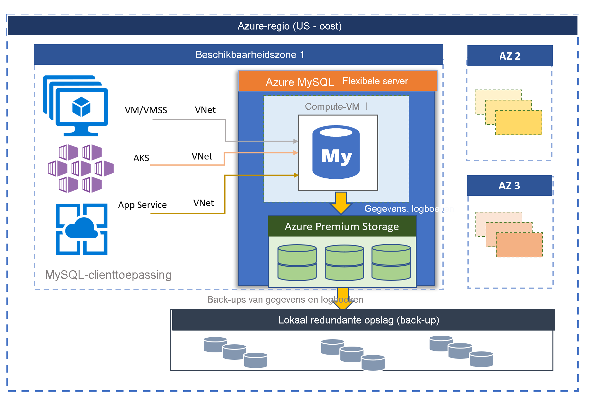

# Azure Database for MySQL Flexible Server (preview-versie)

Azure Database for MySQL, mogelijk gemaakt door de MySQL Community Edition, is beschikbaar in twee implementatiemodi:
- Single Server 
- Flexible Server (preview)

In dit artikel vindt u een overzicht van en inleiding tot kernconcepten van het implementatiemodel voor flexibele servers. 

## Overzicht

Azure Database for MySQL Flexible Server is een volledig beheerde databaseservice die is ontworpen om nauwkeurige controle en flexibiliteit te bieden als het gaat om databasebeheerfuncties en configuratie-instellingen. Over het algemeen biedt de service meer flexibiliteit en aanpassingen van de serverconfiguratie op basis van de gebruikersvereisten. Met de flexibele-serverarchitectuur kunnen gebruikers kiezen voor hoge beschikbaarheid binnen één beschikbaarheidszone en tussen meerdere beschikbaarheidszones. Flexibele servers bieden ook betere besturingselementen voor kostenoptimalisatie, met de mogelijkheid om uw server en burstable SKU's te stoppen of te starten, wat ideaal is voor workloads die niet voortdurend volledige rekencapaciteit nodig hebben. De service ondersteunt momenteel de communityversie van MySQL 5.7. De service is momenteel beschikbaar als preview-versie en verkrijgbaar in allerlei [Azure-regio's](https://azure.microsoft.com/global-infrastructure/services/).

Flexibele servers zijn het best geschikt voor 
- Ontwikkeling van toepassingen die betere controle en aanpassingen vereisen.
- Zone-redundante hoge beschikbaarheid
- Beheerde onderhoudsvensters

 

## Hoge beschikbaarheid binnen en tussen beschikbaarheidszones

Het implementatiemodel van flexibele servers biedt ondersteuning voor hoge beschikbaarheid binnen één beschikbaarheidszone en tussen meerdere beschikbaarheidszones. In de architectuur zijn rekenkracht en opslag van elkaar gescheiden. De database-engine wordt uitgevoerd op een virtuele machine, en gegevensbestanden bevinden zich in Azure Storage. In de opslag worden drie lokaal redundante synchrone kopieën van de databasebestanden onderhouden, zodat duurzaamheid van gegevens te allen tijde wordt gegarandeerd. 

Als de server binnen een enkele beschikbaarheidszone uitvalt als gevolg van geplande of niet-geplande gebeurtenissen, behoudt de service hoge beschikbaarheid van de servers met behulp van de volgende geautomatiseerde procedure:

1. Er wordt een nieuwe reken-VM ingericht.
2. De opslag met gegevensbestanden wordt toegewezen aan de nieuwe virtuele machine
3. De MySQL-database-engine wordt online gebracht op de nieuwe virtuele machine.
4. Clienttoepassingen kunnen opnieuw verbinding maken zodra de server gereed is om verbindingen te accepteren.
   
:::image type="content" source="media/overview/2-flexible-server-architecture.png" alt-text="Conceptueel diagram voor hoge beschikbaarheid met één zone"::: 

Als zone-redundante hoge beschikbaarheid is geconfigureerd, wordt in de service een dynamische stand-byserver voor de beschikbaarheidszone binnen dezelfde Azure-regio onderhouden. De gegevenswijzigingen op de bronserver worden synchroon gerepliceerd naar de stand-byserver om ervoor te zorgen dat er geen gegevens verloren gaan. Als de geplande of niet-geplande failovergebeurtenis wordt geactiveerd met zone-redundante hoge beschikbaarheid, komt de stand-byserver onmiddellijk online en is deze beschikbaar voor het verwerken van binnenkomende transacties. Een failover duurt meestal tussen de 60 en 120 seconden. Op deze manier kan de service hoge beschikbaarheid ondersteunen en meer flexibiliteit bieden met tolerantie voor storingen in één beschikbaarheidszone in een bepaalde Azure-regio. 

Zie [concepten met betrekking tot hoge beschikbaarheid](concepts-high-availability.md) voor meer informatie.

:::image type="content" source="media/overview/3-flexible-server-overview-zone-redundant-ha.png" alt-text="Conceptueel diagram voor zone-redundante hoge beschikbaarheid"::: 

## Automatische toepassing van patches met beheerd onderhoudsvenster

De service voert automatische patches uit van de onderliggende hardware, het besturingssysteem en de database-engine. De patches omvatten beveiligings- en software-updates. Voor de MySQL-engine maken kleine versie-upgrades ook deel uit van de geplande onderhoudsrelease. Gebruikers kunnen het schema voor het toepassen van patches configureren voor beheer door het systeem of zelf hun eigen aangepaste schema definiëren. Tijdens het onderhoudsschema wordt de patch toegepast en moet de server mogelijk opnieuw worden opgestart als onderdeel van het patchproces om de update te voltooien. Met een aangepast schema kunnen gebruikers hun patchcyclus voorspelbaar maken en een onderhoudsvenster kiezen met minimale gevolgen voor het bedrijf. Over het algemeen volgt de service de maandelijkse releaseplanning, als onderdeel van de continue integratie en releases. 

## Automatische back-ups

Door de service voor flexibele servers worden automatisch serverback-ups gemaakt en opgeslagen in een door de gebruiker geconfigureerde lokaal redundante of geografisch redundante opslag. Back-ups kunnen worden gebruikt om uw server naar een bepaald tijdstip binnen de retentieperiode van de back-up te herstellen. De standaardretentieperiode voor back-ups is zeven dagen. De retentie kan desgewenst op maximaal 35 dagen worden ingesteld. Alle back-ups worden versleuteld met AES 256-bits versleuteling. 

Zie [Back-upconcepten](concepts-backup-restore.md) voor meer informatie.

## Netwerkisolatie

U beschikt over twee netwerkopties om verbinding te maken met uw Azure Database for MySQL Flexible Server. De opties zijn **privétoegang (VNet-integratie)** en openbare toegang **(toegestane IP-adressen)** . 

* **Privétoegang (VNet-integratie)** : u kunt uw flexibele server implementeren in uw [virtuele Azure-netwerk](../../virtual-network/virtual-networks-overview.md). Virtuele Azure-netwerken bieden privé- en beveiligde netwerkcommunicatie. Resources in een virtueel netwerk kunnen communiceren via privé-IP-adressen.

   Kies de optie van VNet-integratie als u over de volgende mogelijkheden wilt beschikken:
   * Verbinding maken tussen Azure-resources in hetzelfde virtuele netwerk en uw flexibele server met behulp van privé-IP-adressen
   * VPN of ExpressRoute gebruiken om verbinding te maken met een flexibele server vanuit andere resources dan Azure
   * Geen openbaar eindpunt

* **Openbare toegang (toegestane IP-adressen)** : u kunt uw flexibele server met een openbaar eindpunt implementeren. Het openbare eindpunt is een openbaar omzetbaar DNS-adres. De zin 'toegestane IP-adressen' verwijst naar een bereik van IP's die u toestemming geeft om toegang te krijgen tot uw server. Deze machtigingen worden **firewallregels** genoemd.

Zie [Netwerkconcepten](concepts-networking.md) voor meer informatie.

## Binnen een paar seconden prestaties en schaal aanpassen

De service voor flexibele servers is beschikbaar in drie SKU-lagen: Burstable, Algemeen gebruik en Geoptimaliseerd voor geheugen. De Burstable-laag is het meest geschikt voor goedkope ontwikkeling en workloads met weinig gelijktijdigheid waarbij de volledige rekencapaciteit niet continu nodig is. Algemeen gebruik en Geoptimaliseerd voor geheugen zijn beter geschikt voor productieworkloads waarvoor hoge gelijktijdigheid, schaalbaarheid en voorspelbare prestaties nodig zijn. U kunt uw eerste app op een kleine database bouwen voor een paar euro per maand en vervolgens de schaal ervan naadloos aanpassen om aan de vereisten van uw oplossing te voldoen. De opslagschaal is online en ondersteunt automatische groei van opslag. Doordat de schaalbaarheid dynamisch is, kan uw database op een transparante manier reageren op snel veranderende resourcevereisten. U betaalt alleen voor de resources die u gebruikt. 

Zie [Reken- en opslagconcepten](concepts-compute-storage.md) voor meer informatie.

## De server stoppen/starten om de kosten te optimaliseren

De service voor flexibele servers biedt u de mogelijkheid om de server op aanvraag te stoppen en te starten om de kosten te optimaliseren. Het factureren van de rekenlaag wordt direct gestopt wanneer de server is gestopt. Hierdoor kunt u aanzienlijke kostenbesparingen realiseren tijdens het ontwikkelen en testen en krijgt u tijdgebonden, voorspelbare productieworkloads. De server blijft gedurende zeven dagen gestopt, tenzij deze opnieuw wordt gestart. 

## Toonaangevende beveiliging en privacy

De service voor flexibele servers maakt gebruik van de door FIPS 140-2 gevalideerde cryptografische module voor opslagversleuteling van niet-actieve gegevens. Gegevens, inclusief back-ups en tijdelijke bestanden die worden gemaakt tijdens het uitvoeren van query's, worden versleuteld. De service maakt gebruikt van de AES 256-bits versleuteling die deel uitmaakt van Azure Storage-versleuteling. De sleutels kunnen door het systeem worden beheerd (standaardinstelling). 

De service versleutelt actieve gegevens met TLS (Transport Layer Security) dat standaard wordt afgedwongen. Flexibele servers bieden alleen ondersteuning voor versleutelde verbindingen met behulp van TLS 1.2 (Transport Layer Security) en alle binnenkomende verbindingen met TLS 1.0 en TLS 1.1 worden geweigerd. 

Zie [Versleutelde verbindingen gebruiken met flexibele servers](/articles/mysql/flexible-server/how-to-connect-tls-ssl.md) voor meer informatie.

Flexibele servers bieden volledige privétoegang tot de servers met behulp van [VNet-integratie (Virtual Network) van Azure](https://docs.microsoft.com/azure/virtual-network/virtual-networks-overview). Servers in een virtueel netwerk van Azure kunnen alleen worden bereikt en verbonden via privé-IP-adressen. Met VNet-integratie wordt openbare toegang geweigerd en kunnen er geen servers worden bereikt via openbare eindpunten. 

Zie [Netwerkconcepten](concepts-networking.md) voor meer informatie.

## Bewaking en waarschuwingen

De service voor flexibele servers is uitgerust met ingebouwde functies voor prestatiebewaking en waarschuwingen. Alle metrische gegevens van Azure hebben een frequentie van één minuut, en elke metriek bevat een geschiedenis van 30 dagen. U kunt waarschuwingen configureren voor de metrische gegevens. Met de service worden metrische gegevens van de hostserver beschikbaar gemaakt voor het bewaken van het resourcegebruik en het configureren van langzame querylogboeken. Met deze hulpprogramma's kunt u uw workloads snel optimaliseren en uw server configureren voor de beste prestaties. 

Zie [Bewakingsconcepten](concepts-monitoring.md) voor meer informatie.

## Migratie

De service voert de communityversie van MySQL uit. Dit biedt volledige toepassingscompatibiliteit en vereist minimale herstructureringskosten voor het migreren van bestaande toepassingen die zijn ontwikkeld op MySQL-engine naar een service met één server. De migratie naar de enkele server kan worden uitgevoerd met behulp van een van de volgende opties:

- **Dumpen en herstellen**: voor offline migraties, waarbij gebruikers zich enige downtime kunnen veroorloven, kunnen dumpen en herstellen met behulp van communityhulpprogramma's, zoals mysqldump/mydumper, de snelste manier zijn voor migratie. Zie Migreren met behulp van dump en herstel voor meer informatie. 
- **Azure Database Migration Service**: voor naadloze en vereenvoudigde migraties naar één server met minimale downtime kan [Azure Database Migration Service](https://docs.microsoft.com/azure/dms/tutorial-mysql-azure-mysql-online) worden gebruikt. 

## Volgende stappen
Nu u een inleiding tot de implementatiemodus voor één server van Azure Database for MySQL hebt gelezen, bent u klaar voor het volgende:

- Uw eerste server maken. 
  - [Een Azure Database for MySQL Flexible Server maken met behulp van Azure Portal](quickstart-create-server-portal.md)
  - [Een Azure Database for MySQL Flexible Server maken met behulp van de Azure CLI](quickstart-create-server-cli.md)
  - [Een Azure Database for MySQL Flexible Server beheren met behulp van Azure CLI](how-to-manage-server-portal.md)

- Bouw uw eerste app in de taal van uw voorkeur:
  - [Python](connect-python.md)
  - [PHP](connect-php.md)
