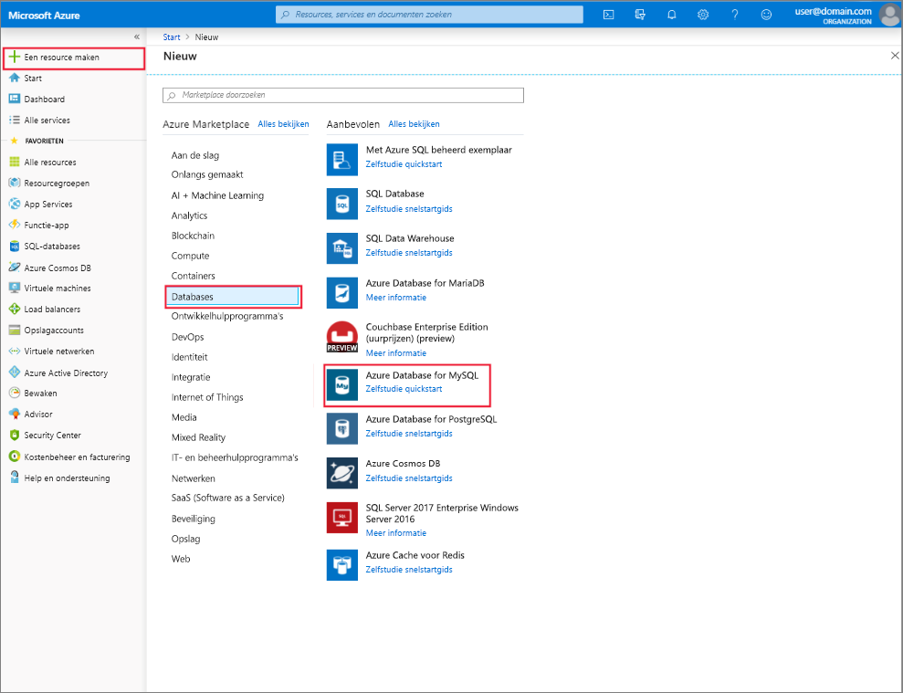

# Azure Database for MySQL server maken en beheren met Azure Portal
In dit onderwerp wordt beschreven hoe u snel een nieuwe Azure Database for MySQL-server kunt maken. Het bevat ook informatie over het beheren van de server met behulp van de Azure Portal. Server beheer omvat het weer geven van Server Details en data bases, het opnieuw instellen van het wacht woord, het schalen van resources en het verwijderen van de server.

## Aanmelden bij Azure Portal
Meld u aan bij [Azure Portal](https://portal.azure.com).

## Een Azure-database voor MySQL-server maken
Volg deze stappen om een Azure Database for MySQL server te maken met de naam ' mydemoserver '.

1. Klik op de knop **een resource maken** in de linkerbovenhoek van de Azure Portal.

2. Selecteer op de pagina nieuw de optie **data bases**en selecteer vervolgens op de pagina data bases de optie **Azure database for MySQL**.

    > Een Azure Database for MySQL-server wordt gemaakt met een gedefinieerde set [reken-en opslag](./concepts-pricing-tiers.md) resources. De data base wordt gemaakt in een Azure-resource groep en in een Azure Database for MySQL-server.

   

3. Vul het Azure Database for MySQL formulier in met behulp van de volgende gegevens:

    | **Formulierveld** | **Beschrijving van veld** |
    |----------------|-----------------------|
    | *Servernaam* | mydemoserver (Server naam is wereld wijd uniek) |
    | *Abonnement* | mysubscription (Selecteer een optie in de vervolg keuzelijst) |
    | *Resourcegroep* | myresourcegroup (een nieuwe resource groep maken of een bestaande gebruiken) |
    | *Bron selecteren* | Leeg (Maak een lege MySQL-server) |
    | *Aanmeldgegevens van serverbeheerder* | myadmin (stel accountnaam van beheerder in) |
    | *Wachtwoord* | wacht woord voor beheerders account instellen |
    | *Wachtwoord bevestigen* | bevestig wachtwoord voor beheerdersaccount |
    | *Location* | Zuidoost-Azië (selecteren tussen Europa-noord en VS-West) |
    | *Versie* | 5,7 (Kies Azure Database for MySQL Server versie) |

   

4. Klik op **prijs categorie** om de servicelaag en het prestatie niveau voor de nieuwe server op te geven. Selecteer het tabblad **Algemeen** . *Gen 5*, *2 vCores*, *5 GB* en *7 dagen* zijn de standaardwaarden voor **Bewerking voor compute**, **vCore**, **Opslag** en **Bewaarperiode voor back-up**. U kunt deze schuifregelaars laten zoals ze zijn. Als u serverback-ups in geografisch redundante opslag wilt inschakelen, selecteert u **Geografisch redundant** in het gedeelte **Redundantieopties voor back-up**.

   

5. Klik op **Maken** om de server in te richten. De inrichting duurt een paar minuten.

    > Selecteer de optie **vastmaken aan dash board** om uw implementaties eenvoudig te kunnen bijhouden.

## Een Azure Database for MySQL-server bijwerken
Nadat de nieuwe server is ingericht, heeft de gebruiker verschillende opties voor het configureren van de bestaande server, waaronder het opnieuw instellen van het beheerders wachtwoord, het wijzigen van de prijs categorie en het schalen van de server naar boven of beneden door de vCore of opslag te wijzigen.

### Het gebruikers wachtwoord van de beheerder wijzigen
1. Klik in het **overzicht**van de server op **wacht woord opnieuw instellen** om het venster wacht woord opnieuw instellen weer te geven.

   

2. Voer een nieuw wacht woord in en bevestig het wacht woord in het venster, zoals wordt weer gegeven:

   

3. Klik op **OK** om het nieuwe wacht woord op te slaan.

### De prijs categorie wijzigen
> [!NOTE]
> Schalen wordt alleen ondersteund vanuit Algemeen voor service lagen geoptimaliseerd voor geheugen en vice versa. Houd er rekening mee dat het wijzigen van en van de prijs categorie Basic nadat het maken van de server niet wordt ondersteund in Azure Database for MySQL.
> 
1. Klik onder **instellingen**op **prijs categorie**.
2. Selecteer de **prijs categorie** die u wilt wijzigen.

    

4. Klik op **OK** om de wijzigingen op te slaan. 

### VCores omhoog/omlaag schalen

1. Klik onder **instellingen**op **prijs categorie**.

2. Wijzig de instelling **vCore** door de schuif regelaar naar de gewenste waarde te verplaatsen.

    

3. Klik op **OK** om de wijzigingen op te slaan.

### Opslag omhoog schalen

1. Klik onder **instellingen**op **prijs categorie**.

2. Wijzig de **opslag** instelling door de schuif regelaar naar de gewenste waarde te verplaatsen.

    

3. Klik op **OK** om de wijzigingen op te slaan.

## Een Azure Database for MySQL server verwijderen

1. Klik in het **overzicht**van de server op de knop **verwijderen** om de bevestigings prompt voor verwijderen te openen.

    

2. Typ de naam van de server in het invoervak voor dubbele bevestiging.

    

3. Klik op de knop **verwijderen** om het verwijderen van de server te bevestigen. Wacht totdat de pop-up met geslaagde MySQL-server is verwijderd, wordt weer gegeven in de meldings balk.

## De Azure Database for MySQL-data bases weer geven
Schuif in het **overzicht**van de server omlaag totdat de data base-tegel onderaan wordt weer gegeven. Alle data bases op de server worden weer gegeven in de tabel.

   

## Details van een Azure Database for MySQL server weer geven
Klik op **Eigenschappen**onder **instellingen** om gedetailleerde informatie over de-server weer te geven.

## Volgende stappen

[Snelstart: Azure Database for MySQL server maken met behulp van Azure Portal](./quickstart-create-mysql-server-database-using-azure-portal.md)