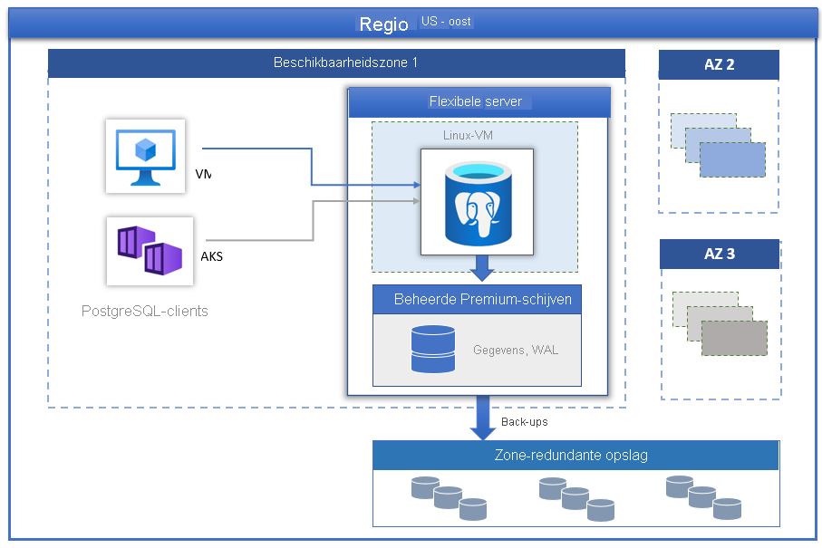

# Azure Database for PostgreSQL - Flexible Server

[Azure Database for PostgreSQL](../overview.md) op basis van de PostgreSQL Community Edition is beschikbaar in drie implementatiemodi:

- [Single Server](../overview-single-server.md)
- Flexible Server (Preview)
- Hyperscale (Citus)

In dit artikel vindt u een overzicht van en inleiding tot kernconcepten van het implementatiemodel voor flexibele servers.

> [!IMPORTANT]
> Azure Database for PostgreSQL - Flexible Server is als preview-versie beschikbaar

## Overzicht

Azure Database for PostgreSQL - Flexible Server is een volledig beheerde databaseservice die is ontworpen om nauwkeurige controle en flexibiliteit te bieden als het gaat om databasebeheerfuncties en configuratie-instellingen. Over het algemeen biedt de service meer flexibiliteit en aanpassingen van de serverconfiguratie op basis van de gebruikersvereisten. De flexibele serverarchitectuur stelt gebruikers in staat om collocatie van een database-engine uit te voeren met de clientlaag voor een lagere latentie, een hoge beschik baarheid te kiezen binnen één beschikbaarheidszone en in meerdere beschikbaarheidszones. Flexibele servers bieden ook betere besturing voor kostenoptimalisatie, met de mogelijkheid om uw server en burstable SKU's te stoppen of te starten, wat ideaal is voor workloads die niet voortdurend volledige rekencapaciteit nodig hebben. De service ondersteunt momenteel de communityversie van PostgreSQL 11 en 12. De service is momenteel beschikbaar als preview-versie en verkrijgbaar in allerlei [Azure-regio's](https://azure.microsoft.com/global-infrastructure/services/).

Flexibele servers zijn het best geschikt voor

- Ontwikkeling van toepassingen die betere controle en aanpassingen vereisen.
- Zone-redundante hoge beschikbaarheid
- Beheerde onderhoudsvensters
  
## Hoge beschikbaarheid

Het implementatiemodel van flexibele servers biedt ondersteuning voor hoge beschikbaarheid binnen één beschikbaarheidszone en tussen meerdere beschikbaarheidszones. In de architectuur zijn rekenkracht en opslag van elkaar gescheiden. De database-engine wordt uitgevoerd op een virtuele Linuxmachine, en gegevensbestanden bevinden zich in Azure-opslag. In de opslag worden drie lokaal redundante synchrone kopieën van de databasebestanden onderhouden, zodat duurzaamheid van gegevens behouden blijft.

Tijdens geplande of niet-geplande gebeurtenissen, als de server uitvalt, behoudt de service hoge beschikbaarheid van de servers met behulp van de volgende geautomatiseerde procedure:

1. Er wordt een nieuwe Linux reken-VM ingericht.
2. De opslag met gegevensbestanden wordt toegewezen aan de nieuwe virtuele machine
3. De PostgreSQL-database-engine wordt online gebracht op de nieuwe virtuele machine.

Onderstaande afbeelding toont de overgang voor de virtuele machine en de opslagfout.

 :::image type="content" source="./media/overview/overview-azure-postgres-flex-virtualmachine.png" alt-text="Flexibele Server - VM- en opslagfouten":::

Als zone-redundante hoge beschikbaarheid is geconfigureerd, wordt in de service een dynamische stand-byserver voor de beschikbaarheidszone binnen dezelfde Azure-regio onderhouden. De gegevenswijzigingen op de bronserver worden synchroon gerepliceerd naar de stand-byserver om ervoor te zorgen dat er geen gegevens verloren gaan. Als de geplande of niet-geplande failovergebeurtenis wordt geactiveerd met zone-redundante hoge beschikbaarheid, komt de stand-byserver onmiddellijk online en is deze beschikbaar voor het verwerken van binnenkomende transacties. Dit geeft de service tolerantie tegen mislukking van de beschikbaarheidszone binnen een Azure-regio die ondersteuning biedt voor meerdere beschikbaarheidszones, zoals wordt weergegeven in de onderstaande afbeelding.

 :::image type="content" source="./media/business-continuity/concepts-zone-redundant-high-availability-architecture.png" alt-text="Flexibele Server - VM- en opslagfouten":::

 Zie [Document over hoge beschikbaarheid](./concepts-high-availability.md) voor meer informatie.

## Automatische toepassing van patches met beheerd onderhoudsvenster

De service voert automatische patches uit van de onderliggende hardware, het besturingssysteem en de database-engine. De patches omvatten beveiligings- en software-updates. Voor de PostgreSQL-engine maken kleine versie-upgrades ook deel uit van de geplande onderhoudsrelease. Gebruikers kunnen het schema voor het toepassen van patches configureren voor beheer door het systeem of zelf hun eigen aangepaste schema definiëren. Tijdens het onderhoudsschema wordt de patch toegepast en moet de server mogelijk opnieuw worden opgestart als onderdeel van het patchproces om de update te voltooien. Met een aangepast schema kunnen gebruikers hun patchcyclus voorspelbaar maken en een onderhoudsvenster kiezen met minimale gevolgen voor het bedrijf. Over het algemeen volgt de service de maandelijkse releaseplanning, als onderdeel van de continue integratie en releases.

## Automatische back-ups

Met de flexibele server-service worden automatisch server-back-ups gemaakt en opgeslagen in de gebruiker die lokaal is geconfigureerd op de zone redundante (ZRS). Back-ups kunnen worden gebruikt om uw server naar een bepaald tijdstip binnen de retentieperiode van de back-up te herstellen. De standaardretentieperiode voor back-ups is zeven dagen. De retentie kan desgewenst op maximaal 35 dagen worden ingesteld. Alle back-ups worden versleuteld met AES 256-bits versleuteling. Zie [Back-ups](./concepts-backup-restore.md) voor meer informatie.

## Binnen een paar seconden prestaties en schaal aanpassen

De service voor flexibele servers is beschikbaar in drie rekenlagen: Burstable, Algemeen gebruik en Geoptimaliseerd voor geheugen. De Burstable-laag is het meest geschikt voor goedkope ontwikkeling en workloads met weinig gelijktijdigheid waarbij de volledige rekencapaciteit niet continu nodig is. Algemeen gebruik en Geoptimaliseerd voor geheugen zijn beter geschikt voor productieworkloads waarvoor hoge gelijktijdigheid, schaalbaarheid en voorspelbare prestaties nodig zijn. U kunt uw eerste app op een kleine database bouwen voor een paar euro per maand en vervolgens de schaal ervan naadloos aanpassen om aan de vereisten van uw oplossing te voldoen.

## Server stoppen/starten om de TCO te verlagen

De service voor flexibele servers biedt u de mogelijkheid om de server op aanvraag te stoppen en te starten om de TCO te optimaliseren. Het factureren van de rekenlaag wordt direct gestopt wanneer de server is gestopt. Hierdoor kunt u aanzienlijke kostenbesparingen realiseren tijdens het ontwikkelen en testen en krijgt u tijdgebonden, voorspelbare productieworkloads. De server blijft gedurende zeven dagen gestopt, tenzij deze opnieuw wordt gestart.

## Beveiliging van bedrijfskwaliteit

De service voor flexibele servers maakt gebruik van de door FIPS 140-2 gevalideerde cryptografische module voor opslagversleuteling van niet-actieve gegevens. Gegevens, inclusief back-ups en tijdelijke bestanden die worden gemaakt tijdens het uitvoeren van query's, worden versleuteld. De service maakt gebruikt van de AES 256-bits versleuteling die deel uitmaakt van Azure-opslagversleuteling. De sleutels kunnen door het systeem worden beheerd (standaardinstelling). De service versleutelt actieve gegevens met SSL/TLS (Transport Layer Security) dat standaard wordt afgedwongen. De service dwingt en ondersteunt alleen TLS-versie 1.2.

Flexibele servers bieden volledige privétoegang tot de servers met behulp van VNet-integratie (virtual netwerk) van Azure. Servers in een virtueel netwerk van Azure kunnen alleen worden bereikt en verbonden via privé-IP-adressen. Met VNet-integratie wordt openbare toegang geweigerd en kunnen geen servers worden bereikt via openbare eindpunten.

## Bewaking en waarschuwingen

De service voor flexibele servers is uitgerust met ingebouwde functies voor prestatiebewaking en waarschuwingen. Alle metrische gegevens van Azure hebben een frequentie van één minuut, en elke metriek bevat een geschiedenis van 30 dagen. U kunt waarschuwingen configureren voor de metrische gegevens. Met de service worden metrische gegevens van de hostserver beschikbaar gemaakt voor het bewaken van het resourcegebruik en het configureren van langzame querylogboeken. Met deze hulpprogramma's kunt u uw workloads snel optimaliseren en uw server configureren voor de beste prestaties.

## Migratie

De service voert de communityversie van PostgreSQL uit. Dit biedt volledige toepassingscompatibiliteit en vereist minimale herstructureringskosten voor het migreren van bestaande toepassingen die zijn ontwikkeld op PostgreSQL-engine naar Flexible Server. 

- **Dumpen en herstellen**: voor offline migraties, waarbij gebruikers zich enige downtime kunnen veroorloven, kan dumpen en herstellen met behulp van communityhulpprogramma's, zoals pg_dump en pg_restore, de snelste manier zijn voor migratie. Zie [Migreren met behulp van dumpen en herstellen](https://docs.microsoft.com/azure/postgresql/howto-migrate-using-dump-and-restore) voor meer informatie.
- **Azure Database Migration Service**: voor naadloze en vereenvoudigde migraties naar één server met minimale downtime kan Azure Database Migration Service worden gebruikt. Zie [DMS via portal](https://docs.microsoft.com/azure/dms/tutorial-postgresql-azure-postgresql-online-portal) en [DMS via CLI](https://docs.microsoft.com/azure/dms/tutorial-postgresql-azure-postgresql-online). U kunt migreren van uw Azure Database for PostgreSQL - Single Server naar Flexible Server. Zie dit [DMS-artikel](https://docs.microsoft.com/azure/dms/tutorial-azure-postgresql-to-azure-postgresql-online-portal) voor meer informatie.

## Volgende stappen

Nu u een inleiding tot de implementatiemodus voor flexibele servers van Azure Database for PostgreSQL hebt gelezen, bent u klaar om uw eerste server te maken: [Een Azure Database for PostgreSQL- Flexible Server maken met behulp van Azure Portal](./quickstart-create-server-portal.md)

