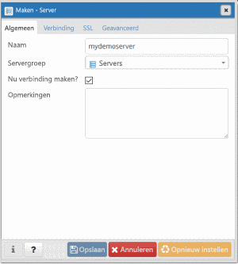
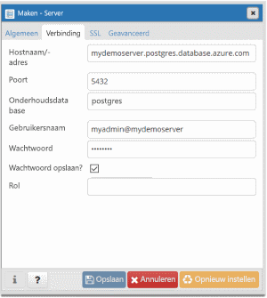
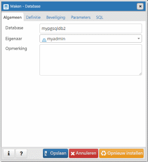

# <a name="quickstart-create-an-azure-database-for-postgresql---single-server-using-powershell"></a>Quickstart: Een Azure Database for PostgreSQL - één server maken met behulp van PowerShell

In deze quickstart wordt beschreven hoe u met PowerShell een Azure Database for PostgreSQL-server maakt in een Azure-resourcegroep. U kunt PowerShell gebruiken om Azure-resources interactief of in scripts te maken en te beheren.

## <a name="prerequisites"></a>Vereisten

Als u nog geen Azure-abonnement hebt, maakt u een [gratis account](https://azure.microsoft.com/free/) voordat u begint.

Als u PowerShell lokaal wilt gebruiken, moet u voor dit artikel de Az-module van PowerShell installeren en verbinding maken met uw Azure-account met behulp van de cmdlet [Connect-AzAccount](https://docs.microsoft.com/powershell/module/az.accounts/connect-azaccount). Zie [Azure PowerShell installeren](https://docs.microsoft.com/powershell/azure/install-az-ps) voor meer informatie over het installeren van de Az-module van PowerShell.

> [!IMPORTANT]
> Hoewel de PowerShell-module Az.PostgreSql in preview is, moet u deze afzonderlijk van de PowerShell-module Az installeren met behulp van de volgende opdracht: `Install-Module -Name Az.PostgreSql -AllowPrerelease`.
> Zodra de PowerShell-module Az.PostgreSql algemeen beschikbaar is, wordt deze onderdeel van toekomstige releases van Az PowerShell en is de module systeemeigen beschikbaar vanuit Azure Cloud Shell.

Als dit de eerste keer is dat u de Azure Database for PostgreSQL-service gebruikt, moet u de resourceprovider van **Microsoft.DBforPostgreSQL** registreren.

```azurepowershell-interactive
Register-AzResourceProvider -ProviderNamespace Microsoft.DBforPostgreSQL
```

[!INCLUDE [cloud-shell-try-it](../../includes/cloud-shell-try-it.md)]

Als u meerdere Azure-abonnementen hebt, kiest u het juiste abonnement waarin de resource moet worden gefactureerd. Selecteer een specifieke abonnementen-id met behulp van de cmdlet [set-AzContext](https://docs.microsoft.com/powershell/module/az.accounts/set-azcontext).

```azurepowershell-interactive
Set-AzContext -SubscriptionId 00000000-0000-0000-0000-000000000000
```

## <a name="create-a-resource-group"></a>Een resourcegroep maken

Maak een [Azure-resourcegroep](https://docs.microsoft.com/azure/azure-resource-manager/resource-group-overview) met de cmdlet [New-AzResourceGroup](https://docs.microsoft.com/powershell/module/az.resources/new-azresourcegroup). Een resourcegroep is een logische container waarin Azure-resources worden geïmplementeerd en groepsgewijs worden beheerd.

In het volgende voorbeeld wordt een resourcegroep met de naam **myresourcegroup** gemaakt in de regio **US – West**.

```azurepowershell-interactive
New-AzResourceGroup -Name myresourcegroup -Location westus
```

## <a name="create-an-azure-database-for-postgresql-server"></a>Een Azure-database voor PostgreSQL-server maken

Maak een Azure Database for PostgreSQL-server met de cmdlet `New-AzPostgreSqlServer`. Een server kan meerdere databases beheren. Een aparte database wordt doorgaans gebruikt voor elk project of voor elke gebruiker.

De volgende tabel bevat een lijst met veelgebruikte parameters en voorbeeldwaarden voor de `New-AzPostgreSqlServer` cmdlet.

|        **Instelling**         | **Voorbeeldwaarde** |                                                                                                                                                             **Beschrijving**                                                                                                                                                              |
| -------------------------- | ---------------- | ---------------------------------------------------------------------------------------------------------------------------------------------------------------------------------------------------------------------------------------------------------------------------------------------------------------------------------------- |
| Naam                       | mydemoserver     | Kies een globaal unieke naam in Azure ter identificatie van de Azure Database for PostgreSQL-server. De naam mag alleen letters, cijfers en het koppelteken (-) bevatten. Alle hoofdletters die worden opgegeven, worden automatisch omgezet in kleine letters tijdens het aanmaakproces. en moet 3 tot 63 tekens lang zijn. |
| ResourceGroupName          | myResourceGroup  | Geef de naam op van de Azure-resourcegroep.                                                                                                                                                                                                                                                                                            |
| Sku                        | GP_Gen5_2        | De naam van de SKU. Volgt de verkorte notatie voor conventie **prijscategorie\_ compute-generatie\_vCores**. Zie de sectie onder deze tabel voor meer informatie over de Sku-parameter.                                                                                                                                           |
| BackupRetentionDay         | 7                | Hoe lang een back-up moet worden bewaard. De eenheid is dagen. Het bereik is 7-35.                                                                                                                                                                                                                                                                       |
| GeoRedundantBackup         | Ingeschakeld          | Of geografisch redundante back-ups moeten worden ingeschakeld voor deze server. Deze waarde kan niet worden ingeschakeld voor servers in de prijscategorie Basic en kan niet worden gewijzigd nadat de server is gemaakt. Toegestane waarden: Ingeschakeld, Uitgeschakeld.                                                                                                      |
| Locatie                   | westus           | De Azure-regio voor de server.                                                                                                                                                                                                                                                                                                         |
| SslEnforcement             | Ingeschakeld          | Of SSL moet worden ingeschakeld voor deze server. Toegestane waarden: Ingeschakeld, Uitgeschakeld.                                                                                                                                                                                                                                                 |
| StorageInMb                | 51.200            | De opslagcapaciteit van de server (eenheid is MB). Een geldige StorageInMb is minimaal 5120 MB en heeft toenames van 1024 MB. Zie [Prijscategorieën voor Azure Database for PostgreSQL](./concepts-pricing-tiers.md) voor meer informatie over opslaglimieten.                                                                               |
| Versie                    | 9.6              | De primaire versie van PostgreSQL.                                                                                                                                                                                                                                                                                                                 |
| AdministratorUserName      | myadmin          | De gebruikersnaam voor aanmelding als beheerder. De aanmeldingsnaam van de beheerder mag niet **azure_superuser**, **admin**, **administrator**, **root**, **guest** of **public** zijn.                                                                                                                                                                                            |
| AdministratorLoginPassword | `<securestring>` | Het wachtwoord van de beheerder-gebruiker in de vorm van een veilige tekenreeks. Dit wachtwoord moet tussen 8 en 128 tekens bevatten. Uw wachtwoord moet tekens bevatten uit drie van de volgende categorieën: Nederlandse hoofdletters, Nederlandse kleine letters, cijfers en niet-alfanumerieke tekens.                                       |

De parameterwaarde voor de **Sku** volgt de conventie **prijscategorie\_compute-generatie\_vCores** zoals is te zien in de volgende voorbeelden.

- `-Sku B_Gen5_1` komt overeen met Basic, Gen 5 en 1 vCore. Deze optie is de kleinst beschikbare SKU.
- `-Sku GP_Gen5_32` komt overeen met Algemeen gebruik, Gen 5 en 32 vCores.
- `-Sku MO_Gen5_2` komt overeen met Geoptimaliseerd voor geheugen, Gen 5 en 2 vCores.

Voor meer informatie over geldige **SKU**-waarden per regio en voor categorieën vindt u in [Prijscategorieën voor Azure Database for PostgreSQL](./concepts-pricing-tiers.md).

In het volgende voorbeeld wordt een PostgreSQL-server gemaakt in de regio **US - west**. De server heeft de naam **mydemoserver** en bevindt zich in de resourcegroep **myresourcegroup**. De serverbeheerder kan zich aanmelden met **myadmin**. De server is een Gen 5-server in de prijscategorie Algemeen en beschikt over twee vCores. Daarnaast is geografisch redundante back-ups ingeschakeld. Noteer het wachtwoord dat in de eerste regel van het voorbeeld wordt gebruikt, aangezien dit het wachtwoord voor het beheerdersaccount van de PostgreSQL-server is.

> [!TIP]
> Een servernaam wordt toegewezen aan een DNS-naam en moet wereldwijd uniek zijn in Azure.

```azurepowershell-interactive
$Password = Read-Host -Prompt 'Please enter your password' -AsSecureString
New-AzPostgreSqlServer -Name mydemoserver -ResourceGroupName myresourcegroup -Sku GP_Gen5_2 -GeoRedundantBackup Enabled -Location westus -AdministratorUsername myadmin -AdministratorLoginPassword $Password
```

Overweeg het gebruik van de prijscategorie Basic als lichte reken- en I/O-capaciteit voldoende is voor uw workload.

> [!IMPORTANT]
> Servers die zijn gemaakt in de prijscategorie Basic, kunnen later niet meer worden geschaald voor algemeen gebruik of worden geoptimaliseerd voor het geheugen. Daarnaast is het niet mogelijk om geo-replicatie te gebruiken.

## <a name="configure-a-firewall-rule"></a>Een firewallregel configureren

Maak een firewallregel op Azure Database for PostgreSQL-serverniveau met de cmdlet `New-AzPostgreSqlFirewallRule`. Een firewallregel op serverniveau stelt een externe toepassing, zoals het opdrachtregelprogramma `psql` of PostgreSQL Workbench, in staat om via de Azure Database for PostgreSQL-servicefirewall verbinding te maken met uw server.

In het volgende voorbeeld wordt een firewallregel met de naam **AllowMyIP** gemaakt waarmee verbindingen van een specifiek IP-adres, 192.168.0.1, worden toegestaan. Vervang dit door een IP-adres of een bereik van IP-adressen dat overeenkomt met de locatie van waaruit u verbinding maakt.

```azurepowershell-interactive
New-AzPostgreSqlFirewallRule -Name AllowMyIP -ResourceGroupName myresourcegroup -ServerName mydemoserver -StartIPAddress 192.168.0.1 -EndIPAddress 192.168.0.1
```

> [!NOTE]
> Verbindingen met Azure Database for PostgreSQL lopen via poort 5432. Als u verbinding probeert te maken vanuit een bedrijfsnetwerk, wordt uitgaand verkeer via poort 5432 mogelijk niet toegestaan. In dit scenario kunt u alleen verbinding maken met uw server als uw IT-afdeling poort 5432 opent.

## <a name="get-the-connection-information"></a>De verbindingsgegevens ophalen

Als u verbinding met uw server wilt maken, moet u hostgegevens en toegangsreferenties opgeven. Gebruik het volgende voorbeeld om de verbindingsgegevens te bepalen. Noteer de waarden voor **FullyQualifiedDomainName** en de **AdministratorLogin**.

```azurepowershell-interactive
Get-AzPostgreSqlServer -Name mydemoserver -ResourceGroupName myresourcegroup |
  Select-Object -Property FullyQualifiedDomainName, AdministratorLogin
```

```Output
FullyQualifiedDomainName                    AdministratorLogin
------------------------                    ------------------
mydemoserver.postgres.database.azure.com       myadmin
```

## <a name="connect-to-postgresql-database-using-psql"></a>Verbinding maken met een PostgreSQL-database met behulp van psql

Als op uw clientcomputer PostgreSQL is geïnstalleerd, kunt u een lokale instantie van [psql](https://www.postgresql.org/docs/current/static/app-psql.html) gebruiken om verbinding te maken met een Azure PostgreSQL-server. U kunt ook een vooraf geïnstalleerde versie openen van het opdrachtregelhulpprogramma `psql` in Azure Cloud Shell door in een codevoorbeeld in dit artikel de knop **Proberen** te selecteren. Andere manieren om toegang te krijgen tot Azure Cloud Shell zijn de selectie van de knop **> _** in de werkbalk rechtsboven in de Azure Portal of een bezoek aan [shell.azure.com](https://shell.azure.com/).

1. Maak verbinding met uw Azure PostgreSQL-server met behulp van het opdrachtregelprogramma `psql`.

   ```azurepowershell-interactive
   psql --host=<servername> --port=<port> --username=<user@servername> --dbname=<dbname>
   ```

   Met de volgende opdracht maakt u bijvoorbeeld verbinding met de standaarddatabase **postgres** op uw PostgreSQL-server `mydemoserver.postgres.database.azure.com` met behulp van toegangsreferenties. Voer het `<server_admin_password>` in dat u koos toen u werd gevraagd om een wachtwoord.

   ```azurepowershell-interactive
   psql --host=mydemoserver.postgres.database.azure.com --port=5432 --username=myadmin@mydemoserver --dbname=postgres
   ```

   > [!TIP]
   > Als u liever een URL-pad gebruikt om verbinding te maken met Postgres, URL-codeert u het teken @ in de gebruikersnaam met `%40`. De verbindingsreeks voor psql zou bijvoorbeeld worden: `psql postgresql://myadmin%40mydemoserver@mydemoserver.postgres.database.azure.com:5432/postgres`

1. Wanneer u met de server bent verbonden, maakt u bij de prompt een lege database.

   ```sql
   CREATE DATABASE mypgsqldb;
   ```

1. Voer na de prompt de volgende opdracht uit om verbinding te maken met de zojuist gemaakte database **mypgsqldb**:

   ```sql
   \c mypgsqldb
   ```

## <a name="connect-to-the-postgresql-server-using-pgadmin"></a>Verbinding maken met de PostgreSQL-server met behulp van pgAdmin

pgAdmin is een open-source hulpprogramma voor PostgreSQL. U kunt pgAdmin installeren vanaf de [pgAdmin-website](https://www.pgadmin.org/). Mogelijk gebruikt u een andere versie van pgAdmin dan de versie in deze snelstart. Raadpleeg de documentatie van pgAdmin als u extra hulp nodig hebt.

1. Start de toepassing pgAdmin op uw clientcomputer.

1. Ga naar **Object** op de werkbalk, wijs **Create** aan met de muisaanwijzer en selecteer **Server**.

1. In het dialoogvenster **Create - Server** gaat u naar het tabblad **General** en voert u een unieke beschrijvende naam in voor de server, zoals **mydemoserver**.

   

1. In het dialoogvenster **Create - Server** gaat u naar het tabblad **Connection** en vult u de tabel met instellingen in.

   

    Parameter pgAdmin |Waarde|Beschrijving
    ---|---|---
    Host name/address | Servernaam | De servernaam die u hebt gebruikt toen u eerder de Azure Database for PostgreSQL-server hebt gemaakt. De server in ons voorbeeld is **mydemoserver.postgres.database.azure.com**. Gebruik de FQDN (Fully Qualified Domain Name) ( **\*. postgres.database.azure.com**) zoals weergegeven in het voorbeeld. Als u de servernaam niet meer weet, volgt u de stappen in de vorige sectie om de verbindingsgegevens op te halen.
    Poort | 5432 | De poort die moet worden gebruikt wanneer u verbinding maakt met de Azure Database for PostgreSQL-server.
    Onderhoudsdatabase | *postgres* | De door het systeem gegenereerde standaarddatabasenaam.
    Gebruikersnaam | Aanmeldingsnaam van serverbeheerder | De aanmeldingsnaam van de serverbeheerder die u hebt opgegeven toen u de Azure Database for PostgreSQL-server eerder hebt gemaakt. Als u de gebruikersnaam niet meer weet, volgt u de stappen in de vorige sectie om de verbindingsgegevens op te halen. De indeling is *gebruikersnaam\@servernaam*.
    Wachtwoord | Uw beheerderswachtwoord | Het wachtwoord dat u hebt gekozen toen u eerder in deze Quick Start de server maakte.
    Rol | Leeg laten | U hoeft op dit moment geen rolnaam op te geven. Laat het veld leeg.
    SSL-modus | *Require* | U kunt de TLS/SSL-modus instellen op het tabblad SSL van pgAdmin. Bij het maken van een Azure Database for PostgreSQL-server wordt standaard afdwinging van TLS ingeschakeld. Zie [Afdwinging van TLS configureren](./concepts-ssl-connection-security.md#configure-enforcement-of-tls) om het afdwingen van TLS uit te schakelen.

1. Selecteer **Opslaan**.

1. Vouw in het linkerdeelvenster **Browser** het knooppunt **Server** uit. Selecteer uw server, bijvoorbeeld **mydemoserver**. Klik erop om er verbinding mee te maken.

1. Vouw het knooppunt Servers uit en vouw vervolgens **Databases** eronder uit. De lijst moet uw bestaande *postgres*-database bevatten, plus eventuele andere databases die u hebt gemaakt. U kunt met Azure Database for PostgreSQL meerdere databases per server maken.

1. Klik met de rechtermuisknop op **Databases**, kies het menu **Create** en selecteer **Database**.

1. Typ een naam voor de database in het veld **Database**, bijvoorbeeld **mypgsqldb2**.

1. Selecteer bij **Owner** de eigenaar voor de database uit de keuzelijst. Kies de aanmeldingsnaam van de serverbeheerder, zoals **my admin** uit het voorbeeld.

   

1. Klik op **Save** om een nieuwe, lege database te maken.

1. In het deelvenster **Browser** kunt u de database die u hebt gemaakt, zien in de lijst met databases onder de naam van uw server.

## <a name="clean-up-resources"></a>Resources opschonen

Als u deze resources uit deze quickstart niet voor een andere quickstart of zelfstudie nodig hebt, kunt u ze verwijderen door het volgende voorbeeld uit te voeren.

> [!CAUTION]
> In het volgende voorbeeld worden de opgegeven resourcegroep en alle resources erin verwijderd.
> Als resources buiten het bereik van deze quickstart in de opgegeven resourcegroep bestaan, worden ze ook verwijderd.

```azurepowershell-interactive
Remove-AzResourceGroup -Name myresourcegroup
```

Als u alleen de server wilt verwijderen die u in deze quickstart hebt gemaakt zonder de resourcegroep te verwijderen, gebruikt u de cmdlet `Remove-AzPostgreSqlServer`.

```azurepowershell-interactive
Remove-AzPostgreSqlServer -Name mydemoserver -ResourceGroupName myresourcegroup
```

## <a name="next-steps"></a>Volgende stappen

> [!div class="nextstepaction"]
> [Een Azure Database for PostgreSQL ontwerpen met behulp van PowerShell](tutorial-design-database-using-powershell.md)
