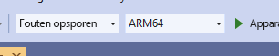

# <a name="quickstart-deploy-native-c-sample-to-hololens"></a>Quickstart: Systeemeigen C++-voorbeeld implementeren in HoloLens

In deze quickstart wordt beschreven hoe u de systeemeigen C++-zelfstudietoepassing uitvoert op een HoloLens 2.

In deze snelstart leert u het volgende:

> [!div class="checklist"]
>
>* Bouw de zelfstudietoepassing voor HoloLens.
>* Wijzig de ARR-referenties in de broncode.
>* Implementeer en voer het voorbeeld uit op het apparaat.

## <a name="prerequisites"></a>Vereisten

Als u toegang wilt krijgen tot de Azure Remote Rendering-service, moet u eerst [een account maken](../../../how-tos/create-an-account.md).

De volgende software moet zijn geïnstalleerd:

* Windows SDK 10.0.18362.0 [(download)](https://developer.microsoft.com/windows/downloads/windows-10-sdk)
* De nieuwste versie van Visual Studio 2019 [(download)](https://visualstudio.microsoft.com/vs/older-downloads/)
* [Visual Studio Tools voor Mixed Reality](https://docs.microsoft.com/windows/mixed-reality/install-the-tools). Met name de volgende *workload*-installaties zijn verplicht:
  * **Desktopontwikkeling met C++**
  * **Universal Windows Platform (UWP)-ontwikkeling**
* Git [(downloaden)](https://git-scm.com/downloads)

## <a name="clone-the-arr-samples-repository"></a>De opslagplaats met de ARR-voorbeelden klonen

Als eerste stap klonen we de Git-opslagplaats, die de openbare voorbeelden voor Azure Remote Rendering bevat. Open een opdrachtprompt (typ `cmd` in het menu Start van Windows) en ga naar een map waarin u het ARR-voorbeeldproject wilt opslaan.

Voer de volgende opdrachten uit:

```cmd
mkdir ARR
cd ARR
git clone https://github.com/Azure/azure-remote-rendering
```

Met de laatste opdracht maakt u een submap in de ARR-map die de verschillende voorbeeldprojecten voor Azure Remote Rendering bevat.

De C++ HoloLens-zelfstudie vindt u in de submap *NativeCpp/HoloLens*.

## <a name="build-the-project"></a>Het project bouwen

Open het oplossingsbestand *HolographicApp.sln* in de submap *NativeCpp/HoloLens* met Visual Studio 2019.

Schakel de buildconfiguratie om naar *Foutopsporing* (of *Release*) en *ARM64*. Zorg er ook voor dat de foutopsporingsmodus is ingesteld op *Apparaat* en niet op *Externe computer*:



Omdat de accountreferenties worden vastgelegd in de broncode van de zelfstudie, wijzigt u deze in geldige referenties. Hiervoor opent u het bestand `HolographicAppMain.cpp` in Visual Studio en wijzigt u het onderdeel waarin de front-end wordt gemaakt in de constructor van klasse `HolographicAppMain`:

```cpp
// 2. Create front end
{
    // Users need to fill out the following with their account data and model
    RR::AzureFrontendAccountInfo init;
    init.AccountId = "00000000-0000-0000-0000-000000000000";
    init.AccountKey = "<account key>";
    init.AccountDomain = "westus2.mixedreality.azure.com"; // <change to your region>
    m_modelURI = "builtin://Engine";
    m_sessionOverride = ""; // If there is a valid session ID to re-use, put it here. Otherwise a new one is created
    m_frontEnd = RR::ApiHandle(RR::AzureFrontend(init));
}
```

Wijzig met name de volgende waarden:
* `init.AccountId` en `init.AccountKey` om uw accountgegevens te gebruiken. Zie de informatie over het [ophalen van accountgegevens](../../../how-tos/create-an-account.md#retrieve-the-account-information).
* Het regiodeel van de `init.AccountDomain`-tekenreeks voor andere regio's dan `westus2`, bijvoorbeeld `"westeurope.mixedreality.azure.com"`
* Daarnaast kan `m_sessionOverride` worden gewijzigd in een bestaande sessie-id. Sessies kunnen buiten dit voorbeeld worden gemaakt, bijvoorbeeld door [het PowerShell-script ](../../../samples/powershell-example-scripts.md#script-renderingsessionps1) te gebruiken of door rechtstreeks de [sessie-REST API](../../../how-tos/session-rest-api.md#create-a-session) te gebruiken.
Het maken van een sessie buiten het voorbeeld wordt aanbevolen wanneer het voorbeeld meerdere keren moet worden uitgevoerd. Als er geen sessie wordt doorgegeven, maakt het voorbeeld een nieuwe sessie bij elke keer opstarten. Dit kan enkele minuten duren.

U kunt nu de toepassing compileren.

## <a name="launch-the-application"></a>De toepassing starten

1. Sluit de HoloLens via een USB-kabel aan op uw pc.
1. Schakel de HoloLens in en wacht totdat het menu Start wordt weergegeven.
1. Start de foutopsporing in Visual Studio (F5). De app wordt automatisch geïmplementeerd op het apparaat.

De voorbeeld-app moet worden gestart en er moet een tekstvenster worden weergegeven waarin u wordt geïnformeerd over de huidige toepassingsstatus. De status bij het opstarten is ofwel een nieuwe sessie starten ofwel verbinding maken met een bestaande sessie. Nadat het laden van het model is voltooid, wordt het ingebouwde enginemodel op de hoofdpositie weergegeven. Het enginemodel blijkt goed te communiceren met de draaiende kubus die lokaal wordt weergegeven.

 Als u het voorbeeld een tweede keer wilt starten, kunt u het ook vinden in het startmenu van HoloLens, maar houd er dan wel rekening mee dat er een verlopen sessie-id kan zijn gecompileerd.

## <a name="next-steps"></a>Volgende stappen

Deze quickstart is gebaseerd op het resultaat van een zelfstudie waarin wordt uitgelegd hoe u alle onderdelen van Remote Rendering kunt integreren in een *Holographic-app*. Volg deze zelfstudie als u wilt weten welke stappen er nodig zijn:

> [!div class="nextstepaction"]
> [Zelfstudie: Remote Rendering integreren in een HoloLens Holographic-app](../../../tutorials/native-cpp/hololens/integrate-remote-rendering-into-holographic-app.md)
