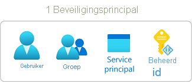
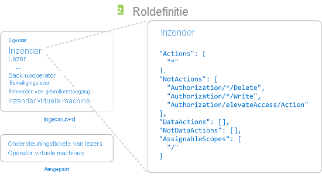
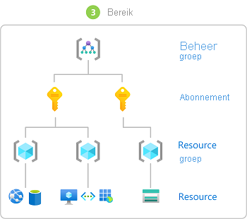
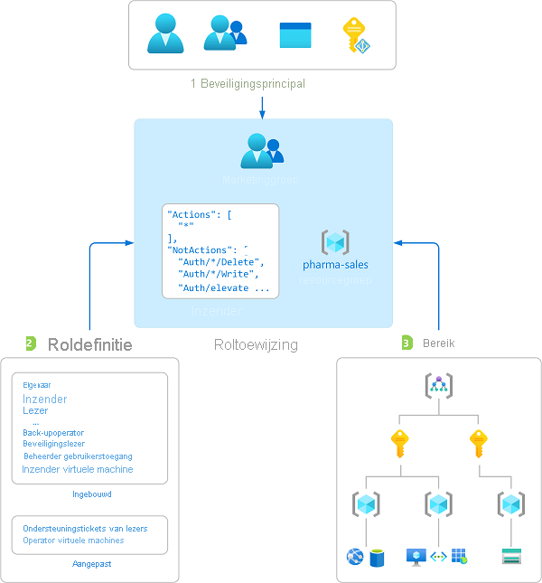

# Wat is Azure RBAC (toegangsbeheer op basis van rollen)?

Toegangsbeheer voor cloudresources is een uiterst belangrijke functie voor elke organisatie die van de cloud gebruikmaakt. Het gebruik van op rollen gebaseerd toegangsbeheer in Azure (Azure RBAC) helpt u bij het beheren van wie er toegang heeft tot Azure-resources, wat ze kunnen doen met die resources en tot welke gebieden ze toegang hebben.

Op rollen gebaseerd toegangsbeheer in Azure is een machtigingssysteem dat is gebouwd op [Azure Resource Manager](../azure-resource-manager/management/overview.md) dat een geavanceerd toegangsbeheer van Azure-resources biedt.

Deze video geeft een kort overzicht van Azure RBAC.

>[!VIDEO https://www.youtube.com/embed/Dzhm-garKBM]

## Wat kan ik doen met op rollen gebaseerd toegangsbeheer in Azure?

Hier volgen enkele voorbeelden van wat u met op rollen gebaseerd toegangsbeheer in Azure kunt doen:

- Toestaan dat één gebruiker de virtuele machines in een abonnement kan beheren en een andere gebruiker de virtuele netwerken kan beheren.
- Een DBA-groep toestaan de SQL-databases in een abonnement te beheren.
- Toestaan dat een gebruiker alle resources in een resourcegroep kan beheren, zoals virtuele machines, websites en subnetten
- Toestaan dat een toepassing toegang heeft tot alle resources in een resourcegroep

## Hoe Azure RBAC werkt

De manier waarop u de toegang tot resources beheert met behulp van op rollen gebaseerd toegangsbeheer in Azure is door roltoewijzingen te maken. Dit is een belangrijke concept om te weten: het is de manier waarop machtigingen worden afgedwongen. Een roltoewijzing bestaat uit drie elementen: beveiligings-principal, roldefinitie en bereik (ook wel scope of niveau genoemd).

### Beveiligings-principal

Een *beveiligings-principal* is een object dat een gebruiker, groep, service-principal of beheerde identiteit vertegenwoordigt die toegang tot Azure-resources aanvraagt. U kunt een rol toewijzen aan een van deze beveiligingsprincipals.

### Roldefinitie

Een *roldefinitie* is een verzameling machtigingen. Het wordt meestal gewoon een *rol* genoemd. Een roldefinitie beschijft de bewerkingen die kunnen worden uitgevoerd, zoals lezen, schrijven en verwijderen. Rollen kunnen op algemeen zijn, zoals eigenaar, of specifiek, zoals de lezer van de virtuele machine.

Azure bevat diverse [ingebouwde rollen](built-in-roles.md) die u kunt gebruiken. Met de rol [Inzender voor virtuele machines](built-in-roles.md#virtual-machine-contributor) kan een gebruiker bijvoorbeeld virtuele machines maken en beheren. Als de ingebouwde rollen niet voldoen aan de specifieke behoeften van uw organisatie, kunt u uw eigen [aangepaste Azure-rollen](custom-roles.md) maken.

Deze video bevat een kort overzicht van ingebouwde rollen en aangepaste rollen.

>[!VIDEO https://www.youtube.com/embed/I1mefHptRgo]

Azure heeft gegevensbewerkingen waarmee u toegang tot gegevens in een object kunt verlenen. Als een gebruiker bijvoorbeeld toegang heeft tot gegevens in een opslagaccount, kan deze de blobs of berichten in dat opslagaccount lezen.

Zie [Roldefinities in Azure begrijpen](role-definitions.md) voor meer informatie.

### Bereik

*Bereik* is de set resources waarop de toegang van toepassing is. Wanneer u een rol toewijst, kunt u de acties die zijn toegestaan verder beperken door een bereik te definiëren. Dit is handig als u van iemand een [Inzender voor websites](built-in-roles.md#website-contributor) wilt maken, maar slechts voor één resourcegroep.

In Azure kunt u een bereik op vier niveaus opgeven: [beheergroep](../governance/management-groups/overview.md), abonnement, [resourcegroep](../azure-resource-manager/management/overview.md#resource-groups) of resource. Bereiken zijn gestructureerd in een bovenliggende/onderliggende relatie. U kunt rollen toewijzen aan elk van deze bereikniveaus.

Zie [Bereik](scope-overview.md) voor meer informatie over het bereik.

### Roltoewijzingen

Een *roltoewijzing* is het proces waarmee voor een bepaald bereik een roldefinitie aan een gebruiker, groep, service-principal of beheerde identiteit wordt gekoppeld, met het doel om toegang te verlenen. Toegang wordt verleend door een roltoewijzing te maken en toegang kan worden ingetrokken door een roltoewijzing te verwijderen.

Het volgende diagram toont een voorbeeld van een roltoewijzing. In dit voorbeeld wordt aan de groep Marketing de rol van [inzender](built-in-roles.md#contributor) toegewezen voor de resourcegroep pharma-sales. Dit betekent dat gebruikers in de groep Marketing een Azure-resource in de resourcegroep pharma-sales kunnen maken of beheren. Gebruikers in de groep Marketing hebben geen toegang tot resources buiten de resourcegroep pharma-sales, tenzij ze deel uitmaken van een andere roltoewijzing.

U kunt roltoewijzingen maken met behulp van Azure Portal, Azure CLI, Azure PowerShell, Azure-SDK's of REST-API's.

Zie [Stappen om een roltoewijzing toe te voegen](role-assignments-steps.md) voor meer informatie.

## Meervoudige roltoewijzingen

Wat gebeurt er wanneer er meerdere overlappende roltoewijzingen zijn? Azure RBAC is een additief model, dus uw effectieve machtigingen zijn de som van uw roltoewijzingen. Bekijk het volgende voorbeeld, waarbij aan een gebruiker de rol Inzender wordt toegekend in het abonnementsbereik en de rol Lezer in een resourcegroep. De som van de Inzender- en Lezer-machtigingen is effectief gelijk aan de rol Inzender voor de resourcegroep. Daarom heeft in dit geval de toewijzing van de rol Lezer geen impact.

## Weigeringstoewijzingen

Voorheen was Azure RBAC een model op basis van alleen-toestaan zonder de mogelijkheid tot weigeren, maar nu ondersteunt Azure RBAC in beperkte mate weigeringstoewijzingen. Ongeveer op dezelfde manier als een roltoewijzing verbindt een *weigeringstoewijzing* een reeks acties aan een gebruiker, groep, service-principal of beheerde identiteit met een bepaald bereik met het doel toegang te weigeren. Een roltoewijzing definieert een set acties die zijn *toegestaan*, terwijl een weigeringstoewijzing een set acties definieert die *niet zijn toegestaan*. Met andere woorden, weigeringstoewijzingen voorkomen dat gebruikers opgegeven acties uitvoeren, zelfs als een roltoewijzing hen deze toegang verleent. Weigeringstoewijzingen hebben voorrang op roltoewijzingen.

Zie [Inzicht in weigeringstoewijzingen in Azure](deny-assignments.md) voor meer informatie.

## Hoe Azure RBAC bepaalt of een gebruiker toegang tot een resource heeft

Hier volgen de stappen op hoog niveau die Azure RBAC gebruikt om te bepalen of u toegang tot een resource hebt op het beheervlak. Het is handig om dit te begrijpen als u probeert een toegangsprobleem op te lossen.

1. Een gebruiker (of service-principal) krijgt een token voor Azure Resource Manager.

    Het token bevat groepslidmaatschappen van de gebruiker (met inbegrip van overdraagbare groepslidmaatschappen).

1. De gebruiker voert een REST API-aanroep uit naar Azure Resource Manager met het gekoppelde token.

1. Azure Resource Manager haalt alle roltoewijzingen en weigeringstoewijzingen op die betrekking hebben op de resource waarop de actie wordt ondernomen.

1. Azure Resource Manager beperkt de roltoewijzingen die van toepassing zijn op deze gebruiker of hun groep en bepaalt welke rollen de gebruiker heeft voor deze resource.

1. Azure Resource Manager bepaalt of de actie in de API-aanroep is opgenomen in de rollen die de gebruiker voor deze resource heeft.

1. Als de gebruiker geen rol met de actie heeft in het aangevraagde bereik, wordt er geen toegang verleend. Anders controleert Azure Resource Manager of er een weigeringstoewijzing van toepassing is.

1. Als de weigeringstoewijzing van toepassing is, wordt toegang geblokkeerd. Anders wordt toegang verleend.

## Licentievereisten

[!INCLUDE [Azure AD free license](../../includes/active-directory-free-license.md)]

## Volgende stappen

- [Azure-roltoewijzingen toevoegen of verwijderen met behulp van de Azure-portal](role-assignments-portal.md)
- [Inzicht in de verschillende rollen](rbac-and-directory-admin-roles.md)
- [Cloud Adoption Framework: Resource-toegangsbeheer in Azure](/azure/cloud-adoption-framework/govern/resource-consistency/resource-access-management)
