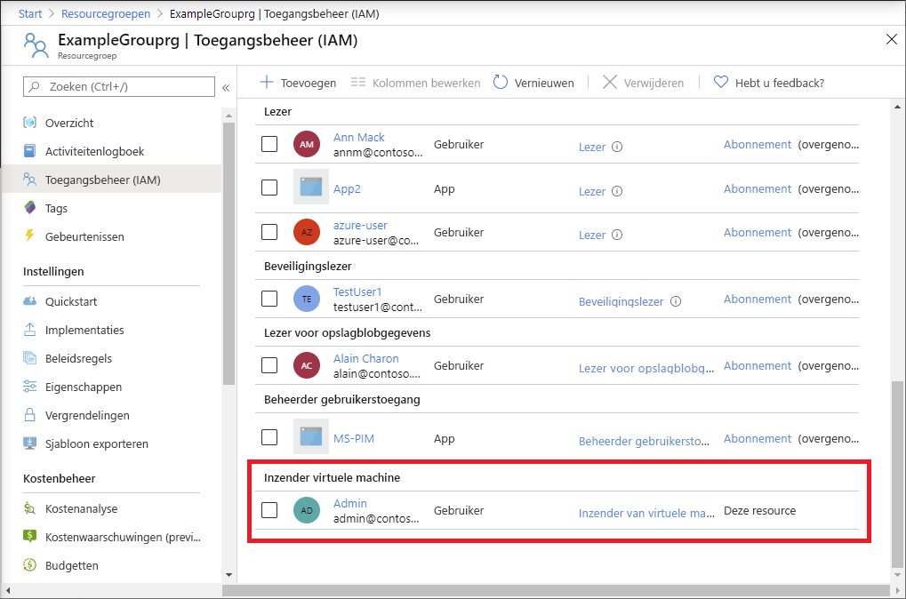

# <a name="quickstart-add-an-azure-role-assignment-using-an-arm-template"></a>Quickstart: Een Azure-roltoewijzing toevoegen met behulp van een ARM-sjabloon

Met [op rollen gebaseerd toegangsbeheer van Azure (Azure RBAC)](overview.md) kunt u de toegang tot Azure-resources beheren. In deze quickstart maakt u een resourcegroep en verleent u een gebruiker toegang tot het maken en beheren van virtuele machines in de resourcegroep. In deze quickstart wordt gebruikgemaakt van een Azure Resource Manager-sjabloon (ARM-sjabloon) om de toegang te verlenen.

[!INCLUDE [About Azure Resource Manager](../../includes/resource-manager-quickstart-introduction.md)]

Als uw omgeving voldoet aan de vereisten en u benkend bent met het gebruik van ARM-sjablonen, selecteert u de knop **Implementeren naar Azure**. De sjabloon wordt in Azure Portal geopend.

[](https://portal.azure.com/#create/Microsoft.Template/uri/https%3A%2F%2Fraw.githubusercontent.com%2FAzure%2Fazure-quickstart-templates%2Fmaster%2F101-rbac-builtinrole-resourcegroup%2Fazuredeploy.json)

## <a name="prerequisites"></a>Vereisten

Als u roltoewijzingen wilt toevoegen, hebt u het volgende nodig:

- Als u nog geen abonnement op Azure hebt, maak dan een [gratis account](https://azure.microsoft.com/free/?WT.mc_id=A261C142F) aan voordat u begint.
- Machtigingen voor `Microsoft.Authorization/roleAssignments/write` en `Microsoft.Authorization/roleAssignments/delete`, zoals [Beheerder van gebruikerstoegang](built-in-roles.md#user-access-administrator) of [Eigenaar](built-in-roles.md#owner)
- Om een roltoewijzing toe te voegen, moet u drie elementen opgeven: beveiligingsprincipal, roldefinitie en bereik. Voor deze quickstart bent u of is een andere gebruiker de beveiligingsprincipal in uw map, is de roldefinitie [Inzender voor virtuele machines](built-in-roles.md#virtual-machine-contributor) en is het bereik de opgegeven resourcegroep.

## <a name="review-the-template"></a>De sjabloon controleren

De sjabloon die in deze quickstart wordt gebruikt, komt uit [Azure Quick Start-sjablonen](https://azure.microsoft.com/resources/templates/101-rbac-builtinrole-resourcegroup/). De sjabloon heeft drie parameters en een resourcessectie. De resourcessectie bevat de drie elementen van een roltoewijzing: beveiligingsprincipal, roldefinitie en bereik.

:::code language="json" source="~/quickstart-templates/101-rbac-builtinrole-resourcegroup/azuredeploy.json":::

De resource die is gedefinieerd in de sjabloon:

- [Microsoft.Authorization/roleAssignments](/azure/templates/Microsoft.Authorization/roleAssignments)

## <a name="deploy-the-template"></a>De sjabloon implementeren

1. Meld u aan bij de [Azure-portal](https://portal.azure.com).

1. Geef uw e-mailadres op dat is gekoppeld aan uw Azure-abonnement. Of geef het e-mailadres van een andere gebruiker in uw map op.

1. Open Azure Cloud Shell voor PowerShell.

1. Kopieer en plak het volgende script in Cloud Shell.

    ```azurepowershell
    $resourceGroupName = Read-Host -Prompt "Enter a resource group name (i.e. ExampleGrouprg)"
    $emailAddress = Read-Host -Prompt "Enter an email address for a user in your directory"
    $location = Read-Host -Prompt "Enter a location (i.e. centralus)"
    
    $roleAssignmentName = New-Guid
    $principalId = (Get-AzAdUser -Mail $emailAddress).id
    $roleDefinitionId = (Get-AzRoleDefinition -name "Virtual Machine Contributor").id
    $templateUri = "https://raw.githubusercontent.com/Azure/azure-quickstart-templates/master/101-rbac-builtinrole-resourcegroup/azuredeploy.json"
    
    New-AzResourceGroup -Name $resourceGroupName -Location $location
    New-AzResourceGroupDeployment -ResourceGroupName $resourceGroupName -TemplateUri $templateUri -roleAssignmentName $roleAssignmentName -roleDefinitionID $roleDefinitionId -principalId $principalId
    ```

1. Voer een naam voor de resourcegroep in, zoals ExampleGrouprg.

1. Voer een e-mailadres in van uzelf of van een andere gebruiker in uw map.

1. Voer een locatie in voor de resourcegroep, zoals centralus.

1. Druk, indien nodig, op Enter om de opdracht New-AzResourceGroupDeployment uit te voeren.

    Met de opdracht [New-AzResourceGroup](/powershell/module/az.resources/new-azresourcegroup) maakt u een nieuwe resourcegroep en met de opdracht [New-AzResourceGroupDeployment](/powershell/module/az.resources/new-azresourcegroupdeployment) implementeert u de sjabloon om de roltoewijzing toe te voegen.

    De uitvoer ziet er als volgt uit:

    ```azurepowershell
    PS> New-AzResourceGroupDeployment -ResourceGroupName $resourceGroupName -TemplateUri $templateUri -roleAssignmentName $roleAssignmentName -roleDefinitionID $roleDefinitionId -principalId $principalId
    
    DeploymentName          : azuredeploy
    ResourceGroupName       : ExampleGrouprg
    ProvisioningState       : Succeeded
    Timestamp               : 5/22/2020 9:01:30 PM
    Mode                    : Incremental
    TemplateLink            :
                              Uri            : https://raw.githubusercontent.com/Azure/azure-quickstart-templates/master/101-rbac-builtinrole-resourcegroup/azuredeploy.json
                              ContentVersion : 1.0.0.0
    
    Parameters              :
                              Name                  Type                       Value
                              ====================  =========================  ==========
                              roleAssignmentName    String                     {roleAssignmentName}
                              roleDefinitionID      String                     9980e02c-c2be-4d73-94e8-173b1dc7cf3c
                              principalId           String                     {principalId}
    
    Outputs                 :
    DeploymentDebugLogLevel :
    ```

## <a name="review-deployed-resources"></a>Geïmplementeerde resources bekijken

1. Open de resourcegroep die u hebt gemaakt in de Azure-portal.

1. Klik in het linkermenu op **Toegangsbeheer (IAM)** .

1. Klik op het tabblad **Roltoewijzingen**.

1. Controleer of de rol **Inzender voor virtuele machines** is toegewezen aan de gebruiker die u hebt opgegeven.

   

## <a name="clean-up-resources"></a>Resources opschonen

Volg deze stappen om de roltoewijzing en de resourcegroep die u hebt gemaakt, te verwijderen.

1. Kopieer en plak het volgende script in Cloud Shell.

    ```azurepowershell
    $emailAddress = Read-Host -Prompt "Enter the email address of the user with the role assignment to remove"
    $resourceGroupName = Read-Host -Prompt "Enter the resource group name to remove (i.e. ExampleGrouprg)"
    
    $principalId = (Get-AzAdUser -Mail $emailAddress).id
    
    Remove-AzRoleAssignment -ObjectId $principalId -RoleDefinitionName "Virtual Machine Contributor" -ResourceGroupName $resourceGroupName
    Remove-AzResourceGroup -Name $resourceGroupName
    ```
    
1. Voer het e-mailadres van de gebruiker met de roltoewijzing in die u wilt verwijderen.

1. Voer de naam in van de resourcegroep die u wilt verwijderen, zoals ExampleGrouprg.

1. Druk, indien nodig, op Enter om de opdracht Remove-AzResourceGroup uit te voeren.

1. Voer **Y** in om te bevestigen dat u de resourcegroep wilt verwijderen.

## <a name="next-steps"></a>Volgende stappen

> [!div class="nextstepaction"]
> [Zelfstudie: Toegang tot Azure-resources verlenen aan een gebruiker met behulp van Azure PowerShell](tutorial-role-assignments-user-powershell.md)