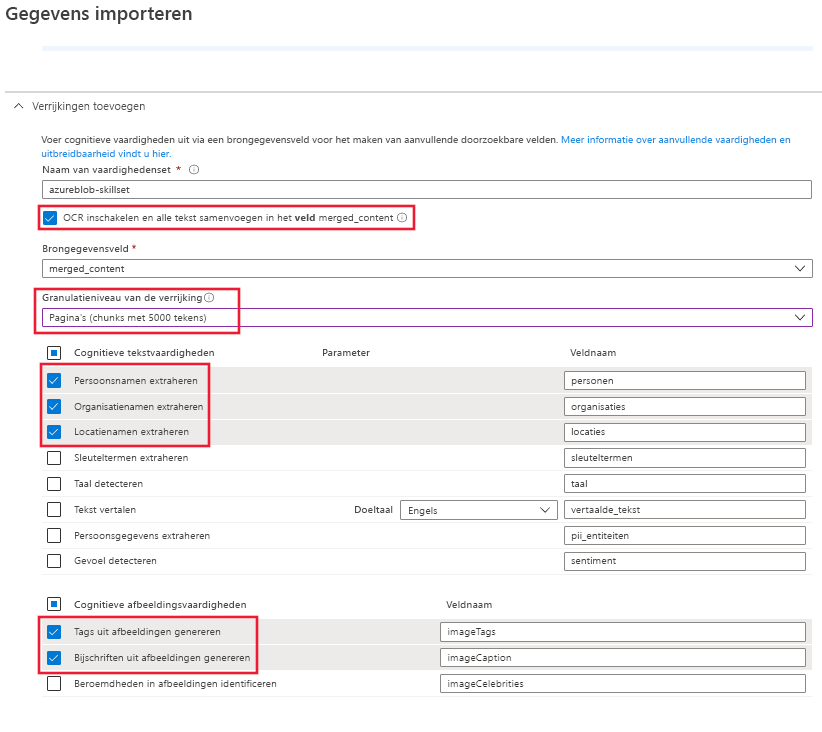

# Snelstartgids: een Azure Cognitive Search cognitieve-vaardigheids maken in de Azure Portal

Een vaardig heden is een AI-functie waarmee informatie en structuur worden geëxtraheerd uit grote niet-gedifferentieerde tekst-of afbeeldings bestanden, en kan worden geïndexeerd en doorzoekbaar is voor Zoek opdrachten in volledige tekst in azure Cognitive Search. 

In deze Quick Start combineert u services en gegevens in de Azure-Cloud om de vaardig heden te maken. Zodra alles aanwezig is, voert u de wizard **gegevens importeren** in de portal uit om het allemaal samen te halen. Het eind resultaat is een Doorzoek bare index die is gevuld met gegevens die door de AI-verwerking zijn gemaakt en die u in de portal kunt doorzoeken ([Search Explorer](search-explorer.md)).

Als u nog geen abonnement op Azure hebt, maak dan een [gratis account](https://azure.microsoft.com/free/?WT.mc_id=A261C142F) aan voordat u begint.

## Services maken en gegevens laden

Deze Snelstartgids maakt gebruik van Azure Cognitive Search, Azure Blob Storage en [azure Cognitive Services](https://azure.microsoft.com/services/cognitive-services/) voor de AI. 

Omdat de werk belasting zo klein is, wordt Cognitive Services achter de schermen getikt om gratis Maxi maal 20 trans acties dagelijks te kunnen uitvoeren wanneer deze vanuit Azure Cognitive Search worden aangeroepen. Zolang u de door u geleverde voorbeeld gegevens gebruikt, kunt u het maken of koppelen van een Cognitive Services resource overs Laan.

1. [Download de voorbeeldgegevens](https://1drv.ms/f/s!As7Oy81M_gVPa-LCb5lC_3hbS-4) die bestaan uit een kleine set van verschillende typen bestanden. Pak de bestanden uit.

1. [Een Azure Storage-account maken](https://docs.microsoft.com/azure/storage/common/storage-quickstart-create-account?tabs=azure-portal) of [een bestaand account vinden](https://ms.portal.azure.com/#blade/HubsExtension/BrowseResourceBlade/resourceType/Microsoft.Storage%2storageAccounts/) onder uw huidige abonnement. 

   Kies dezelfde regio als Azure Cognitive Search. Kies het account type StorageV2 (algemeen gebruik v2) als u de Knowledge Store-functie later in een andere walkthrough wilt proberen. Anders kiest u een wille keurig type.

1. Open de pagina's van de BLOB Services en maak een container. U kunt het standaard niveau voor open bare toegang gebruiken. 

1. Klik in container op **uploaden** om de voorbeeld bestanden te uploaden die u in de eerste stap hebt gedownload. Merk op dat u een breed scala aan inhouds typen hebt, waaronder afbeeldingen en toepassings bestanden die niet in volledige tekst kunnen worden doorzocht in de oorspronkelijke indeling.

   

1. [Een Azure Cognitive Search-service maken](search-create-service-portal.md) of [een bestaande service vinden](https://ms.portal.azure.com/#blade/HubsExtension/BrowseResourceBlade/resourceType/Microsoft.Search%2FsearchServices) onder hetzelfde abonnement. U kunt een gratis service voor deze Quick Start gebruiken.

<!-- 1. You are almost done with this resource, but before you leave these pages, use a link on the left navigation pane to open the **Access Keys** page. In many tutorials, especially those that use the REST API, you will need a connection string to retrieve data from Blob storage. A connection string looks similar to the following example: `DefaultEndpointsProtocol=https;AccountName=<YOUR-ACCOUNT-NAME>;AccountKey=<YOUR-ACCOUNT-KEY>;EndpointSuffix=core.windows.net` -->

U bent nu klaar om door te gaan met de wizard gegevens importeren.

## De wizard gegevens importeren uitvoeren

Klik op de pagina overzicht van de zoek service op **gegevens importeren** op de opdracht balk om een cognitieve verrijking in te stellen in vier stappen.

  

### Stap 1: een gegevensbron maken

1. Kies in **verbinding maken met uw gegevens** **Azure Blob-opslag**, selecteer het opslag account en de container die u hebt gemaakt. Geef een naam op voor de gegevensbron en gebruik standaardwaarden voor de rest. 

   

1. Ga door naar de volgende pagina.

### Stap 2: cognitieve vaardigheden toevoegen

Voeg vervolgens cognitieve vaardig heden toe om natuurlijke taal verwerking aan te roepen. De voorbeeld gegevens bestaan uit 12 bestanden. de gratis toewijzing van 20 trans acties op Cognitive Services is voldoende voor deze Quick Start. Omdat niet OCR wordt gebruikt, worden alleen de niet-afbeeldings bestanden geteld, gekraakt en gebruikt in dit proces.

1. Voor deze Snelstartgids gebruiken we de **gratis** Cognitive Services-resource.

   

1. Vouw **vaardig heden toevoegen** uit en selecteer vaardig heden die natuurlijke taal verwerking uitvoeren. Kies bij deze snelstart voor entiteitsherkenning voor personen, organisaties en locaties.

   

1. Accepteer het standaard bron veld: `content`. Dit lijkt mogelijk een klein doel, maar voor Azure-blobs bevat het veld `content` het meren deel van het BLOB-document (bijvoorbeeld een Word-doc-of Power Point-deck), waardoor het een goede kandidaat wordt.

1. Ga door naar de volgende pagina.

> [!NOTE]
> Vaardigheden voor verwerking van natuurlijke taal werken met behulp van tekstinhoud in de set voorbeeldgegevens. Omdat we geen OCR-optie hebben geselecteerd, worden de JPEG- en PNG-bestanden die worden gevonden in de set voorbeeldgegevens niet verwerkt in deze snelstart. 

### Stap 3: de index configureren

In azure Cognitive Search bevat een index uw Doorzoek bare inhoud en kan de wizard **gegevens importeren** doorgaans het schema voor u maken door de gegevens bron te bemonsteren. In deze stap controleert u het gegenereerde schema en kunt u alle instellingen wijzigen. Hieronder ziet u het standaard schema dat is gemaakt voor de demo-BLOB-gegevensset.

De wizard biedt goede standaardinstellingen voor deze snelstart: 

+ De standaardnaam is *azureblob-index*, gebaseerd op het type gegevensbron. 

+ Standaard velden zijn gebaseerd op het oorspronkelijke brongegevens veld (`content`), plus de uitvoer velden (`people`, `organizations`en `locations`) die zijn gemaakt door de cognitieve vaardig heden. De standaardgegevenstypen worden afgeleid van metagegevens en steekproeven van gegevens.

+ De standaard document sleutel is *metadata_storage_path* (geselecteerd omdat het veld unieke waarden bevat).

+ **Ophaalbaar** en **Doorzoekbaar** zijn standaardkenmerken voor deze velden. **Doorzoekbaar** geeft aan dat een veld kan worden doorzocht. **Ophaalbaar** betekent dat het in resultaten kan worden geretourneerd. De wizard gaat ervan uit dat deze velden ophaalbaar en doorzoekbaar moeten zijn omdat u ze hebt gemaakt via een set vaardigheden.

  

Let op het doorgehaalde vinkje en het vraagteken in de kolom **Ophaalbaar** voor het veld `content`. Voor blob-documenten met veel tekst bevat het veld `content` het grootste deel van het bestand, mogelijk wel duizenden regels. Als u de inhoud van een bestand wilt doorgeven aan clientcode, moet **Ophaalbaar** geselecteerd blijven. Anders kunt u dit kenmerk uitschakelen voor `content` als de uitgepakte elementen (`people`, `organizations` en `locations`) voldoende zijn voor uw doeleinden.

Als u een veld markeert als **Ophaalbaar**, betekent niet dat het veld aanwezig *moet* zijn in de lijst met zoekresultaten. U kunt de samenstelling van zoekresultaten nauwkeurig beheren met behulp van de queryparameter **$select** door op te geven welke velden u wilt opnemen. Voor velden met veel tekst zoals `content`, is de parameter **$select** de oplossing voor het aanbieden van beheersbare zoekresultaten aan de gebruikers van uw toepassing, terwijl clientcode via het kenmerk **Ophaalbaar** toegang heeft tot alle gegevens die nodig zijn.
  
Ga door naar de volgende pagina.

### Stap 4: de indexeerfunctie configureren

De indexeerfunctie is een belangrijke resource die het indexeerproces aandrijft. Hiermee specificeert u de naam van de gegevensbron, een doelindex en de uitvoerfrequentie. De wizard **gegevens importeren** maakt verschillende objecten, en ze zijn altijd een Indexeer functie die u herhaaldelijk kunt uitvoeren.

1. Op de pagina **Indexeer functie** kunt u de standaard naam accepteren en op de optie voor het **eenmalige** schema klikken om deze direct uit te voeren. 

   

1. Klik op **Verzenden** om de indexeerfunctie te maken en tegelijkertijd uit te voeren.

## Monitor status

Het indexeren van cognitieve vaardig heden duurt langer dan gebruikelijk indexering op basis van tekst. Als u de voortgang wilt bewaken, gaat u naar de pagina overzicht en klikt u op **Indexeer functies** in het midden van de pagina.

De waarschuwing treedt op omdat JPG-en PNG-afbeeldings bestanden zich in de gegevens bron bevinden, en we hebben de OCR-vaardigheid van deze pijp lijn wegge laten. U krijgt ook afkappingsmeldingen. Extractie is beperkt tot 32.000 tekens in de gratis laag.

  

Indexeren en verrijken kunnen even duren. Daarom is het aan te raden om kleinere gegevenssets te gebruiken voor verkenning. 

In de Azure Portal kunt u ook het activiteiten logboek van meldingen controleren op een klikable **Azure Cognitive Search meldings** status koppeling. Het kan enkele minuten duren voordat de uitvoering is voltooid.

## Query uitvoeren in Search Explorer

Nadat er een index is gemaakt, kunt u query's uitvoeren om documenten te retourneren uit de index. Gebruik **Search Explorer** in de portal om query's uit te voeren en resultaten te bekijken. 

1. Klik op de dashboardpagina van de zoekservice op **Search Explorer** in de opdrachtbalk.

1. Selecteer bovenaan **Index wijzigen** om de index die u hebt gemaakt te selecteren.

1. Voer een zoekopdracht in om een query op de index toe te passen, zoals `search=Microsoft&searchFields=Organizations`.

Resultaten worden in JSON geretourneerd, wat uitgebreid en moeilijk te lezen kan zijn, met name in grote documenten die afkomstig zijn van Azure-blobs. Als u niet eenvoudig resultaten kunt scannen, gebruikt u CTRL+F om in documenten te zoeken. Voor deze query kunt u in de JSON zoeken naar specifieke voorwaarden. 

Met CTRL+F kunt u ook bepalen hoeveel documenten een bepaalde resultatenset bevat. Voor Azure-blobs kiest de portal 'metadata_storage_path' als de sleutel omdat elke waarde uniek voor het document is. Zoek met CTRL+F naar 'metadata_storage_path' om het aantal documenten te tellen. 

  

## Opgedane kennis

U hebt nu uw eerste vaardig heden gemaakt en belang rijke concepten geleerd die nuttig zijn voor het prototypen van een verrijkte Zoek oplossing met behulp van uw eigen gegevens.

Een van de belangrijke concepten die we wilden overbrengen, is de afhankelijkheid van Azure-gegevensbronnen. Een vaardig heden is gebonden aan een Indexeer functie en Indexeer functies zijn Azure en zijn specifiek voor de bron. Hoewel deze snelstart Azure Blob-opslag gebruikt, zijn andere Azure-gegevensbronnen ook mogelijk. Zie [Indexeer functies in Azure Cognitive Search](search-indexer-overview.md)voor meer informatie.

Een ander belangrijk concept is dat vaardigheden via invoervelden werken. In de portal moet u één bronveld voor alle vaardigheden kiezen. Invoeren kunnen in code andere velden zijn, of de uitvoer van een upstream-vaardigheid.

Uitvoer wordt omgeleid naar een zoek index en er is een toewijzing tussen naam/waarde-paren die tijdens het indexeren en afzonderlijke velden in uw index worden gemaakt. Intern stelt de portal [aantekeningen](cognitive-search-concept-annotations-syntax.md) in en definieert een [set vaardigheden](cognitive-search-defining-skillset.md), waarmee de volgorde van bewerkingen en de algemene stroom wordt bepaald. Deze stappen zijn verborgen in de portal, maar wanneer u begint met het schrijven van code worden deze concepten belangrijk.

Ten slotte hebt u geleerd dat inhoud kan worden gecontroleerd door de index te doorzoeken. In het eind, wat Azure Cognitive Search biedt, is een Doorzoek bare index, die u kunt opvragen met de [eenvoudige](https://docs.microsoft.com/rest/api/searchservice/simple-query-syntax-in-azure-search) of een [volledig uitgebreide query syntaxis](https://docs.microsoft.com/rest/api/searchservice/lucene-query-syntax-in-azure-search). Een index met verrijkte velden werkt zoals elke andere index. Als u standaard of [aangepaste analyse](search-analyzers.md)functies, [Score profielen](https://docs.microsoft.com/rest/api/searchservice/add-scoring-profiles-to-a-search-index), [synoniemen](search-synonyms.md), [facet filters](search-filters-facets.md), Geo-search of andere Azure Cognitive Search-functie wilt opnemen, kunt u dit zeker doen.

## Opruimen

Wanneer u in uw eigen abonnement werkt, is het een goed idee aan het einde van een project om te bepalen of u nog steeds de resources nodig hebt die u hebt gemaakt. Resources die actief zijn, kunnen kosten in rekening worden. U kunt resources afzonderlijk verwijderen of de resource groep verwijderen om de volledige set resources te verwijderen.

U kunt resources vinden en beheren in de portal met behulp van de koppeling **alle resources** of **resource groepen** in het navigatie deel venster aan de linkerkant.

Als u een gratis service gebruikt, moet u er rekening mee houden dat u bent beperkt tot drie indexen, Indexeer functies en gegevens bronnen. U kunt afzonderlijke items in de Portal verwijderen om de limiet te blijven. 

## Volgende stappen

U kunt vaardig heden maken met behulp van de portal, de .NET-SDK of de REST API. Probeer het REST API met behulp van Postman en meer voorbeeld gegevens om uw kennis te verfijnen.

> [!div class="nextstepaction"]
> [Zelf studie: structuur toevoegen aan ' ongestructureerde inhoud ' met AI-verrijking](cognitive-search-tutorial-blob.md)

> [!Tip]
> Als u deze oefening wilt herhalen of als u een andere AI-verrijkings scenario wilt proberen, verwijdert u de Indexeer functie in de portal. Als u de Indexeer functie verwijdert, wordt de gratis dagelijkse transactie teller weer ingesteld op nul voor Cognitive Services verwerking.