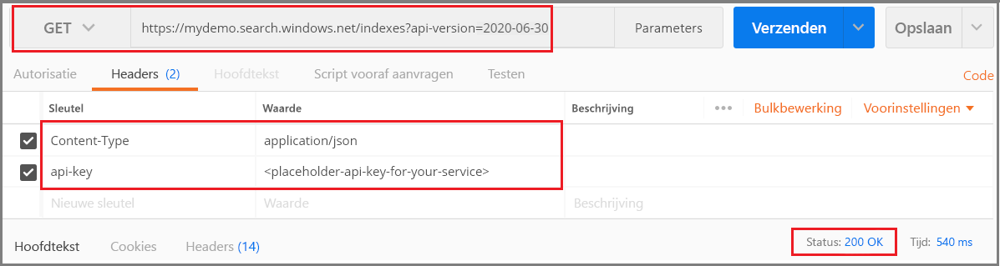
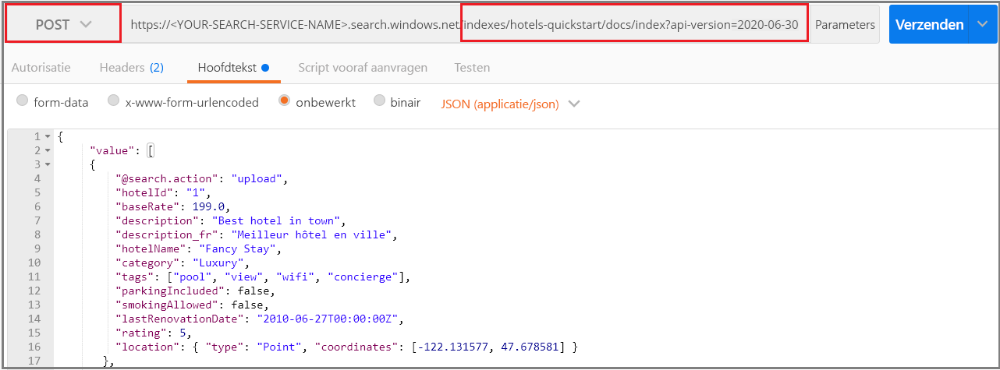

# <a name="quickstart-create-an-azure-cognitive-search-index-in-postman-using-rest-apis"></a>Snelstart: een Azure Cognitive Search-index maken in Postman met REST API's
> [!div class="op_single_selector"]
> * [Postman](search-get-started-postman.md)
> * [C #](search-create-index-dotnet.md)
> * [Python](search-get-started-python.md)
> * [Portal](search-get-started-portal.md)
> * [Powershell](search-howto-dotnet-sdk.md)
>*

Een van de eenvoudigste manieren om de [Azure Cognitive Search REST API's](https://docs.microsoft.com/rest/api/searchservice) te verkennen, is door Postman of een ander webtestprogramma te gebruiken om HTTP-verzoeken te formuleren en de antwoorden te inspecteren. Met de juiste hulpmiddelen en deze instructies kunt u aanvragen verzenden en antwoorden bekijken voordat u code gaat schrijven.

In dit artikel wordt uitgelegd hoe u verzoeken interactief formuleren. U ook [een Postman-verzameling downloaden en importeren](https://github.com/Azure-Samples/azure-search-postman-samples/tree/master/Quickstart) om vooraf gedefinieerde aanvragen te gebruiken.

Als u geen Azure-abonnement hebt, maakt u een [gratis account](https://azure.microsoft.com/free/?WT.mc_id=A261C142F) voordat u begint.

## <a name="prerequisites"></a>Vereisten

De volgende services en tools zijn vereist voor deze quickstart. 

+ [De postmanbureaubladapp](https://www.getpostman.com/) wordt gebruikt voor het verzenden van aanvragen naar Azure Cognitive Search.

+ [Maak een Azure Cognitive Search-service](search-create-service-portal.md) of [zoek een bestaande service](https://ms.portal.azure.com/#blade/HubsExtension/BrowseResourceBlade/resourceType/Microsoft.Search%2FsearchServices) onder uw huidige abonnement. U gebruik maken van een gratis service voor deze quickstart. 

## <a name="get-a-key-and-url"></a>Een sleutel en URL ophalen

REST-aanroepen hebben voor elke aanvraag de service-URL en een toegangssleutel nodig. Er wordt een zoekservice gemaakt met beide, dus als u Azure Cognitive Search aan uw abonnement hebt toegevoegd, voert u de volgende stappen uit om de benodigde informatie te krijgen:

1. [Meld u aan bij de Azure-portal](https://portal.azure.com/)en ontvang de URL op de pagina **Overzicht** van uw zoekservice. Een eindpunt ziet er bijvoorbeeld uit als `https://mydemo.search.windows.net`.

1. Ontvang **in Instellingentoetsen** > **Keys**een beheersleutel voor volledige rechten op de service. Er zijn twee verwisselbare beheerderssleutels, voorzien voor bedrijfscontinuïteit voor het geval u er een moet omdraaien. U de primaire of secundaire sleutel gebruiken voor aanvragen voor het toevoegen, wijzigen en verwijderen van objecten.


Voor alle aanvragen is een api-sleutel vereist voor elk verzoek dat naar uw service wordt verzonden. Met een geldige sleutel stelt u per aanvraag een vertrouwensrelatie in tussen de toepassing die de aanvraag verzendt en de service die de aanvraag afhandelt.

## <a name="connect-to-azure-cognitive-search"></a>Verbinding maken met Azure Cognitive Search

Gebruik in deze sectie uw webtool naar keuze om verbindingen met Azure Cognitive Search in te stellen. Elk hulpprogramma blijft header-informatie aanvragen voor de sessie, wat betekent dat u slechts één keer de api-toets en inhoudstype hoeft in te voeren.

Voor beide gereedschappen moet u een opdracht kiezen (GET, POST, PUT, enzovoort), een URL-eindpunt opgeven en voor sommige taken JSON in de hoofdtekst van de aanvraag opgeven. Vervang de naam van de zoekservice (UW-ZOEK-SERVICE-NAAM) door een geldige waarde. Toevoegen `$select=name` om alleen de naam van elke index terug te geven. 

    https://<YOUR-SEARCH-SERVICE-NAME>.search.windows.net/indexes?api-version=2019-05-06&$select=name

Let op het HTTPS-voorvoegsel, de naam van de service, de naam van een object (in dit geval de indexenverzameling) en de [api-versie.](search-api-versions.md) De api-versie is een vereiste, `?api-version=2019-05-06` kleine tekenreeks opgegeven als voor de huidige versie. API-versies worden regelmatig bijgewerkt. Als u de API-versie toevoegt aan elke aanvraag, kunt u precies bepalen welke versie wordt gebruikt.  

De samenstelling van de koptekst aanvragen bevat twee elementen, het inhoudstype, plus de api-toets die wordt gebruikt om te verifiëren bij Azure Cognitive Search. Vervang de beheer-API-sleutel (UW-AZURE-SEARCH-ADMIN-API-KEY) door een geldige waarde. 

    api-key: <YOUR-AZURE-SEARCH-ADMIN-API-KEY>
    Content-Type: application/json

In Postman formuleer je een verzoek dat lijkt op de volgende screenshot. Kies **GET** als werkwoord, geef de URL op en klik op **Verzenden**. Met deze opdracht wordt verbinding gemaakt met Azure Cognitive Search, wordt de indexverzameling gelezen en wordt HTTP-statuscode 200 geretourneerd op een geslaagde verbinding. Als uw service al indexen heeft, bevat het antwoord ook indexdefinities.



## <a name="1---create-an-index"></a>1 - Een index maken

In Azure Cognitive Search maakt u de index meestal voordat u deze laadt met gegevens. Voor deze taak wordt [de API IndexREST maken](https://docs.microsoft.com/rest/api/searchservice/create-index) gebruikt. 

De URL wordt uitgebreid `hotels` met de indexnaam.

Om dit te doen in Postman:

1. Verander het werkwoord in **PUT**.

2. Kopiëren in `https://<YOUR-SEARCH-SERVICE-NAME>.search.windows.net/indexes/hotels-quickstart?api-version=2019-05-06`deze URL .

3. Geef de indexdefinitie (code die klaar is voor kopiëren hieronder) in de hoofdtekst van het verzoek.

4. Klik op **Verzenden**.


### <a name="index-definition"></a>Indexdefinitie

Met de verzameling velden wordt de documentstructuur gedefinieerd. Elk document moet deze velden hebben en elk veld moet een gegevenstype hebben. Tekenreeksvelden worden gebruikt voor zoekopdrachten in de volledige tekst. Voeg daarom numerieke gegevens als tekenreeksen toe als u wilt dat naar die inhoud kan worden gezocht.

Kenmerken voor het veld bepalen de toegestane bewerking. De REST API's staan standaard veel bewerkingen toe. Standaard kunnen alle tekenreeksen bijvoorbeeld worden doorzocht, opgehaald en gefilterd en zijn ze geschikt voor facetten. Vaak hoeft u alleen kenmerken in te stellen wanneer u een gedrag moet uitschakelen.

```json
{
    "name": "hotels-quickstart",  
    "fields": [
        {"name": "HotelId", "type": "Edm.String", "key": true, "filterable": true},
        {"name": "HotelName", "type": "Edm.String", "searchable": true, "filterable": false, "sortable": true, "facetable": false},
        {"name": "Description", "type": "Edm.String", "searchable": true, "filterable": false, "sortable": false, "facetable": false, "analyzer": "en.lucene"},
        {"name": "Category", "type": "Edm.String", "searchable": true, "filterable": true, "sortable": true, "facetable": true},
        {"name": "Tags", "type": "Collection(Edm.String)", "searchable": true, "filterable": true, "sortable": false, "facetable": true},
        {"name": "ParkingIncluded", "type": "Edm.Boolean", "filterable": true, "sortable": true, "facetable": true},
        {"name": "LastRenovationDate", "type": "Edm.DateTimeOffset", "filterable": true, "sortable": true, "facetable": true},
        {"name": "Rating", "type": "Edm.Double", "filterable": true, "sortable": true, "facetable": true},
        {"name": "Address", "type": "Edm.ComplexType", 
        "fields": [
        {"name": "StreetAddress", "type": "Edm.String", "filterable": false, "sortable": false, "facetable": false, "searchable": true},
        {"name": "City", "type": "Edm.String", "searchable": true, "filterable": true, "sortable": true, "facetable": true},
        {"name": "StateProvince", "type": "Edm.String", "searchable": true, "filterable": true, "sortable": true, "facetable": true},
        {"name": "PostalCode", "type": "Edm.String", "searchable": true, "filterable": true, "sortable": true, "facetable": true},
        {"name": "Country", "type": "Edm.String", "searchable": true, "filterable": true, "sortable": true, "facetable": true}
        ]
     }
  ]
}
```

Wanneer u deze aanvraag indient, krijgt u een HTTP 201-respons om aan te geven dat de index is gemaakt. U kunt deze bewerking controleren in de portal, maar houd er rekening mee dat de portalpagina regelmatig wordt vernieuwd, zodat het enkele minuten kan duren voordat deze actueel is.

> [!TIP]
> Als u een HTTP 504-respons ontvangt, controleert u of de URL HTTPS bevat. Als de HTTP-fout 400 of 404 wordt weergegeven ziet, controleert u of de aanvraagtekst op fouten die mogelijk zijn opgetreden tijden kopiëren en plakken. Een HTTP 403 duidt doorgaans op een probleem met de API-sleutel (een ongeldige sleutel of een syntaxisfout in de opgegeven API-sleutel).

## <a name="2---load-documents"></a>2 - Documenten laden

De index maken en de index vullen zijn afzonderlijke stappen. In Azure Cognitive Search bevat de index alle doorzoekbare gegevens, die u als JSON-documenten verstrekken. Voor deze taak wordt de [API Rest-api voor documenten toevoegen, bijwerken of Verwijderen](https://docs.microsoft.com/rest/api/searchservice/addupdate-or-delete-documents) gebruikt. 

De URL wordt uitgebreid `docs` met `index` de collecties en de bewerking.

Om dit te doen in Postman:

1. Wijzig de bewerking in **POST**.

2. Kopiëren in `https://<YOUR-SEARCH-SERVICE-NAME>.search.windows.net/indexes/hotels-quickstart/docs/index?api-version=2019-05-06`deze URL .

3. Geef de JSON-documenten (copy-ready code is hieronder) in de hoofdtekst van het verzoek.

4. Klik op **Verzenden**.



### <a name="json-documents-to-load-into-the-index"></a>JSON-documenten die in de index moeten worden geladen

De aanvraagtekst bevat vier documenten die moeten worden toegevoegd aan de index hotels.

```json
{
    "value": [
    {
    "@search.action": "upload",
    "HotelId": "1",
    "HotelName": "Secret Point Motel",
    "Description": "The hotel is ideally located on the main commercial artery of the city in the heart of New York. A few minutes away is Time's Square and the historic centre of the city, as well as other places of interest that make New York one of America's most attractive and cosmopolitan cities.",
    "Category": "Boutique",
    "Tags": [ "pool", "air conditioning", "concierge" ],
    "ParkingIncluded": false,
    "LastRenovationDate": "1970-01-18T00:00:00Z",
    "Rating": 3.60,
    "Address": 
        {
        "StreetAddress": "677 5th Ave",
        "City": "New York",
        "StateProvince": "NY",
        "PostalCode": "10022",
        "Country": "USA"
        } 
    },
    {
    "@search.action": "upload",
    "HotelId": "2",
    "HotelName": "Twin Dome Motel",
    "Description": "The hotel is situated in a  nineteenth century plaza, which has been expanded and renovated to the highest architectural standards to create a modern, functional and first-class hotel in which art and unique historical elements coexist with the most modern comforts.",
    "Category": "Boutique",
    "Tags": [ "pool", "free wifi", "concierge" ],
    "ParkingIncluded": false,
    "LastRenovationDate": "1979-02-18T00:00:00Z",
    "Rating": 3.60,
    "Address": 
        {
        "StreetAddress": "140 University Town Center Dr",
        "City": "Sarasota",
        "StateProvince": "FL",
        "PostalCode": "34243",
        "Country": "USA"
        } 
    },
    {
    "@search.action": "upload",
    "HotelId": "3",
    "HotelName": "Triple Landscape Hotel",
    "Description": "The Hotel stands out for its gastronomic excellence under the management of William Dough, who advises on and oversees all of the Hotel’s restaurant services.",
    "Category": "Resort and Spa",
    "Tags": [ "air conditioning", "bar", "continental breakfast" ],
    "ParkingIncluded": true,
    "LastRenovationDate": "2015-09-20T00:00:00Z",
    "Rating": 4.80,
    "Address": 
        {
        "StreetAddress": "3393 Peachtree Rd",
        "City": "Atlanta",
        "StateProvince": "GA",
        "PostalCode": "30326",
        "Country": "USA"
        } 
    },
    {
    "@search.action": "upload",
    "HotelId": "4",
    "HotelName": "Sublime Cliff Hotel",
    "Description": "Sublime Cliff Hotel is located in the heart of the historic center of Sublime in an extremely vibrant and lively area within short walking distance to the sites and landmarks of the city and is surrounded by the extraordinary beauty of churches, buildings, shops and monuments. Sublime Cliff is part of a lovingly restored 1800 palace.",
    "Category": "Boutique",
    "Tags": [ "concierge", "view", "24-hour front desk service" ],
    "ParkingIncluded": true,
    "LastRenovationDate": "1960-02-06T00:00:00Z",
    "Rating": 4.60,
    "Address": 
        {
        "StreetAddress": "7400 San Pedro Ave",
        "City": "San Antonio",
        "StateProvince": "TX",
        "PostalCode": "78216",
        "Country": "USA"
        }
    }
  ]
}
```

Binnen enkele seconden ziet u een HTTP 201-antwoord in de sessielijst. Dit geeft aan dat de documenten zijn gemaakt. 

Als u een 207-respons ontvang, is minimaal één document niet geüpload. Als u een 404-respons ontvangt, bevat de header of het hoofdgedeelte van de aanvraag een syntaxisfout: controleer of u het eindpunt hebt gewijzigd zodat dit `/docs/index` bevat.

> [!Tip]
> Voor bepaalde gegevensbronnen kunt u de alternatieve methode *indexer* gebruiken die de indexering vereenvoudigt en de hoeveelheid code die is vereist vermindert. Zie [Indexeerbewerkingen](https://docs.microsoft.com/rest/api/searchservice/indexer-operations) voor meer informatie.


## <a name="3---search-an-index"></a>3 - Een index doorzoeken

Nu een index en documenten zijn geladen, u er query's tegen uitgeven met [behulp van Search Documents REST API.](https://docs.microsoft.com/rest/api/searchservice/search-documents)

De URL wordt uitgebreid met een queryexpressie die is opgegeven met de zoekoperator.

Om dit te doen in Postman:

1. Verander het werkwoord in **GET**.

2. Kopiëren in `https://<YOUR-SEARCH-SERVICE-NAME>.search.windows.net/indexes/hotels-quickstart/docs?search=*&$count=true&api-version=2019-05-06`deze URL .

3. Klik op **Verzenden**.

Deze query is leeg en retourneert een aantal documenten in de zoekresultaten. De aanvraag en het antwoord moeten eruitzien als in de volgende schermopname voor Postman nadat u op **Send** (Verzenden) hebt geklikt. De statuscode moet 200 zijn.

 

Probeer een paar andere queryvoorbeelden om een gevoel voor de syntaxis te krijgen. U een tekenreekszoekopdracht doen, letterlijk $filter query's, de resultatenset beperken, het zoeken beperken tot specifieke velden en meer.

Wissel de huidige URL uit met de onderstaande URL, klik telkens op **Verzenden** om de resultaten te bekijken.

```
# Query example 1 - Search on restaurant and wifi
# Return only the HotelName, Description, and Tags fields
https://<YOUR-SEARCH-SERVICE>.search.windows.net/indexes/hotels-quickstart/docs?search=restaurant wifi&$count=true&$select=HotelName,Description,Tags&api-version=2019-05-06

# Query example 2 - Apply a filter to the index to find hotels rated 4 or highter
# Returns the HotelName and Rating. Two documents match
https://<YOUR-SEARCH-SERVICE>.search.windows.net/indexes/hotels-quickstart/docs?search=*&$filter=Rating gt 4&$select=HotelName,Rating&api-version=2019-05-06

# Query example 3 - Take the top two results, and show only HotelName and Category in the results
https://<YOUR-SEARCH-SERVICE>.search.windows.net/indexes/hotels-quickstart/docs?search=boutique&$top=2&$select=HotelName,Category&api-version=2019-05-06

# Query example 4 - Sort by a specific field (Address/City) in ascending order
https://<YOUR-SEARCH-SERVICE>.search.windows.net/indexes/hotels-quickstart/docs?search=pool&$orderby=Address/City asc&$select=HotelName, Address/City, Tags, Rating&api-version=2019-05-06
```

## <a name="get-index-properties"></a>Indexeigenschappen ophalen
U ook [Statistieken opvragen voor](https://docs.microsoft.com/rest/api/searchservice/get-index-statistics) documenttellingen en indexgrootte gebruiken: 

```
https://<YOUR-SEARCH-SERVICE-NAME>.search.windows.net/indexes/hotels-quickstart/stats?api-version=2019-05-06
```

Als `/stats` u aan uw URL toevoegt, worden indexgegevens geretourneerd. In Postman moet uw aanvraag er ongeveer als volgt uitzien en bevat de reactie het aantal documenten en de gebruikte ruimte in bytes.

 

Let op dat de syntaxis van api-version verschilt. Voeg voor deze aanvraag `?` toe aan api-version. Hiermee `?` wordt het URL-pad gescheiden van de querytekenreeks, terwijl & elk 'naam=waarde'-paar in de querytekenreeks scheidt. Voor deze query is api-version het eerste en enige item in de querytekenreeks.

## <a name="clean-up-resources"></a>Resources opschonen

Wanneer u in uw eigen abonnement werkt, is het een goed idee om aan het einde van een project te bepalen of u de resources die u hebt gemaakt, nog nodig hebt. Resources die actief blijven, kunnen u geld kosten. U kunt resources afzonderlijk verwijderen, maar u kunt ook de resourcegroep verwijderen als u de volledige resourceset wilt verwijderen.

U resources in de portal vinden en beheren met de koppeling **Alle resources** of **Resourcegroepen** in het linkernavigatiedeelvenster.

Als u een gratis service gebruikt, moet u er rekening mee houden dat u beperkt bent tot drie indexen, indexeerders en gegevensbronnen. U afzonderlijke items in de portal verwijderen om onder de limiet te blijven. 

## <a name="next-steps"></a>Volgende stappen

Nu u weet hoe u kerntaken uitvoeren, u verder gaan met extra REST API-aanroepen voor meer geavanceerde functies, zoals indexeerders of [het instellen van een pijplijn voor cognitief zoeken.](cognitive-search-tutorial-blob.md) Voor de volgende stap raden we de volgende link aan:

> [!div class="nextstepaction"]
> [REST-zelfstudie: semi-gestructureerde gegevens (JSON-blobs) indexeren en zoeken in Azure Cognitive Search](search-semi-structured-data.md)
