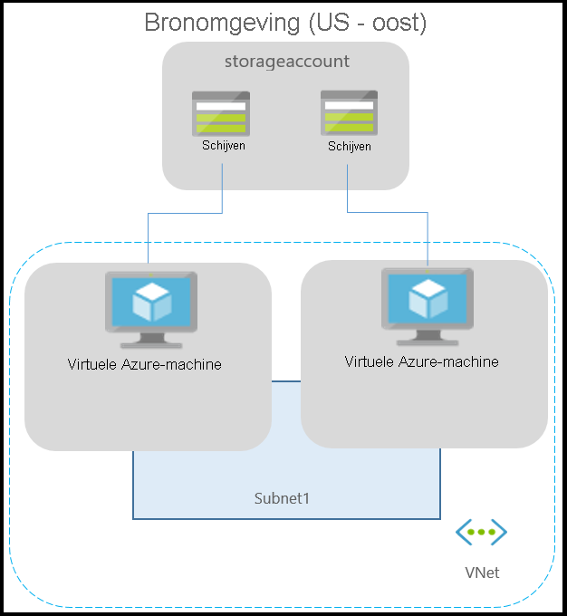
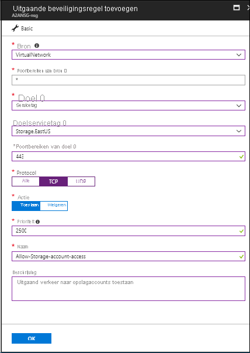
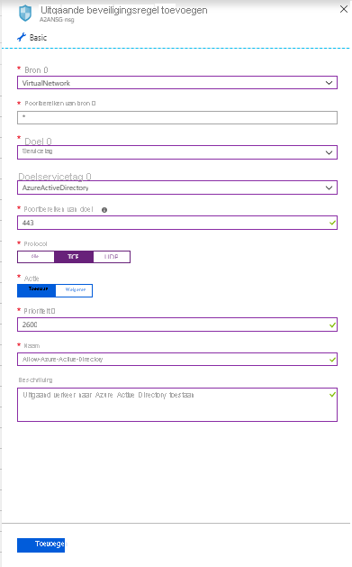
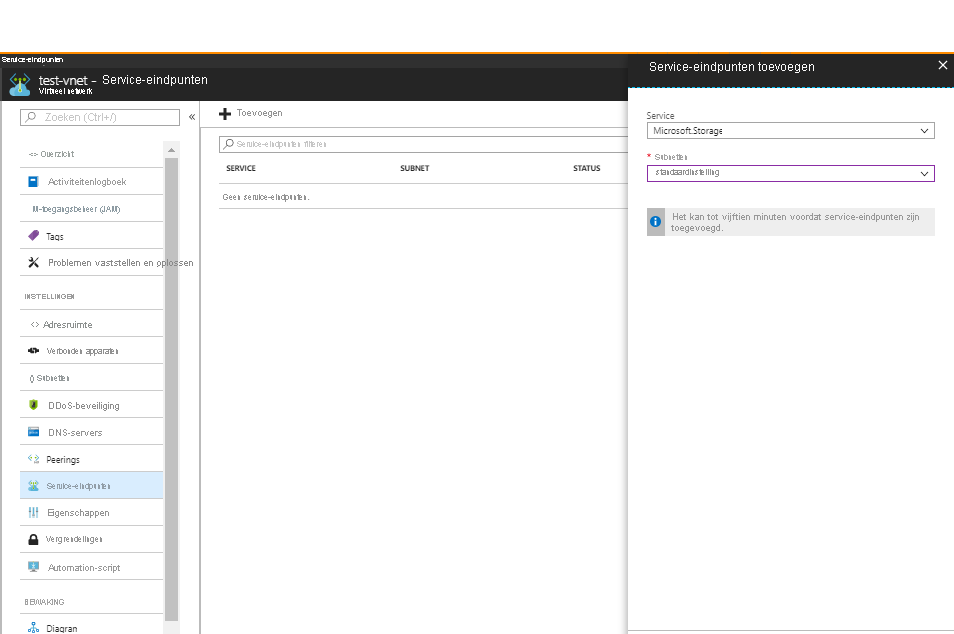

# Over netwerken in Azure VM-noodherstel

In dit artikel vindt u netwerkrichtlijnen wanneer u Azure VM's van de ene regio naar het andere repliceert en herstelt met [Azure Site Recovery.](site-recovery-overview.md)

## Voordat u begint

Meer informatie over hoe siteherstel voor [dit scenario](azure-to-azure-architecture.md)een rampherstel biedt.

## Typische netwerkinfrastructuur

In het volgende diagram wordt een typische Azure-omgeving weergegeven voor toepassingen die worden uitgevoerd op Azure VM's:

Als u Azure ExpressRoute of een VPN-verbinding van uw on-premises netwerk naar Azure gebruikt, ziet de omgeving er als volgt uit:

Netwerken worden doorgaans beveiligd met firewalls en netwerkbeveiligingsgroepen (NSG's). Firewalls gebruiken URL of IP-gebaseerde whitelisting om de netwerkconnectiviteit te beheren. NSGs bieden regels die IP-adresbereiken gebruiken om de netwerkconnectiviteit te beheren.

>[!IMPORTANT]
> Het gebruik van een geverifieerde proxy om de netwerkconnectiviteit te beheren wordt niet ondersteund door Site Recovery en replicatie kan niet worden ingeschakeld.

## Uitgaande connectiviteit voor URL's

Als u een op URL gebaseerde firewallproxy gebruikt om uitgaande connectiviteit te beheren, moet u deze URL's voor siteherstel toestaan:

**Url** | **Details**
--- | ---
*.blob.core.windows.net | Vereist zodat gegevens vanaf de VM naar het cacheopslagaccount in het brongebied kunnen worden geschreven. Als u alle cacheopslagaccounts voor uw VM's kent, u toegang verlenen tot de specifieke URL's van het opslagaccount (bijvoorbeeld cache1.blob.core.windows.net en cache2.blob.core.windows.net) in plaats van *.blob.core.windows.net
login.microsoftonline.com | Vereist voor autorisatie en verificatie voor de URL's van de siteherstelservice.
*.hypervrecoverymanager.windowsazure.com | Vereist zodat de servicecommunicatie siteherstel vanuit de VM kan plaatsvinden.
*.servicebus.windows.net | Vereist zodat de siteherstelcontrole- en diagnostische gegevens kunnen worden geschreven vanuit de VM.
*.vault.azure.net | Biedt toegang om replicatie voor virtuele machines met ADE-poort via portal mogelijk te maken
*.automation.ext.azure.com | Maakt het mogelijk om een automatische upgrade van mobiliteitsagent mogelijk te maken voor een gerepliceerd item via portal

## Uitgaande connectiviteit met servicetags

Als u een NSG gebruikt om uitgaande connectiviteit te beheren, moeten deze servicetags worden toegestaan.

- Voor de opslagaccounts in het brongebied:
    - Maak een NSG-regel op [basis van opslagservicetags](../virtual-network/security-overview.md#service-tags) voor het brongebied.
    - Geef deze adressen toe, zodat gegevens vanaf de VM naar het cacheopslagaccount kunnen worden geschreven.
- Een [OP Azure Active Directory (AAD) servicetag](../virtual-network/security-overview.md#service-tags) gebaseerde NSG-regel maken voor het toestaan van toegang tot alle IP-adressen die overeenkomen met AAD
- Maak een NSG-regel op basis van EventsHub-servicetags voor de doelregio, waarmee toegang tot siteherstelbewaking mogelijk is.
- Maak een OP AzureSiteRecovery-servicetag gebaseerde NSG-regel voor het toestaan van toegang tot de siteherstelservice in elke regio.
- Maak een OP AzureKeyVault-servicetag gebaseerde NSG-regel. Dit is alleen vereist voor het inschakelen van replicatie van virtuele machines met ADE via portal.
- Maak een NSG-regel op basis van guestandhybridmanagement-servicetags. Dit is alleen vereist voor het inschakelen van automatische upgrade van mobiliteitsagent voor een gerepliceerd item via portal.
- We raden u aan de vereiste NSG-regels voor een test NSG te maken en te controleren of er geen problemen zijn voordat u de regels voor een productie-NSG maakt.

## Voorbeeld NSG-configuratie

In dit voorbeeld ziet u hoe u NSG-regels configureert voor een vm die moet worden gerepliceerd.

- Als u NSG-regels gebruikt om uitgaande connectiviteit te beheren, gebruikt u 'HTTPS-uitgaande regels toestaan voor poort:443 voor alle vereiste IP-adresbereiken.
- Het voorbeeld gaat ervan uit dat de VM-bronlocatie "Oost-VS" is en dat de doellocatie 'Centraal VS' is.

### NSG regels - Oost-VS

1. Maak een uitgaande HTTPS (443) beveiligingsregel voor "Storage.EastUS" op de NSG, zoals weergegeven in de onderstaande schermafbeelding.

      

2. Maak een uitgaande HTTPS(443) beveiligingsregel voor 'AzureActiveDirectory' op de NSG, zoals in de onderstaande schermafbeelding.

      

3. Net als boven de beveiligingsregels maakt u uitgaande HTTPS(443) beveiligingsregel voor 'EventHub.CentralUS' op de NSG die overeenkomt met de doellocatie. Dit geeft toegang tot Site Recovery monitoring.

4. Maak een uitgaande HTTPS-beveiligingsregel (443) voor 'AzureSiteRecovery' op de NSG. Dit geeft toegang tot siteherstelservice in elke regio.

### NSG regels - Centrale VS

Deze regels zijn vereist, zodat replicatie kan worden ingeschakeld van het doelgebied naar het brongebied na de failover:

1. Maak een uitgaande HTTPS(443) beveiligingsregel voor 'Storage.CentralUS' op de NSG.

2. Maak een uitgaande HTTPS-beveiligingsregel (443) voor 'AzureActiveDirectory' op de NSG.

3. Net als boven de beveiligingsregels maakt u uitgaande HTTPS(443) beveiligingsregel voor 'EventHub.EastUS' op de NSG die overeenkomt met de bronlocatie. Dit geeft toegang tot Site Recovery monitoring.

4. Maak een uitgaande HTTPS-beveiligingsregel (443) voor 'AzureSiteRecovery' op de NSG. Dit geeft toegang tot siteherstelservice in elke regio.

## Configuratie van virtuele apparaten in het netwerk

Als u netwerkvirtuele apparaten (NVA's) gebruikt om uitgaand netwerkverkeer vanuit VM's te beheren, kan het toestel worden beperkt als al het replicatieverkeer door de NVA gaat. We raden u aan een eindpunt voor netwerkservice te maken in uw virtuele netwerk voor 'Opslag', zodat het replicatieverkeer niet naar de NVA gaat.

### Eindpunt van netwerkservice voor opslag maken
U een eindpunt voor netwerkservice maken in uw virtuele netwerk voor 'Opslag', zodat het replicatieverkeer azure-grens niet verlaat.

- Selecteer uw virtuele Azure-netwerk en klik op 'Service-eindpunten'

    

- Klik op 'Toevoegen' en 'Serviceeindpunten toevoegen' wordt geopend
- Selecteer 'Microsoft.Storage' onder 'Service' en de vereiste subnetten onder het veld 'Subnetten' en klik op 'Toevoegen'

>[!NOTE]
>Beperk de toegang tot virtueel netwerk niet tot uw opslagaccounts die voor ASR worden gebruikt. U moet toegang verlenen vanuit 'Alle netwerken'

### Geforceerde tunneling

U de standaardsysteemroute van Azure voor het voorvoegsel 0.0.0.0/0 overschrijven met een [aangepaste route](../virtual-network/virtual-networks-udr-overview.md#custom-routes) en VM-verkeer omleiden naar een on-premises virtuele netwerk -toestel (NVA), maar deze configuratie wordt niet aanbevolen voor siteherstelreplicatie. Als u aangepaste routes gebruikt, moet u [een eindpunt voor virtuele netwerkservice maken](azure-to-azure-about-networking.md#create-network-service-endpoint-for-storage) in uw virtuele netwerk voor 'Opslag' zodat het replicatieverkeer de Azure-grens niet verlaat.

## Volgende stappen
- Begin met het beveiligen van uw workloads door [het repliceren van Azure virtuele machines.](site-recovery-azure-to-azure.md)
- Meer informatie over [het bewaren van IP-adres](site-recovery-retain-ip-azure-vm-failover.md) voor azure virtual machine failover.
- Meer informatie over noodherstel van [Azure virtuele machines met ExpressRoute](azure-vm-disaster-recovery-with-expressroute.md).
