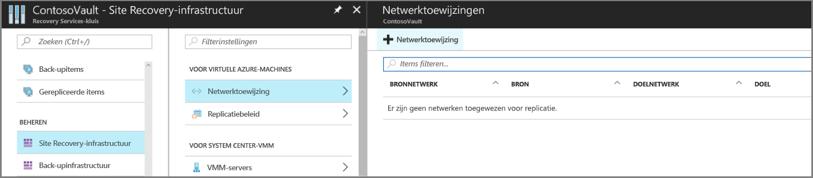
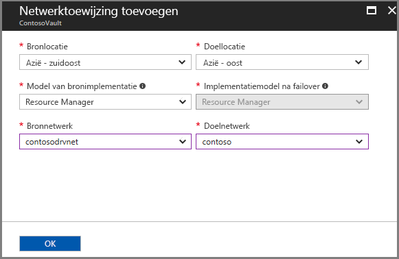
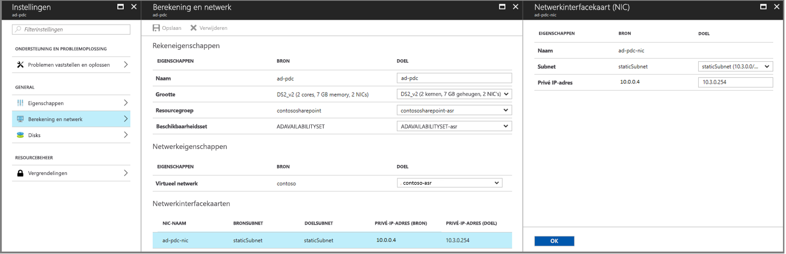

# Netwerk toewijzing en IP-adres Sering instellen voor VNets

In dit artikel wordt beschreven hoe u twee exemplaren van Azure Virtual Networks (VNets) kunt toewijzen die zich in verschillende Azure-regio's bevinden en hoe u IP-adres Sering tussen netwerken instelt. Netwerk toewijzing biedt een standaard gedrag voor de selectie van het doel netwerk op basis van het bron netwerk op het moment dat de replicatie wordt ingeschakeld.

## Vereisten

Voordat u netwerken toewijst, moet u [Azure VNets](../virtual-network/virtual-networks-overview.md) hebben in de bron-en doel-Azure-regio's. 

## Netwerk toewijzing hand matig instellen (optioneel)

Wijs netwerken als volgt toe:

1. Klik in **site Recovery-infra structuur**op **+ netwerk toewijzing**.

    

3. Selecteer in **netwerk toewijzing toevoegen**de bron-en doel locatie. In ons voor beeld wordt de bron-VM uitgevoerd in de regio Azië-oost en repliceert deze naar de regio Zuidoost-Azië.

    
3. Maak nu een netwerk toewijzing in tegenovergestelde richting. In ons voor beeld is de bron nu Zuidoost-Azië en wordt het doel Azië-oost.

    

## Netwerken toewijzen wanneer u replicatie inschakelt

Als u geen netwerk toewijzing hebt voor bereid voordat u herstel na nood gevallen voor Azure-Vm's configureert, kunt u een doelnet netwerk opgeven wanneer u [replicatie instelt en inschakelt](azure-to-azure-how-to-enable-replication.md). Wanneer u dit doet, gebeurt het volgende:

- Op basis van het doel dat u selecteert, maakt Site Recovery automatisch netwerk toewijzingen van de bron-naar-doel regio en van de doel-naar-bron regio.
- Site Recovery maakt standaard een netwerk in de doel regio die identiek is aan het bron netwerk. Site Recovery voegt **ASR** toe als achtervoegsel aan de naam van het bron netwerk. U kunt het doelnet-netwerk aanpassen.
- Als er al een netwerk toewijzing heeft plaatsgevonden voor een bron netwerk, is het toegewezen doelnet werk altijd de standaard waarde voor het inschakelen van replicaties voor meer Vm's. U kunt ervoor kiezen om het virtuele doel netwerk te wijzigen door andere beschik bare opties te kiezen in de vervolg keuzelijst. 
- Als u het standaard virtuele doel netwerk voor nieuwe replicatie wilt wijzigen, moet u de bestaande netwerk toewijzing wijzigen.
- Als u een netwerk toewijzing wilt wijzigen van regio A in regio B, moet u ervoor zorgen dat u eerst de netwerk toewijzing uit regio B naar regio A verwijdert. Nadat u het verwijderen van de toewijzing ongedaan hebt gemaakt, wijzigt u de netwerk toewijzing van regio A in regio B en maakt u de relevante omgekeerde toewijzing.

>[!NOTE]
>* Als u de netwerk toewijzing wijzigt, worden alleen de standaard waarden voor nieuwe VM-replicaties gewijzigd. Dit heeft geen invloed op de selecties van het virtuele doel netwerk voor bestaande replicaties. 
>* Als u het doelnet werk voor een bestaande replicatie wilt wijzigen, gaat u naar de reken-en netwerk instellingen van het gerepliceerde item.

## Subnet opgeven

Het subnet van de doel-VM wordt geselecteerd op basis van de naam van het subnet van de bron-VM.

- Als er een subnet met dezelfde naam als de bron-VM-subnet beschikbaar is in het doelnet-netwerk, wordt dat subnet ingesteld voor de doel-VM.
- Als er geen subnet met dezelfde naam bestaat in het doelnet-netwerk, wordt het eerste subnet in de alfabetische volg orde ingesteld als het doel-subnet.
- U kunt het doel-subnet in de **reken-en netwerk** instellingen voor de virtuele machine wijzigen.

    

## IP-adres Sering instellen voor doel-Vm's

Het IP-adres voor elke NIC op een virtuele doel machine wordt als volgt geconfigureerd:

- **DHCP**: Als de NIC van de bron-VM DHCP gebruikt, is de NIC van de doel-VM ook ingesteld op het gebruik van DHCP.
- **Statisch IP-adres**: Als de NIC van de bron-VM gebruikmaakt van vaste IP-adres Sering, wordt er ook een statisch IP-adres gebruikt voor de doel-VM-NIC.

## Toewijzing van IP-adres tijdens failover

**Bron-en doel-subnetten** | **Details**
--- | ---
Dezelfde adres ruimte | IP-adres van de bron-VM-NIC is ingesteld als het IP-adres van de doel-VM-NIC.   Als het adres niet beschikbaar is, wordt het volgende beschik bare IP-adres ingesteld als het doel.

Andere adres ruimte   Het volgende beschik bare IP-adres in het doel-subnet wordt ingesteld als het doel-VM NIC-adres.

## Toewijzing van IP-adressen tijdens testfailover

**Doelnet netwerk** | **Details**
--- | ---
Het doelnet netwerk is het failover-VNet | -Het doel-IP-adres is statisch, maar niet hetzelfde IP-adres als dat voor failover is gereserveerd.    -Het toegewezen adres is het volgende beschik bare adres aan het einde van het bereik van het subnet.   Bijvoorbeeld: Als het IP-adres van de bron 10.0.0.19 is en het failover-netwerk gebruikmaakt van het bereik 10.0.0.0/24, is het volgende IP-adres dat is toegewezen aan de doel-VM 10.0.0.254.
Het doelnet netwerk is geen failover-VNet | -Het doel-IP-adres is statisch met hetzelfde IP-adres dat is gereserveerd voor failover.    -Als er al een IP-adres is toegewezen, is het IP-adres het volgende beschik bare aan het einde van het subnet-bereik.   Bijvoorbeeld: Als het vaste IP-adres van de bron 10.0.0.19 is en failover zich op een netwerk bevindt dat niet het failovercluster is, met het bereik 10.0.0.0/24, wordt het statische IP-adres van het doel 10.0.0.0.19 als dit beschikbaar is, en is het ook 10.0.0.254.

- De failover VNet is het doelnet doel netwerk dat u selecteert bij het instellen van herstel na nood gevallen.
- U wordt aangeraden altijd een niet-productie netwerk te gebruiken voor een testfailover.
- U kunt het doel-IP-adres wijzigen in de **reken-en netwerk** instellingen van de virtuele machine.

## Volgende stappen

- Bekijk de [netwerk richtlijnen](site-recovery-azure-to-azure-networking-guidance.md) voor herstel na nood gevallen voor Azure VM.
- Meer [informatie](site-recovery-retain-ip-azure-vm-failover.md) over het bewaren van IP-adressen na een failover.
