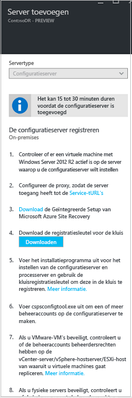
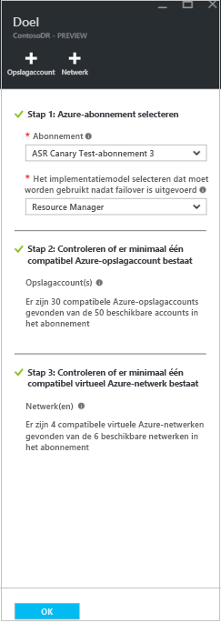
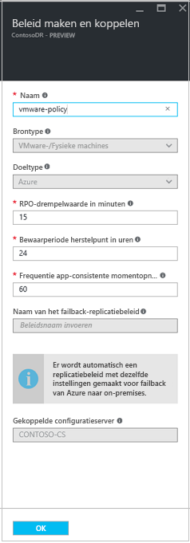

# Azure-VM's verplaatsen tussen Azure Government-regio's en openbare regio's 

Misschien wilt u uw IaaS-VM's verplaatsen tussen Azure Government en openbare regio's om de beschikbaarheid van uw bestaande VM's te vergroten, de beheersbaarheid te verbeteren of om beheerredenen, zoals [hier](azure-to-azure-move-overview.md) wordt beschreven.

Behalve dat u de service [Azure Site Recovery](site-recovery-overview.md) kunt gebruiken om herstel na noodgevallen van on-premises machines en Azure-VM’s te beheren en te organiseren met als doel de bedrijfscontinuïteit te waarborgen, en deze service kunt gebruiken voor herstel na een noodgeval (BCDR), kunt u Site Recovery ook gebruiken om Azure-VM’s te verplaatsen naar een secundaire regio.       

In deze zelfstudie leert u hoe u virtuele Azure-machines tussen Azure Government- en openbare regio's kunt verplaatsen met behulp van Azure Site Recovery. Dit kan ook worden gebruikt om VM's te verplaatsen tussen regioparen die zich niet binnen hetzelfde geografische cluster bevinden. In deze zelfstudie leert u het volgende:

> [!div class="checklist"]
> * Vereisten verifiëren
> * De bron-VM’s voorbereiden
> * De doelregio voorbereiden
> * Gegevens kopiëren naar de doelregio
> * De configuratie testen
> * De verplaatsing uitvoeren
> * De resources in de bronregio verwijderen

> [!IMPORTANT]
> In deze zelfstudie ziet u hoe u virtuele Azure-machines verplaatst tussen Azure Government- en openbare regio's, of tussen regioparen die niet worden ondersteund door de reguliere oplossing voor herstel na noodgevallen voor Azure-VM's. In het geval waarin uw paren van bron- en doelregio worden [ondersteund](./azure-to-azure-support-matrix.md#region-support), raadpleegt u dit [document](azure-to-azure-tutorial-migrate.md) voor het verplaatsen. Raadpleeg deze zelfstudie [hier](move-azure-VMs-AVset-Azone.md) als u de beschikbaarheid wilt verbeteren door VM’s in een beschikbaarheidsset te verplaatsen naar VM’s die zijn vastgemaakt aan een zone in een andere regio.

> [!IMPORTANT]
> Het is niet raadzaam om deze methode te gebruiken voor het configureren van herstel na noodgeval tussen niet-ondersteunde regioparen, aangezien de paren worden gedefinieerd met het oog op gegevenslatentie, wat cruciaal is voor een noodherstelscenario.

## Vereisten verifiëren

> [!NOTE]
> Zorg ervoor dat u inzicht hebt in de [architectuur en onderdelen](physical-azure-architecture.md) voor dit scenario. Deze architectuur wordt gebruikt om virtuele Azure-machines te verplaatsen, **door de VM's te behandelen als fysieke servers**.

- Raadpleeg de [ondersteuningsvereisten](vmware-physical-secondary-support-matrix.md) voor alle onderdelen.
- Zorg ervoor dat de servers die u wilt repliceren aan de [vereisten voor Azure-VM'S](vmware-physical-secondary-support-matrix.md#replicated-vm-support) voldoen.
- Bereid een account voor de automatische installatie van de Mobility-service voor op elke server die u wilt repliceren.

- Let op: nadat u een failover hebt uitgevoerd naar de doelregio in Azure, kunt u een failback naar de bronregio niet rechtstreeks uitvoeren. U moet de replicatie terug naar het doel opnieuw instellen.

### Azure-accountmachtigingen verifiëren

Zorg ervoor dat uw Azure-account machtigingen heeft voor de replicatie van virtuele machines naar Azure.

- Bekijk de [machtigingen](site-recovery-role-based-linked-access-control.md#permissions-required-to-enable-replication-for-new-virtual-machines) die u nodig hebt om machines naar Azure te repliceren.
- Controleer en wijzig [op rollen gebaseerde toegangsmachtigingen](../role-based-access-control/role-assignments-portal.md). 

### Een Azure-netwerk instellen

Stel een [Azure-doelnetwerk](../virtual-network/quick-create-portal.md) in.

- Azure-VM's worden in dit netwerk geplaatst wanneer ze zijn gemaakt na de failover.
- Het netwerk moet zich in dezelfde regio bevinden als de Recovery Services-kluis

### Een Azure-opslagaccount instellen

Stel een [Azure-opslagaccount](../storage/common/storage-account-create.md) in.

- Site Recovery repliceert on-premises machines naar Azure Storage. Virtuele Azure-machines worden gemaakt vanuit opslag nadat de failover heeft plaatsgevonden.
- Het opslagaccount moet zich in dezelfde regio bevinden als de Recovery Services-kluis.

## De bron-VM’s voorbereiden

### Een account voorbereiden voor installatie van de Mobility-service

De Mobility-service moet worden geïnstalleerd op elke server die u wilt repliceren. Site Recovery installeert deze service automatisch wanneer u replicatie voor de server inschakelt. Voor automatische installatie moet u een account voorbereiden waarmee Site Recovery toegang kan krijgen tot de server.

- U kunt een domein- of lokaal account gebruiken
- Voor Windows-accounts schakelt u als u geen domeinaccount gebruikt toegangsbeheer voor externe gebruikers uit op de lokale computer. U doet dit door in het register onder **HKEY_LOCAL_MACHINE\SOFTWARE\Microsoft\Windows\CurrentVersion\Policies\System** de DWORD-vermelding **LocalAccountTokenFilterPolicy** met een waarde van 1 toe te voegen.
- Als u de registervermelding wilt toevoegen om de instelling vanuit een CLI uit te schakelen, typt u:       ``REG ADD HKEY_LOCAL_MACHINE\SOFTWARE\Microsoft\Windows\CurrentVersion\Policies\System /v LocalAccountTokenFilterPolicy /t REG_DWORD /d 1.``
- Voor Linux moet het account een hoofdaccount zijn op de Linux-bronserver.

## De doelregio voorbereiden

1. Controleer of u een Azure-abonnement hebt waarmee u in staat bent om virtuele machines te maken in de doelregio die wordt gebruikt voor herstel na noodgevallen. Neem contact op met ondersteuning voor het inschakelen van het vereiste quotum.

2. Zorg ervoor dat uw abonnement voldoende resources heeft die ondersteuning kunnen bieden voor VM’s met grootten die overeenkomen met uw bron-VM’s. Site Recovery kiest voor de doel-VM dezelfde of de dichtstbijzijnde grootte om gegevens naar het doel te kopiëren.

3. Zorg ervoor dat u een doelresource maakt voor elk onderdeel dat is geïdentificeerd in de bronindeling voor netwerken. Het is belangrijk om ervoor te zorgen dat uw VM’s alle functionaliteit en functies hebben die u in de bron had, na de cutover naar de doelregio.

    > [!NOTE]
    > In Azure Site Recovery wordt automatisch een virtueel netwerk gedetecteerd en gemaakt wanneer u replicatie inschakelt voor de bron-VM. U kunt er ook voor kiezen om vooraf een netwerk te maken en dit toe te wijzen aan de VM in de gebruikersstroom om replicatie in te schakelen. Maar alle andere resources moet u zoals hieronder wordt beschreven handmatig maken in de doelregio.

     Raadpleeg de volgende documenten om de meest gebruikte netwerkresources te maken die relevant zijn voor u, op basis van de bron-VM-configuratie.

    - [Netwerkbeveiligingsgroepen](../virtual-network/manage-network-security-group.md)
    - [Load balancers](../load-balancer/index.yml)
    - [Openbare IP](../virtual-network/virtual-network-public-ip-address.md)
    
    Voor andere netwerkonderdelen raadpleegt u de [netwerkondersteuningsdocumentatie.](../index.yml?pivot=products&panel=network)

4. [Maak handmatig een niet-productienetwerk](../virtual-network/quick-create-portal.md) in de doelregio als u de configuratie wilt testen voordat u het uiteindelijke knippen naar de doelregio uitvoert. Hiermee ontstaat er slechts minimale verstoring in de productie. Dit wordt aanbevolen.

## Gegevens kopiëren naar de doelregio
De onderstaande stappen begeleiden u bij het gebruik van Azure Site Recovery om gegevens te kopiëren naar de doelregio.

### Maak de kluis in elke gewenste regio, met uitzondering van de bronregio.

1. Meld u aan bij [Azure Portal](https://portal.azure.com) > **Recovery Services**.
2. Klik op **Een resource maken** > **Beheerhulpprogramma's** > **Backup en Site Recovery**.
3. Bij **Naam** geeft u de beschrijvende naam **ContosoVMVault** op. Als u meer dan één abonnement hebt, selecteert u het juiste abonnement.
4. Maak een resourcegroep met de naam **ContosoRG**.
5. Geef een Azure-regio op. Zie Geografische beschikbaarheid in [Prijsinformatie voor Azure Site Recovery](https://azure.microsoft.com/pricing/details/site-recovery/) om na te gaan welke regio's er worden ondersteund.
6. Klik in Recovery Services-kluizen op **Overzicht** > **ConsotoVMVault** >  **+Repliceren**
7. selecteer **Naar Azure** > **Niet gevirtualiseerde/overige**.

### Stel de configuratieserver in voor het detecteren van virtuele machines.

Stel de configuratieserver in, registreer deze in de kluis en detecteer VM's.

1. Klik op **Site Recovery** > **Infrastructuur voorbereiden** > **Bron**.
2. Als u geen configuratieserver hebt, klikt u op **+ Configuratieserver**.
3. Controleer bij **Server toevoegen** of **Configuratieserver** wordt weergegeven in **Servertype**.
4. Download het installatiebestand voor de Geïntegreerde Setup van Site Recovery.
5. Download de registratiesleutel voor de kluis. U hebt dit nodig wanneer u de Geïntegreerde Setup uitvoert. De sleutel blijft vijf dagen na het genereren ervan geldig.

   

### De configuratieserver in de kluis registreren

Doe het volgende voordat u begint: 

#### Nauwkeurigheid van tijd controleren
Zorg ervoor dat op de computer met de configuratieserver de systeemklok met een [tijdserver](/windows-server/networking/windows-time-service/windows-time-service-top) is gesynchroniseerd. Deze moeten overeenkomen. Als deze 15 minuten voor- of achterloopt, kan de installatie mislukken.

#### Connectiviteit verifiëren
Zorg ervoor dat de computer toegang kan krijgen tot deze URL's op basis van uw omgeving: 

[!INCLUDE [site-recovery-URLS](../../includes/site-recovery-URLS.md)]  

Op IP-adres gebaseerde firewallregels moeten communicatie toestaan voor alle Azure-URL's die hierboven worden vermeld via de HTTPS-poort (443). Om het IP-bereik te vereenvoudigen en te beperken, wordt het aanbevolen om URL-filtering uit te voeren.

- **Commerciële IP's**: de [Azure Data Center IP-adresbereiken](https://www.microsoft.com/download/confirmation.aspx?id=41653) en de HTTPS-poort (443) toestaan. IP-adresbereiken toestaan voor de Azure-regio van uw abonnement ter ondersteuning van de AAD-, back-up-, replicatie-en opslag-URL's.  
- **Government-IP's**: de [Azure Government Data Center IP-bereiken](https://www.microsoft.com/en-us/download/details.aspx?id=57063) en de HTTPS-poort (443) toestaan voor alle USGov-regio's (Virginia, Texas, Arizona en Iowa) voor de ondersteuning van AAD-, back-up-, replicatie-en opslag-URL's.  

#### Setup uitvoeren
Voer Geïntegreerde Setup uit als een lokale beheerder om de configuratieserver te installeren. De processerver en de hoofddoelserver worden ook standaard geïnstalleerd op de configuratieserver.

[!INCLUDE [site-recovery-add-configuration-server](../../includes/site-recovery-add-configuration-server.md)]

Na voltooiing van de registratie wordt de configuratieserver weergegeven op de pagina **Instellingen** > **Servers** in de kluis.

### Doelinstellingen voor replicatie configureren

Selecteer en controleer doelbronnen.

1. Klik op **Infrastructuur voorbereiden** > **Doel** en selecteer het Azure-abonnement dat u wilt gebruiken.
2. Geef het doelimplementatiemodel op.
3. Site Recovery controleert of u een of meer compatibele Azure-opslagaccounts en -netwerken hebt.

   

### Een replicatiebeleid maken

1. Klik op **Infrastructuur voor Site Recovery** > **Herstelbeleid** >  **+Herstelbeleid** om een nieuw replicatiebeleid te maken.
2. Geef in **Replicatiebeleid maken** een beleidsnaam op.
3. Geef in **RPO-drempelwaarde** de limiet van de Recovery Point Objective (RPO) op. Deze waarde geeft aan hoe vaak gegevensherstelpunten worden gemaakt. Wanneer de continue replicatie deze limiet overschrijdt, wordt er een waarschuwing gegenereerd.
4. Geef in **Bewaarperiode van het herstelpunt** op hoelang (in uren) de bewaarperiode voor elk herstelpunt is. Gerepliceerde VM’s kunnen worden hersteld naar een willekeurig punt in een tijdvenster. Voor computers die worden gerepliceerd naar Premium Storage, wordt een bewaarperiode van maximaal 24 uur ondersteund, en 72 uur voor computers die naar Standard Storage worden gerepliceerd.
5. Geef in **Frequentie van de app-consistente momentopname** op hoe vaak (in minuten) er herstelpunten moeten worden gemaakt met toepassingsconsistente momentopnamen. Klik op **OK** om het beleid te maken.

    

Het beleid wordt automatisch gekoppeld aan de configuratieserver. Standaard wordt automatisch een bijbehorend beleid gemaakt voor failback. Als het replicatiebeleid bijvoorbeeld **rep-policy** is, wordt het failbackbeleid **rep-policy-failback** gemaakt. Dit beleid wordt pas gebruikt als u een failback initieert vanuit Azure.

### Replicatie inschakelen

- Site Recovery installeert de Mobility-service wanneer replicatie wordt ingeschakeld.
- Wanneer u replicatie voor een server inschakelt, kan het 15 minuten of langer duren voordat wijzigingen zijn doorgevoerd en in de portal worden weergegeven.

1. Klik op **Toepassing repliceren** > **Bron**.
2. Selecteer in **Bron** de configuratieserver.
3. Selecteer bij **Type machine** de optie **Fysieke machines**.
4. Selecteer de processerver (de configuratieserver). Klik vervolgens op **OK**.
5. Selecteer in **Doel** het abonnement en de resourcegroep waarin u de Azure-VM's na failover wilt maken. Kies het implementatiemodel dat u wilt gebruiken in Azure (klassiek of resourcebeheer).
6. Selecteer het Azure-opslagaccount dat u wilt gebruiken voor het repliceren van gegevens. 
7. Selecteer het Azure-netwerk en -subnet waarmee virtuele Azure-machines verbinding maken wanneer ze na een failover worden gemaakt.
8. Selecteer **Nu configureren voor geselecteerde machines** om de netwerkinstelling toe te passen op alle machines die u voor beveiliging selecteert. Selecteer **Later configureren** om per machine een Azure-netwerk te selecteren. 
9. Klik in **Fysieke machines** op **+Fysieke machine**. Geef de naam en het IP-adres op. Selecteer het besturingssysteem van de computer die u wilt repliceren. Het duurt enkele minuten voordat de servers zijn gedetecteerd en worden weergegeven. 

   > [!WARNING]
   > U moet het IP-adres invoeren van de virtuele Azure-machine die u wilt verplaatsen

10. Selecteer in **Eigenschappen** > **Eigenschappen configureren** het account dat door de processerver zal worden gebruikt om automatisch de Mobility-service op de computer te installeren.
11. Controleer of het juiste replicatiebeleid is geselecteerd in **Replicatie-instellingen** > **Replicatie-instellingen configureren**. 
12. Klik op **Replicatie inschakelen**. U kunt de voortgang van de taak **Beveiliging inschakelen** volgen via **Instellingen** > **Taken** > **Site Recovery-taken**. Nadat de taak **Beveiliging voltooien** is uitgevoerd, is de machine klaar voor een mogelijke failover.

Voor het bewaken van servers die u toevoegt, kunt u de laatste detectietijd voor servers controleren in **Configuratieservers** > **Laatst contact om**. Als u machines wilt toevoegen zonder te wachten op de geplande detectietijd, markeert u de configuratieserver (klik er niet op) en klikt u op **Vernieuwen**.

## De configuratie testen

1. Ga naar de kluis, klik in **Instellingen** > **Gerepliceerde items** op de virtuele machine die u wilt verplaatsen naar de doelregio. Klik op het pictogram **+Failover testen**.
2. Selecteer in **Failover testen** een herstelpunt om voor de failover te gebruiken:

   - **Laatst verwerkt**: voert een failover van de VM uit naar het laatste herstelpunt dat is verwerkt door de Site Recovery-service. Het tijdstempel wordt weergegeven. Met deze optie wordt er geen tijd besteed aan het verwerken van gegevens, zodat er een lage RTO (Recovery Time Objective) is
   - **Laatste toepassingsconsistente punt**: met deze optie wordt er een failover uitgevoerd van alle VM's naar het laatste toepassingsconsistente herstelpunt. Het tijdstempel wordt weergegeven.
   - **Aangepast**: selecteer een herstelpunt.

3. Selecteer het Azure-doelnetwerk waar u de Azure VM's naartoe wilt verplaatsen, om de configuratie te testen. 

   > [!IMPORTANT]
   > U wordt aangeraden een afzonderlijk Azure-VM-netwerk te gebruiken voor de testfailover en niet het productienetwerk waarnaar u uw VM’s uiteindelijk wilt verplaatsen dat is ingesteld toen u replicatie hebt ingeschakeld.

4. Klik op **OK** om de verplaatsing te testen. Klik op de VM om de eigenschappen ervan te openen als u de voortgang wilt volgen. U kunt ook op de taak **Failover testen** klikken in kluisnaam > **Instellingen** > **Taken** > **Site Recovery-taken**.
5. Nadat de failover is voltooid, wordt de replica-Azure-VM weergegeven in de Azure Portal > **Virtuele machines**. Controleer of de VM draait, de juiste grootte heeft en aangesloten is op het juiste netwerk.
6. Als u de VM wilt verwijderen die is gemaakt als onderdeel van de verplaatsingstest, klikt u op **Failovertest wissen** op het gerepliceerde item. Leg in **Notities** eventuele opmerkingen over de test vast en sla deze op.

## Voer de overstap naar de doelregio uit en bevestig dit.

1. Ga naar de kluis, klik in **Instellingen** > **Gerepliceerde items** op de virtuele machine en klik vervolgens op **Failover**.
2. Bij **Failover** selecteert u **Meest recente**. 
3. Selecteer **Sluit de computer af voordat de failover wordt gestart**. Site Recovery sluit de virtuele bronmachine af voordat de failover wordt geactiveerd. De failover wordt voortgezet zelfs als het afsluiten is mislukt. U kunt de voortgang van de failover volgen op de pagina **Taken**. 
4. Nadat de taak is voltooid, controleert u of de VM zoals verwacht wordt weergegeven in de Azure-doelregio.
5. Klik in **Gerepliceerde items** met de rechtermuisknop op de virtuele machine > **Doorvoeren**. De verplaatsing naar de doelregio wordt voltooid. Wacht tot de doorvoertaak is voltooid.

## Verwijder de resource in de bronregio 

- Navigeer naar de VM.  Klik op **Replicatie uitschakelen**.  Hiermee wordt het proces van het kopiëren van de gegevens voor de VM beëindigd.  

   > [!IMPORTANT]
   > Het is belangrijk dat u deze stap uitvoert om te vermijden dat kosten in rekening worden gebracht voor ASR-replicatie.

Als u van plan bent om een of meer van de bronresources opnieuw te gebruiken, gaat u verder met de volgende reeks stappen.

1. Ga verder met het verwijderen van alle relevante netwerkresources in de bronregio die u hebt vermeld als onderdeel van stap 4 in [De bron-VM’s voorbereiden](#prepare-the-source-vms) 
2. Verwijder het bijbehorende opslagaccount in de bronregio.

## Volgende stappen

In deze zelfstudie hebt u een Azure-VM verplaatst naar een andere Azure-regio. U kunt nu herstel na noodgevallen configureren voor de verplaatste VM.

> [!div class="nextstepaction"]
> [Herstel na noodgeval instellen na een migratie](azure-to-azure-quickstart.md)
