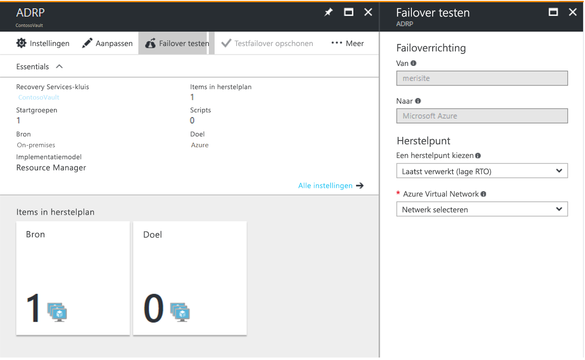
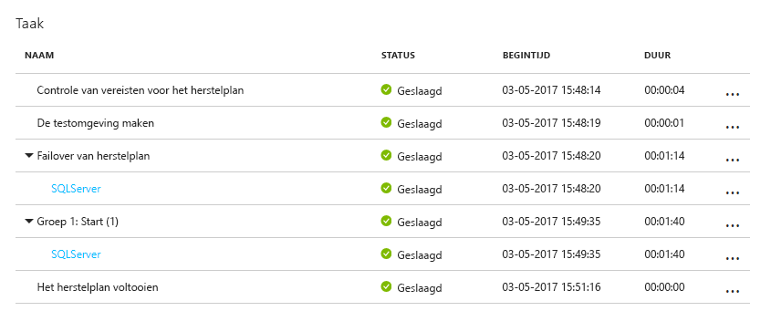

# Een testfailover (inzoomen op nood herstel) uitvoeren in azure 

In dit artikel wordt beschreven hoe u een nood herstel analyse uitvoert op Azure met behulp van een Site Recovery testfailover.  

U voert een testfailover uit om uw strategie voor replicatie en herstel na nood gevallen te valideren, zonder dat er gegevens verloren gaan of downtime. Een testfailover heeft geen invloed op de continue replicatie of uw productie omgeving. U kunt een testfailover uitvoeren op een specifieke virtuele machine (VM) of in een [herstel plan](site-recovery-create-recovery-plans.md) met meerdere vm's.

## Een testfailover uitvoeren
In deze procedure wordt beschreven hoe u een testfailover uitvoert voor een herstel plan. Als u een testfailover wilt uitvoeren voor één virtuele machine, volgt u de stappen die [hier](tutorial-dr-drill-azure.md#run-a-test-failover-for-a-single-vm) worden beschreven

1. Klik in site Recovery in het Azure Portal op **herstel plannen**  >  *recoveryplan_name*  >  **testfailover**.
2. Selecteer een **herstel punt** waarvoor u een failover wilt uitvoeren. U kunt een van de volgende opties gebruiken:
    - **Laatst verwerkte**: met deze optie wordt een failover uitgevoerd voor alle virtuele machines in het plan naar het laatste herstel punt dat is verwerkt door site Recovery. Als u het meest recente herstel punt voor een specifieke virtuele machine wilt zien, controleert u de **meest recente herstel punten** in de VM-instellingen. Deze optie heeft een lage RTO (Recovery Time Objective), omdat er geen tijd wordt besteed aan het verwerken van niet-verwerkte gegevens.
    - **Nieuwste app-consistent**: deze optie is van toepassing op alle virtuele machines in het plan naar het laatste toepassings consistente herstel punt dat is verwerkt door site Recovery. Als u het meest recente herstel punt voor een specifieke virtuele machine wilt zien, controleert u de **meest recente herstel punten** in de VM-instellingen.
    - **Nieuwste**: met deze optie worden eerst alle gegevens verwerkt die zijn verzonden naar site Recovery service, om een herstel punt te maken voor elke virtuele machine voordat er een failover wordt uitgevoerd. Deze optie biedt de laagste RPO (beoogd herstel punt), omdat de VM die is gemaakt na de failover, alle gegevens die worden gerepliceerd naar Site Recovery wanneer de failover werd geactiveerd.
    - **Laatste verwerkte multi-VM**: deze optie is beschikbaar voor herstel plannen met een of meer vm's waarvoor multi-VM-consistentie is ingeschakeld. Vm's waarvoor de instelling is ingeschakeld, kunnen failover uitvoeren naar het meest recente, veelvoorkomende herstel punt met meerdere VM'S. Er wordt een failover uitgevoerd voor andere Vm's naar het meest recente verwerkte herstel punt.  
    - **Nieuwste multi-VM-app-consistent**: deze optie is beschikbaar voor herstel plannen met een of meer vm's waarvoor multi-VM-consistentie is ingeschakeld. Voor virtuele machines die deel uitmaken van een replicatie groep, wordt een failover uitgevoerd naar het meest recente algemene herstel punt van een toepassings consistente multi-VM. Er wordt een failover uitgevoerd voor andere Vm's naar het nieuwste toepassings consistente herstel punt.
    - **Aangepast**: gebruik deze optie om een failover van een specifieke virtuele machine naar een bepaald herstel punt uit te kunnen geven.
3. Selecteer een virtueel Azure-netwerk waarin u de test-Vm's wilt maken.

    - Site Recovery probeert test-Vm's te maken in een subnet met dezelfde naam en hetzelfde IP-adres als in de **reken-en netwerk** instellingen van de virtuele machine.
    - Als een subnet met dezelfde naam niet beschikbaar is in het virtuele netwerk van Azure dat wordt gebruikt voor de testfailover, wordt de test-VM in het eerste subnet alfabetisch gemaakt.
    - Als hetzelfde IP-adres niet beschikbaar is in het subnet, ontvangt de virtuele machine een ander beschikbaar IP-adres in het subnet. [Meer informatie](#create-a-network-for-test-failover).
4. Als er een failover wordt uitgevoerd naar Azure en gegevens versleuteling is ingeschakeld, selecteert u in **versleutelings sleutel**het certificaat dat is uitgegeven bij het inschakelen van versleuteling tijdens de installatie van de provider. U kunt deze stap negeren als versleuteling niet is ingeschakeld.
5. Volg de voortgang van de failover op het tabblad **taken** . U moet de test replica-machine in de Azure Portal kunnen zien.
6. Als u een RDP-verbinding met de Azure-VM wilt initiëren, moet u [een openbaar IP-adres toevoegen](https://aka.ms/addpublicip) aan de netwerk interface van de virtuele machine waarvoor een failover is uitgevoerd.
7. Wanneer alles werkt zoals verwacht, klikt u op **testfailover opschonen**. Hiermee verwijdert u de Vm's die zijn gemaakt tijdens de testfailover.
8. Leg in **Notities** eventuele opmerkingen over de testfailover vast en sla deze op.

Wanneer een testfailover wordt geactiveerd, gebeurt het volgende:

1. **Vereisten**: een controle van vereisten wordt uitgevoerd om ervoor te zorgen dat aan alle voor waarden voor failover wordt voldaan.
2. **Failover**: de failover processen en voor bereide gegevens, zodat er een virtuele machine van Azure kan worden gemaakt.
3. **Nieuwste**: als u het meest recente herstel punt hebt gekozen, wordt een herstel punt gemaakt op basis van de gegevens die naar de service zijn verzonden.
4. **Begin**: met deze stap maakt u een virtuele Azure-machine met behulp van de gegevens die in de vorige stap zijn verwerkt.

### Timing van failover

In de volgende scenario's vereist failover een extra tussenliggende stap die doorgaans ongeveer 8 tot 10 minuten duurt:

* VMware-Vm's met een versie van Mobility service ouder dan 9,8
* Fysieke servers
* Virtuele VMware Linux-machines
* Hyper-V-VM die wordt beveiligd als fysieke servers
* VMware-VM waarbij de volgende Stuur Programma's geen opstart Stuur Programma's zijn:
    * storvsc
    * vmbus
    * storflt
    * Intelide
    * ATAPI
* VMware-VM waarvoor DHCP niet is ingeschakeld, ongeacht of ze DHCP of statische IP-adressen gebruiken.

In alle andere gevallen is geen tussen stap vereist en neemt de failover aanzienlijk minder tijd in beslag.

## Een netwerk maken voor failovertest

Het wordt aangeraden om voor het testen van failover een netwerk te kiezen dat is geïsoleerd van het herstelnetwerk voor de productiesite dat is opgegeven in de instellingen voor **Berekening en netwerk** voor een VM. De standaardinstelling is dat bij het maken van een virtueel Azure-netwerk dit netwerk wordt geïsoleerd van andere netwerken. Het testnetwerk moet een exacte kopie zijn van uw productienetwerk:

- Het testnetwerk moet hetzelfde aantal subnetten hebben als uw productienetwerk. Subnetten moeten dezelfde naam hebben.
- Het testnetwerk moet hetzelfde IP-adresbereik gebruiken.
- Werk het DNS van het testnetwerk bij met het IP-adres dat voor de DNS-VM is opgegeven in de instellingen voor **Berekening en netwerk**. Lees [Testfailover-overwegingen voor Active Directory](site-recovery-active-directory.md#test-failover-considerations) voor meer informatie.

## Testfailover naar een productie netwerk op de herstel site

We raden u echter aan om een ander test netwerk dan het productie netwerk te gebruiken. Als u een nood herstel analyse in uw productie netwerk wilt testen, moet u rekening houden met het volgende:

- Zorg ervoor dat de primaire virtuele machine wordt afgesloten wanneer u de testfailover uitvoert. Anders worden er twee virtuele machines met dezelfde identiteit, die tegelijkertijd in hetzelfde netwerk worden uitgevoerd. Dit kan leiden tot onverwachte gevolgen.
- Eventuele wijzigingen aan Vm's die zijn gemaakt voor een testfailover, gaan verloren wanneer u de failover opschoont. Deze wijzigingen worden niet gerepliceerd naar de primaire virtuele machine.
- Testen in uw productie omgeving leidt tot uitval tijd van uw productie toepassing. Gebruikers mogen geen apps gebruiken die worden uitgevoerd op Vm's wanneer de testfailover wordt uitgevoerd.  

## Active Directory en DNS voorbereiden

Als u een testfailover wilt uitvoeren voor het testen van toepassingen, hebt u een kopie nodig van uw productie Active Directory omgeving in uw test omgeving. Lees de [overwegingen voor testfailover voor Active Directory voor](site-recovery-active-directory.md#test-failover-considerations) meer informatie.

## Voorbereiden op het verbinden met virtuele Azure-machines na een failover

Als u na een failover verbinding wilt maken met virtuele Azure-machines met behulp van RDP/SSH, volgt u de vereisten in de tabel.

**Failover** | **Locatie** | **Acties**
--- | --- | ---
**Virtuele Azure-machine met Windows** | On-premises machine vóór een failover | Voor toegang tot de Azure-VM via internet schakelt u RDP in en zorgt u ervoor dat de TCP-en UDP-regels voor **openbaar**worden toegevoegd en dat RDP is toegestaan voor alle profielen in **Windows Firewall**  >  **toegestane apps**.   Als u toegang wilt krijgen tot de Azure-VM via een site-naar-site-verbinding, schakelt u RDP in op de machine en zorgt u ervoor dat RDP is toegestaan in de **Windows Firewall**  ->  **toegestane apps en functies**voor **domein-en particuliere** netwerken.    Zorg ervoor dat het SAN-beleid van het besturings systeem is ingesteld op **OnlineAll**. [Meer informatie](https://support.microsoft.com/kb/3031135).   Zorg ervoor dat er geen Windows-updates in behandeling zijn op de virtuele machine wanneer u een failover triggert. Windows Update kan worden gestart wanneer u een failover uitvoert. u kunt zich pas aanmelden bij de VM als de update is voltooid.
**Virtuele Azure-machine met Windows** | Virtuele Azure-machine na een failover |  [Voeg een openbaar IP-adres toe](https://aka.ms/addpublicip) voor de VM.   De regels voor de netwerk beveiligings groep op de virtuele machine waarvoor een failover is uitgevoerd (en het Azure-subnet waarmee deze is verbonden) moeten binnenkomende verbindingen met de RDP-poort toestaan.   Controleer de **Diagnostische gegevens over opstarten** om een scherm opname van de virtuele machine te controleren.   Als u geen verbinding kunt maken, controleert u of de virtuele machine wordt uitgevoerd en raadpleegt u deze [Tips voor probleem oplossing](https://social.technet.microsoft.com/wiki/contents/articles/31666.troubleshooting-remote-desktop-connection-after-failover-using-asr.aspx).
**Azure-VM met Linux** | On-premises machine vóór een failover | Zorg ervoor dat de Secure shell-service op de VM is ingesteld om automatisch te starten bij het opstarten van het systeem.   Controleer of er in de firewallregels is ingesteld dat SSH-verbindingen zijn toegestaan.
**Azure-VM met Linux** | Virtuele Azure-machine na een failover | De regels voor de netwerk beveiligings groep op de virtuele machine waarvoor een failover is uitgevoerd (en het Azure-subnet waarmee deze is verbonden) moeten binnenkomende verbindingen met de SSH-poort toestaan.   [Voeg een openbaar IP-adres toe](https://aka.ms/addpublicip) voor de VM.   Controleer de **Diagnostische gegevens over opstarten** voor een scherm opname van de virtuele machine.  

Volg de stappen die [hier](site-recovery-failover-to-azure-troubleshoot.md) worden beschreven om eventuele verbindingsproblemen na een failover op te lossen.

## Volgende stappen
Nadat u een nood herstel analyse hebt voltooid, kunt u meer informatie over andere typen [failover](site-recovery-failover.md)vinden.
