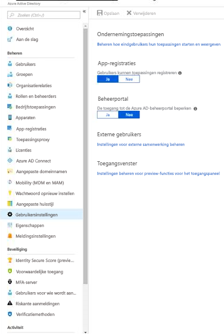
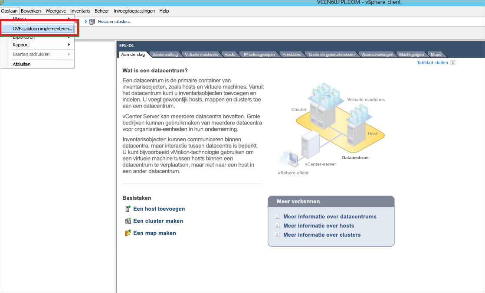

# Een configuratieserver implementeren

U implementeert een on-premises configuratieserver wanneer u [Azure Site Recovery](site-recovery-overview.md) gebruikt voor noodherstel van VMware VM's en fysieke servers naar Azure. De configuratieserver coördineert de communicatie tussen on-premises VMware en Azure. Het beheert ook gegevensreplicatie. In dit artikel vindt u de stappen die nodig zijn om de configuratieserver te implementeren wanneer u VMware VM's naar Azure repliceert. Zie [De configuratieserver instellen voor noodherstel van fysieke servers in Azure](physical-azure-set-up-source.md)als u een configuratieserver voor fysieke serverreplicatie moet instellen.

> [!TIP]
> Zie [VMware naar Azure-architectuur voor noodherstel](vmware-azure-architecture.md)voor meer informatie over de rol van een configuratieserver als onderdeel van de Azure Site Recovery-architectuur.

## Een configuratieserver implementeren via een OVA-sjabloon

De configuratieserver moet zijn ingesteld als een zeer beschikbare VMware VM met bepaalde minimale hardware- en dimensioneringsvereisten. Voor een handige en eenvoudige implementatie biedt Site Recovery een downloadbare OVA-sjabloon (Open Virtualization Application) om de configuratieserver in te stellen die voldoet aan alle hier vermelde vereisten met een mandaat.

## Vereisten

In de volgende secties worden minimale hardwarevereisten voor een configuratieserver samengevat.

[!INCLUDE [site-recovery-configuration-server-requirements](../../includes/site-recovery-configuration-and-scaleout-process-server-requirements.md)]

## Vereisten voor Azure Active Directory-machtigingen

U moet een gebruiker hebben met een van de volgende machtigingen die zijn ingesteld in Azure Active Directory (Azure AD) om de configuratieserver te registreren met Azure Site Recovery-services.

1. De gebruiker moet een rol voor toepassingsontwikkelaars hebben om een toepassing te maken.
    - Meld u aan bij de Azure-portal om u te verifiëren. 
    - Ga naar **Azure Active Directory** > **Rollen en beheerders**. 
    - Controleer of de rol van de toepassingsontwikkelaar aan de gebruiker is toegewezen. Als dit niet het zo is, gebruikt u een gebruiker met deze toestemming of neemt u contact op met een [beheerder om de machtiging in te schakelen.](https://docs.microsoft.com/azure/active-directory/fundamentals/active-directory-users-assign-role-azure-portal#assign-roles)
    
2. Als de rol van toepassingsontwikkelaar niet kan worden toegewezen, moet u ervoor zorgen dat de vlag **gebruikers toepassingen kunnen registreren,** is ingesteld als **waar** voor de gebruiker om een identiteit te maken. Ga als volgende over de volgende machtigingen:
    - Meld u aan bij Azure Portal.
    - Ga naar Azure Active > **Directory-gebruikersinstellingen**. **Azure Active Directory**
    - Onder **App-registraties** **kunnen gebruikers toepassingen registreren,** **ja**selecteren.

      

> [!NOTE]
> Active Directory Federation *Services wordt niet ondersteund.* Gebruik een account dat wordt beheerd via [Azure Active Directory](https://docs.microsoft.com/azure/active-directory/fundamentals/active-directory-whatis).

## De sjabloon downloaden

1. Ga in de kluis naar > **Infrastructuurbron** **voorbereiden.**
2. Selecteer **+Configuratieserver** in **Bron voorbereiden**.
3. Controleer in **Server toevoegen** of **Configuratieserver voor VMware** wordt weergegeven in **Servertype**.
4. Download de OVA-sjabloon voor de configuratieserver.

   > [!TIP]
   >U ook de nieuwste versie van de configuratieserversjabloon rechtstreeks downloaden vanuit het [Microsoft Download Center.](https://aka.ms/asrconfigurationserver)

> [!NOTE]
> De licentie die is voorzien van een OVA-sjabloon is een evaluatielicentie die 180 dagen geldig is. Na deze periode moet u een licentie aanschaffen.

## De sjabloon in VMware importeren

1. Meld u bij de VMware vCenter-server of vSphere ESXi-host met behulp van de VMWare vSphere-client.
2. Selecteer **in het** menu Bestand de optie **OVF-sjabloon implementeren** om de wizard **OVF-sjabloon implementeren** te starten.

     

3. Voer in **Bron selecteren** de locatie van de gedownloade OVF in.
4. Selecteer **Volgende** in **Beoordelingsdetails**.
5. Accepteer de standaardinstellingen in **Naam en map selecteren** en **Configuratie selecteren**.
6. Selecteer in **Opslag selecteren****Thick Provision Eager Zeroed** in **Indeling virtuele schijf selecteren**. Het gebruik van de thin provisioning-optie kan van invloed zijn op de prestaties van de configuratieserver.
7. Accepteer de standaardinstellingen in de rest van de wizardpagina's.
8. In **Klaar om te voltooien** doet u het volgende:

    * Als u de vm wilt instellen met de standaardinstellingen, selecteert u **Stroom inschakelen na implementatieeinde** > **Finish**.
    * Als u een extra netwerkinterface wilt toevoegen, schakelt u **Stroom na implementatie uit**en selecteert u **Voltooien**. Standaard wordt de configuratieserversjabloon met één NIC geïmplementeerd. Na de implementatie kunt u meer NIC’s toevoegen.

> [!IMPORTANT]
> Wijzig geen bronconfiguraties, zoals geheugen, cores en CPU-beperking, of wijzig of verwijder geïnstalleerde services of bestanden op de configuratieserver niet na implementatie. Deze typen wijzigingen zijn van invloed op de registratie van de configuratieserver met Azure-services en de prestaties van de configuratieserver.

## Een extra adapter toevoegen

> [!NOTE]
> Er zijn twee NIC's nodig als u van plan bent om de IP-adressen van de bronmachines op failover te behouden en later niet meer op locatie wilt worden. De ene NIC is verbonden met bronmachines en de andere NIC wordt gebruikt voor Azure-connectiviteit.

Als u een extra NIC aan de configuratieserver wilt toevoegen, voegt u deze toe voordat u de server in de kluis registreert. Het toevoegen van extra adapters wordt niet ondersteund na registratie.

1. Klik in de vSphere Client-inventaris met de rechtermuisknop op de VM en selecteer **Instellingen bewerken**.
2. Selecteer **Toevoegen** > **Ethernet-adapter** bij **Hardware**. Selecteer **vervolgens Volgende**.
3. Selecteer een adaptertype en een netwerk.
4. Als u de virtuele NIC wilt aansluiten wanneer de virtuele virtuele nic is ingeschakeld, selecteert u **Verbinding maken bij aanschakeling**. Selecteer vervolgens **Volgende** > **einddatum** > **OK**.

## De configuratieserver registreren met Azure Site Recovery-services

1. Schakel de VM in vanuit de VMWare vSphere Client-console.
2. De VM wordt opgestart in een Windows Server 2016-installatie-ervaring. Accepteer de gebruiksrechtovereenkomst en voer een Administrator-wachtwoord in.
3. Meld u nadat de installatie is voltooid bij de virtuele machine aan als de administrator.
4. De eerste keer dat u zich aanmeldt, wordt binnen enkele seconden het hulpprogramma azure siteherstelconfiguratie gestart.
5. Voer een naam in die wordt gebruikt voor het registreren van de configuratieserver bij Site Recovery. Selecteer **vervolgens Volgende**.
6. Het hulpprogramma controleert of de VM verbinding kan maken met Azure. Nadat de verbinding tot stand is gebracht, selecteert u **Aanmelden** om u aan te melden bij uw Azure-abonnement. 
    a. De referenties moeten toegang hebben tot de kluis waarin u de configuratieserver wilt registreren. 
    b. Controleer of het gekozen gebruikersaccount toestemming heeft om een toepassing in Azure te maken. Als u de vereiste machtigingen wilt inschakelen, volgt u de richtlijnen in de sectie [Azure Active Directory-machtigingsvereisten](#azure-active-directory-permission-requirements).
7. Het hulpprogramma voert enkele configuratietaken uit en start opnieuw op.
8. Meld u opnieuw aan bij de machine. De wizard configuratieserverbeheer wordt binnen enkele seconden automatisch gestart.

### Instellingen configureren

1. Selecteer in de wizard Configuratieserverbeheer de optie **Configuratie-connectiviteit**. Selecteer in de vervolgkeuzelijsten eerst de NIC die de ingebouwde processerver gebruikt voor detectie en push-installatie van mobiliteitsservice op bronmachines. Selecteer vervolgens de NIC die de configuratieserver gebruikt voor connectiviteit met Azure. Selecteer **Opslaan**. U kunt deze instelling niet wijzigen nadat deze is geconfigureerd. Wijzig het IP-adres van een configuratieserver niet. Controleer of het IP-adres dat aan de configuratieserver is toegewezen, een statisch IP-adres is en geen DHCP-IP.
2. Meld u bij **De kluis Selecteren herstelservices**aan bij Microsoft Azure met de referenties die worden gebruikt in stap 6 van [De configuratieserver registreren met Azure Site Recovery-services](#register-the-configuration-server-with-azure-site-recovery-services).
3. Selecteer na het aanmelden uw Azure-abonnement en de relevante brongroep en kluis.

    > [!NOTE]
    > Na registratie is er geen flexibiliteit om de kluis van de herstelservices te wijzigen.
    > Als u een kluis voor herstelservices wijzigt, moet de configuratieserver worden losgekoppeld van de huidige kluis en wordt de replicatie van alle beveiligde virtuele machines onder de configuratieserver gestopt. Zie [De configuratieserver voor VMware VM-noodherstel beheren voor](vmware-azure-manage-configuration-server.md#register-a-configuration-server-with-a-different-vault)meer informatie.

4. Op **Software van derden installeren:**

    |Scenario   |Stappen die moeten worden gevolgd  |
    |---------|---------|
    |Kan ik MySQL handmatig downloaden en installeren?     |  Ja. Download de MySQL-toepassing, plaats deze in de map **C:\Temp\ASRSetup**en installeer deze handmatig. Nadat u de voorwaarden accepteert en **Downloaden en installeren**selecteert, zegt de portal Al *geïnstalleerd*. U doorgaan naar de volgende stap.       |
    |Kan ik het downloaden van MySQL online vermijden?     |   Ja. Plaats uw MySQL-installatietoepassing in de map **C:\Temp\ASRSetup**. Accepteer de voorwaarden, selecteer **Downloaden en installeren**en de portal gebruikt het installatieprogramma dat u hebt toegevoegd om de toepassing te installeren. Nadat de installatie is voltooid, gaat u verder met de volgende stap.    |
    |Ik wil MySQL downloaden en installeren via Azure Site Recovery.    |  Accepteer de licentieovereenkomst en selecteer **Downloaden en installeren.** Nadat de installatie is voltooid, gaat u verder met de volgende stap.       |

5. Bij **Toestelconfiguratie valideren**worden de vereisten geverifieerd voordat u verdergaat.
6. Voer op **VCenter Server/vSphere ESXi-server configureren**het FQDN- of IP-adres van de vCenter-server of vSphere-host in, waar de VM's die u wilt repliceren zich bevinden. Voer de poort in waarop de server luistert. Voer een beschrijvende naam in voor de VMware-server in de kluis.
7. Voer referenties in die door de configuratieserver moeten worden gebruikt voor verbinding met de VMware-server. Site Recovery gebruikt deze referenties voor het automatisch detecteren van VMware-VM’s die beschikbaar zijn voor replicatie. Selecteer **Doorgaan toevoegen** > **Continue**. De hier ingevoerde referenties worden lokaal opgeslagen.
8. Voer **bij Het configureren van virtuele machinereferenties**de gebruikersnaam en het wachtwoord van virtuele machines in om de mobiliteitsservice automatisch te installeren tijdens de replicatie. Voor **Windows-machines** heeft het account lokale beheerdersbevoegdheden nodig op de machines die u wilt repliceren. Voor **Linux,** geef details voor de root-account.
9. Selecteer **Configuratie voltooien** om de registratie te voltooien.
10. Nadat de registratie is voltooid, opent u de Azure-portal en controleert u of de configuratieserver en vmware-server worden vermeld op de**configuratieservers**van **Recovery Services Vault** > **Manage** > **Site Recovery Infrastructure** > .

## De configuratieserver bijwerken

Zie [De configuratieserver voor VMware VM-noodherstel beheren](vmware-azure-manage-configuration-server.md#upgrade-the-configuration-server)als u de configuratieserver wilt upgraden naar de nieuwste versie. Zie [Service-updates in Site recovery](service-updates-how-to.md)voor instructies over het upgraden van alle onderdelen voor siteherstel.

## De configuratieserver beheren

Als u onderbrekingen in de lopende replicatie wilt voorkomen, moet u ervoor zorgen dat het IP-adres van de configuratieserver niet wordt gewijzigd nadat de configuratieserver is geregistreerd in een kluis. Zie [De configuratieserver voor VMware VM-noodherstel beheren voor](vmware-azure-manage-configuration-server.md)meer informatie over algemene configuratieserverbeheertaken.

## Oplossen van implementatieproblemen

Raadpleeg ons [artikel voor het oplossen van problemen](vmware-azure-troubleshoot-configuration-server.md) met problemen met het oplossen van problemen met de implementatie &-connectiviteit.

## Veelgestelde vragen

* Hoe lang is de licentie die wordt verstrekt op een configuratieserver die via OVF wordt geïmplementeerd, geldig? Wat gebeurt er als ik de licentie niet opnieuw activeer?

    De licentie met een OVA-sjabloon is een evaluatielicentie die 180 dagen geldig is. Voordat u afloopt, moet u de licentie activeren. Anders kan dit leiden tot frequente afsluiting van de configuratieserver en kan dit een belemmering vormen voor replicatieactiviteiten. Zie [De configuratieserver voor VMware VM-noodherstel beheren voor](vmware-azure-manage-configuration-server.md#update-windows-license)meer informatie.

* Kan ik de VM gebruiken wanneer de configuratieserver voor verschillende doeleinden is geïnstalleerd?

    Nee. Gebruik de VM voor het enige doel van de configuratieserver. Zorg ervoor dat u alle specificaties volgt die zijn vermeld [in Voorwaarden voor](#prerequisites) een efficiënt beheer van noodherstel.
* Kan ik de kluis die al is geregistreerd in de configuratieserver overschakelen met een nieuw gemaakte kluis?

    Nee. Nadat een kluis is geregistreerd bij de configuratieserver, kan deze niet worden gewijzigd.
* Kan ik dezelfde configuratieserver gebruiken om zowel fysieke als virtuele machines te beschermen?

    Ja. Dezelfde configuratieserver kan worden gebruikt voor het repliceren van fysieke en virtuele machines. De fysieke machine kan echter alleen worden teruggezet naar een VMware VM.
* Wat is het doel van een configuratieserver en waar wordt deze gebruikt?

    Zie [VMware naar Azure-replicatiearchitectuur voor](vmware-azure-architecture.md)meer informatie over de configuratieserver en de bijbehorende functionaliteiten.
* Waar vind ik de nieuwste versie van de configuratieserver?

    Zie [De configuratieserver bijwerken](vmware-azure-manage-configuration-server.md#upgrade-the-configuration-server)voor stappen om de configuratieserver via de portal te upgraden. Zie [Service-updates in Site recovery](https://aka.ms/asr_how_to_upgrade)voor instructies over het upgraden van alle onderdelen voor siteherstel.
* Waar kan ik de wachtwoordzin voor configuratieserver downloaden?

    Zie [De configuratieserver voor VMware VM-noodherstel beheren](vmware-azure-manage-configuration-server.md#generate-configuration-server-passphrase)als u de wachtwoordzin wilt downloaden.
* Kan ik de wachtwoordzin wijzigen?

    Nee. Wijzig de wachtwoordzin van de configuratieserver niet. Een wijziging in de wachtwoordzin breekt replicatie van beveiligde machines en leidt tot een kritieke status.
* Waar kan ik kluisregistratiesleutels downloaden?

    Selecteer in **de vault van Recovery Services**de optie Configuratieservers voor**siteherstelinfrastructuur** >  **Manage** > **beheren**. Selecteer **in Servers**de **registratiesleutel downloaden** om het bestand met vaultcredentials te downloaden.
* Kan ik een bestaande configuratieserver klonen en gebruiken voor replicatieorkestratie?

    Nee. Het gebruik van een gekloonde configuratieservercomponent wordt niet ondersteund. Het klonen van een scale-out processerver is ook een niet-ondersteund scenario. Onderdelen van het klonen van siteherstel zijn van invloed op lopende replicaties.

* Kan ik het IP van een configuratieserver wijzigen?

    Nee. Wijzig het IP-adres van een configuratieserver niet. Controleer of alle IP's die aan de configuratieserver zijn toegewezen, statische IP's zijn en geen DHCP IP's.
* Kan ik een configuratieserver instellen op Azure?

    Stel een configuratieserver in een on-premises omgeving met een directe zichtlijn met v-Center en om de latende latencies van gegevensoverdracht te minimaliseren. U geplande back-ups van de configuratieserver maken voor [failback-doeleinden.](vmware-azure-manage-configuration-server.md#failback-requirements)

* Kan ik cachestuurprogramma's wijzigen op een configuratieserver of scale-out processerver?

    Nee, cachestuurprogramma kan niet worden gewijzigd nadat het is ingesteld.

Zie [Algemene vragen configuratieserver](vmware-azure-common-questions.md#configuration-server)voor meer veelgestelde vragen op configuratieservers.

## Volgende stappen

Stel disaster recovery van [VMware VM's](vmware-azure-tutorial.md) in op Azure.
