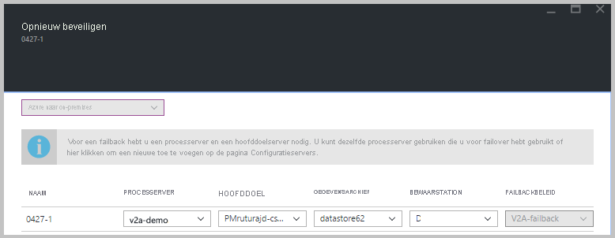

# Opnieuw beveiligen van Azure naar on-premises

Na een [failover](site-recovery-failover.md) van on-premises virtuele VMware-machines of fysieke servers naar Azure, is de eerste stap bij het uitvoeren van een failback naar uw on-premises site het opnieuw beveiligen van de Azure-vm's die zijn gemaakt tijdens de failover. In dit artikel wordt beschreven hoe u dit doet. 

## Voordat u begint

1. Volg de stappen in [dit artikel](vmware-azure-prepare-failback.md) om de beveiliging en failback voor te bereiden, inclusief het instellen van een proces server in Azure en een on-premises hoofddoel server, en het configureren van een site-naar-site-VPN, of ExpressRoute privé-peering, voor failback.
2. Zorg ervoor dat de on-premises configuratie server actief is en is verbonden met Azure. Tijdens een failover naar Azure is de on-premises site mogelijk niet toegankelijk en is de configuratie server mogelijk niet beschikbaar of afgesloten. Tijdens het failback moet de virtuele machine aanwezig zijn in de data base van de configuratie server. Anders mislukt de failback.
3. Verwijder alle moment opnamen op de on-premises hoofddoel server. Opnieuw beveiligen werkt niet als er moment opnamen zijn.  De moment opnamen op de virtuele machine worden automatisch samengevoegd tijdens een taak voor opnieuw beveiligen.
4. Als u Vm's die zijn verzameld in een replicatie groep opnieuw wilt beveiligen voor consistentie tussen meerdere VM'S, moet u ervoor zorgen dat ze allemaal hetzelfde besturings systeem (Windows of Linux) hebben en dat de hoofddoel server die u implementeert, hetzelfde type besturings systeem heeft. Alle virtuele machines in een replicatie groep moeten dezelfde hoofddoel server gebruiken.
5. Open [de vereiste poorten](vmware-azure-prepare-failback.md#ports-for-reprotectionfailback) voor failback.
6. Zorg ervoor dat de vCenter Server is verbonden vóór de failback. Als dat niet het geval is, ontkoppelt u schijven en koppelt u deze opnieuw aan de virtuele machine.
7. Als een vCenter-Server de Vm's beheert waarvoor u een failback wilt uitvoeren, moet u ervoor zorgen dat u over de vereiste machtigingen beschikt. Als u een alleen-lezen gebruikers-vCenter-detectie uitvoert en virtuele machines beveiligt, is de beveiliging geslaagd en werkt failover. Tijdens het opnieuw beveiligen mislukt de failover echter omdat de gegevens opslag niet kan worden gedetecteerd en niet wordt weer gegeven tijdens het opnieuw beveiligen. U kunt dit probleem oplossen door de vCenter-referenties bij te werken met de [juiste account/machtigingen](vmware-azure-tutorial-prepare-on-premises.md#prepare-an-account-for-automatic-discovery)en vervolgens de taak opnieuw uit te voeren. 
8. Als u een sjabloon hebt gebruikt om uw virtuele machines te maken, moet u ervoor zorgen dat elke virtuele machine een eigen UUID voor de schijven heeft. Als de UUID van de on-premises VM afstamt met de UUID van de hoofddoel server omdat beide zijn gemaakt op basis van dezelfde sjabloon, mislukt de beveiliging. Implementeren vanuit een andere sjabloon.
9. Als u niet terugkeert naar een alternatieve vCenter Server, moet u ervoor zorgen dat de nieuwe vCenter Server en de hoofddoel server worden gedetecteerd. Normaal gesp roken als de gegevens opslag niet toegankelijk zijn of niet zichtbaar zijn in opnieuw **beveiligen**.
10. Controleer de volgende scenario's waarin u geen failback kunt uitvoeren:
    - Als u gebruikmaakt van de ESXi 5,5 Free Edition of de gratis versie van vSphere 6 Hyper Visor. Voer een upgrade uit naar een andere versie.
    - Als u een fysieke server met Windows Server 2008 R2 SP1 hebt.
    - VMware-Vm's kunnen niet worden teruggedraaid naar Hyper-V.
    - Vm's die zijn [gemigreerd](migrate-overview.md#what-do-we-mean-by-migration).
    - Een virtuele machine die is verplaatst naar een andere resource groep.
    - Een replica van een virtuele machine van Azure die is verwijderd.
    - Een replica van een virtuele machine van Azure die niet is beveiligd (repliceren naar de on-premises site).
10. [Bekijk de typen failback](concepts-types-of-failback.md) die u kunt gebruiken-oorspronkelijke locatie herstel en herstel van alternatieve locaties.

## Opnieuw beveiligen inschakelen

Schakel replicatie in. U kunt specifieke Vm's of een herstel plan opnieuw beveiligen:

- Als u een herstel plan opnieuw beveiligt, moet u de waarden voor elke beveiligde machine opgeven.
- Als Vm's deel uitmaken van een replicatie groep voor consistentie tussen meerdere VM'S, kunnen ze alleen opnieuw worden beveiligd met een herstel plan. Vm's in een replicatie groep moeten dezelfde hoofddoel server gebruiken

### Voordat u begint

- Nadat een virtuele machine na een failover is opgestart in azure, duurt het enige tijd voordat de agent zich opnieuw heeft geregistreerd bij de configuratie server (Maxi maal 15 minuten). Gedurende deze tijd kunt u niet opnieuw beveiligen en wordt een fout bericht weer gegeven dat de agent niet is geïnstalleerd. Als dit het geval is, wacht u een paar minuten en vervolgens opnieuw beveiligen.
- Als u een back-up wilt maken van de virtuele machine van Azure naar een bestaande on-premises VM, koppelt u de on-premises VM-gegevens opslag items met lees-en schrijf toegang op de ESXi-host van de hoofddoel server.
- Als u een failback wilt uitvoeren naar een alternatieve locatie, bijvoorbeeld als de on-premises VM niet bestaat, selecteert u het Bewaar station en de gegevens opslag die zijn geconfigureerd voor de hoofddoel server. Wanneer u een failback naar de on-premises site maakt, gebruiken de virtuele VMware-machines in het failback-beveiligings plan dezelfde gegevens opslag als de hoofddoel server. Er wordt vervolgens een nieuwe VM gemaakt in vCenter.

Schakel de beveiliging als volgt in:

1. Selecteer de **kluis**  >  **gerepliceerde items**. Klik met de rechter muisknop op de virtuele machine waarvoor een failover is uitgevoerd en selecteer vervolgens **opnieuw beveiligen**. U kunt ook op de opdracht knoppen de machine selecteren en vervolgens **opnieuw beveiligen**selecteren.
2. Controleer of de **Azure to on-premises** richting van beveiliging is geselecteerd.
3. In **hoofddoel server** en **proces server**selecteert u de on-premises hoofddoel server en de proces server.  
4. Selecteer voor **gegevens opslag**de gegevens opslag waarnaar u de schijven on-premises wilt herstellen. Deze optie wordt gebruikt wanneer de on-premises virtuele machine wordt verwijderd en u moet nieuwe schijven maken. Deze optie wordt genegeerd als de schijven al bestaan. U moet nog een waarde opgeven.
5. Selecteer het Bewaar station.
6. Het failback-beleid wordt automatisch geselecteerd.
7. Selecteer **OK** om te beginnen met opnieuw beveiligen.

    
    
8. Een taak begint met het repliceren van de virtuele machine van Azure naar de on-premises site. U kunt de voortgang volgen op het tabblad **Taken**.
    - Wanneer de beveiliging is geslaagd, wordt de virtuele machine in een beveiligde staat gezet.
    - De on-premises VM wordt uitgeschakeld tijdens het opnieuw beveiligen. Dit helpt ervoor te zorgen dat gegevens tijdens de replicatie consistent blijven.
    - Schakel de on-premises VM niet in nadat de beveiliging is voltooid.
   

## Volgende stappen

- Als u problemen ondervindt, raadpleegt u het [artikel over probleem oplossing](vmware-azure-troubleshoot-failback-reprotect.md).
- Nadat de virtuele machines van Azure zijn beveiligd, kunt u [een failback uitvoeren](vmware-azure-failback.md). De virtuele machine van Azure wordt afgesloten en de on-premises VM wordt opgestart. Verwacht enige downtime voor de toepassing en kies een failback-tijd dienovereenkomstig.

