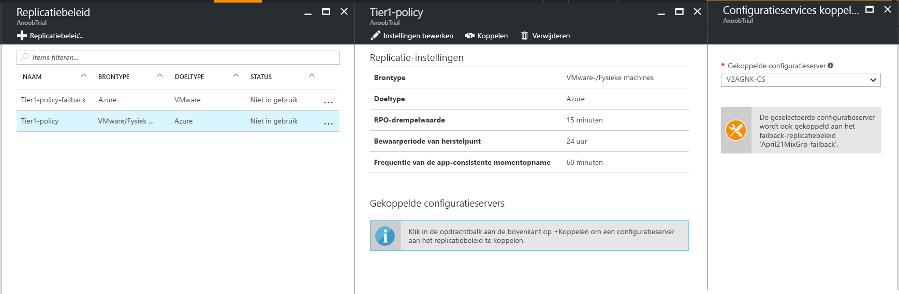
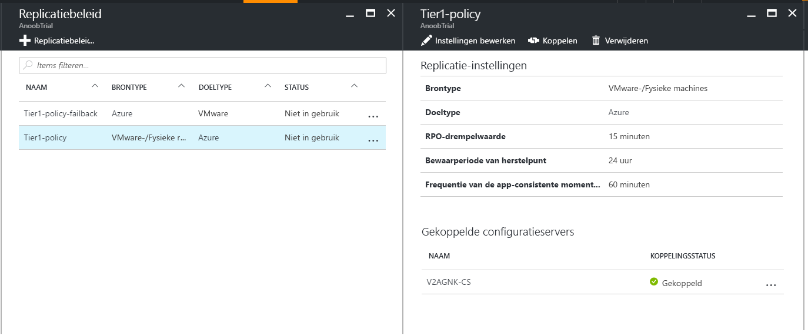

# Replicatie beleid configureren en beheren voor VMware-nood herstel

In dit artikel wordt beschreven hoe u een replicatie beleid configureert wanneer u virtuele VMware-machines naar Azure repliceert met behulp van [Azure site Recovery](site-recovery-overview.md).

## Beleid maken

1. Selecteer **Beheren** > **Infrastructuur voor Site Recovery**.
2. Selecteer in **voor VMware-en fysieke machines**, het **replicatie beleid**.
3. Klik op **+ replicatie beleid**en geef de naam van het beleid op.
4. Geef de limiet voor de RPO op bij **RPO-drempelwaarde**. Er worden waarschuwingen gegenereerd wanneer continue replicatie deze limiet overschrijdt.
5. Geef in **Bewaarperiode van het herstelpunt** de duur (in uren) op dat elk herstelpunt moet worden bewaard. Beveiligde machines kunnen binnen een bepaald tijdsvenster te allen tijde worden hersteld naar een willekeurig punt. Een bewaarperiode van maximaal 24 uur wordt ondersteund voor computers die worden gerepliceerd naar Premium Storage. Maxi maal 72 uur wordt ondersteund voor standaard opslag.
6. Kies in de frequentie van de **app-consistente moment opname**in de vervolg keuzelijst hoe vaak (in uren) herstel punten met toepassings consistente moment opnamen moeten worden gemaakt. Als u het genereren van toepassings consistentie punten wilt uitschakelen, kiest u waarde uit in de vervolg keuzelijst.
7. Klik op **OK**. Het beleid wordt binnen 30 seconden tot 60 minuut gemaakt.

Wanneer u een replicatie beleid maakt, wordt automatisch een bijbehorend failback-replicatie beleid gemaakt met het achtervoegsel ' failback '. Nadat u het beleid hebt gemaakt, kunt u dit bewerken door het te selecteren > **Instellingen bewerken**.

## Een configuratie server koppelen

Koppel het replicatie beleid aan uw on-premises configuratie server.

1. Klik op **koppelen**en selecteer de configuratie server.

    
2. Klik op **OK**. De configuratieserver wordt binnen één tot twee minuten gekoppeld.

    

## Een beleid bewerken

U kunt een replicatie beleid wijzigen nadat u het hebt gemaakt.

- Wijzigingen in het beleid worden toegepast op alle computers die het beleid gebruiken.
- Als u gerepliceerde machines met een ander replicatie beleid wilt koppelen, moet u de beveiliging voor de relevante computers uitschakelen en opnieuw inschakelen.

Bewerk een beleid als volgt:
1. Selecteer > **site Recovery-infra structuur** **beheren** > **replicatie beleid**.
2. Selecteer het replicatie beleid dat u wilt wijzigen.
3. Klik op **Instellingen bewerken**en werk de velden voor het bewaren van de RPO-drempel waarde/het herstel punt en de app-consistente moment opname frequentie in zoals vereist.
4. Als u het genereren van toepassings consistentie punten wilt uitschakelen, kiest u waarde uit in de vervolg keuzelijst van de frequentie van de **app-consistente moment opname**van het veld.
5. Klik op **Opslaan**. Het beleid moet worden bijgewerkt in 30 tot 60 seconden.

## Een replicatie beleid ontkoppelen of verwijderen

1. Kies het replicatie beleid.
    a. Als u het beleid van de configuratie server wilt ontkoppelen, moet u ervoor zorgen dat het beleid niet door gerepliceerde machines wordt gebruikt. Klik **vervolgens op**ontkoppelen.
    b. Als u het beleid wilt verwijderen, moet u ervoor zorgen dat het niet is gekoppeld aan een configuratie server. Klik vervolgens op **verwijderen**. Het duurt 30-60 seconden om te verwijderen.
2. Klik op **OK**.
