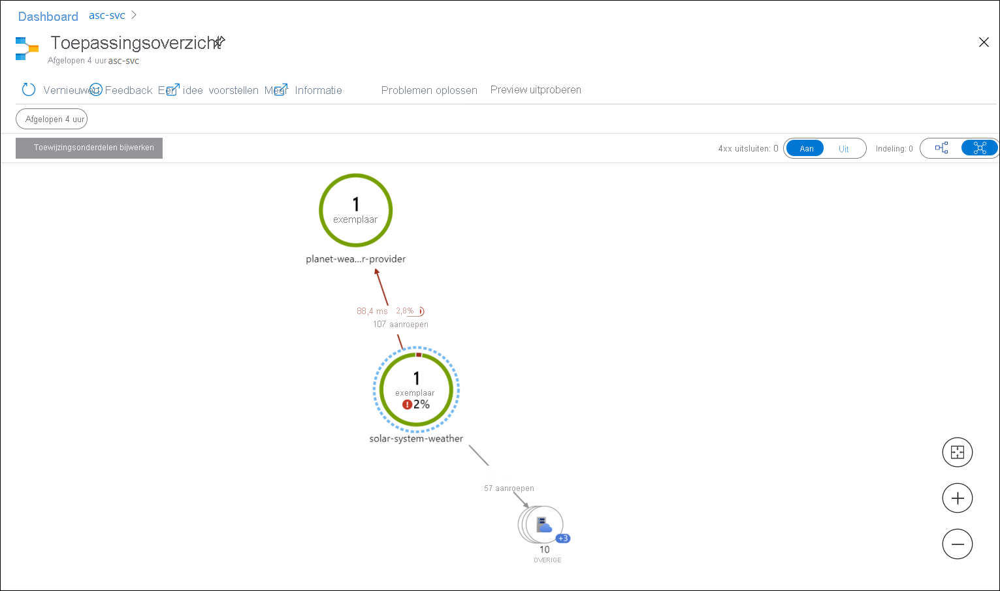
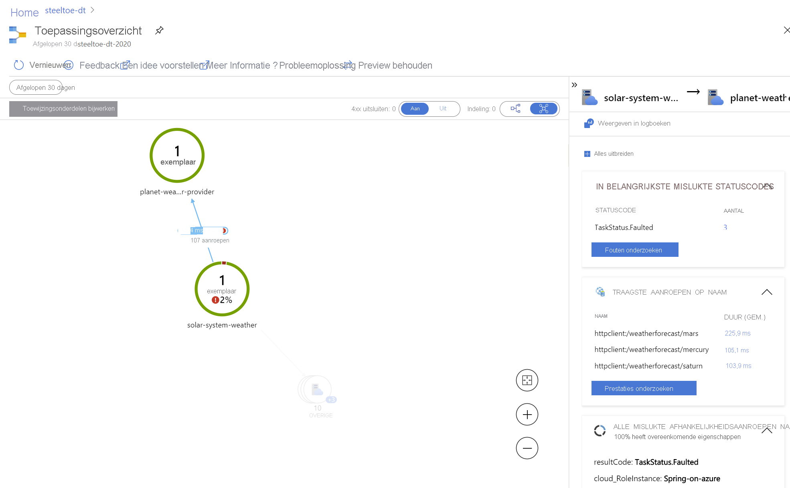

# <a name="quickstart-monitoring-azure-spring-cloud-apps-with-logs-metrics-and-tracing"></a>Quickstart: Azure Spring Cloud-apps bewaken met logboeken, metrische gegevens en tracering

::: zone pivot="programming-language-csharp"
Met de ingebouwde bewaking in Azure Spring Cloud kunt u complexe problemen opsporen en bewaken. Azure Spring Cloud integreert [gedistribueerde tracering](https://steeltoe.io/docs/3/tracing/distributed-tracing) van Steeltoe met [Application Insights](https://docs.microsoft.com/azure/azure-monitor/app/app-insights-overview) van Azure. Deze integratie biedt krachtige logboeken, metrische gegevens en functies voor gedistribueerde tracering via Azure Portal.

In de volgende procedures wordt uitgelegd hoe u logboekstreaming, logboekanalyse, metrische gegevens en gedistribueerde tracering gebruikt met de voorbeeld-app die u in de voorgaande quickstarts hebt geïmplementeerd.

## <a name="prerequisites"></a>Vereisten

* Voltooi de vorige quickstarts in deze reeks:

  * [Azure Spring Cloud-service inrichten](spring-cloud-quickstart-provision-service-instance.md).
  * [Azure Spring Cloud-configuratieserver instellen](spring-cloud-quickstart-setup-config-server.md).
  * [Apps bouwen en implementeren](spring-cloud-quickstart-deploy-apps.md).

## <a name="logs"></a>Logboeken

Er zijn twee manieren om logboeken in Azure Spring Cloud te bekijken: **Logboekstreaming** van realtime logboeken per app-instantie of **logboekanalyse** voor geaggregeerde logboeken met geavanceerde querymogelijkheden.

### <a name="log-streaming"></a>Logboekstreaming

U kunt logboekstreaming in de Azure CLI gebruiken met de volgende opdracht.

```azurecli
az spring-cloud app logs -n solar-system-weather -f
```

De uitvoer is vergelijkbaar met de uitvoer in het volgende voorbeeld:

```output
=> ConnectionId:0HM2HOMHT82UK => RequestPath:/weatherforecast RequestId:0HM2HOMHT82UK:00000003, SpanId:|e8c1682e-46518cc0202c5fd9., TraceId:e8c1682e-46518cc0202c5fd9, ParentId: => Microsoft.Azure.SpringCloud.Sample.SolarSystemWeather.Controllers.WeatherForecastController.Get (Microsoft.Azure.SpringCloud.Sample.SolarSystemWeather)
Executing action method Microsoft.Azure.SpringCloud.Sample.SolarSystemWeather.Controllers.WeatherForecastController.Get (Microsoft.Azure.SpringCloud.Sample.SolarSystemWeather) - Validation state: Valid
←[40m←[32minfo←[39m←[22m←[49m: Microsoft.Azure.SpringCloud.Sample.SolarSystemWeather.Controllers.WeatherForecastController[0]

=> ConnectionId:0HM2HOMHT82UK => RequestPath:/weatherforecast RequestId:0HM2HOMHT82UK:00000003, SpanId:|e8c1682e-46518cc0202c5fd9., TraceId:e8c1682e-46518cc0202c5fd9, ParentId: => Microsoft.Azure.SpringCloud.Sample.SolarSystemWeather.Controllers.WeatherForecastController.Get (Microsoft.Azure.SpringCloud.Sample.SolarSystemWeather)
Retrieved weather data from 4 planets
←[40m←[32minfo←[39m←[22m←[49m: Microsoft.AspNetCore.Mvc.Infrastructure.ControllerActionInvoker[2]

=> ConnectionId:0HM2HOMHT82UK => RequestPath:/weatherforecast RequestId:0HM2HOMHT82UK:00000003, SpanId:|e8c1682e-46518cc0202c5fd9., TraceId:e8c1682e-46518cc0202c5fd9, ParentId: => Microsoft.Azure.SpringCloud.Sample.SolarSystemWeather.Controllers.WeatherForecastController.Get (Microsoft.Azure.SpringCloud.Sample.SolarSystemWeather)
Executing ObjectResult, writing value of type 'System.Collections.Generic.KeyValuePair`2[[System.String, System.Private.CoreLib, Version=4.0.0.0, Culture=neutral, PublicKeyToken=7cec85d7bea7798e],[System.String, System.Private.CoreLib, Version=4.0.0.0, Culture=neutral, PublicKeyToken=7cec85d7bea7798e]][]'.
←[40m←[32minfo←[39m←[22m←[49m: Microsoft.AspNetCore.Mvc.Infrastructure.ControllerActionInvoker[2]
```

> [!TIP]
> Gebruik `az spring-cloud app logs -h` om meer parameters en functionaliteit van logboekstreaming te verkennen.

### <a name="log-analytics"></a>Log Analytics

1. Ga in de Azure-portal naar de pagina **service | Overzicht** en selecteer **Logboeken** in de sectie **Bewaking**. Selecteer **Uitvoeren** op een van de voorbeeldquery's voor Azure Spring Cloud.

   [  ](media/spring-cloud-quickstart-logs-metrics-tracing/logs-entry.png#lightbox)
    
1. Bewerk de query om de WHERE-componenten te verwijderen die de weergave beperken tot waarschuwings- en foutenlogboeken.

1. Selecteer vervolgens `Run`. De logboeken worden weergeven. Zie [Azure Log Analytics-documenten](https://docs.microsoft.com/azure/azure-monitor/log-query/get-started-queries) voor meer informatie over het schrijven van query's.

   [  ](media/spring-cloud-quickstart-logs-metrics-tracing/logs-query-steeltoe.png#lightbox)

## <a name="metrics"></a>Metrische gegevens

1. Ga in Azure Portal naar de pagina **service | Overzicht** en selecteer **Metrische gegevens** in de sectie **Bewaking**. Voeg uw eerste metrische gegevens toe door een van de metrische .NET-gegevens onder **Performance (.NET)** of **Request (.NET)** te selecteren in de vervolgkeuzelijst **Metrisch** en `Avg` voor **Aggregatie** om de tijdlijn voor deze metrische gegevens te bekijken.

   [  ](media/spring-cloud-quickstart-logs-metrics-tracing/metrics-basic-cpu-steeltoe.png#lightbox)
    
1. Klik in de werkbalk op **Filter toevoegen** en selecteer `App=solar-system-weather` om het CPU-gebruik voor alleen de app **solar-system-weather** te bekijken.

   [  ](media/spring-cloud-quickstart-logs-metrics-tracing/metrics-filter-steeltoe.png#lightbox)

1. Sluit het in de vorige stap gemaakte filter, selecteer **Splitsing toepassen** en selecteer `App` voor **Waarden** om het CPU-gebruik door verschillende apps te bekijken.

   [  ](media/spring-cloud-quickstart-logs-metrics-tracing/metrics-split-steeltoe.png#lightbox)

## <a name="distributed-tracing"></a>Gedistribueerde tracering

1. Ga in Azure Portal naar de pagina **service | Overzicht** en selecteer **Gedistribueerde tracering** in de sectie **Bewaking**. Selecteer vervolgens aan de rechterkant het tabblad **Toepassingsoverzicht weergeven**.

   [  ](media/spring-cloud-quickstart-logs-metrics-tracing/tracing-entry.png#lightbox)

1. U ziet nu de status van aanroepen tussen apps. 

   [  ](media/spring-cloud-quickstart-logs-metrics-tracing/tracing-overview-steeltoe.png#lightbox)
    
1. Selecteer de koppeling tussen **solar-system-weather** en **planet-weather-provider** om meer details te zien, zoals langzaamste aanroepen door HTTP-methoden.

   [  ](media/spring-cloud-quickstart-logs-metrics-tracing/tracing-call-steeltoe.png#lightbox)
    
1. Selecteer ten slotte **Prestaties onderzoeken** om krachtigere, ingebouwde prestatieanalyse te verkennen.

   [  ](media/spring-cloud-quickstart-logs-metrics-tracing/tracing-performance-steeltoe.png#lightbox)
::: zone-end

::: zone pivot="programming-language-java"
Met de ingebouwde bewaking in Azure Spring Cloud kunt u complexe problemen opsporen en bewaken. Azure Spring Cloud integreert [Spring Cloud Sleuth](https://spring.io/projects/spring-cloud-sleuth) met [Application Insights](https://docs.microsoft.com/azure/azure-monitor/app/app-insights-overview) van Azure. Deze integratie biedt krachtige logboeken, metrische gegevens en functies voor gedistribueerde tracering via Azure Portal. In de volgende procedures wordt uitgelegd hoe u logboekstreaming, logboekanalyse, metrische gegevens en gedistribueerde tracering gebruikt met geïmplementeerde PiggyMetrics-apps.

## <a name="prerequisites"></a>Vereisten

Voltooiing van de vorige stappen: 

* [Een exemplaar van Azure Spring Cloud inrichten](spring-cloud-quickstart-provision-service-instance.md)
* [De configuratieserver instellen](spring-cloud-quickstart-setup-config-server.md)
* [Apps bouwen en implementeren](spring-cloud-quickstart-deploy-apps.md).

## <a name="logs"></a>Logboeken

Er zijn twee manieren om logboeken in Azure Spring Cloud te bekijken: **Logboekstreaming** van realtime logboeken per app-instantie of **logboekanalyse** voor geaggregeerde logboeken met geavanceerde querymogelijkheden.

### <a name="log-streaming"></a>Logboekstreaming

#### <a name="cli"></a>[CLI](#tab/Azure-CLI)

U kunt logboekstreaming in de Azure CLI gebruiken met de volgende opdracht.

```azurecli
az spring-cloud app logs -s <service instance name> -g <resource group name> -n gateway -f
```

U ziet logboeken zoals het volgende:

[  ](media/spring-cloud-quickstart-logs-metrics-tracing/logs-streaming-cli.png#lightbox)

> [!TIP]
> Gebruik `az spring-cloud app logs -h` om meer parameters en de functionaliteiten van logboekstreaming te verkennen.

#### <a name="intellij"></a>[IntelliJ](#tab/IntelliJ)

De logboeken ophalen met behulp van Azure-toolkit voor IntelliJ:

1. Selecteer **Azure Explorer**  en **Spring Cloud**.

1. Klik met de rechtermuisknop op de app die wordt uitgevoerd.

1. Selecteer **Streaminglogboeken** in de vervolgkeuzelijst.

   
    
1. Selecteer **Exemplaar**.

   
    
1. Het streaminglogboek wordt weergegeven in het uitvoervenster.

   

---
### <a name="log-analytics"></a>Log Analytics

1. Ga naar de pagina **service | Overzicht** en selecteer **Logboeken** in de sectie **Bewaking**. Klik op een van de voorbeeldquery's voor Azure Spring Cloud op **Uitvoeren**. 

   [  ](media/spring-cloud-quickstart-logs-metrics-tracing/logs-entry.png#lightbox)
    
1. Vervolgens worden gefilterde logboeken weergegeven. Zie [Azure Log Analytics-documenten](https://docs.microsoft.com/azure/azure-monitor/log-query/get-started-queries) voor meer informatie over het schrijven van query's.

   [  ](media/spring-cloud-quickstart-logs-metrics-tracing/logs-query.png#lightbox)

## <a name="metrics"></a>Metrische gegevens

1. Ga naar de pagina **service | Overzicht** en selecteer **Metrische gegevens** in de sectie **Bewaking**. Voeg uw eerste meetwaarde toe door `system.cpu.usage` voor **Meetwaarde** en `Avg` voor **Aggregatie** te selecteren om de tijdlijn voor het totale CPU-gebruik te bekijken.

   [  ](media/spring-cloud-quickstart-logs-metrics-tracing/metrics-basic-cpu.png#lightbox)
    
1. Klik in de werkbalk hierboven op **Filter toevoegen**, selecteer `App=Gateway` om het CPU-gebruik voor alleen de **gateway**-app te bekijken.

   [  ](media/spring-cloud-quickstart-logs-metrics-tracing/metrics-filter.png#lightbox)

1. Sluit het eerder gemaakte filter, klik op **Splitsing toepassen** en selecteer `App` voor **Waarden** om het CPU-gebruik door verschillende apps te bekijken.

   [  ](media/spring-cloud-quickstart-logs-metrics-tracing/metrics-split.png#lightbox)

## <a name="distributed-tracing"></a>Gedistribueerde tracering

1. Ga naar de pagina **service | Overzicht** en selecteer **Gedistribueerde tracering** in de sectie **Bewaking**. Klik vervolgens op het tabblad **Toepassingsoverzicht weergeven** aan de rechterkant.

   [  ](media/spring-cloud-quickstart-logs-metrics-tracing/tracing-entry.png#lightbox)

1. U kunt nu de status van aanroepen zien tussen Piggymetrics-apps. 

   [  ](media/spring-cloud-quickstart-logs-metrics-tracing/tracing-overview.png#lightbox)
    
1. Klik op de koppeling tussen **gateway** en **account-service** om meer details weer te geven, zoals traagste aanroepen via HTTP-methoden.

   [  ](media/spring-cloud-quickstart-logs-metrics-tracing/tracing-call.png#lightbox)
    
1. Klik ten slotte op **Prestaties onderzoeken** om krachtigere, ingebouwde prestatieanalyse te verkennen.

   [  ](media/spring-cloud-quickstart-logs-metrics-tracing/tracing-performance.png#lightbox)

::: zone-end

## <a name="clean-up-resources"></a>Resources opschonen

In deze quickstarts hebt u Azure-resources gemaakt waarmee de kosten blijven toenemen als de resources in uw abonnement blijven. Als u deze resources niet meer nodig denkt te hebben, verwijdert u de resourcegroep via de portal of door de volgende opdracht in Cloud Shell uit te voeren:

```azurecli
az group delete --name <your resource group name; for example: helloworld-1558400876966-rg> --yes
```

In een voorgaande quickstart hebt u ook de standaardnaam van de resourcegroep ingesteld. Als u niet van plan bent om door te gaan naar de volgende quickstart, wist u die standaardinstelling door de volgende CLI-opdracht uit te voeren:

```azurecli
az configure --defaults group=
```

## <a name="next-steps"></a>Volgende stappen

Voor meer bewakingsmogelijkheden van Azure Spring Cloud raadpleegt u:

> [!div class="nextstepaction"]
> [Diagnostische services](diagnostic-services.md)
>
> [Gedistribueerde tracering](spring-cloud-tutorial-distributed-tracing.md)
>
> [Logboeken in real-time streamen](spring-cloud-howto-log-streaming.md)
