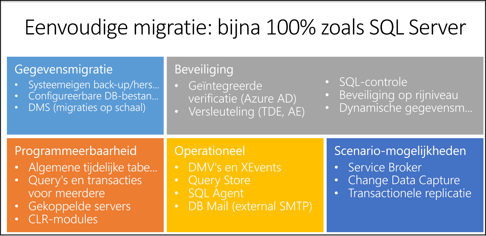

# <a name="managed-instance-t-sql-differences-limitations-and-known-issues"></a>T-SQL-verschillen, beperkingen en bekende problemen met beheerde exemplaren

In dit artikel vindt u een overzicht van de verschillen in de syntaxis en het gedrag tussen Azure SQL Database beheerde instantie en de on-premises SQL Server data base-engine. De implementatie optie Managed instance biedt hoge compatibiliteit met on-premises SQL Server data base-engine. De meeste functies van de SQL Server data base-engine worden ondersteund in een beheerd exemplaar.



Er zijn enkele PaaS-beperkingen die worden geïntroduceerd in een beheerde instantie en sommige gedrags wijzigingen vergeleken met SQL Server. De verschillen zijn onderverdeeld in de volgende categorieën:<a name="Differences"></a>

- [Beschik baarheid](#availability) omvat de verschillen in [altijd](#always-on-availability) en [back-ups](#backup).
- [Beveiliging](#security) omvat de verschillen in [controle](#auditing), [certificaten](#certificates), [referenties](#credential), [cryptografische providers](#cryptographic-providers), [aanmeldingen en gebruikers](#logins-and-users), en de [Service sleutel en service hoofd sleutel](#service-key-and-service-master-key).
- De [configuratie](#configuration) bevat de verschillen [in de buffergroepuitbreiding](#buffer-pool-extension), [sortering](#collation), [compatibiliteits niveaus](#compatibility-levels), [database spiegeling](#database-mirroring), [database opties](#database-options), [SQL Server Agent](#sql-server-agent)en [tabel opties](#tables).
- De [functies](#functionalities) omvatten [Bulk Insert/OPENROWSET](#bulk-insert--openrowset), [CLR](#clr), [DBCC](#dbcc), [Distributed trans actions](#distributed-transactions), [Extended Events](#extended-events), [externe bibliotheken](#external-libraries), [FileStream en bestands tabel](#filestream-and-filetable), [volledige tekst Semantisch zoeken](#full-text-semantic-search), [gekoppelde servers](#linked-servers), [poly base](#polybase), [replicatie](#replication), [herstel](#restore-statement), [Service Broker](#service-broker), [opgeslagen procedures, functies en triggers](#stored-procedures-functions-and-triggers).
- [Omgevings instellingen](#Environment) , zoals VNets en subnet-configuraties.

De meeste van deze functies zijn architectuur beperkingen en vertegenwoordigen service onderdelen.

Op deze pagina worden ook [tijdelijke bekende problemen](#Issues) beschreven die worden gedetecteerd in een beheerd exemplaar, die in de toekomst worden opgelost.

## <a name="availability"></a>Beschikbaarheid

### <a name="always-on-availability"></a>Altijd aan

[Hoge Beschik baarheid](sql-database-high-availability.md) is ingebouwd in een beheerd exemplaar en kan niet worden beheerd door gebruikers. De volgende instructies worden niet ondersteund:

- [EIND PUNT MAKEN... VOOR DATABASE_MIRRORING](/sql/t-sql/statements/create-endpoint-transact-sql)
- [BESCHIKBAARHEIDS GROEP MAKEN](/sql/t-sql/statements/create-availability-group-transact-sql)
- [ALTER AVAILABILITY GROUP](/sql/t-sql/statements/alter-availability-group-transact-sql)
- [BESCHIKBAARHEIDS GROEP NEERZETTEN](/sql/t-sql/statements/drop-availability-group-transact-sql)
- De [set HADR](/sql/t-sql/statements/alter-database-transact-sql-set-hadr) -component van de instructie [ALTER data base](/sql/t-sql/statements/alter-database-transact-sql)

### <a name="backup"></a>Backup

Beheerde exemplaren hebben automatische back-ups, zodat gebruikers volledige data bases kunnen maken `COPY_ONLY` back-ups. Differentiële back-ups, logboek bestanden en moment opnamen van bestands momentopnamen worden niet ondersteund.

- Met een beheerd exemplaar kunt u een back-up maken van een exemplaar database alleen naar een Azure Blob Storage-account:
  - Alleen `BACKUP TO URL` wordt ondersteund.
  - `FILE`, `TAPE`en back-upapparaten worden niet ondersteund.
- De meeste algemene `WITH`-opties worden ondersteund.
  - `COPY_ONLY` is verplicht.
  - `FILE_SNAPSHOT` wordt niet ondersteund.
  - Tape opties: `REWIND`, `NOREWIND`, `UNLOAD`en `NOUNLOAD` worden niet ondersteund.
  - Opties die specifiek zijn voor het logboek: `NORECOVERY`, `STANDBY`en `NO_TRUNCATE` worden niet ondersteund.

Beperkingen: 

- Met een beheerd exemplaar kunt u een back-up maken van een exemplaar database met Maxi maal 32 stroken, die voldoende is voor data bases tot 4 TB als back-upcompressie wordt gebruikt.
- U kunt `BACKUP DATABASE ... WITH COPY_ONLY` niet uitvoeren op een Data Base die is versleuteld met door service beheerde Transparent Data Encryption (TDE). Door service beheerde TDE zorgt ervoor dat back-ups worden versleuteld met een interne TDE-sleutel. De sleutel kan niet worden geëxporteerd, dus u kunt de back-up niet herstellen. Gebruik automatische back-ups en herstel naar een bepaald tijdstip, of gebruik in plaats daarvan door de [klant beheerde (BYOK) TDe](transparent-data-encryption-azure-sql.md#customer-managed-transparent-data-encryption---bring-your-own-key) . U kunt versleuteling ook uitschakelen voor de data base.
- De maximale grootte van de back-upstripe met behulp van de `BACKUP`-opdracht in een beheerd exemplaar is 195 GB. Dit is de maximale grootte van de blob. Verhoog het aantal Stripes in de back-upopdracht om de afzonderlijke Stripe-grootte te verminderen en binnen deze limiet te blijven.

    > [!TIP]
    > Als u een back-up van een Data Base maakt vanuit een van SQL Server in een on-premises omgeving of op een virtuele machine, kunt u het volgende doen om deze beperking te omzeilen:
    >
    > - Maak een back-up naar `DISK` in plaats van een back-up te maken naar `URL`.
    > - Upload de back-upbestanden naar de Blob-opslag.
    > - Herstel naar het beheerde exemplaar.
    >
    > De `Restore` opdracht in een beheerd exemplaar ondersteunt grotere BLOB-grootten in de back-upbestanden omdat een ander type BLOB wordt gebruikt voor het opslaan van de geüploade back-upbestanden.

Zie [back-up](/sql/t-sql/statements/backup-transact-sql)voor informatie over back-ups met behulp van T-SQL.

## <a name="security"></a>Beveiliging

### <a name="auditing"></a>Controleren

De belangrijkste verschillen tussen controles in data bases in Azure SQL Database en data bases in SQL Server zijn:

- Met de implementatie optie Managed instance in Azure SQL Database werkt auditing op server niveau. De `.xel`-logboek bestanden worden opgeslagen in Azure Blob-opslag.
- Met de implementatie opties voor één data base en elastische pool in Azure SQL Database werkt auditing op het niveau van de data base.
- Bij SQL Server on-premises of virtuele machines werkt auditing op server niveau. Gebeurtenissen worden opgeslagen in gebeurtenis logboeken van het bestands systeem of Windows.
 
XEvent-controle in een beheerd exemplaar ondersteunt Azure Blob-opslag doelen. Bestands-en Windows-logboeken worden niet ondersteund.

De belangrijkste verschillen in de `CREATE AUDIT` syntaxis voor de controle van Azure Blob-opslag zijn:

- Er wordt een nieuwe syntaxis `TO URL` opgegeven die u kunt gebruiken om de URL op te geven van de Azure Blob Storage-container waarin de `.xel` bestanden worden geplaatst.
- De syntaxis `TO FILE` wordt niet ondersteund omdat een beheerd exemplaar geen toegang krijgt tot Windows-bestands shares.

Ga voor meer informatie naar: 

- [SERVER CONTROLE MAKEN](/sql/t-sql/statements/create-server-audit-transact-sql) 
- [ALTER SERVER AUDIT](/sql/t-sql/statements/alter-server-audit-transact-sql)
- [Controle](/sql/relational-databases/security/auditing/sql-server-audit-database-engine)

### <a name="certificates"></a>Certificaten

Een beheerd exemplaar heeft geen toegang tot bestands shares en Windows-mappen, dus de volgende beperkingen zijn van toepassing:

- Het `CREATE FROM`/`BACKUP TO`-bestand wordt niet ondersteund voor certificaten.
- Het `CREATE`/`BACKUP` certificaat van `FILE`/`ASSEMBLY` wordt niet ondersteund. Persoonlijke sleutel bestanden kunnen niet worden gebruikt. 

Zie [certificaat](/sql/t-sql/statements/create-certificate-transact-sql) en [back-upcertificaat](/sql/t-sql/statements/backup-certificate-transact-sql)maken. 
 
**Tijdelijke oplossing**: in plaats van het maken van een back-up van het certificaat en het herstellen van de back-up, [de binaire inhoud en de persoonlijke sleutel van het certificaat op te halen, deze op te slaan als. SQL-bestand en te maken](/sql/t-sql/functions/certencoded-transact-sql#b-copying-a-certificate-to-another-database)

```sql
CREATE CERTIFICATE  
   FROM BINARY = asn_encoded_certificate
WITH PRIVATE KEY (<private_key_options>)
```

### <a name="credential"></a>Referentie

Alleen Azure Key Vault-en `SHARED ACCESS SIGNATURE`-identiteiten worden ondersteund. Windows-gebruikers worden niet ondersteund.

Zie [referentie maken](/sql/t-sql/statements/create-credential-transact-sql) en [referenties wijzigen](/sql/t-sql/statements/alter-credential-transact-sql).

### <a name="cryptographic-providers"></a>Cryptografische providers

Een beheerd exemplaar heeft geen toegang tot bestanden, zodat er geen cryptografische providers kunnen worden gemaakt:

- `CREATE CRYPTOGRAPHIC PROVIDER` wordt niet ondersteund. Zie [Cryptografische provider maken](/sql/t-sql/statements/create-cryptographic-provider-transact-sql).
- `ALTER CRYPTOGRAPHIC PROVIDER` wordt niet ondersteund. Zie [ALTER CRYPTOGRAPHIC provider](/sql/t-sql/statements/alter-cryptographic-provider-transact-sql).

### <a name="logins-and-users"></a>Aanmeldingen en gebruikers

- SQL-aanmeldingen die zijn gemaakt met behulp van `FROM CERTIFICATE`, `FROM ASYMMETRIC KEY`en `FROM SID` worden ondersteund. Zie [login maken](/sql/t-sql/statements/create-login-transact-sql).
- Azure Active Directory (Azure AD) server-principals (aanmeldingen) die zijn gemaakt met de syntaxis voor het maken van een [aanmelding](/sql/t-sql/statements/create-login-transact-sql?view=azuresqldb-mi-current) of de syntaxis voor het [maken van een gebruiker op basis van aanmelding [Azure AD login]](/sql/t-sql/statements/create-user-transact-sql?view=azuresqldb-mi-current) worden ondersteund. Deze aanmeldingen worden gemaakt op server niveau.

    Het beheerde exemplaar ondersteunt Azure AD-databaseprincipal met de syntaxis `CREATE USER [AADUser/AAD group] FROM EXTERNAL PROVIDER`. Deze functie is ook bekend als Azure AD, Inge sloten database gebruikers.

- Windows-aanmeldingen die zijn gemaakt met de `CREATE LOGIN ... FROM WINDOWS` syntaxis worden niet ondersteund. Gebruik Azure Active Directory aanmeldingen en gebruikers.
- De Azure AD-gebruiker die het exemplaar heeft gemaakt, heeft [onbeperkte beheerders bevoegdheden](sql-database-manage-logins.md#unrestricted-administrative-accounts).
- Gebruikers die geen beheerder zijn, kunnen Azure AD-data bases op database niveau maken met behulp van de `CREATE USER ... FROM EXTERNAL PROVIDER` syntaxis. Zie [gebruiker maken... VAN externe PROVIDER](sql-database-manage-logins.md#non-administrator-users).
- Azure AD server-principals (aanmeldingen) bieden alleen ondersteuning voor SQL-functies binnen één Managed instance. Functies waarvoor cross-instance interacties zijn vereist, ongeacht of deze zich binnen dezelfde Azure AD-Tenant of andere tenants bevinden, worden niet ondersteund voor Azure AD-gebruikers. Voor beelden van deze functies zijn:

  - SQL transactionele replicatie.
  - Koppelings server.

- Het instellen van een Azure AD-aanmelding die is toegewezen aan een Azure AD-groep, wordt niet ondersteund voor de eigenaar van de data base.
- Imitatie van Azure AD-principals op server niveau met behulp van andere Azure AD-principals wordt ondersteund, zoals de component [Execute as](/sql/t-sql/statements/execute-as-transact-sql) . UITVOEREN als beperkingen zijn:

  - UITVOEREN als gebruiker wordt niet ondersteund voor Azure AD-gebruikers wanneer de naam verschilt van de aanmeldings naam. Een voor beeld hiervan is wanneer de gebruiker wordt gemaakt via de syntaxis CREATE USER [myAadUser] FROM LOGIN [john@contoso.com] en imitatie wordt geprobeerd via de opdracht USER = _myAadUser_. Wanneer u een **gebruiker** maakt op basis van een Azure ad server-principal (aanmelden), geeft u de user_name op als dezelfde login_name van de **aanmelding**.
  - Alleen de principals op het SQL Server niveau (aanmeldingen) die deel uitmaken van de `sysadmin` rol kunnen de volgende bewerkingen uitvoeren die zijn gericht op Azure AD-principals:

    - EXECUTE AS USER
    - EXECUTE AS LOGIN

- Het exporteren/importeren van een Data Base met Bacpac-bestanden wordt ondersteund voor Azure AD-gebruikers in een beheerd exemplaar met behulp van [SSMS v 18.4 of hoger](/sql/ssms/download-sql-server-management-studio-ssms), of met [SQLPackage. exe](/sql/tools/sqlpackage-download).
  - De volgende configuraties worden ondersteund met behulp van het Bacpac-bestand van de Data Base: 
    - Een Data Base tussen verschillende beheer exemplaren binnen hetzelfde Azure AD-domein exporteren/importeren.
    - Een Data Base uit een beheerd exemplaar exporteren en importeren in SQL Database binnen hetzelfde Azure AD-domein. 
    - Een Data Base uit SQL Database exporteren en importeren in een beheerd exemplaar binnen hetzelfde Azure AD-domein.
    - Een Data Base uit een beheerd exemplaar exporteren en importeren in SQL Server (versie 2012 of hoger).
      - In deze configuratie worden alle Azure AD-gebruikers gemaakt als SQL database-principals (gebruikers) zonder aanmeldingen. Het type gebruikers wordt weer gegeven als SQL (zichtbaar als SQL_USER in sys. database_principals). De machtigingen en rollen blijven aanwezig in de meta gegevens van de data base van SQL Server en kunnen worden gebruikt voor imitatie. Ze kunnen echter niet worden gebruikt voor toegang tot en aanmelding bij de SQL Server met behulp van hun referenties.

- Alleen de principal-aanmelding op server niveau, die wordt gemaakt door het proces van het inrichten van het beheerde exemplaar, leden van de server functies, zoals `securityadmin` of `sysadmin`, of andere aanmeldingen waarbij elke AANMELDINGS machtiging op server niveau wordt gewijzigd, kan Azure AD-server maken principals (aanmeldingen) in de hoofd database voor een beheerd exemplaar.
- Als de aanmelding een SQL-principal is, kunnen alleen aanmeldingen die deel uitmaken van de functie `sysadmin`, de opdracht maken gebruiken om aanmeldingen voor een Azure AD-account in te stellen.
- De Azure AD-aanmelding moet lid zijn van een Azure AD in dezelfde map die wordt gebruikt voor Azure SQL Database Managed instance.
- Azure AD server-principals (aanmeldingen) zijn zichtbaar in Objectverkenner vanaf SQL Server Management Studio 18,0 Preview 5.
- Het is niet toegestaan Azure AD-server-principals (aanmeldingen) te overlappen met een Azure AD-beheerders account. Azure AD server-principals (aanmeldingen) hebben voor rang op de Azure AD-beheerder wanneer u de principal oplost en machtigingen toepast op het beheerde exemplaar.
- Tijdens de verificatie wordt de volgende reeks toegepast om de verificatie-principal op te lossen:

    1. Als het Azure AD-account is gekoppeld aan de principal van de Azure AD-server (aanmelden), dat aanwezig is in sys. server_principals als type "E," toegang verlenen en machtigingen Toep assen van de Azure AD server-principal (aanmelden).
    2. Als het Azure AD-account lid is van een Azure AD-groep die is toegewezen aan de Azure AD-server principal (login), die aanwezig is in sys. server_principals als type X, toegang verlenen en machtigingen Toep assen van de aanmelding van de Azure AD-groep.
    3. Als het Azure AD-account een speciaal door de portal geconfigureerde Azure AD-beheerder voor het beheerde exemplaar is, dat niet bestaat in de beheer weergaven van het beheerde exemplaar, moet u speciale vaste machtigingen van de Azure AD-beheerder voor het beheerde exemplaar (legacy-modus) Toep assen.
    4. Als het Azure AD-account is gekoppeld aan een Azure AD-gebruiker in een Data Base die aanwezig is in sys. database_principals als type "E," toegang verlenen en machtigingen Toep assen van de gebruiker van de Azure AD-data base.
    5. Als het Azure AD-account lid is van een Azure AD-groep die is toegewezen aan een Azure AD-gebruiker in een Data Base, die aanwezig is in sys. database_principals als type X, toegang verlenen en machtigingen Toep assen van de aanmelding van de Azure AD-groep.
    6. Als er een Azure AD-aanmelding is toegewezen aan een Azure AD-gebruikers account of een Azure AD-groeps account, die wordt omgezet naar de gebruiker die de verificatie uitvoert, worden alle machtigingen van deze Azure AD-aanmelding toegepast.

### <a name="service-key-and-service-master-key"></a>Service sleutel en service hoofd sleutel

- [Back-up van hoofd sleutel](/sql/t-sql/statements/backup-master-key-transact-sql) wordt niet ondersteund (beheerd door SQL database-service).
- Het terugzetten van de [hoofd sleutel](/sql/t-sql/statements/restore-master-key-transact-sql) wordt niet ondersteund (beheerd door de SQL database-service).
- De [back-up van de service hoofd sleutel](/sql/t-sql/statements/backup-service-master-key-transact-sql) wordt niet ondersteund (beheerd door SQL database-service).
- Het herstellen van de [service hoofd sleutel](/sql/t-sql/statements/restore-service-master-key-transact-sql) wordt niet ondersteund (beheerd door de SQL database-service).

## <a name="configuration"></a>Configuratie

### <a name="buffer-pool-extension"></a>Extensie van buffer groep

- De [buffergroepuitbreiding](/sql/database-engine/configure-windows/buffer-pool-extension) wordt niet ondersteund.
- `ALTER SERVER CONFIGURATION SET BUFFER POOL EXTENSION` wordt niet ondersteund. Zie [ALTER Server Configuration](/sql/t-sql/statements/alter-server-configuration-transact-sql).

### <a name="collation"></a>Serverconfiguratie

De standaard sortering van exemplaren is `SQL_Latin1_General_CP1_CI_AS` en kan worden opgegeven als een aanmaak parameter. Zie [sorteringen](/sql/t-sql/statements/collations).

### <a name="compatibility-levels"></a>Compatibiliteitsniveaus

- Ondersteunde compatibiliteits niveaus zijn 100, 110, 120, 130, 140 en 150.
- Compatibiliteits niveaus onder 100 worden niet ondersteund.
- Het standaard compatibiliteits niveau voor nieuwe data bases is 140. Voor herstelde data bases blijft het compatibiliteits niveau ongewijzigd als het 100 en hoger.

Zie [ALTER data base Compatibility Level](/sql/t-sql/statements/alter-database-transact-sql-compatibility-level).

### <a name="database-mirroring"></a>Databasespiegeling

Het spie gelen van data bases wordt niet ondersteund.

- opties voor `ALTER DATABASE SET PARTNER` en `SET WITNESS` worden niet ondersteund.
- `CREATE ENDPOINT … FOR DATABASE_MIRRORING` wordt niet ondersteund.

Zie [ALTER data base set partner en Witness instellen](/sql/t-sql/statements/alter-database-transact-sql-database-mirroring) en ENDPOINT maken voor meer informatie [. VOOR DATABASE_MIRRORING](/sql/t-sql/statements/create-endpoint-transact-sql).

### <a name="database-options"></a>Database opties

- Meerdere logboek bestanden worden niet ondersteund.
- In-Memory-objecten worden niet ondersteund in de servicelaag Algemeen. 
- Er is een limiet van 280 bestanden per Algemeen-exemplaar, wat een maximum van 280 bestanden per data base impliceert. De gegevens en logboek bestanden in de laag Algemeen worden meegeteld bij deze limiet. [De laag bedrijfskritiek ondersteunt 32.767 bestanden per data base](https://docs.microsoft.com/azure/sql-database/sql-database-managed-instance-resource-limits#service-tier-characteristics).
- De data base mag geen bestands groepen bevatten die FileStream-gegevens bevatten. Herstellen mislukt als. bak `FILESTREAM` gegevens bevat. 
- Elk bestand wordt in Azure Blob-opslag geplaatst. I/o en door Voer per bestand zijn afhankelijk van de grootte van elk afzonderlijk bestand.

#### <a name="create-database-statement"></a>Instructie CREATE data base

De volgende beperkingen zijn van toepassing op `CREATE DATABASE`:

- Bestanden en bestands groepen kunnen niet worden gedefinieerd. 
- De optie `CONTAINMENT` wordt niet ondersteund. 
- `WITH` opties worden niet ondersteund. 
   > [!TIP]
   > Als tijdelijke oplossing gebruikt u `ALTER DATABASE` na `CREATE DATABASE` om database opties in te stellen om bestanden toe te voegen of containment in te stellen. 

- De optie `FOR ATTACH` wordt niet ondersteund.
- De optie `AS SNAPSHOT OF` wordt niet ondersteund.

Zie [Create Data Base](/sql/t-sql/statements/create-database-sql-server-transact-sql)(Engelstalig) voor meer informatie.

#### <a name="alter-database-statement"></a>Instructie ALTER data base

Sommige bestands eigenschappen kunnen niet worden ingesteld of gewijzigd:

- Er kan geen bestandspad worden opgegeven in de `ALTER DATABASE ADD FILE (FILENAME='path')` T-SQL-instructie. Verwijder `FILENAME` uit het script omdat een beheerd exemplaar automatisch de bestanden plaatst. 
- Een bestands naam kan niet worden gewijzigd met behulp van de `ALTER DATABASE`-instructie.

De volgende opties zijn standaard ingesteld en kunnen niet worden gewijzigd:

- `MULTI_USER`
- `ENABLE_BROKER ON`
- `AUTO_CLOSE OFF`

De volgende opties kunnen niet worden gewijzigd:

- `AUTO_CLOSE`
- `AUTOMATIC_TUNING(CREATE_INDEX=ON|OFF)`
- `AUTOMATIC_TUNING(DROP_INDEX=ON|OFF)`
- `DISABLE_BROKER`
- `EMERGENCY`
- `ENABLE_BROKER`
- `FILESTREAM`
- `HADR`
- `NEW_BROKER`
- `OFFLINE`
- `PAGE_VERIFY`
- `PARTNER`
- `READ_ONLY`
- `RECOVERY BULK_LOGGED`
- `RECOVERY_SIMPLE`
- `REMOTE_DATA_ARCHIVE` 
- `RESTRICTED_USER`
- `SINGLE_USER`
- `WITNESS`

Zie [ALTER data base](/sql/t-sql/statements/alter-database-transact-sql-file-and-filegroup-options)(Engelstalig) voor meer informatie.

### <a name="sql-server-agent"></a>SQL Server Agent

- Het in-en uitschakelen van SQL Server Agent wordt momenteel niet ondersteund in een beheerd exemplaar. SQL Agent wordt altijd uitgevoerd.
- SQL Server Agent-instellingen zijn alleen-lezen. De procedure `sp_set_agent_properties` wordt niet ondersteund in een beheerd exemplaar. 
- Taken
  - T-SQL-taak stappen worden ondersteund.
  - De volgende replicatie taken worden ondersteund:
    - Transactie logboek lezer
    - Momentopname
    - Verdeler
  - SSIS-taak stappen worden ondersteund.
  - Andere typen taak stappen worden momenteel niet ondersteund:
    - De taak stap voor samenvoeg replicatie wordt niet ondersteund. 
    - Queue Reader wordt niet ondersteund. 
    - De opdracht shell wordt nog niet ondersteund.
  - Beheerde exemplaren hebben geen toegang tot externe bronnen, bijvoorbeeld netwerk shares via Robocopy. 
  - SQL Server Analysis Services worden niet ondersteund.
- Meldingen worden gedeeltelijk ondersteund.
- E-mail meldingen worden ondersteund, maar hiervoor moet u een Database Mail profiel configureren. SQL Server Agent kunt slechts één Database Mail profiel gebruiken en dit moet `AzureManagedInstance_dbmail_profile`worden genoemd. 
  - Paginering wordt niet ondersteund.
  - Netsend wordt niet ondersteund.
  - Waarschuwingen worden nog niet ondersteund.
  - Proxy's worden niet ondersteund.
- EventLog wordt niet ondersteund.

De volgende functies van de SQL-Agent worden momenteel niet ondersteund:

- Proxy's
- Taken plannen voor een niet-actieve CPU
- Een agent in-of uitschakelen
- Waarschuwingen

Zie [SQL Server Agent](/sql/ssms/agent/sql-server-agent) voor meer informatie over SQL Server Agent.

### <a name="tables"></a>Tabellen

De volgende tabel typen worden niet ondersteund:

- [-](/sql/relational-databases/blob/filestream-sql-server)
- [BESTANDS tabel](/sql/relational-databases/blob/filetables-sql-server)
- [Externe tabel](/sql/t-sql/statements/create-external-table-transact-sql) (poly base)
- [MEMORY_OPTIMIZED](/sql/relational-databases/in-memory-oltp/introduction-to-memory-optimized-tables) (wordt niet alleen ondersteund in de algemeen-laag)

Zie [Create Table](/sql/t-sql/statements/create-table-transact-sql) en [ALTER TABLE](/sql/t-sql/statements/alter-table-transact-sql)voor meer informatie over het maken en wijzigen van tabellen.

## <a name="functionalities"></a>Functionaliteiten

### <a name="bulk-insert--openrowset"></a>Bulksgewijs invoegen/OPENROWSET

Een beheerd exemplaar heeft geen toegang tot bestands shares en Windows-mappen. Daarom moeten de bestanden vanuit Azure Blob Storage worden geïmporteerd:

- `DATASOURCE` is vereist in de `BULK INSERT` opdracht tijdens het importeren van bestanden vanuit Azure Blob Storage. Zie [Bulk Insert](/sql/t-sql/statements/bulk-insert-transact-sql).
- `DATASOURCE` is vereist in de `OPENROWSET`-functie wanneer u de inhoud van een bestand in Azure Blob-opslag leest. Zie [OPENrowset](/sql/t-sql/functions/openrowset-transact-sql).
- `OPENROWSET` kunnen worden gebruikt om gegevens te lezen van andere Azure SQL-data bases, beheerde exemplaren of SQL Server exemplaren. Andere bronnen, zoals Oracle-data bases of Excel-bestanden, worden niet ondersteund.

### <a name="clr"></a>-

Een beheerd exemplaar heeft geen toegang tot bestands shares en Windows-mappen, dus de volgende beperkingen zijn van toepassing:

- Alleen `CREATE ASSEMBLY FROM BINARY` wordt ondersteund. Zie [ASSEM BLY maken op basis van een binair bestand](/sql/t-sql/statements/create-assembly-transact-sql). 
- `CREATE ASSEMBLY FROM FILE` wordt niet ondersteund. Zie [Assembly maken op basis van een bestand](/sql/t-sql/statements/create-assembly-transact-sql).
- `ALTER ASSEMBLY` kan niet verwijzen naar bestanden. Zie [ALTER assembly](/sql/t-sql/statements/alter-assembly-transact-sql).

### <a name="database-mail-db_mail"></a>Database Mail (db_mail)
 - `sp_send_dbmail` kan geen bijlagen verzenden met behulp van de @file_attachments-para meter. Lokaal bestands systeem en externe shares of Azure Blob Storage zijn niet toegankelijk vanuit deze procedure.
 - Zie de bekende problemen met betrekking tot `@query` para meter en verificatie.
 
### <a name="dbcc"></a>DBCC

Niet-gedocumenteerde DBCC-instructies die zijn ingeschakeld in SQL Server, worden niet ondersteund in beheerde exemplaren.

- Slechts een beperkt aantal globale tracerings vlaggen wordt ondersteund. `Trace flags` op sessie niveau worden niet ondersteund. Zie [tracerings vlaggen](/sql/t-sql/database-console-commands/dbcc-traceon-trace-flags-transact-sql).
- [DBCC TRACEOFF](/sql/t-sql/database-console-commands/dbcc-traceoff-transact-sql) en [DBCC TRACEON](/sql/t-sql/database-console-commands/dbcc-traceon-transact-sql) werken met het beperkte aantal globale traceer vlaggen.
- [DBCC CHECKDB](/sql/t-sql/database-console-commands/dbcc-checkdb-transact-sql) met opties REPAIR_ALLOW_DATA_LOSS, REPAIR_FAST en REPAIR_REBUILD kunnen niet worden gebruikt omdat de data base niet kan worden ingesteld in de `SINGLE_USER`-modus. Zie [verschillen in data base wijzigen](#alter-database-statement). Mogelijke beschadigingen van de Data Base worden verwerkt door het ondersteunings team van Azure. Neem contact op met de ondersteuning van Azure als u een merkt-database beschadiging hebt die moet worden opgelost.

### <a name="distributed-transactions"></a>Gedistribueerde transacties

MSDTC-en [elastische trans acties](sql-database-elastic-transactions-overview.md) worden momenteel niet ondersteund in beheerde exemplaren.

### <a name="extended-events"></a>Uitgebreide gebeurtenissen

Sommige Windows-specifieke doelen voor Extended Events (XEvents) worden niet ondersteund:

- Het doel van de `etw_classic_sync` wordt niet ondersteund. `.xel`-bestanden opslaan in Azure Blob-opslag. Zie [etw_classic_sync doel](/sql/relational-databases/extended-events/targets-for-extended-events-in-sql-server#etw_classic_sync_target-target).
- Het doel van de `event_file` wordt niet ondersteund. `.xel`-bestanden opslaan in Azure Blob-opslag. Zie [event_file doel](/sql/relational-databases/extended-events/targets-for-extended-events-in-sql-server#event_file-target).

### <a name="external-libraries"></a>Externe bibliotheken

In-data base R en python worden externe bibliotheken nog niet ondersteund. Zie [SQL Server machine learning Services](/sql/advanced-analytics/r/sql-server-r-services).

### <a name="filestream-and-filetable"></a>FileStream en bestands tabel

- FileStream-gegevens worden niet ondersteund.
- De data base mag geen bestands groepen met `FILESTREAM` gegevens bevatten.
- `FILETABLE` wordt niet ondersteund.
- Tabellen kunnen geen `FILESTREAM` typen hebben.
- De volgende functies worden niet ondersteund:
  - `GetPathLocator()`
  - `GET_FILESTREAM_TRANSACTION_CONTEXT()`
  - `PathName()`
  - `GetFileNamespacePat)`
  - `FileTableRootPath()`

Zie [FILESTREAM](/sql/relational-databases/blob/filestream-sql-server) en [FileTables](/sql/relational-databases/blob/filetables-sql-server)voor meer informatie.

### <a name="full-text-semantic-search"></a>Zoek opdracht in volledige tekst

[Semantisch zoeken](/sql/relational-databases/search/semantic-search-sql-server) wordt niet ondersteund.

### <a name="linked-servers"></a>Gekoppelde servers

Gekoppelde servers in beheerde instanties ondersteunen een beperkt aantal doelen:

- Ondersteunde doelen zijn beheerde instanties, afzonderlijke data bases en SQL Server exemplaren. 
- Gekoppelde servers ondersteunen geen gedistribueerde Beschrijf bare trans acties (MS DTC).
- Doelen die niet worden ondersteund zijn bestanden, Analysis Services en andere RDBMS. Gebruik `BULK INSERT` of `OPENROWSET` als alternatief voor het importeren van bestanden om een systeem eigen CSV-Import uit Azure Blob Storage te gebruiken.

Bewerkingen

- Trans acties voor cross-instances worden niet ondersteund.
- `sp_dropserver` wordt ondersteund voor het verwijderen van een gekoppelde server. Zie [sp_dropserver](/sql/relational-databases/system-stored-procedures/sp-dropserver-transact-sql).
- De functie `OPENROWSET` kan worden gebruikt om alleen query's op SQL Server-exemplaren uit te voeren. Ze kunnen worden beheerd, on-premises of in virtuele machines. Zie [OPENrowset](/sql/t-sql/functions/openrowset-transact-sql).
- De functie `OPENDATASOURCE` kan worden gebruikt om alleen query's op SQL Server-exemplaren uit te voeren. Ze kunnen worden beheerd, on-premises of in virtuele machines. Alleen de waarden `SQLNCLI`, `SQLNCLI11`en `SQLOLEDB` worden ondersteund als een provider. Een voorbeeld is `SELECT * FROM OPENDATASOURCE('SQLNCLI', '...').AdventureWorks2012.HumanResources.Employee`. Zie [OPENDATA source](/sql/t-sql/functions/opendatasource-transact-sql).
- Gekoppelde servers kunnen niet worden gebruikt voor het lezen van bestanden (Excel, CSV) van de netwerk shares. Probeer [Bulk Insert](/sql/t-sql/statements/bulk-insert-transact-sql#e-importing-data-from-a-csv-file) of [OpenRowSet](/sql/t-sql/functions/openrowset-transact-sql#g-accessing-data-from-a-csv-file-with-a-format-file) te gebruiken waarmee CSV-bestanden van Azure Blob Storage worden gelezen. Deze aanvragen bijhouden voor het feedback-item van een [beheerd exemplaar](https://feedback.azure.com/forums/915676-sql-managed-instance/suggestions/35657887-linked-server-to-non-sql-sources)|

### <a name="polybase"></a>PolyBase

Externe tabellen die verwijzen naar de bestanden in HDFS of Azure Blob Storage, worden niet ondersteund. Zie [poly base](/sql/relational-databases/polybase/polybase-guide)voor meer informatie over poly base.

### <a name="replication"></a>Replicatie

- De typen moment opname en bidirectionele replicatie worden ondersteund. Samenvoeg replicatie, peer-to-peer-replicatie en bij te werken abonnementen worden niet ondersteund.
- [Transactionele replicatie](sql-database-managed-instance-transactional-replication.md) is beschikbaar voor open bare preview op een beheerd exemplaar met enkele beperkingen:
    - Alle typen replicatie deelnemers (uitgever, distributeur, pull-abonnee en push-abonnee) kunnen worden geplaatst op beheerde exemplaren, maar de uitgever en de Distributor moeten zowel in de Cloud als in beide on-premises zijn.
    - Beheerde instanties kunnen communiceren met de recente versies van SQL Server. Zie de ondersteunde versies [hier](sql-database-managed-instance-transactional-replication.md#supportability-matrix-for-instance-databases-and-on-premises-systems).
    - Transactionele replicatie heeft enkele [extra netwerk vereisten](sql-database-managed-instance-transactional-replication.md#requirements).

Zie de [zelf studie over replicatie](replication-with-sql-database-managed-instance.md)voor meer informatie over het configureren van replicatie.


Als replicatie is ingeschakeld voor een data base in een [failovergroep](sql-database-auto-failover-group.md), moet de beheerder van het beheerde exemplaar alle publicaties opschonen op de oude primaire en opnieuw configureren op de nieuwe primaire versie nadat een failover is uitgevoerd. In dit scenario zijn de volgende activiteiten nodig:

1. Stop alle replicatie taken die worden uitgevoerd op de data base, indien aanwezig.
2. Voer het volgende script uit op de Publisher-data base om de meta gegevens van uw abonnement uit Publisher te verwijderen:

   ```sql
   EXEC sp_dropsubscription @publication='<name of publication>', @article='all',@subscriber='<name of subscriber>'
   ```             
 
1. De meta gegevens van het abonnement op de abonnee weghalen. Voer het volgende script uit in de abonnementen database op het exemplaar van de abonnee:

   ```sql
   EXEC sp_subscription_cleanup
      @publisher = N'<full DNS of publisher, e.g. example.ac2d23028af5.database.windows.net>', 
      @publisher_db = N'<publisher database>', 
      @publication = N'<name of publication>'; 
   ```                

1. Haal alle replicatie objecten geforceerd van Publisher door het volgende script uit te voeren in de gepubliceerde Data Base:

   ```sql
   EXEC sp_removedbreplication
   ```

1. De oude Distributor geforceerd verwijderen van de oorspronkelijke primaire instantie (als er een failover wordt uitgevoerd naar een oud primair exemplaar dat is gebruikt voor een distributeur). Voer het volgende script uit op de hoofd database in het oude beheerde exemplaar van de distributie server:

   ```sql
   EXEC sp_dropdistributor 1,1
   ```

### <a name="restore-statement"></a>Instructie Restore 

- Ondersteunde syntaxis:
  - `RESTORE DATABASE`
  - `RESTORE FILELISTONLY ONLY`
  - `RESTORE HEADER ONLY`
  - `RESTORE LABELONLY ONLY`
  - `RESTORE VERIFYONLY ONLY`
- Niet-ondersteunde syntaxis:
  - `RESTORE LOG ONLY`
  - `RESTORE REWINDONLY ONLY`
- Bron: 
  - `FROM URL` (Azure Blob-opslag) is de enige optie die wordt ondersteund.
  - `FROM DISK`/`TAPE`/backup-apparaat wordt niet ondersteund.
  - Back-upsets worden niet ondersteund.
- `WITH` opties worden niet ondersteund, zoals geen `DIFFERENTIAL` of `STATS`.
- `ASYNC RESTORE`: het herstellen gaat verder, zelfs als de client verbinding is verbroken. Als de verbinding wordt verbroken, kunt u de weer gave `sys.dm_operation_status` controleren op de status van een herstel bewerking en voor een Data Base maken en verwijderen. Zie [sys. dm_operation_status](/sql/relational-databases/system-dynamic-management-views/sys-dm-operation-status-azure-sql-database). 

De volgende database opties zijn ingesteld of worden overschreven en kunnen later niet meer worden gewijzigd: 

- `NEW_BROKER` als de Broker niet is ingeschakeld in het bak-bestand. 
- `ENABLE_BROKER` als de Broker niet is ingeschakeld in het bak-bestand. 
- `AUTO_CLOSE=OFF` als een data base in het. bak-bestand `AUTO_CLOSE=ON`heeft. 
- `RECOVERY FULL` als een data base in het. bak-bestand `SIMPLE` of `BULK_LOGGED` herstel modus heeft.
- Een bestands groep die is geoptimaliseerd voor geheugen wordt toegevoegd met de naam XTP als deze niet voor komt in het bron. bak-bestand. 
- De naam van een bestaande bestands groep met geoptimaliseerd geheugen is gewijzigd in XTP. 
- `SINGLE_USER`-en `RESTRICTED_USER` opties worden geconverteerd naar `MULTI_USER`.

Beperkingen: 

- Back-ups van de beschadigde data bases kunnen worden hersteld, afhankelijk van het type beschadiging, maar automatische back-ups worden pas uitgevoerd als de beschadiging is opgelost. Zorg ervoor dat u `DBCC CHECKDB` uitvoert op het bron exemplaar en back-up`WITH CHECKSUM` gebruikt om dit probleem te voor komen.
- Het herstellen van `.BAK` bestand van een Data Base dat een beperking bevat die in dit document wordt beschreven (bijvoorbeeld `FILESTREAM` of `FILETABLE` objecten) kunnen niet worden hersteld op een beheerd exemplaar.
- `.BAK` bestanden met meerdere back-upsets kunnen niet worden hersteld. 
- `.BAK` bestanden met meerdere logboek bestanden kunnen niet worden hersteld.
- Back-ups die data bases bevatten die groter zijn dan 8 TB, actieve in-memory OLTP objecten of het aantal bestanden dat groter zou zijn dan 280 bestanden per exemplaar, kunnen niet worden hersteld op een Algemeen-exemplaar. 
- Back-ups met data bases die groter zijn dan 4 TB of in-memory OLTP objecten met de totale grootte die groter is dan de grootte die is beschreven in [resource limieten](sql-database-managed-instance-resource-limits.md) , kunnen niet worden hersteld op bedrijfskritiek exemplaar.
Zie [Restore statements (instructies herstellen](/sql/t-sql/statements/restore-statements-transact-sql)) voor meer informatie over Restore-instructies.

 > [!IMPORTANT]
 > Dezelfde beperkingen zijn van toepassing op de ingebouwde herstel bewerking naar een bepaald tijdstip. Zo kan Algemeen data base van meer dan 4 TB niet worden hersteld op Bedrijfskritiek exemplaar. Bedrijfskritiek data base met OLTP-bestanden in het geheugen of meer dan 280 bestanden kunnen niet worden hersteld op Algemeen exemplaar.

### <a name="service-broker"></a>Service Broker

Service Broker met meerdere exemplaren wordt niet ondersteund:

- `sys.routes`: als u een vereiste hebt, moet u het adres van sys. routes selecteren. Het adres moet lokaal op elke route zijn. Zie [sys. routes](/sql/relational-databases/system-catalog-views/sys-routes-transact-sql).
- `CREATE ROUTE`: u kunt `CREATE ROUTE` niet gebruiken met andere `ADDRESS` dan `LOCAL`. Zie [route maken](/sql/t-sql/statements/create-route-transact-sql).
- `ALTER ROUTE`: u kunt `ALTER ROUTE` niet gebruiken met andere `ADDRESS` dan `LOCAL`. Zie [ALTER route](/sql/t-sql/statements/alter-route-transact-sql). 

### <a name="stored-procedures-functions-and-triggers"></a>Opgeslagen procedures, functies en triggers

- `NATIVE_COMPILATION` wordt niet ondersteund in de Algemeen-laag.
- De volgende [sp_configure](/sql/relational-databases/system-stored-procedures/sp-configure-transact-sql) opties worden niet ondersteund: 
  - `allow polybase export`
  - `allow updates`
  - `filestream_access_level`
  - `remote data archive`
  - `remote proc trans`
- `sp_execute_external_scripts` wordt niet ondersteund. See [sp_execute_external_scripts](/sql/relational-databases/system-stored-procedures/sp-execute-external-script-transact-sql#examples).
- `xp_cmdshell` wordt niet ondersteund. Zie [xp_cmdshell](/sql/relational-databases/system-stored-procedures/xp-cmdshell-transact-sql).
- `Extended stored procedures` worden niet ondersteund, waaronder `sp_addextendedproc` en `sp_dropextendedproc`. Zie [uitgebreide opgeslagen procedures](/sql/relational-databases/system-stored-procedures/general-extended-stored-procedures-transact-sql).
- `sp_attach_db`, `sp_attach_single_file_db`en `sp_detach_db` worden niet ondersteund. Zie [sp_attach_db](/sql/relational-databases/system-stored-procedures/sp-attach-db-transact-sql), [sp_attach_single_file_db](/sql/relational-databases/system-stored-procedures/sp-attach-single-file-db-transact-sql)en [sp_detach_db](/sql/relational-databases/system-stored-procedures/sp-detach-db-transact-sql).

### <a name="system-functions-and-variables"></a>Systeem functies en-variabelen

De volgende variabelen, functies en weer gaven retour neren verschillende resultaten:

- `SERVERPROPERTY('EngineEdition')` retourneert de waarde 8. Deze eigenschap is een unieke aanduiding voor een beheerd exemplaar. Zie [Server Property](/sql/t-sql/functions/serverproperty-transact-sql).
- `SERVERPROPERTY('InstanceName')` retourneert NULL omdat het concept van instance voor SQL Server niet van toepassing is op een beheerd exemplaar. Zie [Server Property (' instanceName ')](/sql/t-sql/functions/serverproperty-transact-sql).
- `@@SERVERNAME` retourneert een volledige DNS-naam (' connectable '), bijvoorbeeld my-managed-instance.wcus17662feb9ce98.database.windows.net. Zie [@@SERVERNAME](/sql/t-sql/functions/servername-transact-sql). 
- `SYS.SERVERS` retourneert de volledige DNS-naam ' connectable ', zoals `myinstance.domain.database.windows.net` voor de eigenschappen ' name ' en ' data_source '. Zie [sys. SERVERS](/sql/relational-databases/system-catalog-views/sys-servers-transact-sql).
- `@@SERVICENAME` retourneert NULL omdat het concept van de service voor SQL Server niet van toepassing is op een beheerd exemplaar. Zie [@@SERVICENAME](/sql/t-sql/functions/servicename-transact-sql).
- `SUSER_ID` wordt ondersteund. Retourneert NULL als de Azure AD-aanmelding zich niet in sys. syslogins bevindt. Zie [SUSER_ID](/sql/t-sql/functions/suser-id-transact-sql). 
- `SUSER_SID` wordt niet ondersteund. De verkeerde gegevens worden geretourneerd. Dit is een tijdelijk bekend probleem. Zie [SUSER_SID](/sql/t-sql/functions/suser-sid-transact-sql). 

## <a name="Environment"></a>Omgevings beperkingen

### <a name="subnet"></a>Subnet
-  U kunt geen andere resources (bijvoorbeeld virtuele machines) plaatsen in het subnet waar u uw beheerde exemplaar hebt geïmplementeerd. Implementeer deze bronnen met behulp van een ander subnet.
- Het subnet moet voldoende beschik bare [IP-adressen](sql-database-managed-instance-connectivity-architecture.md#network-requirements)hebben. Mini maal is 16, terwijl aanbeveling ten minste 32 IP-adressen in het subnet.
- [Service-eind punten kunnen niet worden gekoppeld aan het subnet van het beheerde exemplaar](sql-database-managed-instance-connectivity-architecture.md#network-requirements). Zorg ervoor dat de optie service-eind punten is uitgeschakeld tijdens het maken van het virtuele netwerk.
- Het aantal vCores en typen instanties dat u in een regio kunt implementeren, hebben een aantal [beperkingen en](sql-database-managed-instance-resource-limits.md#regional-resource-limitations)beperkingen.
- Er zijn enkele [beveiligings regels die moeten worden toegepast op het subnet](sql-database-managed-instance-connectivity-architecture.md#network-requirements).

### <a name="vnet"></a>VNET
- VNet kan worden geïmplementeerd met behulp van resource model-Klassiek model voor VNet wordt niet ondersteund.
- Nadat een beheerd exemplaar is gemaakt, wordt het beheerde exemplaar of VNet naar een andere resource groep of een ander abonnement niet ondersteund.
- Sommige services, zoals App Service omgevingen, Logic apps en beheerde instanties (gebruikt voor geo-replicatie, transactionele replicatie of via gekoppelde servers), hebben geen toegang tot beheerde instanties in verschillende regio's als hun VNets zijn verbonden met behulp van [Global peering](../virtual-network/virtual-networks-faq.md#what-are-the-constraints-related-to-global-vnet-peering-and-load-balancers). U kunt via VNet-gateways verbinding maken met deze resources via ExpressRoute of VNet-naar-VNet.

### <a name="tempdb"></a>TEMPDB

De maximale bestands grootte van `tempdb` kan niet groter zijn dan 24 GB per kern op een Algemeen laag. De maximale `tempdb` grootte op een Bedrijfskritiek laag wordt beperkt door de opslag grootte van het exemplaar. `Tempdb` de grootte van het logboek bestand is beperkt tot 120 GB op Algemeen laag. Sommige query's retour neren mogelijk een fout als deze meer dan 24 GB per kern in `tempdb` nodig heeft of als er meer dan 120 GB aan logboek gegevens worden geproduceerd.

### <a name="error-logs"></a>Foutenlogboeken

Een beheerd exemplaar plaatst uitgebreide informatie in fouten Logboeken. Er zijn veel interne systeem gebeurtenissen vastgelegd in het fouten logboek. Gebruik een aangepaste procedure om fout logboeken te lezen die een aantal irrelevante vermeldingen filteren. Zie voor meer informatie [Managed instance-sp_readmierrorlog](https://blogs.msdn.microsoft.com/sqlcat/2018/05/04/azure-sql-db-managed-instance-sp_readmierrorlog/) of [Managed instance extension (preview)](/sql/azure-data-studio/azure-sql-managed-instance-extension#logs) voor Azure Data Studio.

## <a name="Issues"></a>Bekende problemen

### <a name="in-memory-oltp-memory-limits-are-not-applied"></a>In-Memory OLTP-geheugen limieten worden niet toegepast

**Datum:** Okt 2019

Bedrijfskritiek service-laag past in sommige gevallen [Maxi maal geheugen limieten toe voor objecten die zijn geoptimaliseerd voor geheugen](sql-database-managed-instance-resource-limits.md#in-memory-oltp-available-space) . Met een beheerd exemplaar kan workload meer geheugen gebruiken voor OLTP-bewerkingen in het geheugen, wat de beschik baarheid en stabiliteit van het exemplaar kan beïnvloeden. In-Memory OLTP-query's die de limieten bereiken, mislukken mogelijk niet onmiddellijk. Dit probleem wordt binnenkort opgelost. De query's die gebruikmaken van meer in-Memory OLTP-geheugen, zullen eerder worden uitgevoerd als ze de [limieten](sql-database-managed-instance-resource-limits.md#in-memory-oltp-available-space)bereiken.

**Tijdelijke oplossing:** [Bewaak het gebruik van in-Memory OLTP-opslag](https://docs.microsoft.com/azure/sql-database/sql-database-in-memory-oltp-monitoring) met behulp van [SQL Server Management Studio](/sql/relational-databases/in-memory-oltp/monitor-and-troubleshoot-memory-usage#bkmk_Monitoring) om ervoor te zorgen dat de werk belasting niet meer dan het beschik bare geheugen gebruikt. Verhoog de geheugen limieten die afhankelijk zijn van het aantal vCores of Optimaliseer uw werk belasting zodat er minder geheugen wordt gebruikt.

### <a name="wrong-error-returned-while-trying-to-remove-a-file-that-is-not-empty"></a>Verkeerde fout geretourneerd tijdens het verwijderen van een bestand dat niet leeg is

**Datum:** Okt 2019

[De gebruiker mag een bestand dat niet leeg is, niet verwijderen](/sql/relational-databases/databases/delete-data-or-log-files-from-a-database#Prerequisites)SQL Server/beheerd exemplaar. Als u een niet-leeg gegevens bestand probeert te verwijderen met behulp van `ALTER DATABASE REMOVE FILE`-instructie, wordt de fout `Msg 5042 – The file '<file_name>' cannot be removed because it is not empty` niet onmiddellijk geretourneerd. Het beheerde exemplaar zal blijven proberen het bestand te verwijderen en de bewerking zal mislukken na 30 min met `Internal server error`.

**Tijdelijke oplossing**: Verwijder de inhoud van het bestand met behulp van `DBCC SHRINKFILE (N'<file_name>', EMPTYFILE)` opdracht. Als dit het enige bestand in de bestands groep is, moet u gegevens verwijderen uit de tabel of partitie die aan deze bestands groep is gekoppeld voordat u het bestand verkleint en deze gegevens optioneel laadt in een andere tabel/partitie.

### <a name="change-service-tier-and-create-instance-operations-are-blocked-by-ongoing-database-restore"></a>Het wijzigen van de servicelaag en het maken van exemplaar bewerkingen worden geblokkeerd door de huidige Data Base te herstellen

**Datum:** Sep 2019

Voortdurende `RESTORE`-instructie, migratie proces van gegevens migratie service en ingebouwde tijdstippen herstellen blokkeert het bijwerken van de servicelaag of het wijzigen van de grootte van het bestaande exemplaar en het maken van nieuwe instanties totdat het herstel proces is voltooid. Met het herstel proces worden deze bewerkingen geblokkeerd voor de beheerde instanties en exemplaar groepen in hetzelfde subnet waar het herstel proces wordt uitgevoerd. De exemplaren in exemplaar groepen worden niet beïnvloed. Het maken of wijzigen van service tier-bewerkingen mislukken of time-out: ze worden voortgezet zodra het herstel proces is voltooid of geannuleerd.

**Tijdelijke oplossing**: wacht tot het herstel proces is voltooid of Annuleer het herstel proces als de bewerking voor het maken of bijwerken van de service tier een hogere prioriteit heeft.

### <a name="resource-governor-on-business-critical-service-tier-might-need-to-be-reconfigured-after-failover"></a>Resource Governor op Bedrijfskritiek servicelaag moet mogelijk opnieuw worden geconfigureerd na een failover

**Datum:** Sep 2019

[Resource Governor](/sql/relational-databases/resource-governor/resource-governor) functie waarmee u de resources die aan de werk belasting van de gebruiker zijn toegewezen, kunt beperken, kan de werk belasting van een bepaalde gebruiker onjuist worden geclassificeerd na een failover of door de gebruiker geïnitieerde wijziging van de servicelaag (bijvoorbeeld de wijziging van de maximale vCore of het maximale aantal exemplaren opslag grootte).

**Tijdelijke oplossing**: Voer `ALTER RESOURCE GOVERNOR RECONFIGURE` regel matig of als onderdeel van de SQL-Agent taak uit die de SQL-taak uitvoert wanneer het exemplaar wordt gestart als u [Resource Governor](/sql/relational-databases/resource-governor/resource-governor)gebruikt.

### <a name="cannot-authenticate-to-external-mail-servers-using-secure-connection-ssl"></a>Kan niet verifiëren bij externe e-mail servers met behulp van een beveiligde verbinding (SSL)

**Datum:** Aug 2019

Data base mail die is [geconfigureerd met behulp van beveiligde verbinding (SSL)](/sql/relational-databases/database-mail/configure-database-mail) kan niet worden geverifieerd op sommige e-mail servers buiten Azure. Dit is een beveiligings configuratie probleem dat binnenkort wordt opgelost.

**Tijdelijke oplossing:** De tijdelijke Verwijder beveiligde verbinding (SSL) van de configuratie van de data base mail totdat het probleem is opgelost. 

### <a name="cross-database-service-broker-dialogs-must-be-re-initialized-after-service-tier-upgrade"></a>Meerdere data base-Service Broker dialoog vensters moeten opnieuw worden geïnitialiseerd na de upgrade van de servicelaag

**Datum:** Aug 2019

Service Broker dialoog vensters voor meerdere data bases worden gestopt met het leveren van berichten aan de services in andere data bases nadat de bewerking van de service tier is gewijzigd. De berichten zijn **niet verloren gegaan** en kunnen worden gevonden in de wachtrij van de afzender. Elke wijziging van de vCores of de opslag grootte van een exemplaar in een beheerd exemplaar leidt ertoe dat `service_broke_guid` waarde in de weer gave [sys. data bases](/sql/relational-databases/system-catalog-views/sys-databases-transact-sql) voor alle data bases wordt gewijzigd. Een `DIALOG` dat is gemaakt met de instructie [begin dialog](/sql/t-sql/statements/begin-dialog-conversation-transact-sql) , die verwijst naar service-Brokers in een andere data base, stopt met het leveren van berichten aan de doel service.

**Tijdelijke oplossing:** Stop alle activiteiten die gebruikmaken van cross-data base Service Broker dialoog venster gesprekken voordat u de servicelaag bijwerkt en opnieuw initialiseert. Als er nog andere berichten zijn die niet worden bezorgd na wijziging van de servicelaag, leest u de berichten van de bron wachtrij en verzendt u deze opnieuw naar de doel wachtrij.

### <a name="impersonification-of-azure-ad-login-types-is-not-supported"></a>Impersonification van Azure AD-aanmeldings typen wordt niet ondersteund

**Datum:** 2019 juli

Imitatie met behulp van `EXECUTE AS USER` of `EXECUTE AS LOGIN` van de volgende AAD-principals wordt niet ondersteund:
-   Aliased AAD-gebruikers. De volgende fout wordt weer gegeven in dit geval `15517`.
- AAD-aanmeldingen en-gebruikers op basis van AAD-toepassingen of service-principals. De volgende fouten worden in dit geval geretourneerd `15517` en `15406`.

### <a name="query-parameter-not-supported-in-sp_send_db_mail"></a>@query para meter wordt niet ondersteund in sp_send_db_mail

**Datum:** April 2019

De `@query`-para meter in de [sp_send_db_mail](/sql/relational-databases/system-stored-procedures/sp-send-dbmail-transact-sql) procedure werkt niet.

### <a name="transactional-replication-must-be-reconfigured-after-geo-failover"></a>Transactionele replicatie moet opnieuw worden geconfigureerd na geo-failover

**Datum:** Mrt 2019

Als transactionele replicatie is ingeschakeld voor een data base in een groep met automatische failover, moet de beheerder van het beheerde exemplaar alle publicaties opschonen op de oude primaire en opnieuw configureren op de nieuwe primaire versie nadat een failover naar een andere regio is uitgevoerd. Zie [replicatie](#replication) voor meer informatie.

### <a name="aad-logins-and-users-are-not-supported-in-ssdt"></a>AAD-aanmeldingen en-gebruikers worden niet ondersteund in SSDT

**Datum:** Nov 2019

SQL Server Data Tools Azure Active Directory-aanmeldingen en-gebruikers niet volledig ondersteunen.

### <a name="temporary-database-is-used-during-restore-operation"></a>Er wordt een tijdelijke data base gebruikt tijdens de herstel bewerking

Wanneer een Data Base wordt hersteld op een beheerd exemplaar, wordt door de Restore-service eerst een lege data base met de gewenste naam gemaakt om de naam van het exemplaar toe te wijzen. Na enige tijd wordt deze data base verwijderd en wordt het herstellen van de werkelijke data base gestart. De data base die zich in de *herstel* status bevindt, heeft tijdelijk een wille KEURige GUID-waarde in plaats van een naam. De tijdelijke naam wordt gewijzigd in de gewenste naam die is opgegeven in `RESTORE`-instructie nadat het herstel proces is voltooid. In de eerste fase heeft de gebruiker toegang tot de lege data base en kan zelfs tabellen worden gemaakt of gegevens worden geladen in deze data base. Deze tijdelijke data base wordt verwijderd wanneer de Restore-service de tweede fase start.

**Tijdelijke oplossing**: Maak geen toegang tot de data base die u wilt herstellen, totdat u ziet dat de herstel bewerking is voltooid.

### <a name="tempdb-structure-and-content-is-re-created"></a>TEMPDB-structuur en-inhoud worden opnieuw gemaakt

De `tempdb` data base is altijd gesplitst in 12 gegevens bestanden en de bestands structuur kan niet worden gewijzigd. De maximale grootte per bestand kan niet worden gewijzigd en er kunnen geen nieuwe bestanden aan `tempdb`worden toegevoegd. `Tempdb` wordt altijd opnieuw gemaakt als een lege data base wanneer het exemplaar wordt gestart of een failover wordt uitgevoerd, en wijzigingen die in `tempdb` zijn aangebracht, blijven niet behouden.

### <a name="exceeding-storage-space-with-small-database-files"></a>Opslag ruimte overschrijden met kleine database bestanden

`CREATE DATABASE`-, `ALTER DATABASE ADD FILE`-en `RESTORE DATABASE`-instructies kunnen mislukken omdat het exemplaar de Azure Storage limiet kan bereiken.

Elk Algemeen Managed instance heeft tot 35 TB aan opslag ruimte gereserveerd voor Azure Premium. Elk database bestand wordt geplaatst op een afzonderlijke fysieke schijf. Schijf grootten kunnen 128 GB, 256 GB, 512 GB, 1 TB of 4 TB zijn. Voor ongebruikte ruimte op de schijf worden geen kosten in rekening gebracht, maar de totale som van Azure Premium-schijf grootten mag niet groter zijn dan 35 TB. In sommige gevallen kan een beheerd exemplaar dat niet 8 TB in totaal nodig heeft, de Azure-limiet van 35 TB overschrijden bij de opslag grootte vanwege interne fragmentatie.

Een Algemeen Managed instance kan bijvoorbeeld één groot bestand hebben dat 1,2 TB groot is voor een schijf van 4 TB. Er kunnen ook 248-bestanden zijn met een grootte van 1 GB die wordt geplaatst op afzonderlijke 128 GB-schijven. In dit voorbeeld:

- De totale toegewezen schijf ruimte is 1 x 4 TB + 248 x 128 GB = 35 TB.
- De totale gereserveerde ruimte voor data bases op het exemplaar is 1 x 1,2 TB + 248 x 1 GB = 1,4 TB.

In dit voor beeld ziet u dat als gevolg van een specifieke distributie van bestanden onder bepaalde omstandigheden, een beheerd exemplaar de limiet van 35 TB kan bereiken die is gereserveerd voor een gekoppelde Azure Premium-schijf wanneer u dit mogelijk niet verwacht.

In dit voor beeld blijven bestaande data bases werken en kunnen ze zonder enig probleem groeien zolang er geen nieuwe bestanden worden toegevoegd. Nieuwe data bases kunnen niet worden gemaakt of hersteld omdat er onvoldoende ruimte is voor nieuwe schijf stations, zelfs als de totale grootte van alle data bases niet de limiet voor de exemplaar grootte bereikt. De fout die in dat geval wordt geretourneerd, is niet duidelijk.

U kunt [het aantal resterende bestanden identificeren](https://medium.com/azure-sqldb-managed-instance/how-many-files-you-can-create-in-general-purpose-azure-sql-managed-instance-e1c7c32886c1) met behulp van systeem weergaven. Als u deze limiet bereikt, kunt u [een aantal kleinere bestanden leegmaken en verwijderen met behulp van de DBCC SHRINKFILE-instructie](/sql/t-sql/database-console-commands/dbcc-shrinkfile-transact-sql#d-emptying-a-file) of overschakelen naar de [bedrijfskritiek-laag, die deze limiet niet overschrijdt](/azure/sql-database/sql-database-managed-instance-resource-limits#service-tier-characteristics).

### <a name="guid-values-shown-instead-of-database-names"></a>GUID-waarden die worden weer gegeven in plaats van database namen

In verschillende systeem weergaven, prestatie meter items, fout berichten, XEvents en fouten logboek vermeldingen worden GUID-database-id's weer gegeven in plaats van de werkelijke database namen. Vertrouw niet op deze GUID-id's, omdat deze in de toekomst worden vervangen door feitelijke database namen.

### <a name="error-logs-arent-persisted"></a>Fouten logboeken zijn niet persistent gemaakt

Fouten logboeken die beschikbaar zijn in het beheerde exemplaar, worden niet persistent gemaakt en hun grootte is niet opgenomen in de maximale opslag limiet. Fout logboeken kunnen automatisch worden gewist als er een failover wordt uitgevoerd. Er zijn mogelijk hiaten in de fouten logboek geschiedenis, omdat het beheerde exemplaar meerdere keren is verplaatst op verschillende virtuele machines.

### <a name="transaction-scope-on-two-databases-within-the-same-instance-isnt-supported"></a>Het transactie bereik van twee data bases binnen hetzelfde exemplaar wordt niet ondersteund

De `TransactionScope`-klasse in .NET werkt niet als twee query's worden verzonden naar twee data bases binnen hetzelfde exemplaar onder hetzelfde transactie bereik:

```csharp
using (var scope = new TransactionScope())
{
    using (var conn1 = new SqlConnection("Server=quickstartbmi.neu15011648751ff.database.windows.net;Database=b;User ID=myuser;Password=mypassword;Encrypt=true"))
    {
        conn1.Open();
        SqlCommand cmd1 = conn1.CreateCommand();
        cmd1.CommandText = string.Format("insert into T1 values(1)");
        cmd1.ExecuteNonQuery();
    }

    using (var conn2 = new SqlConnection("Server=quickstartbmi.neu15011648751ff.database.windows.net;Database=b;User ID=myuser;Password=mypassword;Encrypt=true"))
    {
        conn2.Open();
        var cmd2 = conn2.CreateCommand();
        cmd2.CommandText = string.Format("insert into b.dbo.T2 values(2)");        cmd2.ExecuteNonQuery();
    }

    scope.Complete();
}

```

Hoewel deze code werkt met gegevens binnen hetzelfde exemplaar, is MSDTC vereist.

**Tijdelijke oplossing:** Gebruik [SqlConnection. ChangeDatabase (teken reeks)](/dotnet/api/system.data.sqlclient.sqlconnection.changedatabase) als u een andere data base in een verbindings context wilt gebruiken in plaats van twee verbindingen te gebruiken.

### <a name="clr-modules-and-linked-servers-sometimes-cant-reference-a-local-ip-address"></a>CLR-modules en gekoppelde servers kunnen soms niet verwijzen naar een lokaal IP-adres

CLR-modules die worden geplaatst in een beheerd exemplaar en gekoppelde servers of gedistribueerde query's die verwijzen naar een huidige instantie, kunnen het IP-adres van een lokaal exemplaar soms niet omzetten. Deze fout is een tijdelijk probleem.

**Tijdelijke oplossing:** Gebruik, indien mogelijk, context verbindingen in een CLR-module.

## <a name="next-steps"></a>Volgende stappen

- Zie [Wat is een beheerd exemplaar?](sql-database-managed-instance.md) voor meer informatie over beheerde exemplaren.
- Zie [Azure SQL database functie vergelijking](sql-database-features.md)voor een overzicht van functies en vergelijkings lijsten.
- Zie [een beheerd exemplaar maken](sql-database-managed-instance-get-started.md)voor een Snelstartgids waarin wordt uitgelegd hoe u een nieuw beheerd exemplaar maakt.
