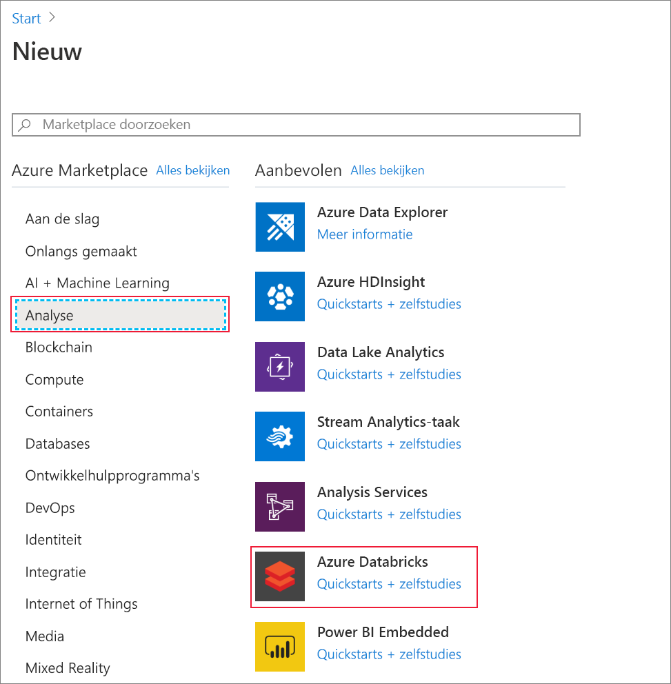
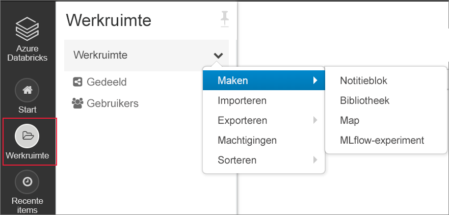

# <a name="tutorial-implement-the-data-lake-capture-pattern-to-update-a-databricks-delta-table"></a>Zelf studie: het data Lake Capture-patroon implementeren om een Databricks Delta tabel bij te werken

In deze zelf studie wordt uitgelegd hoe u gebeurtenissen in een opslag account met een hiërarchische naam ruimte verwerkt.

U maakt een kleine oplossing waarmee een gebruiker een Databricks Delta tabel kan vullen door een bestand met door komma's gescheiden waarden (CSV) te uploaden waarin een verkoop order wordt beschreven. U maakt deze oplossing door samen een Event Grid-abonnement, een Azure-functie en een [taak](https://docs.azuredatabricks.net/user-guide/jobs.html) in azure Databricks te verbinden.

In deze zelfstudie leert u het volgende:

> [!div class="checklist"]
> * Maak een Event Grid-abonnement dat een Azure-functie aanroept.
> * Maak een Azure-functie die een melding ontvangt van een gebeurtenis en voert de taak vervolgens uit in Azure Databricks.
> * Maak een Databricks-taak waarmee een klant order wordt ingevoegd in een Databricks-Delta tabel die zich in het opslag account bevindt.

Deze oplossing wordt in omgekeerde volg orde gebouwd, te beginnen met de Azure Databricks-werk ruimte.

## <a name="prerequisites"></a>Vereisten

* Als u nog geen abonnement op Azure hebt, maak dan een [gratis account](https://azure.microsoft.com/free/?WT.mc_id=A261C142F) aan voordat u begint.

* Maak een opslag account met een hiërarchische naam ruimte (Azure Data Lake Storage Gen2). In deze zelf studie wordt een opslag `contosoorders`account gebruikt met de naam. Zorg ervoor dat aan uw gebruikersaccount de [rol van Gegevensbijdrager voor opslagblob](https://docs.microsoft.com/azure/storage/common/storage-auth-aad-rbac) is toegewezen.

  Zie [een Azure data Lake Storage Gen2-account maken](data-lake-storage-quickstart-create-account.md).

* Een service-principal maken. Zie [How to: de portal gebruiken om een Azure AD-toepassing en Service-Principal te maken die toegang hebben tot resources](https://docs.microsoft.com/azure/active-directory/develop/howto-create-service-principal-portal).

  Er zijn een paar specifieke zaken die u moet doen terwijl u de stappen in het artikel uitvoert.

  : heavy_check_mark: bij het uitvoeren van de stappen in de sectie [toepassing toewijzen aan een rol](https://docs.microsoft.com/azure/active-directory/develop/howto-create-service-principal-portal#assign-a-role-to-the-application) van het artikel, moet u ervoor zorgen dat u de rol van **BLOB voor gegevens opslag** aan de Service-Principal toewijst.

  > [!IMPORTANT]
  > Zorg ervoor dat u de rol toewijst in het bereik van het Data Lake Storage Gen2-opslagaccount. U kunt een rol toewijzen aan de bovenliggende resourcegroep of het bovenliggende abonnement, maar u ontvangt machtigingsgerelateerde fouten tot die roltoewijzingen zijn doorgegeven aan het opslagaccount.

  : heavy_check_mark: als u de stappen in de sectie [waarden ophalen voor ondertekening in](https://docs.microsoft.com/azure/active-directory/develop/howto-create-service-principal-portal#get-values-for-signing-in) van het artikel uitvoert, plakt u de Tenant-id, app-id en wachtwoord waarden in een tekst bestand. U hebt deze waarden later nodig.

## <a name="create-a-sales-order"></a>Een verkoop order maken

Maak eerst een CSV-bestand waarin een verkoop order wordt beschreven en upload dat bestand vervolgens naar het opslag account. Later gebruikt u de gegevens uit dit bestand om de eerste rij in onze Databricks Delta tabel in te vullen.

1. Open Azure Storage Explorer. Ga vervolgens naar uw opslag account en maak in de sectie **BLOB-containers** een nieuwe container met de naam **Data**.

   

   Zie [Azure Storage Explorer gebruiken voor het beheren van gegevens in een Azure data Lake Storage Gen2-account](data-lake-storage-explorer.md)voor meer informatie over het gebruik van Storage Explorer.

2. Maak in de **gegevens** container een map met de naam **input**.

3. Plak de volgende tekst in een tekst editor.

   ```
   InvoiceNo,StockCode,Description,Quantity,InvoiceDate,UnitPrice,CustomerID,Country
   536365,85123A,WHITE HANGING HEART T-LIGHT HOLDER,6,12/1/2010 8:26,2.55,17850,United Kingdom
   ```

4. Sla dit bestand op uw lokale computer op en geef het de naam **Data. CSV**.

5. Upload dit bestand in Storage Explorer naar de map **invoer** .  

## <a name="create-a-job-in-azure-databricks"></a>Een taak maken in Azure Databricks

In deze sectie voert u de volgende taken uit:

* Een Azure Databricks-werkruimte maken.
* Maak een notebook.
* Een Databricks Delta tabel maken en vullen.
* Voeg code toe waarmee rijen in de Databricks Delta tabel worden ingevoegd.
* Een taak maken.

### <a name="create-an-azure-databricks-workspace"></a>Een Azure Databricks-werkruimte maken

In deze sectie gaat u een Azure Databricks-werkruimte maken met behulp van Azure Portal.

1. Selecteer in de Azure Portal **een resource** > **Analytics** > -**Azure Databricks**maken.

    

2. Geef bij **Azure Databricks Service** de waarden op voor het maken van een Databricks-werkruimte.

    

    Het maken van de werkruimte duurt enkele minuten. Bekijk de voortgangsbalk bovenaan om de bewerkingsstatus te volgen.

### <a name="create-a-spark-cluster-in-databricks"></a>Een Spark-cluster maken in Databricks

1. Ga in het [Azure Portal](https://portal.azure.com)naar de Azure Databricks werk ruimte die u hebt gemaakt en selecteer vervolgens **werk ruimte starten**.

2. U wordt omgeleid naar de Azure Databricks-portal. Selecteer in de portal **Nieuw** > **cluster**.

    

3. Op de pagina **Nieuw cluster** geeft u de waarden op waarmee een nieuw cluster wordt gemaakt.

    

    Accepteer alle andere standaardwaarden, anders dan de volgende:

    * Voer een naam in voor het cluster.
    * Zorg ervoor dat u het selectievakje **Beëindigen na 120 minuten van inactiviteit** inschakelt. Geef een duur (in minuten) op waarna het cluster moet worden beëindigd als het niet wordt gebruikt.

4. Selecteer **Cluster maken**. Zodra het cluster wordt uitgevoerd, kunt u notitieblokken koppelen aan het cluster en Spark-taken uitvoeren.

Zie [Een Spark-cluster maken in Azure Databricks](https://docs.azuredatabricks.net/user-guide/clusters/create.html) voor meer informatie over het maken van clusters.

### <a name="create-a-notebook"></a>Een notebook maken

1. Selecteer **Werkruimte** in het linkerdeelvenster. Selecteer in de **Werkruimte**-vervolgkeuzelijst, **Notitieblok** > **maken**.

    

2. Voer in het dialoogvenster **Notitieblok maken** een naam voor het notitieblok in. Selecteer **Python** als taal en selecteer vervolgens het Apache Spark-cluster dat u eerder hebt gemaakt.

    

    Selecteer **Maken**.

### <a name="create-and-populate-a-databricks-delta-table"></a>Een Databricks Delta tabel maken en vullen

1. Kopieer en plak het volgende code blok in de eerste cel van het notitie blok dat u hebt gemaakt, maar voer deze code nog niet uit.  

   Vervang de `appId`waarden `password`, `tenant` , tijdelijke aanduidingen in dit code blok met de waarden die u hebt verzameld bij het volt ooien van de vereisten van deze zelf studie.

    ```Python
    dbutils.widgets.text('source_file', "", "Source File")

    spark.conf.set("fs.azure.account.auth.type", "OAuth")
    spark.conf.set("fs.azure.account.oauth.provider.type", "org.apache.hadoop.fs.azurebfs.oauth2.ClientCredsTokenProvider")
    spark.conf.set("fs.azure.account.oauth2.client.id", "<appId>")
    spark.conf.set("fs.azure.account.oauth2.client.secret", "<password>")
    spark.conf.set("fs.azure.account.oauth2.client.endpoint", "https://login.microsoftonline.com/<tenant>/oauth2/token")

    adlsPath = 'abfss://data@contosoorders.dfs.core.windows.net/'
    inputPath = adlsPath + dbutils.widgets.get('source_file')
    customerTablePath = adlsPath + 'delta-tables/customers'
    ```

    Met deze code wordt een widget gemaakt met de naam **source_file**. Later gaat u een Azure-functie maken die deze code aanroept en een bestandspad naar die widget door gegeven.  Deze code verifieert ook uw service-principal met het opslag account en maakt enkele variabelen die u in andere cellen gebruikt.

    > [!NOTE]
    > In een productieomgeving kunt u de verificatiesleutel eventueel in Azure Databricks opslaan. Vervolgens voegt u een opzoeksleutel toe aan uw codeblok in plaats van de verificatiesleutel. <br><br>In plaats van deze regel code te gebruiken: `spark.conf.set("fs.azure.account.oauth2.client.secret", "<password>")`, gebruikt u bijvoorbeeld de volgende regel code:. `spark.conf.set("fs.azure.account.oauth2.client.secret", dbutils.secrets.get(scope = "<scope-name>", key = "<key-name-for-service-credential>"))` <br><br>Nadat u deze zelf studie hebt voltooid, raadpleegt u het artikel [Azure data Lake Storage Gen2](https://docs.azuredatabricks.net/spark/latest/data-sources/azure/azure-datalake-gen2.html) op de Azure Databricks-website om voor beelden van deze benadering te bekijken.

2. Druk op de toetsen **Shift + Enter** om de code in dit blok uit te voeren.

3. Kopieer en plak het volgende code blok in een andere cel en druk op **SHIFT + ENTER** om de code in dit blok uit te voeren.

   ```Python
   from pyspark.sql.types import StructType, StructField, DoubleType, IntegerType, StringType


   inputSchema = StructType([
   StructField("InvoiceNo", IntegerType(), True),
   StructField("StockCode", StringType(), True),
   StructField("Description", StringType(), True),
   StructField("Quantity", IntegerType(), True),
   StructField("InvoiceDate", StringType(), True),
   StructField("UnitPrice", DoubleType(), True),
   StructField("CustomerID", IntegerType(), True),
   StructField("Country", StringType(), True)
   ])

   rawDataDF = (spark.read
    .option("header", "true")
    .schema(inputSchema)
    .csv(adlsPath + 'input')
   )

   (rawDataDF.write
     .mode("overwrite")
     .format("delta")
     .saveAsTable("customer_data", path=customerTablePath))
   ```

   Deze code maakt de Delta tabel Databricks in uw opslag account en laadt vervolgens enkele initiële gegevens uit het CSV-bestand dat u eerder hebt geüpload.

4. Nadat dit code blok is uitgevoerd, verwijdert u dit code blok uit het notitie blok.

### <a name="add-code-that-inserts-rows-into-the-databricks-delta-table"></a>Code toevoegen waarmee rijen worden ingevoegd in de tabel Databricks Delta

1. Kopieer en plak het volgende code blok in een andere cel, maar voer deze cel niet uit.

   ```Python
   upsertDataDF = (spark
     .read
     .option("header", "true")
     .csv(inputPath)
   )
   upsertDataDF.createOrReplaceTempView("customer_data_to_upsert")
   ```

   Met deze code worden gegevens in een tijdelijke tabel weergave ingevoegd met behulp van gegevens uit een CSV-bestand. Het pad naar dat CSV-bestand is afkomstig van de invoer widget die u in een eerdere stap hebt gemaakt.

2. Voeg de volgende code toe om de inhoud van de tijdelijke tabel weergave samen te voegen met de Delta tabel Databricks.

   ```
   %sql
   MERGE INTO customer_data cd
   USING customer_data_to_upsert cu
   ON cd.CustomerID = cu.CustomerID
   WHEN MATCHED THEN
     UPDATE SET
       cd.StockCode = cu.StockCode,
       cd.Description = cu.Description,
       cd.InvoiceNo = cu.InvoiceNo,
       cd.Quantity = cu.Quantity,
       cd.InvoiceDate = cu.InvoiceDate,
       cd.UnitPrice = cu.UnitPrice,
       cd.Country = cu.Country
   WHEN NOT MATCHED
     THEN INSERT (InvoiceNo, StockCode, Description, Quantity, InvoiceDate, UnitPrice, CustomerID, Country)
     VALUES (
       cu.InvoiceNo,
       cu.StockCode,
       cu.Description,
       cu.Quantity,
       cu.InvoiceDate,
       cu.UnitPrice,
       cu.CustomerID,
       cu.Country)
   ```

### <a name="create-a-job"></a>Een taak maken

Maak een taak die het notitie blok uitvoert dat u eerder hebt gemaakt. Later maakt u een Azure-functie waarmee deze taak wordt uitgevoerd wanneer een gebeurtenis wordt gegenereerd.

1. Klik op **taken**.

2. Klik op de pagina **taken** op **taak maken**.

3. Geef de taak een naam en kies vervolgens de `upsert-order-data` werkmap.

   

## <a name="create-an-azure-function"></a>Een Azure-functie maken

Maak een Azure-functie waarmee de taak wordt uitgevoerd.

1. Kies in de linkerbovenhoek van de werk ruimte Databricks het pictogram personen en kies vervolgens **gebruikers instellingen**.

   

2. Klik op de knop **nieuw token genereren** en klik vervolgens op de knop **genereren** .

   Zorg ervoor dat u het token naar een veilige plaats kopieert. Uw Azure-functie heeft dit token nodig om te verifiëren bij Databricks, zodat de taak kan worden uitgevoerd.
  
3. Selecteer de knop **een resource maken** in de linkerbovenhoek van de Azure Portal en selecteer vervolgens **reken > functie-app**.

   

4. Zorg ervoor dat op de pagina **maken** van de functie-app **.net core** voor de runtime stack is geselecteerd en zorg ervoor dat u een Application Insights exemplaar configureert.

   

5. Klik op de pagina **overzicht** van de functie-app op **configuratie**.

   

6. Kies op de pagina **Toepassings instellingen** de knop **nieuwe toepassings instelling** om elke instelling toe te voegen.

   

   Voeg de volgende instellingen toe:

   |Naam van instelling | Waarde |
   |----|----|
   |**DBX_INSTANCE**| De regio van uw databricks-werk ruimte. Bijvoorbeeld: `westus2.azuredatabricks.net`|
   |**DBX_PAT**| Het persoonlijke toegangs token dat u eerder hebt gegenereerd. |
   |**DBX_JOB_ID**|De id van de taak die wordt uitgevoerd. In ons geval is `1`deze waarde.|
7. Klik op de pagina overzicht van de functie-app op de knop **nieuwe functie** .

   

8. Kies **Azure Event grid trigger**.

   Installeer de extensie **micro soft. Azure. webjobs. Extensions. EventGrid** als u hierom wordt gevraagd. Als u deze moet installeren, moet u **Azure Event grid trigger** opnieuw kiezen om de functie te maken.

   Het deel venster **nieuwe functie** wordt weer gegeven.

9. Geef in het deel venster **nieuwe functie** de naam van de functie **UpsertOrder**en klik vervolgens op de knop **maken** .

10. Vervang de inhoud van het code bestand door deze code en klik vervolgens op de knop **Opslaan** :

    ```cs
    using "Microsoft.Azure.EventGrid"
    using "Newtonsoft.Json"
    using Microsoft.Azure.EventGrid.Models;
    using Newtonsoft.Json;
    using Newtonsoft.Json.Linq;

    private static HttpClient httpClient = new HttpClient();

    public static async Task Run(EventGridEvent eventGridEvent, ILogger log)
    {
        log.LogInformation("Event Subject: " + eventGridEvent.Subject);
        log.LogInformation("Event Topic: " + eventGridEvent.Topic);
        log.LogInformation("Event Type: " + eventGridEvent.EventType);
        log.LogInformation(eventGridEvent.Data.ToString());

        if (eventGridEvent.EventType == "Microsoft.Storage.BlobCreated" | | eventGridEvent.EventType == "Microsoft.Storage.FileRenamed") {
            var fileData = ((JObject)(eventGridEvent.Data)).ToObject<StorageBlobCreatedEventData>();
            if (fileData.Api == "FlushWithClose") {
                log.LogInformation("Triggering Databricks Job for file: " + fileData.Url);
                var fileUrl = new Uri(fileData.Url);
                var httpRequestMessage = new HttpRequestMessage {
                    Method = HttpMethod.Post,
                    RequestUri = new Uri(String.Format("https://{0}/api/2.0/jobs/run-now", System.Environment.GetEnvironmentVariable("DBX_INSTANCE", EnvironmentVariableTarget.Process))),
                    Headers = {
                        { System.Net.HttpRequestHeader.Authorization.ToString(), "Bearer " +  System.Environment.GetEnvironmentVariable ("DBX_PAT", EnvironmentVariableTarget.Process)},
                        { System.Net.HttpRequestHeader.ContentType.ToString (), "application/json" }
                    },
                    Content = new StringContent(JsonConvert.SerializeObject(new {
                        job_id = System.Environment.GetEnvironmentVariable ("DBX_JOB_ID", EnvironmentVariableTarget.Process) ,
                        notebook_params = new {
                            source_file = String.Join("", fileUrl.Segments.Skip(2))
                        }
                    }))
                 };
                var response = await httpClient.SendAsync(httpRequestMessage);
                response.EnsureSuccessStatusCode();
            }
        }
    }
    ```

   Deze code parseert informatie over de opslag gebeurtenis die is gegenereerd en maakt vervolgens een aanvraag bericht met een URL van het bestand dat de gebeurtenis heeft geactiveerd. Als onderdeel van het bericht geeft de functie een waarde door aan de widget **source_file** die u eerder hebt gemaakt. de functie code verzendt het bericht naar de Databricks-taak en gebruikt het token dat u eerder hebt verkregen als verificatie.

## <a name="create-an-event-grid-subscription"></a>Een Event Grid-abonnement maken

In deze sectie maakt u een Event Grid-abonnement dat de Azure-functie aanroept wanneer bestanden worden geüpload naar het opslag account.

1. Klik op de pagina functie code op de knop **Event grid abonnement toevoegen** .

   

2. Typ op de pagina **gebeurtenis abonnement maken** de naam van het abonnement en gebruik vervolgens de velden op de pagina om uw opslag account te selecteren.

   

3. Selecteer in de vervolg keuzelijst **filteren op gebeurtenis typen** de **blob die is gemaakt**, en klik op **BLOB verwijderde** gebeurtenissen en vervolgens op de knop **maken** .

## <a name="test-the-event-grid-subscription"></a>Het Event Grid-abonnement testen

1. Maak een bestand met `customer-order.csv`de naam, plak de volgende gegevens in dat bestand en sla het op uw lokale computer op.

   ```
   InvoiceNo,StockCode,Description,Quantity,InvoiceDate,UnitPrice,CustomerID,Country
   536371,99999,EverGlow Single,228,1/1/2018 9:01,33.85,20993,Sierra Leone
   ```

2. Upload dit bestand in Storage Explorer naar de map **invoer** van uw opslag account.

   Als u een bestand uploadt, wordt de gebeurtenis **micro soft. storage. BlobCreated** gegenereerd. Event Grid worden alle abonnees op die gebeurtenis gewaarschuwd. In ons geval is de Azure-functie de enige abonnee. De functie Azure parseert de gebeurtenis parameters om te bepalen welke gebeurtenis heeft plaatsgevonden. Vervolgens wordt de URL van het bestand door gegeven aan de Databricks-taak. De Databricks-taak leest het bestand en voegt een rij toe aan de tabel Databricks Delta die uw opslag account bevindt.

3. Als u wilt controleren of de taak is voltooid, opent u de databricks-werk ruimte, klikt u op de knop **taken** en opent u uw taak.

4. Selecteer de taak om de taak pagina te openen.

   

   Wanneer de taak is voltooid, ziet u een voltooiings status.

   

5. Voer in een nieuwe werkbladcel deze query uit in een cel om de bijgewerkte Delta tabel weer te geven.

   ```
   %sql select * from customer_data
   ```

   De geretourneerde tabel bevat de meest recente record.

   

6. Als u deze record wilt bijwerken, maakt u `customer-order-update.csv`een bestand met de naam, plakt u de volgende gegevens in dat bestand en slaat u het op uw lokale computer op.

   ```
   InvoiceNo,StockCode,Description,Quantity,InvoiceDate,UnitPrice,CustomerID,Country
   536371,99999,EverGlow Single,22,1/1/2018 9:01,33.85,20993,Sierra Leone
   ```

   Dit CSV-bestand is bijna identiek aan het vorige, behalve dat de hoeveelheid van de order wordt `228` gewijzigd `22`van naar.

7. Upload dit bestand in Storage Explorer naar de map **invoer** van uw opslag account.

8. Voer de `select` query opnieuw uit om de bijgewerkte Delta tabel weer te geven.

   ```
   %sql select * from customer_data
   ```

   De geretourneerde tabel toont de bijgewerkte record.

   

## <a name="clean-up-resources"></a>Resources opschonen

Verwijder de resourcegroep en alle gerelateerde resources, wanneer u deze niet meer nodig hebt. Hiervoor selecteert u de resourcegroep voor het opslagaccount en selecteert u **Verwijderen**.

## <a name="next-steps"></a>Volgende stappen

> [!div class="nextstepaction"]
> [Reageren op gebeurtenissen van Blob Storage](storage-blob-event-overview.md)
