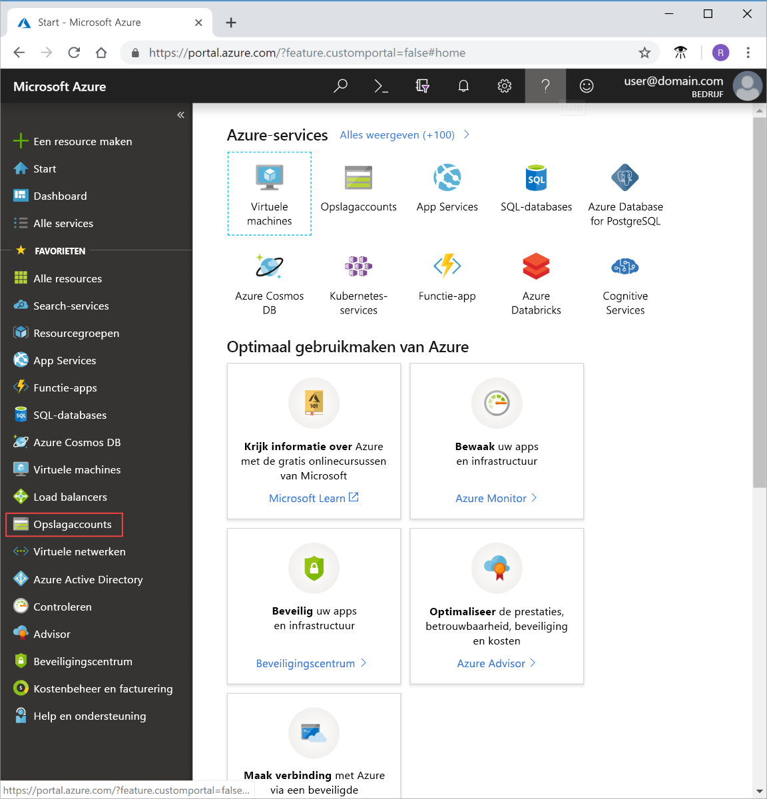
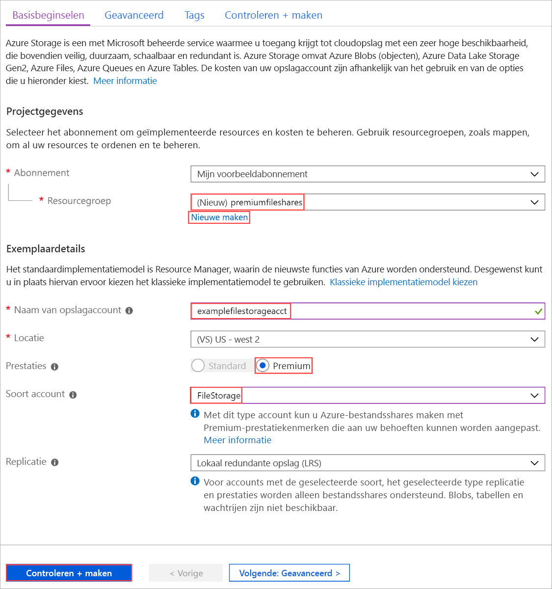
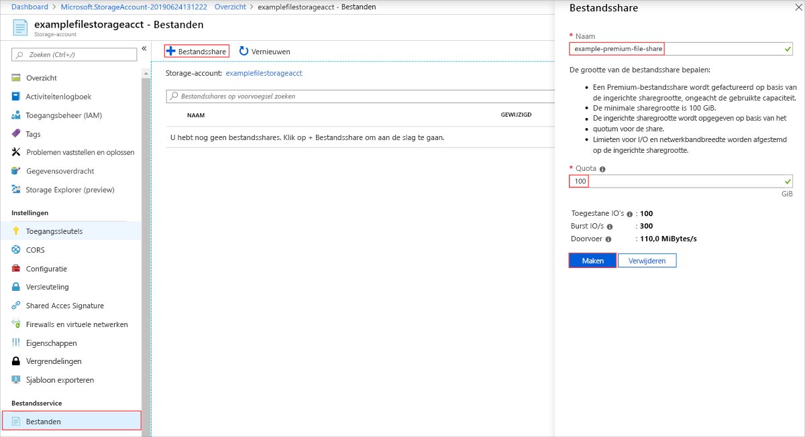

# <a name="how-to-create-an-azure-premium-file-share"></a>Een Azure Premium-bestands share maken

Premium-bestands shares worden aangeboden op media SSD (Solid-State Disk) en zijn handig voor i/o-intensieve workloads, waaronder hosting data bases en HPC (High-Performance Computing). Premium-bestands shares worden gehost in een speciaal type opslag account, een FileStorage-account genoemd. Premium-bestands shares zijn ontworpen voor hoge prestaties en schaal bare toepassingen op bedrijfs niveau en bieden consistente shares met lage latentie, hoge IOPS en hoge door voer.

In dit artikel wordt beschreven hoe u dit nieuwe account type maakt met behulp van de [Azure Portal](https://portal.azure.com/), Azure PowerShell module en de Azure cli.

## <a name="prerequisites"></a>Vereisten

- Als u nog geen abonnement op Azure hebt, maak dan een [gratis account](https://azure.microsoft.com/free/) aan voordat u begint.
- Als u van plan bent om de Artikel CLI te gebruiken, [installeert u de nieuwste versie](https://docs.microsoft.com/cli/azure/install-azure-cli?view=azure-cli-latest).
- Als u de module Azure PowerShell wilt gebruiken, [installeert u de nieuwste versie](https://docs.microsoft.com/powershell/azure/install-az-ps?view=azps-4.6.0).

## <a name="create-a-filestorage-storage-account"></a>Een FileStorage-opslag account maken

Elk opslagaccount moet behoren tot een Azure-resourcegroep. Een resourcegroep is een logische container voor het groeperen van uw Azure-services. Wanneer u een opslagaccount maakt, kunt u een nieuwe resourcegroep maken of een bestaande resourcegroep gebruiken. Premium-bestands shares vereisen een FileStorage-account.

# <a name="portal"></a>[Portal](#tab/azure-portal)

### <a name="sign-in-to-azure"></a>Aanmelden bij Azure

Meld u aan bij de [Azure-portal](https://portal.azure.com/).

U bent nu klaar om uw opslag account te maken.

1. Selecteer in het Azure Portal **opslag accounts** in het menu links.

    

1. Kies in het venster **Opslagaccounts** dat wordt weergegeven de optie **Toevoegen**.
1. Selecteer het abonnement waarin u het opslagaccount wilt maken.
1. Selecteer **Nieuwe maken** onder het veld **Resourcegroep**. Voer een naam in voor de nieuwe resourcegroep, zoals in de volgende afbeelding wordt weergegeven.

1. Voer vervolgens een naam in voor het opslagaccount. De naam die u kiest, moet uniek zijn binnen Azure. Verder moet de naam 3 tot 24 tekens lang zijn en mag alleen cijfers en kleine letters bevatten.
1. Selecteer een locatie voor uw opslagaccount of gebruik de standaardlocatie.
1. Selecteer **Premium**voor **prestaties** .

    U moet **Premium** voor **FileStorage** selecteren als beschik bare optie in de vervolg keuzelijst **account soort** .

1. Selecteer **account type** en kies **FileStorage**.
1. Zorg ervoor dat **replicatie** is ingesteld op de standaard waarde van **lokaal redundante opslag (LRS)**.

    

1. Selecteer **Beoordelen en maken** om uw opslagaccountinstellingen te bekijken en het account te maken.
1. Selecteer **Maken**.

Als uw opslag account is gemaakt, gaat u naar de resource.

# <a name="powershell"></a>[PowerShell](#tab/azure-powershell)

### <a name="sign-in-to-azure"></a>Aanmelden bij Azure

Gebruik de opdracht `Connect-AzAccount` en volg de instructies op het scherm om te verifiëren.

```powershell
Connect-AzAccount
```

### <a name="create-a-resource-group"></a>Een resourcegroep maken

Gebruik de opdracht [New-AzResourceGroup](/powershell/module/az.resources/new-azresourcegroup) om een nieuwe resourcegroep met PowerShell te maken:

```powershell
# put resource group in a variable so you can use the same group name going forward,
# without hardcoding it repeatedly
$resourceGroup = "storage-how-to-resource-group"
$location = "westus2"
New-AzResourceGroup -Name $resourceGroup -Location $location
```

### <a name="create-a-filestorage-storage-account"></a>Een FileStorage-opslag account maken

Als u een FileStorage-opslag account wilt maken vanuit Power shell, gebruikt u de opdracht [New-AzStorageAccount](/powershell/module/az.storage/New-azStorageAccount) :

```powershell
$storageAcct = New-AzStorageAccount -ResourceGroupName $resourceGroup -Name "fileshowto" -SkuName "Premium_LRS" -Location "westus2" -Kind "FileStorage"
```

# <a name="azure-cli"></a>[Azure CLI](#tab/azure-cli)

Meld u aan bij de [Azure Portal](https://portal.azure.com)om Azure Cloud shell te starten.

Als u zich wilt aanmelden bij de lokale installatie van de CLI, controleert u of u de nieuwste versie hebt en meldt u zich aan:

```azurecli
az login
```

### <a name="create-a-resource-group"></a>Een resourcegroep maken

Gebruik de opdracht [az group create](/cli/azure/group) om een nieuwe resourcegroep te maken met Azure CLI.

```azurecli-interactive
az group create `
    --name files-howto-resource-group `
    --location westus2
```

### <a name="create-a-filestorage-storage-account"></a>Een FileStorage-opslag account maken

Als u een FileStorage-opslag account wilt maken vanuit Azure CLI, gebruikt u de opdracht [AZ Storage account create](/cli/azure/storage/account) .

```azurecli-interactive
az storage account create `
    --name fileshowto `
    --resource-group files-howto-resource-group `
    --location westus `
    --sku Premium_LRS `
    --kind FileStorage
```

### <a name="get-the-storage-account-key"></a>Opslagaccountsleutel opvragen

Sleutels voor opslag accounts beheren de toegang tot resources in een opslag account. in dit artikel gebruiken we de sleutel om een Premium-bestands share te maken. Wanneer u een opslagaccount maakt, worden de sleutels automatisch gemaakt. U kunt de opslagaccountsleutels voor uw opslagaccount opvragen met de opdracht [az storage account keys list](/cli/azure/storage/account/keys):

```azurecli-interactive
STORAGEKEY=$(az storage account keys list \
    --resource-group "myResourceGroup" \
    --account-name $STORAGEACCT \
    --query "[0].value" | tr -d '"')
```
---

## <a name="create-a-premium-file-share"></a>Een Premium-bestandsshare maken

Nu u een FileStorage-account hebt gemaakt, kunt u een Premium-bestands share maken binnen dat opslag account.

# <a name="portal"></a>[Portal](#tab/azure-portal)

1. Ga in het menu links voor het opslag account naar de sectie **Bestands service** en selecteer vervolgens **bestanden**.
1. Selecteer **Bestands share** om een Premium-bestands share te maken.
1. Voer een naam en een gewenste quotum in voor de bestands share en selecteer vervolgens **maken**.

> [!NOTE]
> Ingerichte share groottes worden opgegeven door het share quotum, bestands shares worden gefactureerd op basis van de ingerichte grootte. Zie de pagina [prijzen](https://azure.microsoft.com/pricing/details/storage/files/) voor meer informatie.

   

# <a name="powershell"></a>[PowerShell](#tab/azure-powershell)

Als u een Premium-bestands share met de module Azure PowerShell wilt maken, gebruikt u de cmdlet [New-AzStorageShare](/powershell/module/az.storage/New-AzStorageShare) .

> [!NOTE]
> Ingerichte share groottes worden opgegeven door het share quotum, bestands shares worden gefactureerd op basis van de ingerichte grootte. Zie de pagina [prijzen](https://azure.microsoft.com/pricing/details/storage/files/) voor meer informatie.

```powershell
New-AzStorageShare `
   -Name myshare `
   -Context $storageAcct.Context
```

# <a name="azure-cli"></a>[Azure CLI](#tab/azure-cli)

Als u een Premium-bestands share wilt maken met de Azure CLI, gebruikt u de opdracht [AZ Storage share Create](/cli/azure/storage/share) .

> [!NOTE]
> Ingerichte share groottes worden opgegeven door het share quotum, bestands shares worden gefactureerd op basis van de ingerichte grootte. Zie de pagina [prijzen](https://azure.microsoft.com/pricing/details/storage/files/) voor meer informatie.

```azurecli-interactive
az storage share create \
    --account-name $STORAGEACCT \
    --account-key $STORAGEKEY \
    --name "myshare" 
```
---

## <a name="clean-up-resources"></a>Resources opschonen

# <a name="portal"></a>[Portal](#tab/azure-portal)

Als u de resources die in dit artikel zijn gemaakt, wilt opschonen, verwijdert u de resource groep. Als u de resource groep verwijdert, worden ook het bijbehorende opslag account en alle andere resources die aan de resource groep zijn gekoppeld, verwijderd.

# <a name="powershell"></a>[PowerShell](#tab/azure-powershell)

Als u de resources die in dit artikel zijn gemaakt, wilt opschonen, verwijdert u de resource groep. Als u de resource groep verwijdert, worden ook het bijbehorende opslag account en alle andere resources die aan de resource groep zijn gekoppeld, verwijderd.

Gebruik de opdracht [Remove-AzResourceGroup](/powershell/module/az.resources/remove-azresourcegroup) om de resourcegroep en alle bijbehorende resources te verwijderen, inclusief het nieuwe opslagaccount: 

```powershell
Remove-AzResourceGroup -Name $resourceGroup
```

# <a name="azure-cli"></a>[Azure CLI](#tab/azure-cli)

Als u de resources die in dit artikel zijn gemaakt, wilt opschonen, verwijdert u de resource groep. Als u de resource groep verwijdert, worden ook het bijbehorende opslag account en alle andere resources die aan de resource groep zijn gekoppeld, verwijderd.

Gebruik de opdracht [az group delete](/cli/azure/group) om de resourcegroep en alle bijbehorende resources te verwijderen, inclusief het nieuwe opslagaccount.

```azurecli-interactive
az group delete --name myResourceGroup
```
---

## <a name="next-steps"></a>Volgende stappen

In dit artikel hebt u een Premium-bestands share gemaakt. Voor meer informatie over de prestaties van dit account, gaat u naar de sectie prestatie tier van de plannings handleiding.

> [!div class="nextstepaction"]
> [Bestands share lagen](storage-files-planning.md#storage-tiers)
