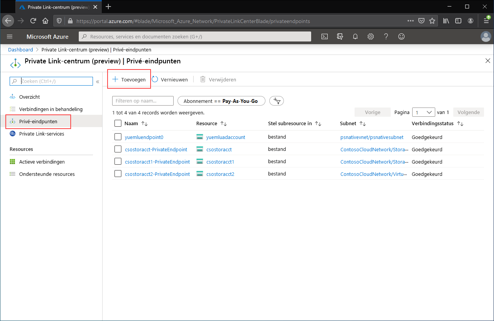
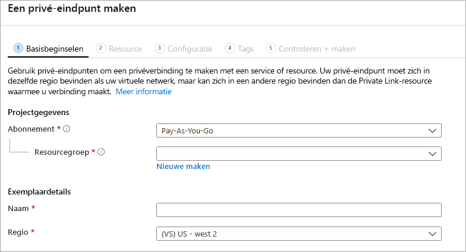

# <a name="configuring-azure-file-sync-network-endpoints"></a>Azure Files Sync-netwerkeindpunten configureren
Azure Files en Azure File Sync bieden twee hoofdtypen eindpunten voor toegang tot Azure-bestandsshares: 
- Openbare eindpunten, die een openbaar IP-adres hebben en overal ter wereld toegankelijk zijn.
- Privé-eindpunten, die zich binnen een virtueel netwerk bevinden en een privé-IP-adres hebben in de adresruimte van het virtuele netwerk.

Voor zowel Azure Files als Azure File controleren de Azure-beheerobjecten, het opslagaccount en de opslagsynchronisatieservice respectieverlijk zowel de openbare en privé-eindpunten. Een opslagaccount is een beheerconstructie die een gedeelde opslaggroep vertegenwoordigt waarin u meerdere bestandsshares kunt implementeren, evenals andere opslagresources, zoals blob-containers of wachtrijen. De opslagsynchronisatieservice is een beheerconstructie die geregistreerde servers vertegenwoordigt, d.w.z. Windows-bestandsservers met een gevestigde vertrouwensrelatie met Azure File Sync, en synchronisatiegroepen, die de topologie van de synchronisatierelatie definiëren. 

Dit artikel is gericht op de configuratie van de netwerkeindpunten voor Azure Files en Azure File Sync. Zie [Azure Files-netwerkeindpunten configureren](storage-files-networking-endpoints.md) voor meer informatie over het configureren van netwerkeindpunten om rechtstreeks toegang te krijgen tot Azure-bestandsshares in plaats van on-premises te cachen met Azure File Sync.

We raden u aan om [Aandachtspunten voor Azure File Sync-netwerken](storage-sync-files-networking-overview.md) te lezen voordat u dit artikel verder leest.

## <a name="prerequisites"></a>Vereisten 
In dit artikel wordt ervan uitgegaan dat:
- U een Azure-abonnement heeft. Als u nog geen abonnement hebt, maakt u een [gratis account](https://azure.microsoft.com/free/?WT.mc_id=A261C142F) voordat u begint.
- U al een Azure-bestandsshare hebt gemaakt in een opslagaccount waarmee u on-premises verbinding wilt maken. Zie [Een Azure-bestandsshare maken](storage-how-to-create-file-share.md) als u wilt lezen hoe u een Azure-bestandsshare maakt.
- U al een opslagsynchronisatieservice heeft aangemaakt en uw Windows-bestandsserver erbij heeft geregistreerd. Bekijk [Azure Files Sync implementeren](storage-sync-files-deployment-guide.md) voor meer informatie over de implementatie van Azure File Sync.

Aanvullend:
- Als u van plan bent om Azure PowerShell te gebruiken, [installeert u de nieuwste versie](https://docs.microsoft.com/powershell/azure/install-az-ps).
- Als u van plan bent om de Artikel CLI te gebruiken, [installeert u de nieuwste versie](https://docs.microsoft.com/cli/azure/install-azure-cli?view=azure-cli-latest).

## <a name="create-the-private-endpoints"></a>De privé-eindpunten aanmaken
Wanneer u een privé-eindpunt maakt voor een Azure-resource, worden de volgende resources geïmplementeerd:

- **Een privé-eindpunt**: Een Azure-resource die het privé-eindpunt voor het opslagaccount of de opslagsynchronisatieservice voorstelt. U kunt dit zien als een resource die een verbinding opzet tussen uw Azure-resource en een netwerkinterface.
- **Een netwerkinterface (NIC)** : De netwerkinterface die een privé-IP-adres onderhoudt binnen het opgeven virtuele netwerk/subnet. Dit is exact dezelfde resource die wordt geïmplementeerd als u een virtuele machine implementeert, alleen wordt de resource nu niet toegewezen aan een VM, maar is deze het eigendom van het privé-eindpunt.
- **Een privé-DNS-zone**: Als u niet eerder een privé-eindpunt hebt geïmplementeerd voor dit virtuele netwerk, wordt er een nieuwe privé-DNS-zone geïmplementeerd voor uw virtuele netwerk. Er wordt ook een DNS A-record gemaakt voor de Azure-resource in deze DNS-zone. Als u al een privé-eindpunt hebt geïmplementeerd in dit virtuele netwerk, wordt er een nieuwe A-record voor de Azure-resource toegevoegd aan de bestaande DNS-zone. Een DNS-zone implementeren is optioneel, maar sterk aanbevolen om het vereiste DNS-beheer te vereenvoudigen.

> [!Note]  
> In dit artikel worden de DNS-achtervoegsels voor de openbare Azure-regio's gebruikt, `core.windows.net` voor opslagaccounts en `afs.azure.net` voor opslagsynchronisatieservices. Deze opmerking geldt ook voor onafhankelijke Azure-clouds zoals de Azure-cloud voor de Amerikaanse overheid. Vervang het achtervoegsel gewoon door dat van de onafhankelijke cloud.

### <a name="create-the-storage-account-private-endpoint"></a>De privé-eindpunt voor opslagaccounts maken
# <a name="portal"></a>[Portal](#tab/azure-portal)
[!INCLUDE [storage-files-networking-endpoints-private-portal](../../../includes/storage-files-networking-endpoints-private-portal.md)]

Als er een virtuele machine aanwezig is in het virtuele netwerk, of als u het doorsturen in DNS hebt geconfigureerd zoals wordt beschreven in [DNS doorsturen configureren voor Azure Files](storage-files-networking-dns.md), kunt u testen of uw privé-eindpunt goed is ingesteld door de volgende opdrachten uit te voeren vanuit PowerShell, vanaf de opdrachtregel of vanuit de terminal (werkt voor Windows, Linux en macOS). U moet `<storage-account-name>` door de juiste naam van het opslagaccount:

```
nslookup <storage-account-name>.file.core.windows.net
```

Als alles in orde is, ziet u de volgende uitvoer, waarbij `192.168.0.5` het privé-IP-adres is van het privé-eindpunt in uw virtuele netwerk (de weergegeven uitvoer is voor Windows):

```Output
Server:  UnKnown
Address:  10.2.4.4

Non-authoritative answer:
Name:    storageaccount.privatelink.file.core.windows.net
Address:  192.168.0.5
Aliases:  storageaccount.file.core.windows.net
```

# <a name="powershell"></a>[PowerShell](#tab/azure-powershell)
[!INCLUDE [storage-files-networking-endpoints-private-powershell](../../../includes/storage-files-networking-endpoints-private-powershell.md)]

Als er een virtuele machine aanwezig is in het virtuele netwerk, of als u het doorsturen in DNS hebt geconfigureerd zoals wordt beschreven in [DNS doorsturen configureren voor Azure Files](storage-files-networking-dns.md), kunt u testen of uw privé-eindpunt goed is ingesteld door de volgende opdrachten uit te voeren:

```PowerShell
$storageAccountHostName = [System.Uri]::new($storageAccount.PrimaryEndpoints.file) | `
    Select-Object -ExpandProperty Host

Resolve-DnsName -Name $storageAccountHostName
```

Als alles in orde is, ziet u de volgende uitvoer, waarbij `192.168.0.5` het privé-IP-adres is van het privé-eindpunt in uw virtuele netwerk:

```Output
Name                             Type   TTL   Section    NameHost
----                             ----   ---   -------    --------
storageaccount.file.core.windows CNAME  60    Answer     storageaccount.privatelink.file.core.windows.net
.net

Name       : storageaccount.privatelink.file.core.windows.net
QueryType  : A
TTL        : 600
Section    : Answer
IP4Address : 192.168.0.5
```

# <a name="azure-cli"></a>[Azure-CLI](#tab/azure-cli)
[!INCLUDE [storage-files-networking-endpoints-private-cli](../../../includes/storage-files-networking-endpoints-private-cli.md)]

Als er een virtuele machine aanwezig is in het virtuele netwerk, of als u het doorsturen in DNS hebt geconfigureerd zoals wordt beschreven in [DNS doorsturen configureren voor Azure Files](storage-files-networking-dns.md), kunt u testen of uw privé-eindpunt goed is ingesteld door de volgende opdrachten uit te voeren:

```bash
httpEndpoint=$(az storage account show \
        --resource-group $storageAccountResourceGroupName \
        --name $storageAccountName \
        --query "primaryEndpoints.file" | \
    tr -d '"')

hostName=$(echo $httpEndpoint | cut -c7-$(expr length $httpEndpoint) | tr -d "/")
nslookup $hostName
```

Als alles in orde is, ziet u de volgende uitvoer, waarbij `192.168.0.5` het privé-IP-adres is van het privé-eindpunt in uw virtuele netwerk:

```Output
Server:         127.0.0.53
Address:        127.0.0.53#53

Non-authoritative answer:
storageaccount.file.core.windows.net      canonical name = storageaccount.privatelink.file.core.windows.net.
Name:   storageaccount.privatelink.file.core.windows.net
Address: 192.168.0.5
```

---

### <a name="create-the-storage-sync-private-endpoint"></a>De privé-eindpunt voor opslagsynchronisatie maken
> [!Important]  
> Om privé-eindpunten te kunnen gebruiken op de opslagsynchronisatieservice-resource, moet u Azure File Sync-agent versie 10.1 of hoger hebben. Agentversies vóór 10.1 bieden geen ondersteuning voor privé-eindpunten op de opslagsynchronisatieservice. Alle eerdere agentversies ondersteunen wel privé-eindpunten op de opslagaccount-resource.

# <a name="portal"></a>[Portal](#tab/azure-portal)
Ga naar het **Private Link-centrum** door *Private Link* te typen in de zoekbalk bovenaan het Azure-portal. Selecteer **Privé-eindpunten** in de inhoudsopgave van het Private Link-centrum en selecteer vervolgens **+ Toevoegen** om een nieuw privé-eindpunt te maken.

[](media/storage-sync-files-networking-endpoints/create-storage-sync-private-endpoint-0.png#lightbox)

Er wordt een wizard gestart waarin u meerdere pagina's moet invullen.

Selecteer op de blade **Algemeen** de gewenste resourcegroep, geef een naam op en selecteer de regio voor het privé-eindpunt. U kunt hier kiezen wat u wilt. De waarden hoeven niet overeen te komen met die van de opslagsynchronisatieservice. Het is wel zo dat u het privé-eindpunt moet maken in dezelfde regio als het virtuele netwerk waarin u het privé-eindpunt wilt maken.



Schakel op de blade **Resource** het keuzerondje **Verbinding maken met een Azure-resource in mijn directory** in. Selecteer **Microsoft.StorageSync/storageSyncServices** als resourcetype onder **Resourcetype**. 

Op de blade **Configuratie** kunt u het specifieke virtuele netwerk en het subnet selecteren waaraan u het privé-eindpunt wilt toevoegen. Selecteer het virtuele netwerk dat u hebt gebruikt voor het opslagaccount hierboven. De blade Configuratie bevat ook de gegevens voor het maken/bijwerken van de privé-DNS-zone.

Klik op **Beoordelen en maken** om het privé-eindpunt te maken.

U kunt testen of uw persoonlijke eindpunt correct is ingesteld door de volgende opdrachten uit te voeren vanuit PowerShell. 

```powershell
$privateEndpointResourceGroupName = "<your-private-endpoint-resource-group>"
$privateEndpointName = "<your-private-endpoint-name>"

Get-AzPrivateEndpoint `
        -ResourceGroupName $privateEndpointResourceGroupName `
        -Name $privateEndpointName `
        -ErrorAction Stop | `
    Select-Object -ExpandProperty NetworkInterfaces | `
    Select-Object -ExpandProperty Id | `
    ForEach-Object { Get-AzNetworkInterface -ResourceId $_ } | `
    Select-Object -ExpandProperty IpConfigurations | `
    Select-Object -ExpandProperty PrivateLinkConnectionProperties | `
    Select-Object -ExpandProperty Fqdns | `
    ForEach-Object { Resolve-DnsName -Name $_ } | `
    Format-List
```

Als alles correct werkt, ziet u de volgende uitvoer, waarbij `192.168.1.4`, `192.168.1.5`, `192.168.1.6` en `192.168.1.7` de privé-IP-adressen zijn die toegewezen zijn aan het privé-eindpunt.

```Output
Name     : mysssmanagement.westus2.afs.azure.net
Type     : CNAME
TTL      : 60
Section  : Answer
NameHost : mysssmanagement.westus2.privatelink.afs.azure.net


Name       : mysssmanagement.westus2.privatelink.afs.azure.net
QueryType  : A
TTL        : 60
Section    : Answer
IP4Address : 192.168.1.4

Name     : myssssyncp.westus2.afs.azure.net
Type     : CNAME
TTL      : 60
Section  : Answer
NameHost : myssssyncp.westus2.privatelink.afs.azure.net


Name       : myssssyncp.westus2.privatelink.afs.azure.net
QueryType  : A
TTL        : 60
Section    : Answer
IP4Address : 192.168.1.5

Name     : myssssyncs.westus2.afs.azure.net
Type     : CNAME
TTL      : 60
Section  : Answer
NameHost : myssssyncs.westus2.privatelink.afs.azure.net


Name       : myssssyncs.westus2.privatelink.afs.azure.net
QueryType  : A
TTL        : 60
Section    : Answer
IP4Address : 192.168.1.6

Name     : mysssmonitoring.westus2.afs.azure.net
Type     : CNAME
TTL      : 60
Section  : Answer
NameHost : mysssmonitoring.westus2.privatelink.afs.azure.net


Name       : mysssmonitoring.westus2.privatelink.afs.azure.net
QueryType  : A
TTL        : 60
Section    : Answer
IP4Address : 192.168.1.7

```

# <a name="powershell"></a>[PowerShell](#tab/azure-powershell)
Om een privé-eindpunt te maken voor uw opslagsynchronisatieservice, heeft u eerst een verwijzing naar uw opslagsynchronisatieservice nodig. Vergeet niet om `<storage-sync-service-resource-group>` en `<storage-sync-service>` te vervangen door de correcte waarden voor uw omgeving. De volgende PowerShell-opdrachten gaan ervan uit dat u de bovenstaande informatie over het virtuele netwerk al heeft ingevuld. 

```powershell
$storageSyncServiceResourceGroupName = "<storage-sync-service-resource-group>"
$storageSyncServiceName = "<storage-sync-service>"

$storageSyncService = Get-AzStorageSyncService `
        -ResourceGroupName $storageSyncServiceResourceGroupName `
        -Name $storageSyncServiceName `
        -ErrorAction SilentlyContinue

if ($null -eq $storageSyncService) {
    $errorMessage = "Storage Sync Service $storageSyncServiceName not found "
    $errorMessage += "in resource group $storageSyncServiceResourceGroupName."
    Write-Error -Message $errorMessage -ErrorAction Stop
}
```

Als u een privé-eindpunt wilt maken, moet u een Private Link-serviceverbinding maken met de opslagsynchronisatieservice. Deze verbinding geeft u op als invoer bij het maken van het privé-eindpunt.

```PowerShell 
# Disable private endpoint network policies
$subnet.PrivateEndpointNetworkPolicies = "Disabled"
$virtualNetwork = $virtualNetwork | `
    Set-AzVirtualNetwork -ErrorAction Stop

# Create a private link service connection to the storage account.
$privateEndpointConnection = New-AzPrivateLinkServiceConnection `
        -Name "$storageSyncServiceName-Connection" `
        -PrivateLinkServiceId $storageSyncService.ResourceId `
        -GroupId "Afs" `
        -ErrorAction Stop

# Create a new private endpoint.
$privateEndpoint = New-AzPrivateEndpoint `
        -ResourceGroupName $storageSyncServiceResourceGroupName `
        -Name "$storageSyncServiceName-PrivateEndpoint" `
        -Location $virtualNetwork.Location `
        -Subnet $subnet `
        -PrivateLinkServiceConnection $privateEndpointConnection `
        -ErrorAction Stop
```

Door een Azure privé-DNS-zone te maken kunnen de hostnamen voor de opslagsynchronisatieservice, zoals `mysssmanagement.westus2.afs.azure.net`, worden omgezet naar de correcte privé-IP-adressen voor de opslagsynchronisatieservice in het virtueel netwerk. Hoewel het optioneel is om een privé-eindpunt te maken, is dit expliciet vereist om de Azure File Sync-agent toegang te geven tot de opslagsynchronisatieservice. 

```powershell
# Get the desired Storage Sync Service suffix (afs.azure.net for public cloud).
# This is done like this so this script will seamlessly work for non-public Azure.
$azureEnvironment = Get-AzContext | `
    Select-Object -ExpandProperty Environment | `
    Select-Object -ExpandProperty Name

switch($azureEnvironment) {
    "AzureCloud" {
        $storageSyncSuffix = "afs.azure.net"
    }

    "AzureUSGovernment" {
        $storageSyncSuffix = "afs.azure.us"
    }
    
    default {
        Write-Error 
                -Message "The Azure environment $_ is not currently supported by Azure File Sync." `
                -ErrorAction Stop
    }
}

# For public cloud, this will generate the following DNS suffix:
# privatelink.afs.azure.net
$dnsZoneName = "privatelink.$storageSyncSuffix"

# Find a DNS zone matching desired name attached to this virtual network.
$dnsZone = Get-AzPrivateDnsZone | `
    Where-Object { $_.Name -eq $dnsZoneName } | `
    Where-Object {
        $privateDnsLink = Get-AzPrivateDnsVirtualNetworkLink `
                -ResourceGroupName $_.ResourceGroupName `
                -ZoneName $_.Name `
                -ErrorAction SilentlyContinue
        
        $privateDnsLink.VirtualNetworkId -eq $virtualNetwork.Id
    }

if ($null -eq $dnsZone) {
    # No matching DNS zone attached to virtual network, so create new one.
    $dnsZone = New-AzPrivateDnsZone `
            -ResourceGroupName $virtualNetworkResourceGroupName `
            -Name $dnsZoneName `
            -ErrorAction Stop

    $privateDnsLink = New-AzPrivateDnsVirtualNetworkLink `
            -ResourceGroupName $virtualNetworkResourceGroupName `
            -ZoneName $dnsZoneName `
            -Name "$virtualNetworkName-DnsLink" `
            -VirtualNetworkId $virtualNetwork.Id `
            -ErrorAction Stop
}
```
U beschikt nu over een verwijzing naar de privé-DNS-zone en kunt daarom een A-record gaan maken voor uw opslagsynchronisatieservice.

```PowerShell 
$privateEndpointIpFqdnMappings = $privateEndpoint | `
    Select-Object -ExpandProperty NetworkInterfaces | `
    Select-Object -ExpandProperty Id | `
    ForEach-Object { Get-AzNetworkInterface -ResourceId $_ } | `
    Select-Object -ExpandProperty IpConfigurations | `
    ForEach-Object { 
        $privateIpAddress = $_.PrivateIpAddress; 
        $_ | `
            Select-Object -ExpandProperty PrivateLinkConnectionProperties | `
            Select-Object -ExpandProperty Fqdns | `
            Select-Object `
                @{ 
                    Name = "PrivateIpAddress"; 
                    Expression = { $privateIpAddress } 
                }, `
                @{ 
                    Name = "FQDN"; 
                    Expression = { $_ } 
                } 
    }

foreach($ipFqdn in $privateEndpointIpFqdnMappings) {
    $privateDnsRecordConfig = New-AzPrivateDnsRecordConfig `
        -IPv4Address $ipFqdn.PrivateIpAddress
    
    $dnsEntry = $ipFqdn.FQDN.Substring(0, 
        $ipFqdn.FQDN.IndexOf(".", $ipFqdn.FQDN.IndexOf(".") + 1))

    New-AzPrivateDnsRecordSet `
            -ResourceGroupName $virtualNetworkResourceGroupName `
            -Name $dnsEntry `
            -RecordType A `
            -ZoneName $dnsZoneName `
            -Ttl 600 `
            -PrivateDnsRecords $privateDnsRecordConfig `
            -ErrorAction Stop | `
        Out-Null
}
```

# <a name="azure-cli"></a>[Azure-CLI](#tab/azure-cli)
Om een privé-eindpunt te maken voor uw opslagsynchronisatieservice, heeft u eerst een verwijzing naar uw opslagsynchronisatieservice nodig. Vergeet niet om `<storage-sync-service-resource-group>` en `<storage-sync-service>` te vervangen door de correcte waarden voor uw omgeving. De volgende CLI-opdrachten gaan ervan uit dat u de bovenstaande informatie over het virtuele netwerk al heeft ingevuld. 

```bash
storageSyncServiceResourceGroupName="<storage-sync-service-resource-group>"
storageSyncServiceName="<storage-sync-service>"

storageSyncService=$(az resource show \
        --resource-group $storageSyncServiceResourceGroupName \
        --name $storageSyncServiceName \
        --resource-type "Microsoft.StorageSync/storageSyncServices" \
        --query "id" | \
    tr -d '"')

storageSyncServiceRegion=$(az resource show \
        --resource-group $storageSyncServiceResourceGroupName \
        --name $storageSyncServiceName \
        --resource-type "Microsoft.StorageSync/storageSyncServices" \
        --query "location" | \
    tr -d '"')
```

Als u een privé-eindpunt wilt maken, moet u er eerst voor zorgen dat het netwerkbeleid voor het privé-eindpunt van het subnet is uitgeschakeld. Vervolgens kunt u een privé-eindpunt maken met de opdracht `az network private-endpoint create`.

```bash
# Disable private endpoint network policies
az network vnet subnet update \
        --ids $subnet \
        --disable-private-endpoint-network-policies \
        --output none

# Get virtual network location
region=$(az network vnet show \
        --ids $virtualNetwork \
        --query "location" | \
    tr -d '"')

# Create a private endpoint
privateEndpoint=$(az network private-endpoint create \
        --resource-group $storageSyncServiceResourceGroupName \
        --name "$storageSyncServiceName-PrivateEndpoint" \
        --location $region \
        --subnet $subnet \
        --private-connection-resource-id $storageSyncService \
        --group-id "Afs" \
        --connection-name "$storageSyncServiceName-Connection" \
        --query "id" | \
    tr -d '"')
```

Door een Azure privé-DNS-zone te maken kunnen de hostnamen voor de opslagsynchronisatieservice, zoals `mysssmanagement.westus2.afs.azure.net`, worden omgezet naar de correcte privé-IP-adressen voor de opslagsynchronisatieservice in het virtueel netwerk. Hoewel het optioneel is om een privé-eindpunt te maken, is dit expliciet vereist om de Azure File Sync-agent toegang te geven tot de opslagsynchronisatieservice. 

```bash
# Get the desired storage account suffix (afs.azure.net for public cloud).
# This is done like this so this script will seamlessly work for non-public Azure.
azureEnvironment=$(az cloud show \
        --query "name" |
    tr -d '"')

storageSyncSuffix=""
if [ $azureEnvironment == "AzureCloud" ]
then
    storageSyncSuffix="afs.azure.net"
elif [ $azureEnvironment == "AzureUSGovernment" ]
then
    storageSyncSuffix="afs.azure.us"
else
    echo "Unsupported Azure environment $azureEnvironment."
fi

# For public cloud, this will generate the following DNS suffix:
# privatelinke.afs.azure.net.
dnsZoneName="privatelink.$storageSyncSuffix"

# Find a DNS zone matching desired name attached to this virtual network.
possibleDnsZones=""
possibleDnsZones=$(az network private-dns zone list \
        --query "[?name == '$dnsZoneName'].id" \
        --output tsv)

dnsZone=""
possibleDnsZone=""
for possibleDnsZone in $possibleDnsZones
do
    possibleResourceGroupName=$(az resource show \
            --ids $possibleDnsZone \
            --query "resourceGroup" | \
        tr -d '"')
    
    link=$(az network private-dns link vnet list \
            --resource-group $possibleResourceGroupName \
            --zone-name $dnsZoneName \
            --query "[?virtualNetwork.id == '$virtualNetwork'].id" \
            --output tsv)
    
    if [ -z $link ]
    then
        echo "1" > /dev/null
    else 
        dnsZoneResourceGroup=$possibleResourceGroupName
        dnsZone=$possibleDnsZone
        break
    fi  
done

if [ -z $dnsZone ]
then
    # No matching DNS zone attached to virtual network, so create a new one
    dnsZone=$(az network private-dns zone create \
            --resource-group $virtualNetworkResourceGroupName \
            --name $dnsZoneName \
            --query "id" | \
        tr -d '"')
    
    az network private-dns link vnet create \
            --resource-group $virtualNetworkResourceGroupName \
            --zone-name $dnsZoneName \
            --name "$virtualNetworkName-DnsLink" \
            --virtual-network $virtualNetwork \
            --registration-enabled false \
            --output none
    
    dnsZoneResourceGroup=$virtualNetworkResourceGroupName
fi
```

U beschikt nu over een verwijzing naar de privé-DNS-zone en kunt daarom een A-record gaan maken voor uw opslagsynchronisatieservice.

```bash
privateEndpointNIC=$(az network private-endpoint show \
        --ids $privateEndpoint \
        --query "networkInterfaces[0].id" | \
    tr -d '"')

privateIpAddresses=$(az network nic show \
        --ids $privateEndpointNIC \
        --query "ipConfigurations[].privateIpAddress" \
        --output tsv) 

hostNames=$(az network nic show \
        --ids $privateEndpointNIC \
        --query "ipConfigurations[].privateLinkConnectionProperties.fqdns[]" \
        --output tsv)

i=0
for privateIpAddress in $privateIpAddresses
do
    j=0
    targetHostName=""
    for hostName in $hostNames
    do
        if [ $i == $j ]
        then
            targetHostName=$hostName
            break
        fi

        j=$(expr $j + 1)
    done

    endpointName=$(echo $targetHostName | \
        cut -c1-$(expr $(expr index $targetHostName ".") - 1))

    az network private-dns record-set a create \
        --resource-group $dnsZoneResourceGroup \
        --zone-name $dnsZoneName \
        --name "$endpointName.$storageSyncServiceRegion" \
        --output none
    
    az network private-dns record-set a add-record \
        --resource-group $dnsZoneResourceGroup \
        --zone-name $dnsZoneName \
        --record-set-name "$endpointName.$storageSyncServiceRegion" \
        --ipv4-address $privateIpAddress \
        --output none

    i=$(expr $i + 1)
done
```
---

## <a name="restrict-access-to-the-public-endpoints"></a>Toegang tot de openbare eindpunten beperken
U kunt de toegang tot de openbare eindpunten van zowel het opslagaccount als de opslagsynchronisatieservices beperken. Beperkte toegang tot de openbare eindpunten biedt aanvullende beveiliging door ervoor te zorgen dat netwerkpakketten enkel aanvaard worden als ze van goedgekeurde locaties komen. 

### <a name="restrict-access-to-the-storage-account-public-endpoint"></a>Toegang tot het openbare eindpunt van het opslagaccount beperken
U kunt de toegang tot het openbare eindpunt beperken via de firewallinstellingen voor het opslagaccount. Over het algemeen beperken de meeste beleidsregels van firewalls voor een opslagaccount de netwerktoegang tot een of meer virtuele netwerken. Er zijn twee benaderingen voor het beperken van de toegang van een opslagaccount tot een virtueel netwerk:

- [Een of meer privé-eindpunten maken voor het opslagaccount](#create-the-storage-account-private-endpoint) en alle toegang tot het openbare eindpunt uitschakelen. Hierdoor heeft alleen verkeer dat afkomstig is uit de gewenste virtuele netwerken toegang tot de Azure-bestandsshares binnen het opslagaccount.
- Het openbare eindpunt beperken tot een of meer virtuele netwerken. Hiervoor wordt een voorziening van het virtuele netwerk gebruikt met de naam *service-eindpunten*. Wanneer u het verkeer naar een opslagaccount beperkt via een service-eindpunt, krijgt u nog steeds toegang tot het opslagaccount via het openbare IP-adres.

#### <a name="disable-access-to-the-storage-account-public-endpoint"></a>Toegang tot het openbare eindpunt van het opslagaccount uitschakelen
Wanneer alle toegang tot het openbare eindpunt wordt uitgeschakeld, is het opslagaccount nog toegankelijk via de privé-eindpunten van het account. Anderszins geldige aanvragen naar het openbare eindpunt van het opslagaccount worden geweigerd. 

# <a name="portal"></a>[Portal](#tab/azure-portal)
[!INCLUDE [storage-files-networking-endpoints-public-disable-portal](../../../includes/storage-files-networking-endpoints-public-disable-portal.md)]

# <a name="powershell"></a>[PowerShell](#tab/azure-powershell)
[!INCLUDE [storage-files-networking-endpoints-public-disable-powershell](../../../includes/storage-files-networking-endpoints-public-disable-powershell.md)]

# <a name="azure-cli"></a>[Azure-CLI](#tab/azure-cli)
[!INCLUDE [storage-files-networking-endpoints-public-disable-cli](../../../includes/storage-files-networking-endpoints-public-disable-cli.md)]

---

#### <a name="restrict-access-to-the-storage-account-public-endpoint-to-specific-virtual-networks"></a>Toegang tot het openbare eindpunt van het opslagaccount beperken tot specifieke virtuele netwerken
Wanneer u de toegang tot het opslagaccount beperkt tot bepaalde virtuele netwerken, staat u aanvragen naar het openbare eindpunt toe vanuit de opgegeven virtuele netwerken. Hiervoor wordt een voorziening van het virtuele netwerk gebruikt met de naam *service-eindpunten*. Deze voorziening kan worden gebruikt met of zonder privé-eindpunten.

# <a name="portal"></a>[Portal](#tab/azure-portal)
[!INCLUDE [storage-files-networking-endpoints-public-restrict-portal](../../../includes/storage-files-networking-endpoints-public-restrict-portal.md)]

# <a name="powershell"></a>[PowerShell](#tab/azure-powershell)
[!INCLUDE [storage-files-networking-endpoints-public-restrict-powershell](../../../includes/storage-files-networking-endpoints-public-restrict-powershell.md)]

# <a name="azure-cli"></a>[Azure-CLI](#tab/azure-cli)
[!INCLUDE [storage-files-networking-endpoints-public-restrict-cli](../../../includes/storage-files-networking-endpoints-public-restrict-cli.md)]

---

### <a name="disable-access-to-the-storage-sync-service-public-endpoint"></a>Toegang tot het openbare eindpunt van de opslagsynchronisatieservice uitschakelen
Met Azure File Sync kunt u de toegang tot specifieke virtuele netwerken enkel beperken via privé-eindpunten. Azure File Sync biedt geen ondersteuning voor service-eindpunten voor het beperken van de toegang tot specifieke virtuele netwerken via openbare eindpunten. Dit betekent dat het openbare eindpunt van de opslagsynchronisatieservice de status ingeschakeld en uitgeschakeld kan hebben.

# <a name="portal"></a>[Portal](#tab/azure-portal)
Dit is niet mogelijk via het Azure-portal. Selecteer de instructies voor het Azure PowerShell- of Azure CLI-tabblad voor instructies over het uitschakelen van het openbare eindpunt voor de opslagsynchronisatieservice. 

# <a name="powershell"></a>[PowerShell](#tab/azure-powershell)
Om toegang tot het openbare eindpunt van de opslagsynchronisatieservice uit te schakelen, stellen we de eigenschap `incomingTrafficPolicy` van de opslagsynchronisatieservice in op `AllowVirtualNetworksOnly`. Als u de toegang tot het openbare eindpunt van de opslagsynchronisatieservice wilt inschakelen, stelt u `incomingTrafficPolicy` in op `AllowAllTraffic`. Vergeet niet om `<storage-sync-service-resource-group>` en `<storage-sync-service>` te vervangen.

```powershell
$storageSyncServiceResourceGroupName = "<storage-sync-service-resource-group>"
$storageSyncServiceName = "<storage-sync-service>"

$storageSyncService = Get-AzResource `
        -ResourceGroupName $storageSyncServiceResourceGroupName `
        -ResourceName $storageSyncServiceName `
        -ResourceType "Microsoft.StorageSync/storageSyncServices"

$storageSyncService.Properties.incomingTrafficPolicy = "AllowVirtualNetworksOnly"
$storageSyncService = $storageSyncService | Set-AzResource -Confirm:$false -Force
```

# <a name="azure-cli"></a>[Azure-CLI](#tab/azure-cli)
Om toegang tot het openbare eindpunt van de opslagsynchronisatieservice uit te schakelen, stellen we de eigenschap `incomingTrafficPolicy` van de opslagsynchronisatieservice in op `AllowVirtualNetworksOnly`. Als u de toegang tot het openbare eindpunt van de opslagsynchronisatieservice wilt inschakelen, stelt u `incomingTrafficPolicy` in op `AllowAllTraffic`. Vergeet niet om `<storage-sync-service-resource-group>` en `<storage-sync-service>` te vervangen.

```bash
storageSyncServiceResourceGroupName="<storage-sync-service-resource-group>"
storageSyncServiceName="<storage-sync-service>"

az resource update \
        --resource-group $storageSyncServiceResourceGroupName \
        --name $storageSyncServiceName \
        --resource-type "Microsoft.StorageSync/storageSyncServices" \
        --set "properties.incomingTrafficPolicy=AllowVirtualNetworksOnly" \
        --output none
```
---

## <a name="see-also"></a>Zie ook
- [Planning voor een Azure Files Sync-implementatie](storage-sync-files-planning.md)
- [Azure Files SYNC implementeren](storage-sync-files-deployment-guide.md)
