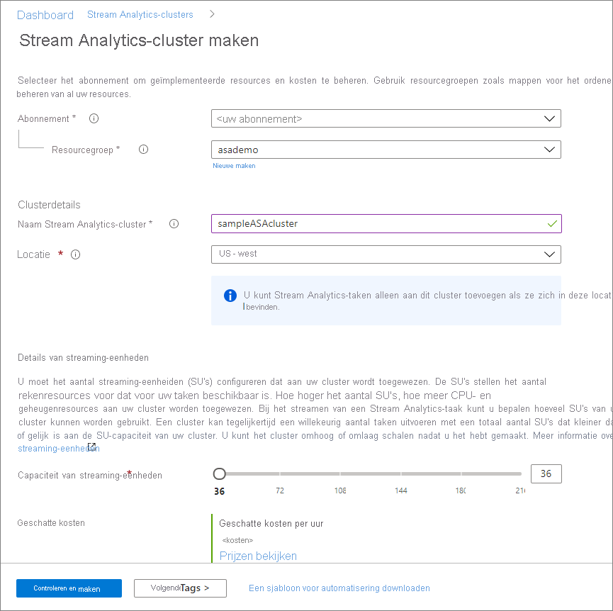

# Quickstart: Een toegewezen Azure Stream Analytics-cluster maken met behulp van Azure Portal

Azure Portal gebruiken om een Azure Stream Analytics-cluster te maken. Een [Stream Analytics-cluster](cluster-overview.md) is een implementatie met één tenant die kan worden gebruikt voor complexe en veeleisende streaming gebruiksscenario's. U kunt meerdere Stream Analytics-taken uitvoeren in een Stream Analytics-cluster.

## Vereisten

* Een Azure-account met een actief abonnement. [Gratis een account maken](https://azure.microsoft.com/free/?WT.mc_id=A261C142F)
* Voltooiing van [quickstart: Een Stream Analytics-taak maken via Azure Portal](stream-analytics-quick-create-portal.md).

## Een Stream Analytics-cluster maken

In dit gedeelte maakt u een Stream Analytics-clusterresource.

1. Meld u aan bij de [Azure-portal](https://portal.azure.com).

1. Selecteer **Een resource maken**. Typ en selecteer *Stream Analytics-cluster* in het zoekvak **Marketplace doorzoeken**. Selecteer vervolgens **Toevoegen**.

   :::image type="content" source="./media/create-cluster/search-result.png" alt-text="Resultaat van zoekopdracht naar Stream Analytics-cluster.":::

1. Voer op de pagina **Stream Analytics-cluster maken** de basisinstellingen voor het nieuwe cluster in.

   |Instelling|Waarde|Beschrijving |
   |---|---|---|
   |Abonnement|Abonnementsnaam|Selecteer het Azure-abonnement dat u voor dit Stream Analytics-cluster wilt gebruiken. |
   |Resourcegroep|Naam van de resourcegroep|Selecteer een resourcegroep of selecteer **Nieuwe maken** en voer vervolgens een unieke naam in voor de nieuwe resourcegroep. |
   |Clusternaam|Een unieke naam|Voer een naam in voor uw Stream Analytics-cluster.|
   |Locatie|De regio die zich het dichtst bij uw gegevensbronnen en sinks bevindt|Selecteer de geografische locatie waar u uw Stream Analytics-cluster wilt hosten. Gebruik de locatie die zich het dichtst bij uw gegevensbronnen en sinks bevindt voor analyses met een lage latentie.|
   |Capaciteit van streaming-eenheden|36 tot en met 216 |Bepaal de grootte van het cluster door te schatten hoeveel Stream Analytics-taken u van plan bent uit te voeren en wat het totale aantal streaming-eenheden voor de taak is. U kunt beginnen met 36 streaming-eenheden en later naar behoefte omhoog of omlaag schalen.|

   

1. Selecteer **Controleren + maken**. U kunt de secties **Tags** overslaan.

1. Controleer de clusterinstellingen en selecteer vervolgens **Maken**. Het maken van een cluster is een langdurige bewerking. Het kan ongeveer 60 minuten duren voordat het cluster is voltooid. Wacht tot de portal-pagina **Uw implementatie is voltooid** weergeeft. In de tussentijd kunt u [Stream Analytics-taken](stream-analytics-quick-create-portal.md#create-a-stream-analytics-job) die u wilt uitvoeren op dit cluster maken en ontwikkelen als u dat nog niet hebt gedaan.

1. Selecteer **Ga naar resource** om naar de pagina Stream Analytics-cluster te gaan.

## Uw cluster verwijderen

U kunt uw Stream Analytics-cluster verwijderen als u niet van plan bent om er Stream Analytics-taken op uit te voeren. Verwijder uw cluster door de volgende stappen uit te voeren in Azure Portal:

1. Ga naar **Stream Analytics-taken** onder **Instellingen** en stop alle taken die worden uitgevoerd.

1. Ga naar het **Overzicht** van het cluster. Selecteer **Verwijderen** en volg de instructies voor het verwijderen van uw cluster.

## Volgende stappen

In deze quickstart hebt u geleerd hoe u een Azure Stream Analytics-cluster maakt. Ga naar het volgende artikel voor meer informatie over het uitvoeren van een Stream Analytics-taak in uw cluster:

> [!div class="nextstepaction"]
> [Stream Analytics-taken beheren in een Stream Analytics-cluster](manage-jobs-cluster.md)
