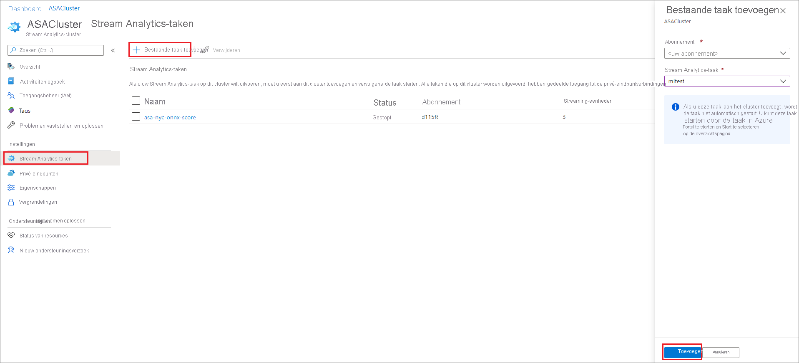
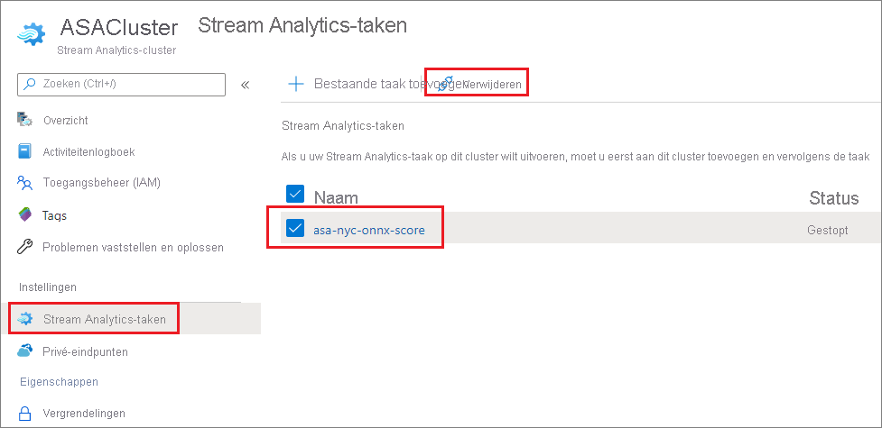

# Taken toevoegen en verwijderen in een Azure Stream Analytics-cluster

U kunt meerdere Stream Analytics-taken uitvoeren in een Stream Analytics-cluster. Het uitvoeren van taken op een cluster is een eenvoudig proces met twee stappen: Voeg de taak aan het cluster toe en start de taak. In dit artikel wordt beschreven hoe u taken kunt toevoegen aan en verwijderen uit een bestaand cluster. Volg de snelstartgids om [een Stream Analytics-cluster te maken](create-cluster.md) als u er nog geen hebt.

## Een Stream Analytics-taak toevoegen aan een cluster

Alleen bestaande Stream Analytics-taken kunnen aan clusters worden toegevoegd. Volg de Snelstartgids om [meer te weten te komen over het maken van een taak](stream-analytics-quick-create-portal.md) met behulp van de Azure Portal. Wanneer u een taak hebt die u wilt toevoegen aan een cluster, gebruikt u de volgende stappen om de taak toe te voegen aan uw cluster.

1. Zoek en selecteer uw Stream Analytics-cluster in de Azure Portal.

1. Selecteer **Stream Analytics-taken** onder **Instellingen**. Selecteer vervolgens **Bestaande taak toevoegen**.

1. Selecteer het abonnement en de Stream Analytics-taak die u aan het cluster wilt toevoegen. Alleen Stream Analytics-taken die zich in dezelfde regio bevinden als het cluster, kunnen worden toegevoegd aan het cluster.

   

1. Nadat u de taak aan het cluster hebt toegevoegd, gaat u naar de taakresource en [start u de taak](start-job.md#azure-portal). De taak wordt vervolgens gestart op uw cluster.

U kunt alle andere bewerkingen, zoals controle, waarschuwingen en diagnostische logboeken uitvoeren op de pagina van de Stream Analytics-taakresource.

## Een Stream Analytics-taak uit een cluster verwijderen

Stream Analytics-taken moeten de status Gestopt hebben voordat deze uit het cluster kunnen worden verwijderd. Als uw taak nog steeds wordt uitgevoerd, stopt u de taak voordat u verdergaat met de volgende stappen.

1. Zoek en selecteer uw Stream Analytics-cluster.

1. Selecteer **Stream Analytics-taken** onder **Instellingen**.

1. Selecteer de taken die u wilt verwijderen uit het cluster en selecteer vervolgens **Verwijderen**.

   

   Wanneer een taak wordt verwijderd uit een Stream Analytics-cluster, wordt deze teruggestuurd naar de standaardomgeving met meerdere tenants.

## Volgende stappen

U weet nu hoe u in uw Azure Stream Analytics-cluster taken kunt toevoegen en verwijderen. Daarna krijgt u meer informatie over het beheren van privé-eindpunten en het schalen van uw clusters:

* [Een Azure Stream Analytics-cluster schalen](scale-cluster.md)
* [Privé-eindpunten maken en verwijderen in een Azure Stream Analytics-cluster](private-endpoints.md)
