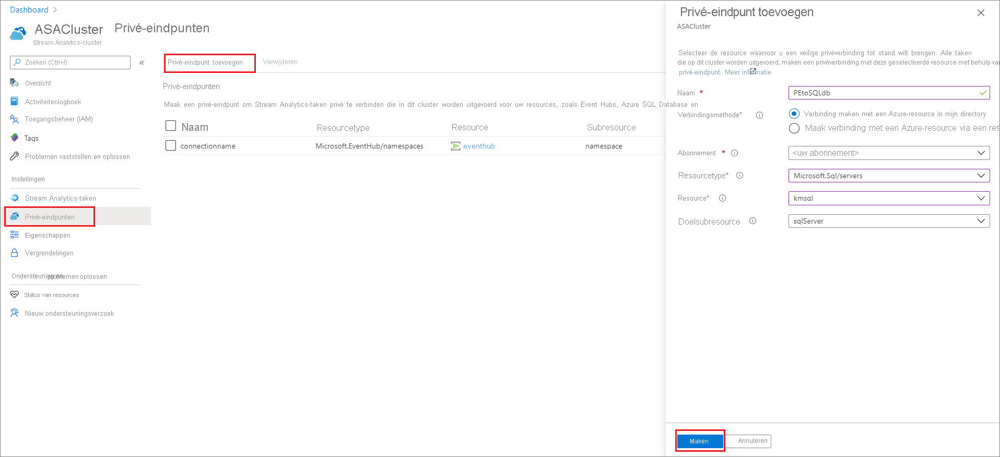
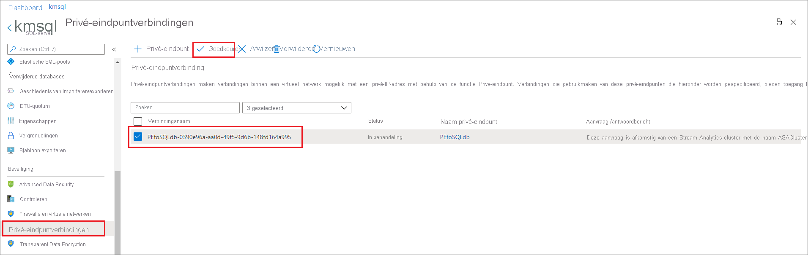
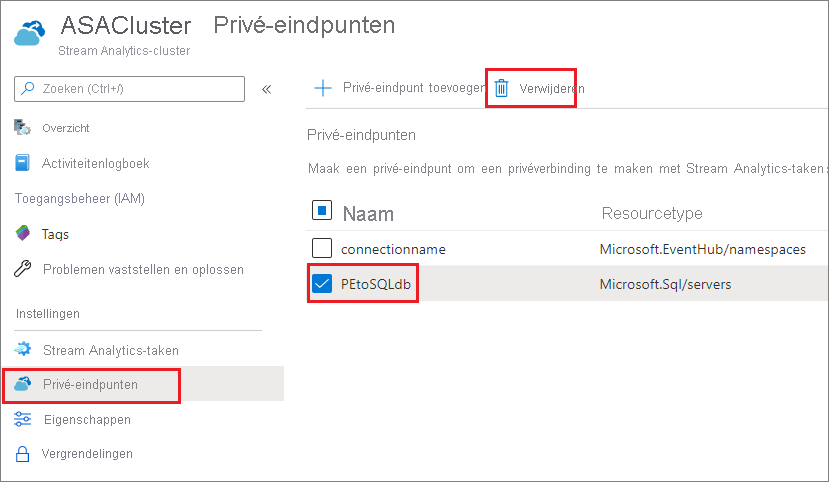

# Privé-eindpunten maken en verwijderen in een Azure Stream Analytics-cluster

U kunt uw Azure Stream Analytics-taken die worden uitgevoerd op een cluster verbinden met invoer- en uitvoerbronnen die zich achter een firewall of een Azure Virtual Network (VNet) bevinden. Eerst maakt u een privé-eindpunt voor een resource, zoals Azure Event Hub of Azure SQL Database, in uw Stream Analytics-cluster. Vervolgens keurt u de verbinding met het privé-eindpunt goed vanuit uw invoer of uitvoer.

Zodra u de verbinding hebt goedgekeurd, heeft elke taak die in uw Stream Analytics-cluster wordt uitgevoerd toegang tot de resource via het privé-eindpunt. In dit artikel wordt beschreven hoe u privé-eindpunten maakt en verwijdert in een Stream Analytics-cluster.

## Een privé-eindpunt in een Stream Analytics-cluster maken

In dit gedeelte leert u hoe u een privé-eindpunt in een Stream Analytics cluster maakt.

1. Zoek en selecteer uw Stream Analytics-cluster in Azure Portal.

1. Selecteer onder **Alle instellingen** de optie **Privé-eindpunten**.

1. Selecteer **Privé-eindpunt toevoegen** en voer de volgende gegevens in om de resource te kiezen die u veilig wilt openen via een privé-eindpunt.

   |Instelling|Waarde|
   |---|---|
   |Naam|Voer een naam in voor uw privé-eindpunt. Als deze naam al wordt gebruikt, maakt u een unieke naam.|
   |Verbindingsmethode|Selecteer **Verbinding maken met een Azure-resource in mijn directory**.  U kunt een van uw resources kiezen om veilig verbinding te maken met het privé-eindpunt, of u kunt verbinding maken met de resource van iemand anders met behulp van een resource-id of alias die met u is gedeeld.|
   |Abonnement|Selecteer uw abonnement.|
   |Resourcetype|Kies het [resourcetype dat aan uw resource is toegewezen](../private-link/private-endpoint-overview.md#private-link-resource).|
   |Resource|Selecteer de resource waarmee u verbinding wilt maken met behulp van een privé-eindpunt.|
   |Subresource van doel|Het type subresource voor de resource die hierboven is geselecteerd en die door uw privé-eindpunt kan worden geopend.|

   

1. Keur de verbinding goed vanaf de doelresource. Als u in de vorige stap bijvoorbeeld een privé-eindpunt hebt gemaakt voor een Azure SQL Database-exemplaar, gaat u naar dit SQL Database exemplaar en ziet u een verbinding die in behandeling is en moet worden goedgekeurd. Het kan een paar minuten duren voordat de verbindingsaanvraag wordt weergegeven.

    

1. U kunt teruggaan naar uw Stream Analytics-cluster om de status van **Goedkeuring klant in behandeling** in **In afwachting van de DNS-instelling** in **Setup voltooid** te zien wijzigen. Dit duurt enkele minuten.

## Een privé-eindpunt in een Stream Analytics-cluster verwijderen

1. Zoek en selecteer uw Stream Analytics-cluster in Azure Portal.

1. Selecteer onder **Alle instellingen** de optie **Privé-eindpunten**.

1. Selecteer het privé-eindpunt dat u wilt verwijderen en selecteer **Verwijderen**.

   

## Volgende stappen

U hebt nu een algemeen beeld van het beheren van privé-eindpunten in een Azure Stream Analytics cluster. U kunt nu gaan leren hoe u uw clusters schaalt en taken uitvoert in uw cluster:

* [Een Azure Stream Analytics-cluster schalen](scale-cluster.md)
* [Stream Analytics-taken beheren in een Stream Analytics-cluster](manage-jobs-cluster.md)