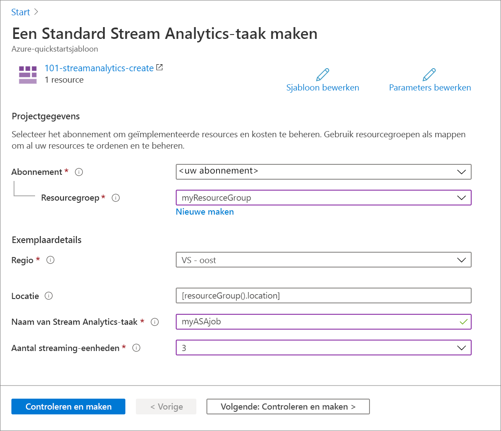

# <a name="quickstart-create-an-azure-stream-analytics-job-by-using-an-arm-template"></a>Quickstart: Een Azure Stream Analytics-taak maken via een ARM-sjabloon

In deze quickstart gebruikt u een ARM-sjabloon (Azure Resource Manager-sjabloon) om een Azure Stream Analytics-taak te maken. Nadat de taak is gemaakt, valideert u de implementatie.

[!INCLUDE [About Azure Resource Manager](../../includes/resource-manager-quickstart-introduction.md)]

Als uw omgeving voldoet aan de vereisten en u benkend bent met het gebruik van ARM-sjablonen, selecteert u de knop **Implementeren naar Azure**. De sjabloon wordt in Azure Portal geopend.

[](https://portal.azure.com/#create/Microsoft.Template/uri/https%3A%2F%2Fraw.githubusercontent.com%2FAzure%2Fazure-quickstart-templates%2Fmaster%2F101-streamanalytics-create%2Fazuredeploy.json)

## <a name="prerequisites"></a>Vereisten

U hebt het volgende nodig om dit artikel te voltooien:

* Een Azure-abonnement: u kunt [een gratis abonnement maken](https://azure.microsoft.com/free/).

## <a name="review-the-template"></a>De sjabloon controleren

De sjabloon die in deze quickstart wordt gebruikt, komt uit [Azure-quickstartsjablonen](https://azure.microsoft.com/resources/templates/101-streamanalytics-create/).

:::code language="json" source="~/quickstart-templates/101-streamanalytics-create/azuredeploy.json":::

De Azure-resource die in de sjabloon is gedefinieerd, is [Microsoft.StreamAnalytics/StreamingJobs](/azure/templates/microsoft.streamanalytics/streamingjobs): een Azure Stream Analytics-taak maken.

## <a name="deploy-the-template"></a>De sjabloon implementeren

In deze sectie gaat u een Azure Stream Analytics-taak maken met behulp van de ARM-sjabloon.

1. Selecteer de volgende afbeelding om u aan te melden bij Azure en een sjabloon te openen. Met de sjabloon wordt een Azure Stream Analytics-taak gemaakt.

   [](https://portal.azure.com/#create/Microsoft.Template/uri/https%3A%2F%2Fraw.githubusercontent.com%2FAzure%2Fazure-quickstart-templates%2Fmaster%2F101-streamanalytics-create%2Fazuredeploy.json)

2. Geef de vereiste waarden op om de Azure Stream Analytics-taak te maken.

   

   Geef de volgende waarden op:

   |Eigenschap  |Beschrijving  |
   |---------|---------|
   |**Abonnement**     | Selecteer uw Azure-abonnement in de vervolgkeuzelijst.        |
   |**Resourcegroep**     | Geef aan of u een nieuwe resourcegroep wilt maken of een bestaande groep wilt gebruiken. Een resourcegroep is een container met gerelateerde resources voor een Azure-oplossing. Zie [Overzicht van Azure Resource Manager](../azure-resource-manager/management/overview.md) voor meer informatie. |
   |**Regio**     | Selecteer **VS - oost**. Zie [Producten beschikbaar per regio](https://azure.microsoft.com/regions/services/) voor andere beschikbare regio's.        |
   |**Naam van Stream Analytics-taak**     | Geef de Stream Analytics-taak een naam.      |
   |**Aantal streaming-eenheden**     |  Kies het aantal streaming-eenheden dat u nodig hebt. Zie [Streaming-eenheden begrijpen en aanpassen](stream-analytics-streaming-unit-consumption.md).       |

3. Selecteer **Controleren en maken** en vervolgens **Maken**.

## <a name="review-deployed-resources"></a>Geïmplementeerde resources bekijken

U kunt de Azure Portal gebruiken om de Azure Stream Analytics-taak te controleren of het volgende Azure CLI- of Azure PowerShell-script gebruiken om de resource weer te geven.

### <a name="azure-cli"></a>Azure CLI

```azurecli-interactive
echo "Enter your Azure Stream Analytics job name:" &&
read streamAnalyticsJobName &&
echo "Enter the resource group where the Azure Stream Analytics job exists:" &&
read resourcegroupName &&
az stream-analytics job show -g $resourcegroupName -n $streamAnalyticsJobName
```

### <a name="azure-powershell"></a>Azure PowerShell

```azurepowershell-interactive
$resourceGroupName = Read-Host -Prompt "Enter the resource group name where your Azure Stream Analytics job exists"
(Get-AzResource -ResourceType "Microsoft.StreamAnalytics/StreamingJobs" -ResourceGroupName $resourceGroupName).Name
 Write-Host "Press [ENTER] to continue..."
```

## <a name="clean-up-resources"></a>Resources opschonen

Als u verder wilt gaan met volgende zelfstudies, kunt u deze resources laten staan. Als u de resourcegroep niet meer nodig hebt, verwijdert u deze. Hierdoor wordt ook de Azure Stream Analytics-taak verwijderd. Zo verwijdert u de resourcegroep met behulp van Azure CLI of Azure PowerShell:

### <a name="azure-cli"></a>Azure CLI

```azurecli-interactive
echo "Enter the Resource Group name:" &&
read resourceGroupName &&
az group delete --name $resourceGroupName &&
echo "Press [ENTER] to continue ..."
```

### <a name="azure-powershell"></a>Azure PowerShell

```azurepowershell-interactive
$resourceGroupName = Read-Host -Prompt "Enter the Resource Group name"
Remove-AzResourceGroup -Name $resourceGroupName
Write-Host "Press [ENTER] to continue..."
```

## <a name="next-steps"></a>Volgende stappen

In deze quickstart hebt u een Azure Stream Analytics-taak gemaakt met behulp van een ARM-sjabloon en de implementatie gevalideerd. Ga naar het volgende artikel voor meer informatie over hoe u een ARM-sjabloon voor een bestaande taak exporteert met behulp van Visual Studio-code.

> [!div class="nextstepaction"]
> [Een ARM-sjabloon voor een Azure Stream Analytics-taak exporteren](resource-manager-export.md)
