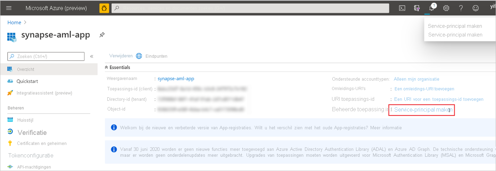

# Quickstart: Een nieuwe gekoppelde Azure Machine Learning-service maken in Synapse

In deze quickstart koppelt u een Synapse Analytics-werkruimte aan een Azure Machine Learning-werkruimte. Als u deze werkruimten koppelt, kunt u Azure Machine Learning gebruiken vanuit verschillende ervaringen in Synapse.

Met deze koppeling naar een Azure Machine Learning-werkruimte kunt u bijvoorbeeld het volgende doen:

- Voer uw Azure Machine Learning-pijplijnen uit als een stap in uw Synapse-pijplijnen. Zie [Azure Machine Learning-pijplijnen uitvoeren](/azure/data-factory/transform-data-machine-learning-service) voor meer informatie.

- Breid uw gegevens uit met voorspellingen door een machine learning-model uit het register van het Azure Machine Learning-model te halen en het model in Synapse SQL-pools te scoren. Zie [Zelfstudie: De wizard voor scoren van het Machine Learning-model voor Synapse SQL-pools](tutorial-sql-pool-model-scoring-wizard.md) voor meer informatie.

## Vereisten

- Azure-abonnement: [Maak een gratis abonnement aan](https://azure.microsoft.com/free/).
- [Synapse Analytics-werkruimte](../get-started-create-workspace.md) met een ADLS Gen2-opslagaccount dat is geconfigureerd als de standaardopslag. U moet de **Inzender van de Storage Blob-gegevens** zijn van het ADLS Gen2-bestandssysteem waar u mee werkt.
- [Azure Machine Learning-werkruimte](/azure/machine-learning/how-to-manage-workspace).
- U hebt machtigingen nodig (of een aanvraag bij iemand die machtigingen heeft) om een service-principal en een geheim te maken waarmee u de gekoppelde service kunt maken. Aan deze service-principal moet de rol Inzender zijn toegewezen in de Azure Machine Learning-werkruimte.

## Aanmelden bij Azure Portal

Meld u aan bij [Azure Portal](https://portal.azure.com/)

## Een service-principal maken

Met deze stap maakt u een nieuwe service-principal. Als u een bestaande service-principal wilt gebruiken, kunt u deze stap overslaan.
1. Open Azure Portal. 

1. Ga naar **Azure Active Directory** -> **App-registraties**.

1. Klik op **Nieuwe registratie**. Volg de instructies in de gebruikersinterface om een nieuwe toepassing te registreren.

1. Nadat de toepassing is geregistreerd. Genereer een geheim voor de toepassing. Ga naar **Uw toepassing** -> **Certificaat en geheim**. Klik op **Clientgeheim toevoegen** om een geheim te genereren. Bewaar het geheim veilig voor later gebruik.

   

1. Maak een service-principal voor de toepassing. Ga naar **Uw toepassing** -> **Overzicht** en klik op **Service-principal maken**. In sommige gevallen wordt deze service-principal automatisch gemaakt.

   

1. Voeg de service-principal toe als Inzender van de Azure Machine Learning-werkruimte. Hiervoor moet u eigenaar zijn van de resourcegroep waartoe de Azure Machine Learning-werkruimte behoort.

   

## Een gekoppelde service maken

1. Ga in de Synapse-werkruimte waar u de nieuwe gekoppelde Azure Machine Learning-service wilt maken, naar **Beheer** -> **Gekoppelde service** en maak een nieuwe gekoppelde service met het type Azure Machine Learning.

   

2. Vul het formulier in:

   - Service-principal-id: Dit is de **id van de toepassing (client)** van de toepassing.
  
     > [!NOTE]
     > Dit is NIET de naam van de toepassing. U vindt deze id op de pagina Overzicht van de toepassing. Het is een lange tekenreeks die lijkt op het volgende: 81707eac-AB38-406u-8f6c-10ce76a568d5.

   - Sleutel voor de service-principal: Het geheim dat u hebt gegenereerd in de vorige sectie.

3. Klik op **Verbinding testen** om te controleren of de configuratie juist is. Klik op **Opslaan** als de verbindingstest is gelukt.

   Als de verbindingstest mislukt, controleert u of de id en het geheim van de service-principal juist zijn en probeert u het opnieuw.

## Volgende stappen

- [Zelfstudie: Wizard voor scoren van het Machine Learning-model - SQL-pool](tutorial-sql-pool-model-scoring-wizard.md)
- [Machine Learning-mogelijkheden in Azure Synapse Analytics (preview van werkruimten)](what-is-machine-learning.md)
