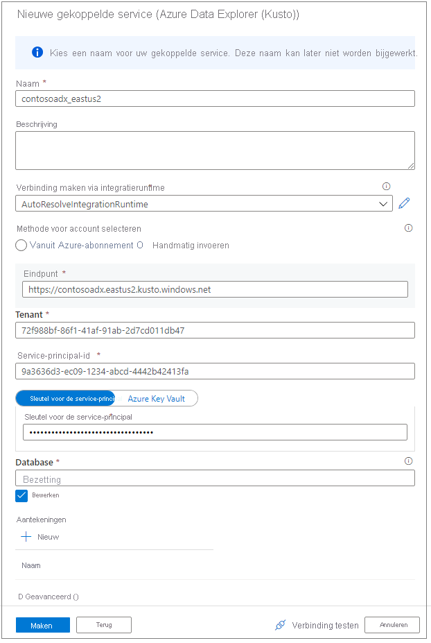

# Verbinding maken met Azure Data Explorer met behulp van Synapse Apache Spark

In dit artikel wordt beschreven hoe u toegang krijgt tot Azure Data Explorer-databases vanuit Synapse Studio met Synapse Apache Spark. 

## Vereisten

* [Maak een Azure Data Explorer-cluster en -database](/azure/data-explorer/create-cluster-database-portal).
* Een bestaande Synapse-werkruimte , of u kunt een nieuwe werkruimte maken door deze [quickstart](./quickstart-create-workspace.md) te volgen 
* Een bestaande Synapse Apache Spark-pool, of u kunt een nieuwe pool maken door deze [quickstart](./quickstart-create-apache-spark-pool-portal.md) te volgen
* [Maak een Azure AD-app door een Azure AD-toepassing in te richten.](/azure/data-explorer/kusto/management/access-control/how-to-provision-aad-app)
* Verleen uw Azure AD-app toegang tot uw database door [Azure Data Explorer-databasemachtigingen beheren](/azure/data-explorer/manage-database-permissions) te volgen

## Ga naar Synapse Studio

Selecteer **Synapse Studio starten** vanuit een Synapse-werkruimte. Selecteer op de startpagina van Synapse Studio de optie **Gegevens**. U wordt nu naar **Data Object Explorer** geleid.

## Een Azure Data Explorer-database verbinden met een Synapse-werkruimte

Het verbinden van een Azure Data Explorer-database met een werkruimte wordt uitgevoerd via een gekoppelde service. Met een gekoppelde service van Azure Data Explorer kunnen gebruikers bladeren in gegevens en deze verkennen, lees- en schrijfbewerkingen vanuit Apache Spark for Azure Synapse Analytics uitvoeren en integratietaken in een pijplijn uitvoeren.

Voer de volgende stappen uit vanuit Data Object Explorer om een rechtstreekse verbinding met een Azure Data Explorer-cluster te maken:

1. Selecteer het pictogram **+** bij de optie Gegevens
2. Selecteer **Verbinding maken** met externe gegevens
3. Selecteer **Azure Data Explorer (Kusto)**
5. Selecteer **Doorgaan**
6. Geef de gekoppelde service een naam. De naam wordt weergegeven in Object Explorer en wordt tijdens Synapse-uitvoeringen gebruikt om verbinding te maken met de database. We raden u aan een beschrijvende naam te gebruiken
7. Selecteer het Azure Data Explorer-cluster in uw abonnement of voer de URI in.
8. Voer de service-principal-id en service-principal-sleutel in (zorg ervoor dat deze service-principal toegang tot de database heeft voor leesbewerkingen en toegang tot de ingestor heeft voor het opnemen van gegevens)
9. Voer de naam van de Azure Data Explorer-database in
10. Klik op **Verbinding testen** om te controleren of u over de juiste machtigingen beschikt
11. Selecteer **Maken**

    

    > [!NOTE]
    > (Optioneel) Bij het testen van de verbinding wordt schrijftoegang niet gevalideerd. Zorg ervoor dat uw service-principal-id schrijftoegang heeft tot de Azure Data Explorer-database.

12. Azure Data Explorer-clusters en -databases worden weergegeven op het tabblad **Gekoppeld** in de sectie Azure Data Explorer. 

    

    > [!NOTE] 
    > In de huidige release worden de databaseobjecten gevuld op basis van de machtigingen van uw AAD-account op de Azure Data Explorer-databases. Wanneer u de Apache Spark-notebooks of -integratietaken uitvoert, wordt de referentie in de koppelingsservice gebruikt (service-principal).

## Snel communiceren via met code gegenereerde acties

* Wanneer u met de rechtermuisknop op een database of tabel klikt, beschikt u over een lijst met gebaren waarmee een voorbeeld-Spark-notebook wordt geactiveerd voor het lezen en schrijven van gegevens en het streamen van gegevens naar Azure Data Explorer. 
    

* Hier volgt een voorbeeld van het lezen van gegevens. Koppel het notebook aan uw Spark-pool en voer de cel  uit

   > [!NOTE] 
   > Bij de eerste uitvoering kan het langer dan drie minuten duren om de Spark-sessie te initiëren. Volgende uitvoeringen zullen veel sneller gaan.  

## Beperkingen
Azure Data Explorer-connector wordt momenteel niet ondersteund in een met Azure Synapse beheerd VNET.

## Volgende stappen

* [Voorbeeldcode met geavanceerde opties](https://github.com/Azure/azure-kusto-spark/blob/master/samples/src/main/python/SynapseSample.py)
* [Spark-connector voor Azure Data Explorer (Kusto)](https://github.com/Azure/azure-kusto-spark)