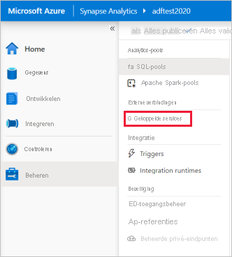
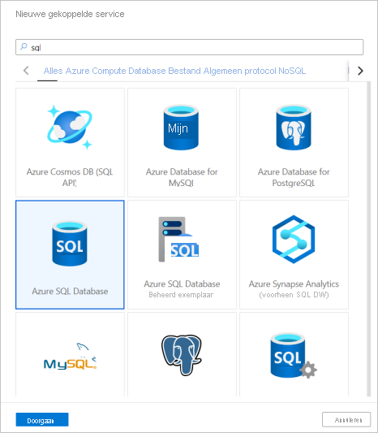
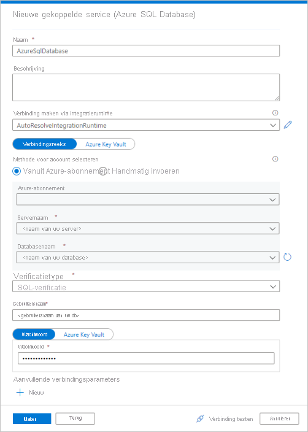
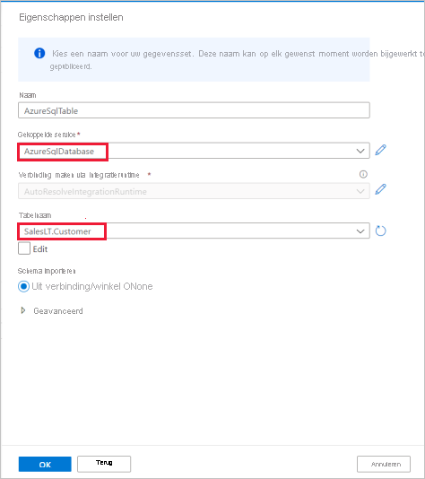
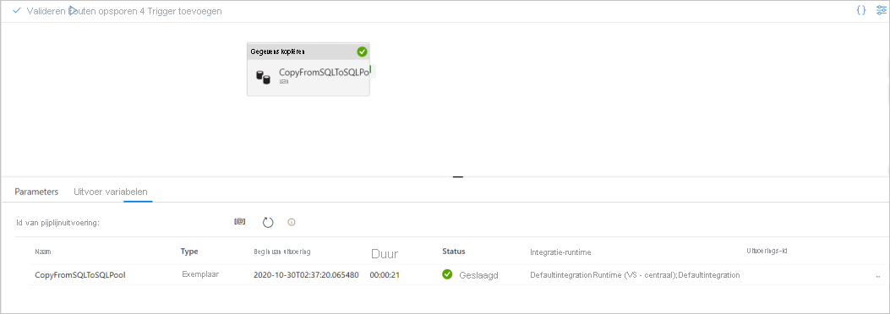

# Quickstart: Gegevens laden in een SQL-pool met de kopieeractiviteit

Azure Synapse Analytics biedt diverse analyse-engines waarmee u uw gegevens kunt opnemen, transformeren, modelleren en analyseren. Een SQL-pool biedt op T-SQL gebaseerde reken- en opslagmogelijkheden. Nadat u een SQL-pool in uw Synapse-werkruimte hebt gemaakt, kunnen gegevens worden geladen, gemodelleerd, verwerkt en geleverd voor een snellere analyse.

In deze quickstart leert u hoe u *gegevens laadt vanuit Azure SQL Database naar Azure Synapse Analytics*. U kunt vergelijkbare stappen volgen om gegevens te kopiëren vanuit andere typen gegevensarchieven. De vergelijkbare stroom geldt ook voor het kopiëren van gegevens tussen andere bronnen en een sink.

## Vereisten

* Azure-abonnement: Als u nog geen abonnement op Azure hebt, maak dan een [gratis account](https://azure.microsoft.com/free/) aan voordat u begint.
* Azure Synapse-werkruimte: Maak een Synapse-werkruimte met behulp van de Azure Portal. Volg hierbij de instructies in [Quickstart: Een Synapse-werkruimte maken](quickstart-create-workspace.md).
* Azure SQL Database: In deze zelfstudie worden gegevens uit de voorbeeldgegevensset Adventure Works LT gekopieerd naar Azure SQL Database. U kunt deze voorbeelddatabase maken in SQL Database door de instructies in [Een voorbeelddatabase maken in Azure SQL Database](../azure-sql/database/single-database-create-quickstart.md) te volgen. U kunt ook andere gegevensarchieven gebruiken door vergelijkbare stappen te volgen.
* Azure Storage-account: Azure Storage wordt gebruikt als *faseringsgebied* in de kopieerbewerking. Als u geen Azure-opslagaccount hebt, raadpleegt u de instructies in [Een opslagaccount maken](../storage/common/storage-account-create.md).
* Azure Synapse Analytics: U gebruikt een SQL-pool als sinkgegevens archief. Als u geen exemplaar van Azure Synapse Analytics hebt, raadpleegt u het artikel [Een SQL-pool maken](quickstart-create-sql-pool-portal.md) om er een te maken.

### Ga naar Synapse Studio

Wanneer uw Azure Synapse-werkruimte is gemaakt, kunt u Synapse Studio op twee manieren openen:

* Open de Synapse-werkruimte in de [Azure-portal](https://ms.portal.azure.com/#home). Selecteer bovenaan de sectie Overzicht de optie **Synapse Studio starten**.
* Open [Azure Synapse Analytics](https://web.azuresynapse.net/) en meld u aan bij uw werkruimte.

In deze quickstart wordt de werkruimte met de naam 'adftest2020' als voorbeeld gebruikt. Er wordt automatisch naar de startpagina van Synapse Studio genavigeerd.

## Gekoppelde services maken

In Azure Synapse Analytics definieert u de verbindingsgegevens voor andere services in een gekoppelde service. In deze sectie maakt u de volgende twee soorten gekoppelde services: Gekoppelde services voor Azure SQL Database en voor Azure Data Lake Storage Gen2.

1. Selecteer het tabblad **Beheren** in het linkernavigatievenster op de startpagina van Synapse Studio.
1. Klik onder Externe verbindingen op Gekoppelde services.
  
   

1. Selecteer **Nieuw** om een gekoppelde service toe te voegen.
1. Selecteer in de galerie de optie **Azure SQL Database**. Selecteer vervolgens **Doorgaan**. U kunt 'sql' in het zoekvak typen om de connectors te filteren.

   

1. Selecteer op de pagina Nieuwe gekoppelde service uw servernaam en databasenaam in de vervolgkeuzelijst en geef de gebruikersnaam en het wachtwoord op. Klik op **Verbinding testen** om de instellingen te valideren en selecteer vervolgens **Maken**.

   

1. Herhaal stap 3 en 4, maar selecteer nu **Azure Data Lake Storage Gen2** in de galerie. Selecteer op de pagina Nieuwe gekoppelde service de naam van het opslagaccount in de vervolgkeuzelijst. Klik op **Verbinding testen** om de instellingen te valideren en selecteer vervolgens **Maken**. 

   
 
## Een pijplijn maken

Een pijplijn bevat de logische stroom voor het uitvoeren van een reeks activiteiten. In deze sectie maakt u een pijplijn met een kopieeractiviteit waarmee gegevens uit Azure SQL Database worden opgenomen in een SQL-pool.

1. Ga naar het tabblad **Integreren**. Klik op het pluspictogram naast de kop Pijplijnen en selecteer Pijplijn.

   

1. Sleep onder *Verplaatsen en transformeren* in het deelvenster *Activiteiten* de optie **Gegevens kopiëren** naar het pijplijncanvas.
1. Klik op de kopieeractiviteit en ga naar het tabblad Bron. Selecteer **Nieuw** om een nieuwe brongegevensset te maken.

   

1. Selecteer **Azure SQL Database** als uw gegevensarchief en klik vervolgens op **Doorgaan**.
1. Selecteer in het deelvenster *Eigenschappen instellen* de gekoppelde Azure SQL Database-service die u in de vorige stap hebt gemaakt. 
1. Selecteer onder Tabelnaam een voorbeeldtabel die u wilt gebruiken in de volgende kopieeractiviteit. In deze quickstart wordt de tabel 'SalesLT.Customer' als voorbeeld gebruikt. 

   
1. Als u klaar bent, klikt u op **OK**.
1. Klik op de kopieeractiviteit en ga naar het tabblad Sink. Selecteer **Nieuw** om een nieuwe sinkgegevensset te maken.
1. Selecteer **SQL Analytics-pool** als uw gegevensarchief en klik vervolgens op **Doorgaan**.
1. Selecteer in het deelvenster **Eigenschappen instellen** de SQL Analytics-pool die u in de vorige stap hebt gemaakt. Als u naar een bestaande tabel schrijft, selecteert u deze onder *Tabelnaam* in de vervolgkeuzelijst. Als dat niet het geval is, vinkt u 'Bewerken' een en voert u de nieuwe tabelnaam in. Als u klaar bent, klikt u op **OK**.
1. Schakel voor de instellingen van de sinkgegevensset **Automatisch tabel maken** in het veld Tabeloptie in.

   

1. Ga naar de pagina **Instellingen** en selecteer het selectievakje voor **Fasering inschakelen**. Deze optie is van toepassing als uw brongegevens niet compatibel zijn met PolyBase. Selecteer in de sectie **Faseringsinstellingen** de gekoppelde Azure Data Lake Storage Gen2-service die u in de vorige stap hebt gemaakt als het faseringsarchief. 

    Het archief wordt gebruikt voor het faseren van de gegevens voordat deze in Azure Synapse Analytics worden geladen met PolyBase. Nadat de kopieeractiviteit is voltooid, worden de tijdelijke gegevens in Azure Data Lake Storage Gen2 automatisch opgeschoond.

   

1. Klik in de werkbalk op **Valideren** om de pijplijn te valideren. U ziet het resultaat van de validatie-uitvoer voor de pijplijn aan de rechterkant van de pagina. 

## Fouten opsporen in de pijplijn en de pijplijn publiceren

Wanneer u klaar bent met het configureren van de pijplijn, kunt u deze uitvoeren om fouten op te sporten voordat u uw artefacten publiceert en te controleren of alles klopt.

1. Selecteer **Fouten opsporen** om fouten op te sporen in de pijplijn. De status van de pijplijnuitvoering wordt weergegeven op het tabblad **Uitvoer** onder in het venster. 

   

1. Zodra de pijplijn goed kan worden uitgevoerd, selecteert u **Alles publiceren** in de bovenste werkbalk. Met deze actie publiceert u entiteiten (gegevenssets en pijplijnen) die u hebt gemaakt in de Synapse Analytics-service.
1. Wacht tot u het bericht **Gepubliceerd** ziet. Als u meldingen wilt bekijken, selecteert u de knop met de bel in de rechterbovenhoek. 

## De pijplijn activeren en controleren

In deze sectie moet u de pijplijn die u in de vorige stap heeft gepubliceerd, handmatig activeren. 

1. Selecteer op de werkbalk de optie **Trigger toevoegen** en selecteer vervolgens **Nu activeren**. Klik op de pagina **Pijplijnuitvoering** op **OK**.  
1. Ga naar het tabblad **Controle** in de zijbalk aan de linkerkant. U ziet een pijplijn die wordt geactiveerd door een handmatige trigger. 
1. Wanneer de uitvoering van de pijplijn is voltooid, selecteert u de koppeling onder de kolom **Pijplijnnaam** om de details van de uitvoering van de activiteit weer te geven of om de pijplijn opnieuw uit te voeren. Omdat er in dit voorbeeld slechts één activiteit is, ziet u slechts één vermelding in de lijst. 
1. Selecteer de koppeling **Details** (pictogram van een bril) in de kolom **Naam activiteit** om details van de kopieerbewerking te zien. U kunt details bekijken, zoals het volume van de gegevens die uit de bron zijn gekopieerd naar de sink, de gegevensdoorvoer, de uitvoeringsstappen met de overeenkomstige duur en de gebruikte configuraties.

   

1. Als u wilt terugkeren naar de weergave met de pijplijnuitvoeringen, selecteert u de koppeling **Alle pijplijnuitvoeringen** bovenaan. Selecteer **Vernieuwen** om de lijst te vernieuwen.
1. Controleer of uw gegevens correct zijn geschreven in de SQL-pool.

## Volgende stappen

Ga naar het volgende artikel voor meer informatie over ondersteuning voor Azure Synapse Analytics:

> [!div class="nextstepaction"]
> [Pijplijn en activiteiten](https://docs.microsoft.com/azure/data-factory/concepts-pipelines-activities?toc=/azure/synapse-analytics/toc.json&bc=/azure/synapse-analytics/breadcrumb/toc.json)
> [Connectoroverzicht](https://docs.microsoft.com/azure/data-factory/connector-overview?toc=/azure/synapse-analytics/toc.json&bc=/azure/synapse-analytics/breadcrumb/toc.json)
> [Kopieeractiviteit](https://docs.microsoft.com/azure/data-factory/copy-activity-overview?toc=/azure/synapse-analytics/toc.json&bc=/azure/synapse-analytics/breadcrumb/toc.json)