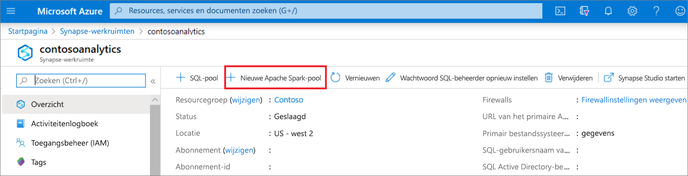
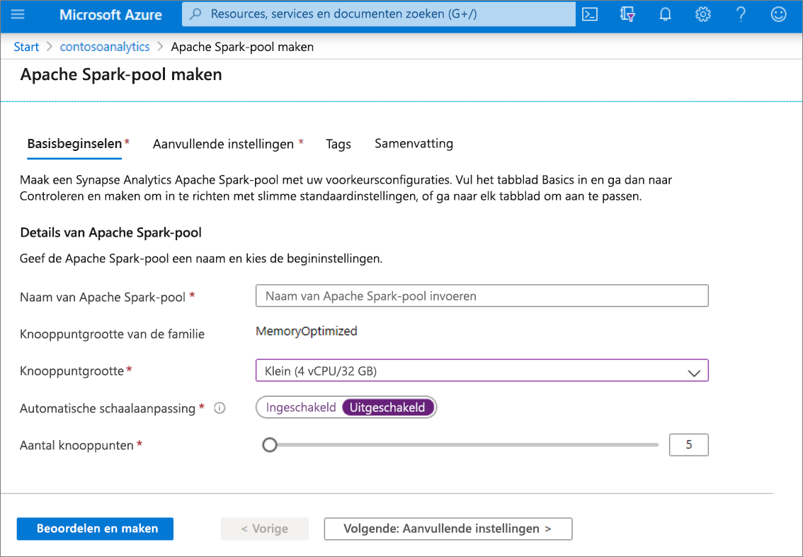
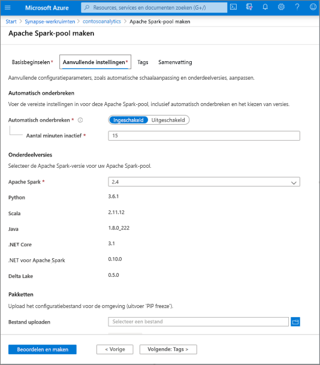
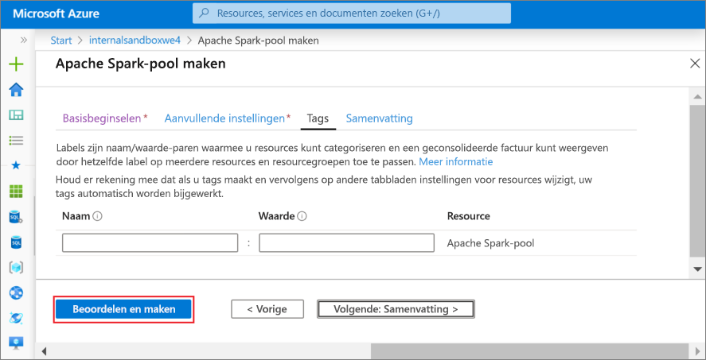
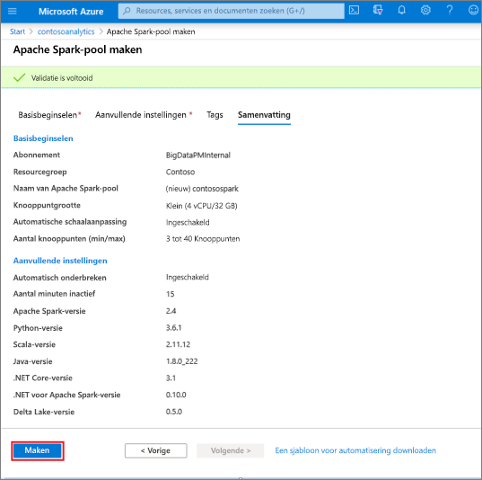
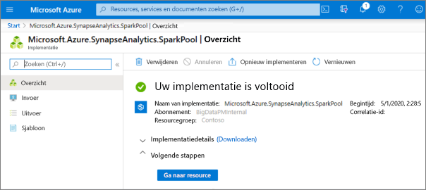
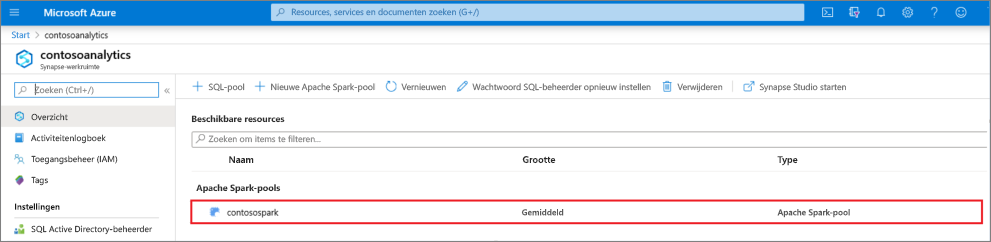
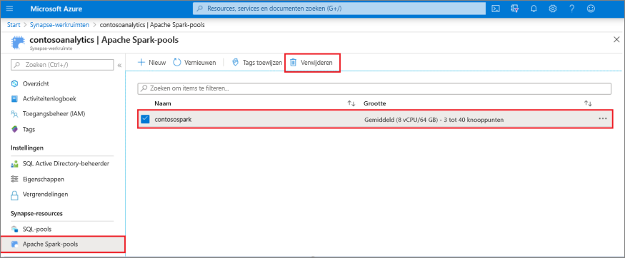
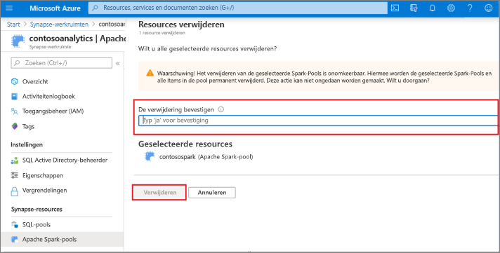

# Quickstart: Een nieuwe Apache Spark-pool maken (preview) met behulp van de Azure-portal

Azure Synapse Analytics biedt diverse analyse-engines waarmee u uw gegevens kunt opnemen, transformeren, modelleren, analyseren en distribueren. Een Apache Spark-pool biedt opensource rekenmogelijkheden voor big data. Nadat u een Apache Spark-pool in uw Synapse-werkruimte hebt gemaakt, kunnen gegevens worden geladen, gemodelleerd, verwerkt en gedistribueerd voor een snellere analyse.

In deze quickstart leert u hoe u een Apache Spark-pool in een Synapse-werkruimte kunt maken met behulp van de Azure-portal.

> [!IMPORTANT]
> Spark-instanties worden pro rato per minuut gefactureerd, ongeacht of u ze wel of niet gebruikt. Zorg er daarom voor dat u de Spark-instantie afsluit wanneer u deze niet meer nodig hebt of stel een korte time-out in. Zie voor meer informatie de sectie **Resources opschonen** van dit artikel.

Als u geen Azure-abonnement hebt, [maakt u een gratis account voordat u begint](https://azure.microsoft.com/free/).

## Vereisten

- Azure-abonnement: [u kunt een gratis abonnement nemen](https://azure.microsoft.com/free/)
- [Synapse Analytics-werkruimte](quickstart-create-workspace.md)

## Aanmelden bij Azure Portal

Meld u aan bij [Azure Portal](https://portal.azure.com/)

## Navigeer naar de Synapse-werkruimte 
1. Navigeer naar de Synapse-werkruimte waar de Apache Spark-pool wordt gemaakt door de servicenaam (of de resourcenaam) rechtstreeks in de zoekbalk te typen.

1. Typ in de lijst met werkruimten de naam (of een deel van de naam) van de werkruimte die u wilt openen. In dit voorbeeld gebruiken we een werkruimte met de naam **contosoanalytics**.

## Nieuwe Apache Spark-pool maken

1. Selecteer in de Synapse-werkruimte waar u de Apache Spark-pool wilt maken de opdracht **Nieuwe Apache Spark-pool** in de bovenste balk.
    
2. Voer de volgende gegevens in op het tabblad **Basisinformatie**:

    |Instelling | Voorgestelde waarde | Beschrijving |
    | :------ | :-------------- | :---------- |
    | **Naam van Apache Spark-pool** | Een geldige poolnaam | Dit is de naam die de Apache Spark-pool krijgt. |
    | **Knooppuntgrootte** | Klein (4 vCPU / 32 GB) | Stel dit in op de kleinste grootte om de kosten voor deze quickstart te verlagen |
    | **Automatisch schalen** | Uitgeschakeld | Automatisch schalen voor deze quickstart is niet vereist |
    | **Aantal knooppunten** | 5 | Gebruik een kleine grootte om de kosten voor deze quickstart te beperken |

    
    > [!IMPORTANT]
    > Er gelden specifieke beperkingen voor de namen die Apache Spark-pools kunnen gebruiken. Namen mogen alleen letters of cijfers bevatten, moeten uit maximaal 15 tekens bestaan, moeten beginnen met een letter, mogen geen gereserveerde woorden bevatten en moeten uniek zijn in de werkruimte.

3. Selecteer **Volgende: extra instellingen** en controleer de standaardinstellingen. Wijzig geen standaardinstellingen.
    

4. **Volgende: tags** selecteren. Voeg geen tags toe.
    

5. Selecteer **Controleren + maken**.

6. Zorg ervoor dat de gegevens juist zijn en zijn gebaseerd op wat eerder is ingevoerd en selecteer **Maken**.
    

7. Op dit punt wordt de stroom voor de resource-inrichting gestart en het wordt aangegeven zodra deze klaar is.
    

8. Als u nadat het inrichten is voltooid weer naar de werkruimte gaat, wordt hier een nieuwe vermelding voor de zojuist gemaakte Apache Spark-pool weergegeven.
    

9. Op dit moment worden er geen resources uitgevoerd, worden er geen kosten in rekening gebracht voor Spark, u hebt metagegevens gemaakt over de Spark-exemplaren die u wilt maken.

## Resources opschonen

Volg de onderstaande stappen om de Apache Spark-pool uit de werkruimte te verwijderen.
> [!WARNING]
> Als u een Apache Spark-pool verwijdert, wordt de analyse-engine uit de werkruimte verwijderd. Het is niet langer mogelijk om verbinding te maken met de pool en alle query's, pijplijnen en notebooks die deze Apache Spark-pool gebruiken, werken niet meer.

Ga als volgt te werk om de Apache Spark-pool te verwijderen:

1. Navigeer naar de blade Apache Spark-pools in de werkruimte.
2. Selecteer de Apache Spark-pool die u wilt verwijderen (in dit geval **contosospark**).
3. Druk op **Verwijderen**.
 
4. Bevestig dat u de werkruimte wilt verwijderen en selecteer de knop **Verwijderen**.
 
5. Wanneer het proces is voltooid, wordt de Apache Spark-pool niet meer weergegeven in de werkruimteresources.

## Volgende stappen

- Zie [Quickstart: Een Apache Spark-notebook maken](quickstart-apache-spark-notebook.md).
- Zie [Quickstart: Een Synapse SQL-pool maken met behulp van de Azure-portal](quickstart-create-sql-pool-portal.md).
