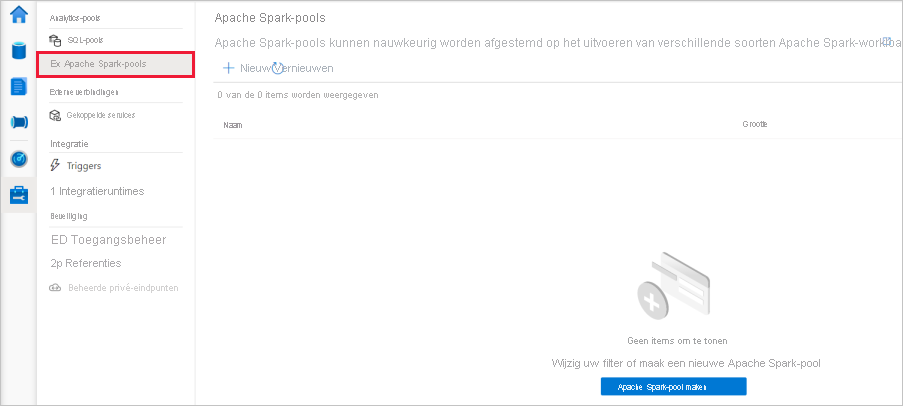
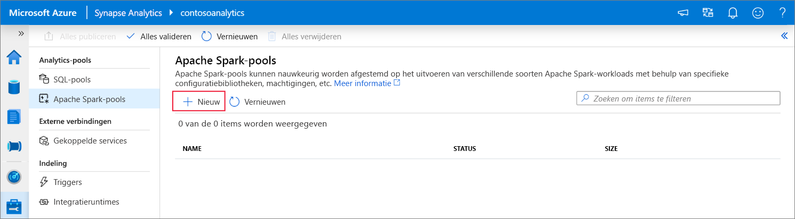
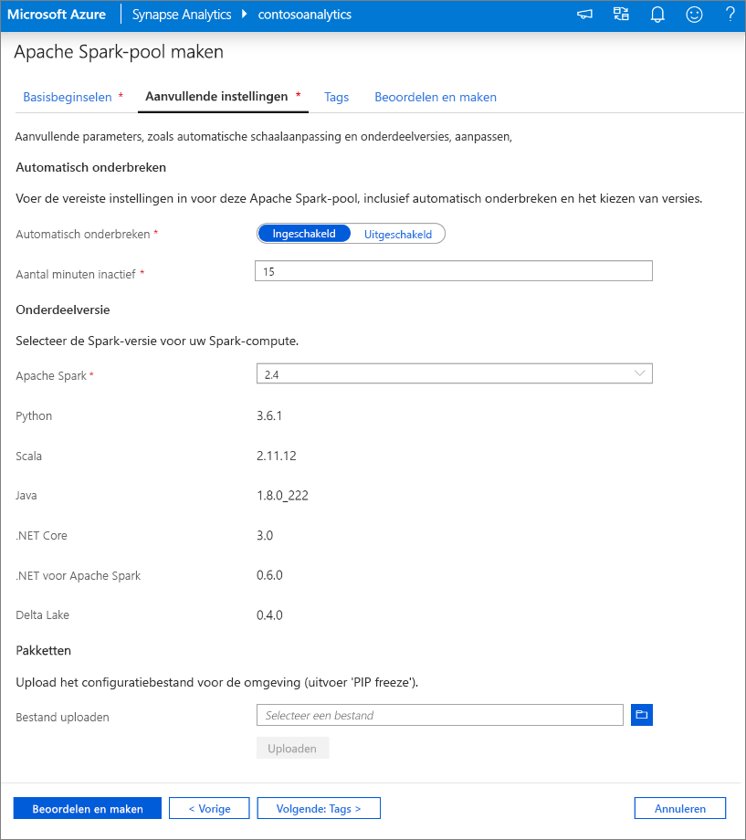
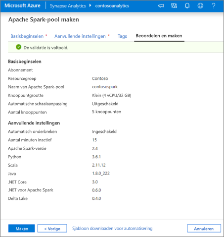
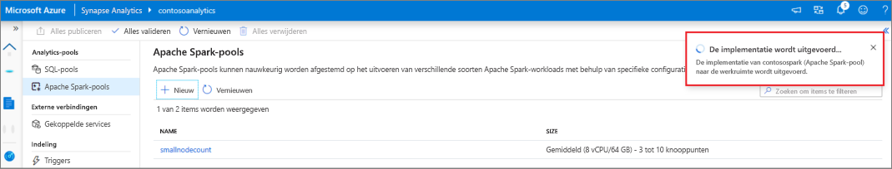
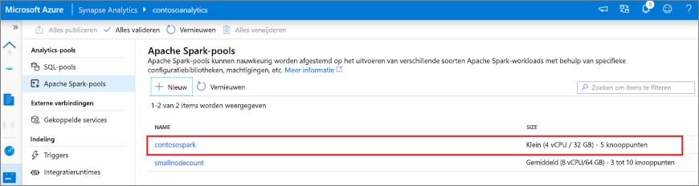
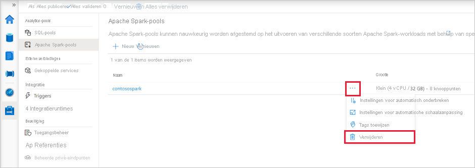
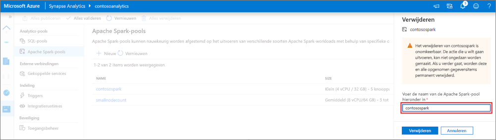

# Quickstart: een Apache Spark-pool maken (preview) met behulp van Synapse Studio

Azure Synapse Analytics biedt diverse analyse-engines waarmee u uw gegevens kunt opnemen, transformeren, modelleren, analyseren en gebruiken. Een Apache Spark-pool biedt opensource-rekenmogelijkheden voor big data. Nadat u een Apache Spark-pool in uw Synapse-werkruimte hebt gemaakt, kunnen gegevens worden geladen, gemodelleerd, verwerkt en gebruikt om inzichten te verkrijgen.  

In deze snelstart wordt stapsgewijs beschreven hoe u een Apache Spark-pool in een Synapse-werkruimte maakt met behulp van Synapse Studio.

> [!IMPORTANT]
> Spark-instanties worden pro rato per minuut gefactureerd, ongeacht of u ze wel of niet gebruikt. Zorg er daarom voor dat u de Spark-instantie afsluit wanneer u deze niet meer nodig hebt of stel een korte time-out in. Zie voor meer informatie de sectie **Resources opschonen** van dit artikel.

Als u geen Azure-abonnement hebt, [maakt u een gratis account voordat u begint](https://azure.microsoft.com/free/).

## Vereisten

- Azure-abonnement: [u kunt een gratis abonnement nemen](https://azure.microsoft.com/free/)
- [Synapse-werkruimte](./quickstart-create-workspace.md)

## Aanmelden bij Azure Portal

Meld u aan bij [Azure Portal](https://portal.azure.com/)

## Navigeer naar de Synapse-werkruimte

1. Navigeer naar de Synapse-werkruimte waar de Apache Spark-pool wordt gemaakt door de servicenaam (of de resourcenaam) rechtstreeks in de zoekbalk te typen.

1. Typ in de lijst met werkruimten de naam (of een deel van de naam) van de werkruimte die u wilt openen. In dit voorbeeld gebruiken we een werkruimte met de naam **contosoanalytics**.

## Synapse Studio starten 

1. Selecteer in het werkruimteoverzicht **Synapse Studio starten** om de locatie te openen waar de Apache Spark-pool wordt gemaakt. Typ de servicenaam of resourcenaam rechtstreeks in de zoekbalk.

## De Apache Spark-pool maken in Synapse Studio

1. Ga op de startpagina van Synapse Studio naar de **Beheerhub** in de linkernavigatiebalk door het pictogram **Beheren** te selecteren.

1. Ga in de Beheerhub naar het gedeelte **Apache Spark-pools** voor een overzicht van de huidige lijst met Apache Spark-pools die beschikbaar zijn in de werkruimte.

1. Selecteer **+ Nieuw**. De wizard Nieuwe Apache Spark-pool maken wordt weergegeven. 

1. Voer de volgende gegevens in op het tabblad **Basisinformatie**:

    | Instelling | Voorgestelde waarde | Beschrijving |
    | :------ | :-------------- | :---------- |
    | **Naam van Apache Spark-pool** | contosospark | Dit is de naam die de Apache Spark-pool krijgt. |
    | **Knooppuntgrootte** | Klein (4 vCPU / 32 GB) | Stel dit in op de kleinste grootte om de kosten voor deze quickstart te verlagen |
    | **Automatisch schalen** | Uitgeschakeld | Automatisch schalen in deze snelstart is niet vereist |
    | **Aantal knooppunten** | 8 | Gebruik een kleine grootte om de kosten in deze snelstart te beperken|
    
    
    > [!IMPORTANT]
    > Er gelden specifieke beperkingen voor de namen die Apache Spark-pools kunnen gebruiken. Namen mogen alleen letters of cijfers bevatten, moeten uit maximaal 15 tekens bestaan, moeten beginnen met een letter, mogen geen gereserveerde woorden bevatten en moeten uniek zijn in de werkruimte.

1. Laat op het volgende tabblad (Extra instellingen) alle standaardinstellingen staan en druk op **Beoordelen en maken** (we voegen geen tags toe).
 

1. We voegen nu geen tags toe. Selecteer daarom **Beoordelen en maken**.

1. Controleer op het tabblad **Beoordelen en maken** of de gegevens juist zijn en zijn gebaseerd op wat eerder is ingevoerd. Druk daarna op **Maken**. 
 

1. Het inrichtingsproces wordt gestart door de Apache Spark-pool.

1. Zodra het inrichten is voltooid, wordt de nieuwe Apache Spark-pool weergegeven in de lijst.

## Apache Spark-poolresources opschonen met behulp van Synapse Studio

Volg de onderstaande stappen om de Apache Spark-pool uit de werkruimte te verwijderen met behulp van Synapse Studio.
> [!WARNING]
> Als u een Spark-pool verwijdert, wordt de analyse-engine uit de werkruimte verwijderd. Het is niet langer mogelijk om verbinding te maken met de pool en alle query's, pijplijnen en notitieblokken die deze Spark-pool gebruiken, werken niet meer.

Ga als volgt te werk om de Apache Spark-pool te verwijderen:

1. Navigeer naar de Apache Spark-pools in de Beheerhub in Synapse Studio.
1. Selecteer het beletselteken naast de Apache-pool die u wilt verwijderen (in dit geval **contosospark**) om de opdrachten voor de Apache Spark-pool weer te geven.

1. Druk op **Verwijderen**.
1. Bevestig dat u de werkruimte wilt verwijderen en selecteer de knop **Verwijderen**.
 
1. Wanneer het proces is voltooid, wordt de Apache Spark-pool niet meer weergegeven in de werkruimteresources. 

## Volgende stappen

- Zie [Quickstart: Een Apache Spark-pool maken in Synapse Studio met behulp van webhulpprogramma's](quickstart-apache-spark-notebook.md).
- Zie [Quickstart: Een Apache Spark-pool maken met behulp van de Azure-portal](quickstart-create-apache-spark-pool-portal.md).