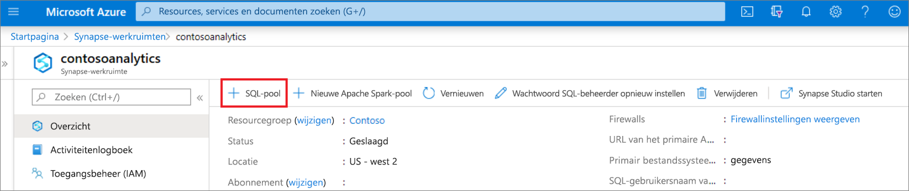
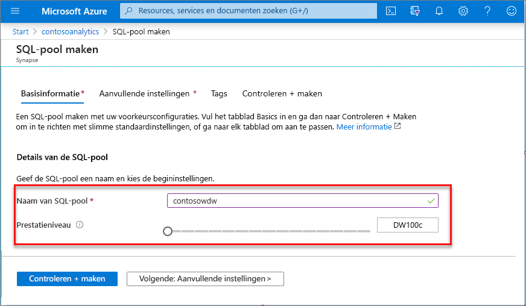
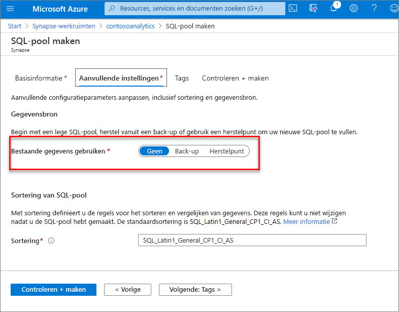
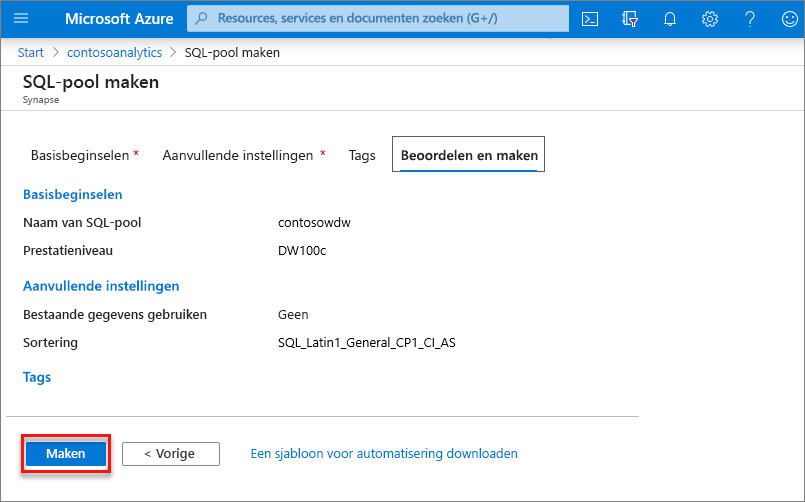
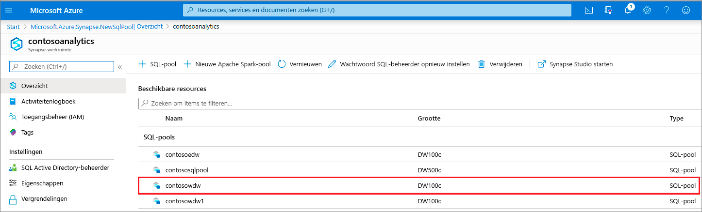
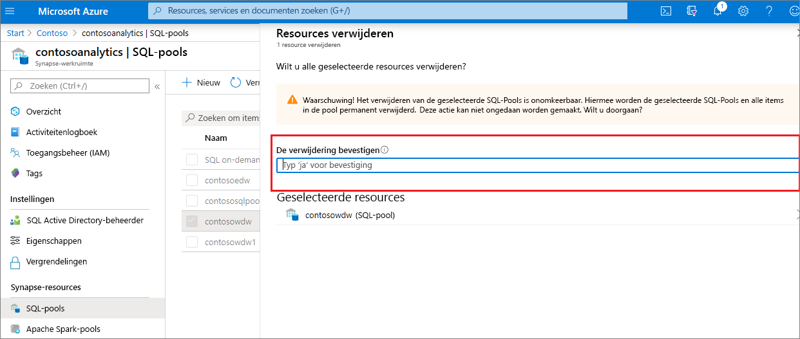

# Quickstart: Een Synapse SQL-pool (preview) maken met behulp van de Azure-portal

Azure Synapse Analytics biedt diverse analyse-engines waarmee u uw gegevens kunt opnemen, transformeren, modelleren en analyseren. Een SQL-pool biedt op T-SQL gebaseerde reken- en opslagmogelijkheden. Nadat u een SQL-pool in uw Synapse-werkruimte hebt gemaakt, kunnen gegevens worden geladen, gemodelleerd, verwerkt en geleverd voor een snellere analyse.

In deze snelstart leert u hoe u een SQL-pool kunt maken in een Synapse-werkruimte met behulp van de Azure-portal.

Als u geen Azure-abonnement hebt, [maakt u een gratis account voordat u begint](https://azure.microsoft.com/free/).

## Vereisten

- Azure-abonnement: [u kunt een gratis abonnement nemen](https://azure.microsoft.com/free/)
- [Synapse-werkruimte](./quickstart-create-workspace.md)

## Aanmelden bij Azure Portal

Meld u aan bij [Azure Portal](https://portal.azure.com/)

## Navigeer naar de Synapse-werkruimte

1. Navigeer naar de Synapse-werkruimte waar de SQL-pool wordt gemaakt door de servicenaam (of de resourcenaam) rechtstreeks in de zoekbalk te typen.
 
1. Typ in de lijst met werkruimten de naam (of een deel van de naam) van de werkruimte die u wilt openen. In dit voorbeeld gebruiken we een werkruimte met de naam **contosoanalytics**.

## Nieuwe SQL-pool maken

1. Selecteer in de Synapse-werkruimte waar u de SQL-pool wilt maken de opdracht **Nieuwe SQL-pool** in de bovenste balk.

2. Voer de volgende gegevens in op het tabblad **Basisinformatie**:

    | Instelling | Voorgestelde waarde | Beschrijving |
    | :------ | :-------------- | :---------- |
    | **Naam van SQL-pool** | Een geldige naam | De naam van de SQL-pool. |
    | **Prestatieniveau** | DW100c | Stel in op de kleinste grootte om de kosten voor deze snelstart te verlagen |

  
    
    > [!IMPORTANT]
    > Er gelden specifieke beperkingen voor de namen die SQL-pools kunnen gebruiken. Namen mogen geen speciale tekens bevatten, mogen niet langer zijn dan 15 tekens, mogen geen gereserveerde woorden bevatten en moeten uniek zijn in de werkruimte.

3. Selecteer **Volgende: Aanvullende instellingen**.
4. Selecteer **Geen** om de SQL-pool zonder gegevens in te richten. Behoud de standaardsortering.

5. Selecteer **Controleren + maken**.
6. Zorg ervoor dat de gegevens juist zijn en zijn gebaseerd op wat eerder is ingevoerd. Selecteer **Maken**.

7. Op dit punt wordt de stroom voor de resource-inrichting gestart.
 

8. Als u nadat het inrichten is voltooid weer naar de werkruimte gaat, wordt hier een nieuwe vermelding voor de zojuist gemaakte SQL-pool weergegeven.
 

Nadat de SQL-pool is gemaakt, is deze beschikbaar in de werkruimte voor het laden van gegevens, het verwerken van stromen, het lezen vanuit de lake, enzovoort.

## Resources opschonen

Voer de onderstaande stappen uit om de SQL-pool uit de werkruimte te verwijderen.
> [!WARNING]
> Als u een SQL-pool verwijdert, worden zowel de analyse-engine als de gegevens die zijn opgeslagen in de database van de verwijderde SQL-pool uit de werkruimte verwijderd. Het is niet langer mogelijk om verbinding te maken met de SQL-pool en alle query's, pijplijnen en notitieblokken die worden gelezen of geschreven naar deze SQL-pool, werken niet meer.

Als u de SQL-pool wilt verwijderen, voert u de volgende stappen uit:

1. Navigeer naar de blade SQL-pools op de blade Werkruimte
1. Selecteer de SQL-pool die u wilt verwijderen (in dit geval **contosowdw**)
1. Klik na het selecteren op **Verwijderen**
1. Bevestig het verwijderen en druk op de knop **Verwijderen** 
1. Wanneer het proces is voltooid, wordt de SQL-pool niet meer weergegeven in de werkruimteresources.

## Volgende stappen

- Zie [Quickstart: Een Apache Spark-pool maken in Synapse Studio met behulp van webhulpprogramma's](quickstart-apache-spark-notebook.md).
- Zie [Quickstart: Een Apache Spark-pool maken met behulp van de Azure-portal](quickstart-create-apache-spark-pool-portal.md).
