# Quickstart: Een Synapse SQL-pool (preview) maken met behulp van Synapse Studio

Azure Synapse Analytics biedt diverse analyse-engines waarmee u uw gegevens kunt opnemen, transformeren, modelleren en analyseren. Een SQL-pool biedt op T-SQL gebaseerde reken- en opslagmogelijkheden. Nadat u een SQL-pool in uw Synapse-werkruimte hebt gemaakt, kunnen gegevens worden geladen, gemodelleerd, verwerkt en geleverd voor een snellere analyse.

In deze quickstart wordt stapsgewijs beschreven hoe u een SQL-pool in een Synapse-werkruimte maakt met behulp van Synapse Studio.

Als u geen Azure-abonnement hebt, [maakt u een gratis account voordat u begint](https://azure.microsoft.com/free/).

## Vereisten

- Azure-abonnement: [u kunt een gratis abonnement nemen](https://azure.microsoft.com/free/)
- [Synapse-werkruimte](quickstart-create-workspace.md)

## Aanmelden bij Azure Portal

Meld u aan bij [Azure Portal](https://portal.azure.com/)

## Navigeer naar de Synapse-werkruimte

1. Navigeer naar de Synapse-werkruimte waar de SQL-pool wordt gemaakt door de servicenaam (of de resourcenaam) rechtstreeks in de zoekbalk te typen.
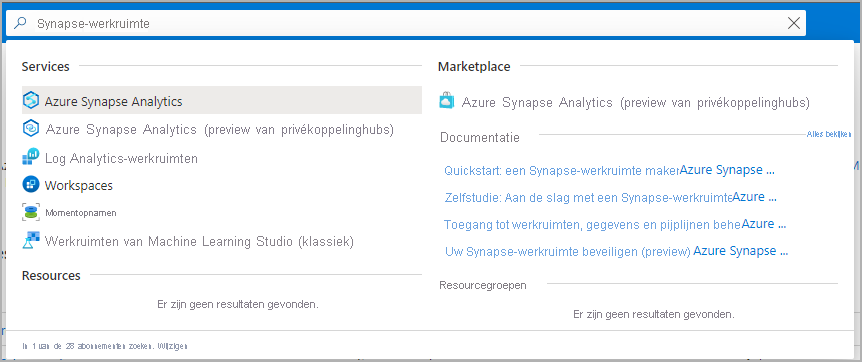
1. Typ in de lijst met werkruimten de naam (of een deel van de naam) van de werkruimte die u wilt openen. In dit voorbeeld gebruiken we een werkruimte met de naam **contosoanalytics**.
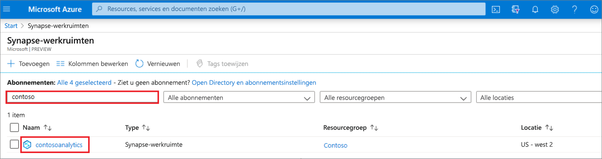

## Synapse Studio starten

1. Selecteer in het werkruimteoverzicht **Synapse Studio starten** om de locatie te openen waar de SQL-pool wordt gemaakt. Typ de servicenaam of resourcenaam rechtstreeks in de zoekbalk.
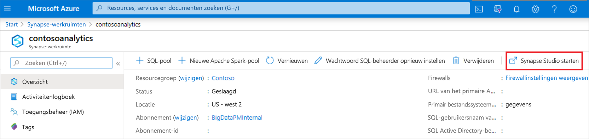

## Een SQL-pool maken met behulp van Synapse Studio

1. Ga op de startpagina van Synapse Studio naar de **Beheerhub** in de linkernavigatiebalk door het pictogram **Beheren** te selecteren.
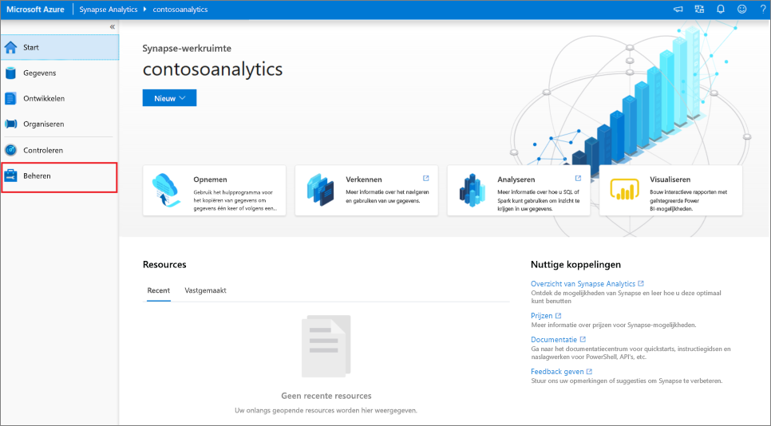

1. Ga in de Beheerhub naar het gedeelte **SQL-pools** voor een overzicht van de huidige lijst met SQL-pools die beschikbaar zijn in de werkruimte.
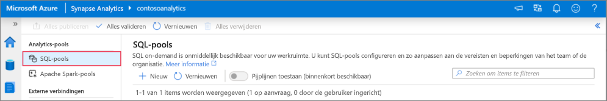

1. Selecteer opdracht **en Nieuw**. De wizard Nieuwe SQL-pool maken wordt weergegeven. 
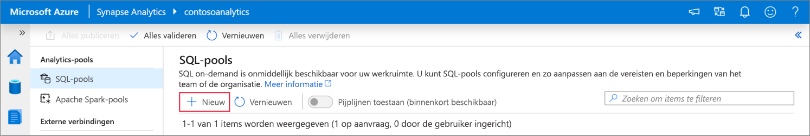

1. Voer de volgende gegevens in op het tabblad **Basisinformatie**:

    | Instelling | Voorgestelde waarde | Beschrijving |
    | :------ | :-------------- | :---------- |
    | **Naam van SQL-pool** | contosoedw | Dit is de naam die de SQL-pool krijgt. |
    | **Prestatieniveau** | DW100c | Stel dit in op de kleinste grootte om de kosten voor deze quickstart te verlagen |

    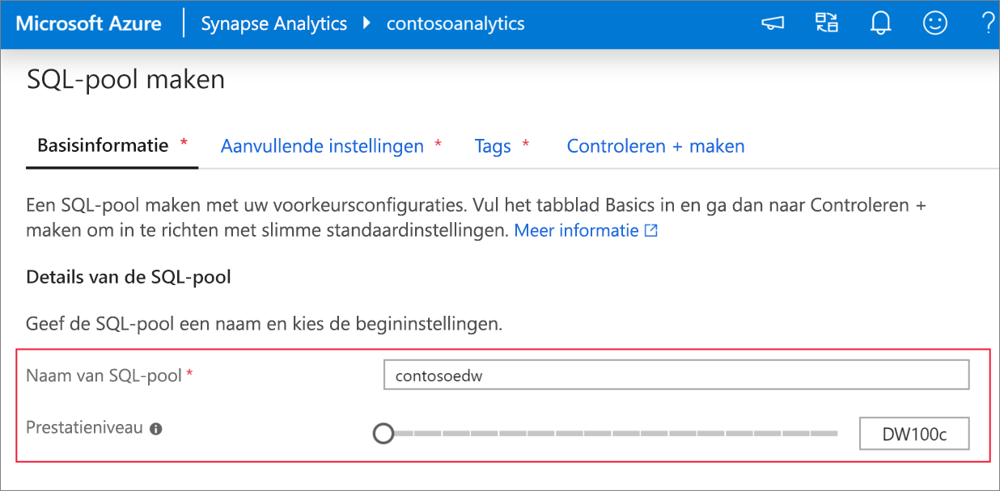
    > [!IMPORTANT]
    > Er gelden specifieke beperkingen voor de namen die SQL-pools kunnen gebruiken. Namen mogen geen speciale tekens bevatten, mogen niet langer zijn dan 15 tekens, mogen geen gereserveerde woorden bevatten en moeten uniek zijn in de werkruimte.

4. Selecteer op het volgende tabblad **Extra instellingen** **Geen** om de SQL-pool zonder gegevens in te richten. Behoud de geselecteerde standaardsortering.
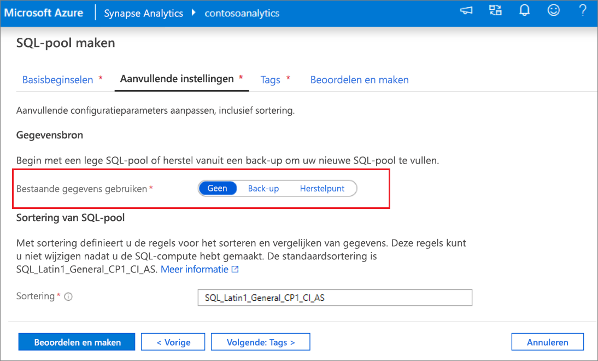

1. We voegen nu geen tags toe. Selecteer daarom  **Volgende: Beoordelen en maken**.

1. Controleer op het tabblad **Beoordelen en maken** of de gegevens juist zijn en zijn gebaseerd op wat eerder is ingevoerd. Druk daarna op **Maken**. 
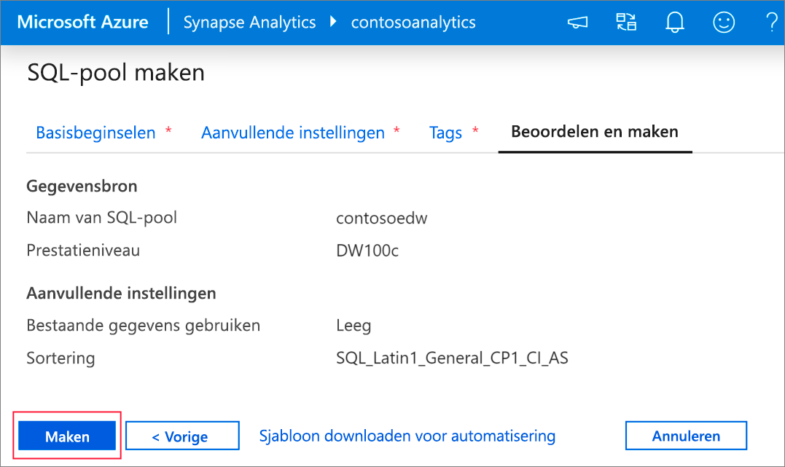

1. Op dit punt wordt de stroom voor de resource-inrichting gestart.

1. Als u nadat het inrichten is voltooid weer naar de werkruimte gaat, wordt hier een nieuwe vermelding voor de zojuist gemaakte SQL-pool weergegeven.
 

1. Als de SQL-pool is eenmaal gemaakt, is deze beschikbaar in de werkruimte voor het laden van gegevens, het verwerken van stromen, het lezen vanuit de lake, enzovoort.

## SQL-pool opschonen met behulp van Synapse Studio    

Volg de onderstaande stappen om de SQL-pool uit de werkruimte te verwijderen met behulp van Synapse Studio.
> [!WARNING]
> Als u een SQL-pool verwijdert, wordt de analyse-engine uit de werkruimte verwijderd. Het is niet langer mogelijk om verbinding te maken met de pool en alle query's, pijplijnen en scripts die deze SQL-pool gebruiken, werken niet meer.

Ga als volgt te werk om de SQL-pool te verwijderen:

1. Navigeer naar de SQL-pools in de Beheerhub in Synapse Studio.
1. Selecteer de ellips in de SQL-pool die u wilt verwijderen (in dit geval **contosoedw**) om de opdrachten voor de SQL-pool weer te geven: 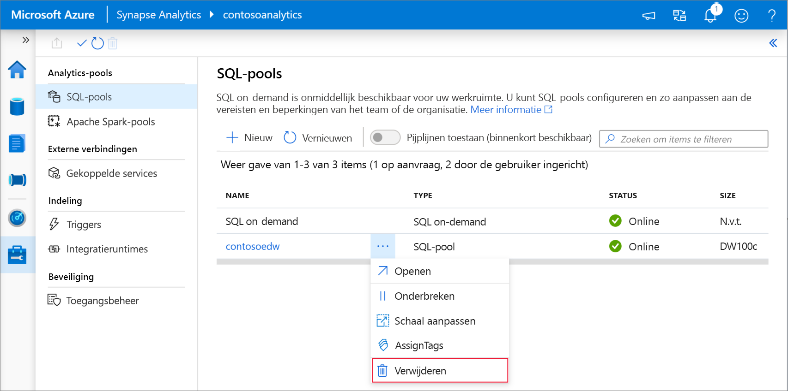
1. Druk op **Verwijderen**.
1. Bevestig dat u de werkruimte wilt verwijderen en selecteer de knop **Verwijderen**.
 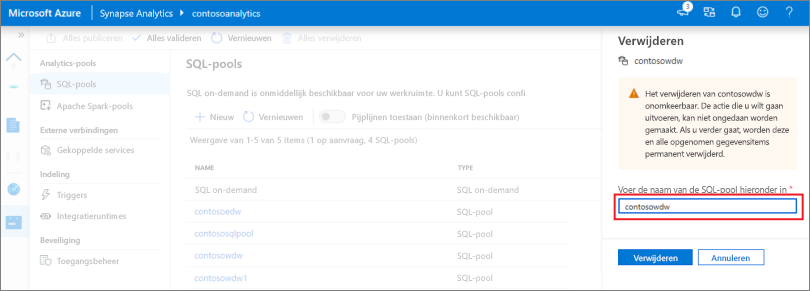
1. Wanneer het proces is voltooid, wordt de SQL-pool niet meer weergegeven in de werkruimteresources.

## Volgende stappen 
- Zie [Quickstart: Een Apache Spark-notebook maken](quickstart-apache-spark-notebook.md).
- Zie [Quickstart: Een Synapse SQL-pool maken met behulp van de Azure-portal](quickstart-create-sql-pool-portal.md).