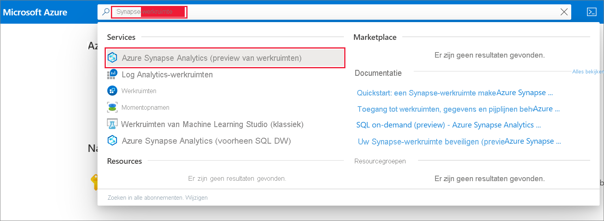
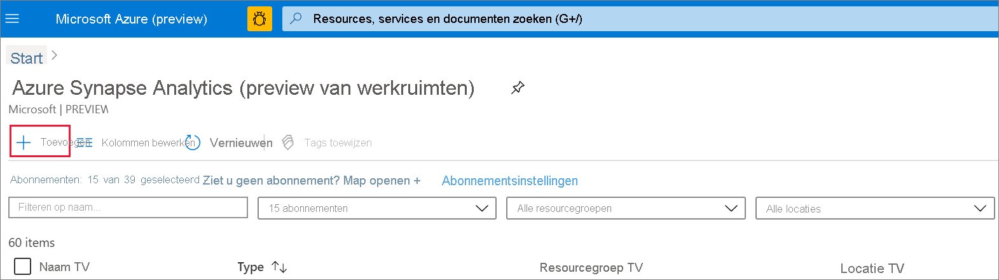
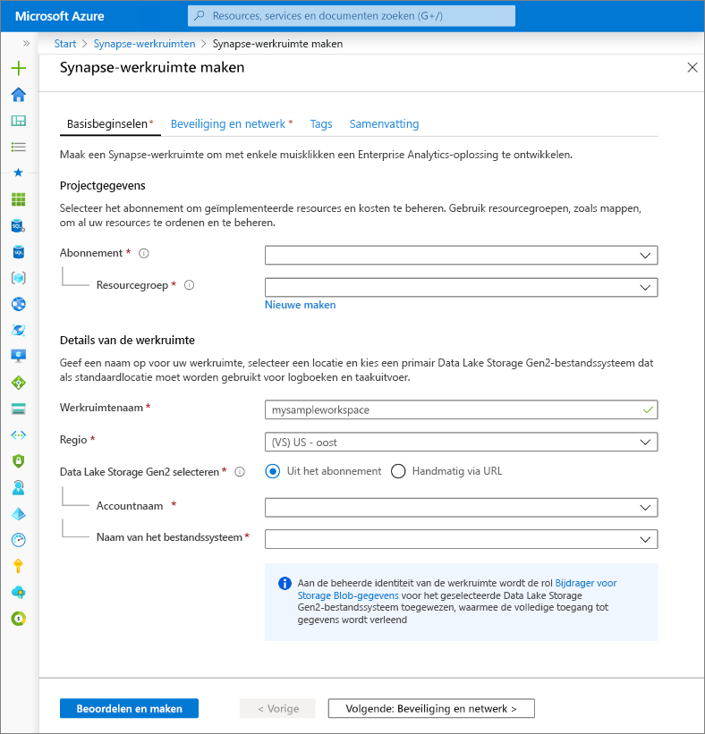
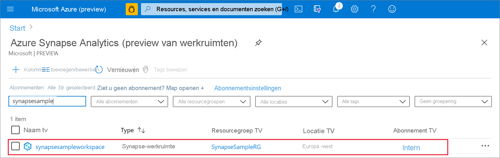

# Snelstart: een Azure Synapse Analytics-werkruimte maken (voorbeeld)

Deze quickstart beschrijft de stappen om een Azure Synapse-werkruimte te maken met behulp van de Azure-portal.

Als u geen Azure-abonnement hebt, [maakt u een gratis account voordat u begint.](https://azure.microsoft.com/free/)

## Vereisten

- [Azure Data Lake Storage Gen2-opslagaccount](../storage/common/storage-account-create.md?toc=/azure/synapse-analytics/toc.json&bc=/azure/synapse-analytics/breadcrumb/toc.json)

## Aanmelden bij Azure Portal

Aanmelden bij de [Azure-portal](https://portal.azure.com/)

## Een Azure Synapse-werkruimte maken met de Azure-portal

1. Voer in het zoekvenster van Microsoft Azure **synapse-werkruimte** in en selecteer deze service.
Synapse-werkruimten is ingetypt. .
2. Klik op de pagina **Synapse-werkruimten** op **+ Toevoegen**.
.
3. Vul het **azure Synapse-werkruimteformulier** in met de volgende gegevens:

    | Instelling | Voorgestelde waarde | Beschrijving |
    | :------ | :-------------- | :---------- |
    | **Abonnement** | *Uw abonnement* | Zie [Abonnementen](https://account.windowsazure.com/Subscriptions) voor meer informatie over uw abonnementen. |
    | **Resourcegroep** | *Elke resourcegroep* | Zie [Naming conventions](/azure/architecture/best-practices/resource-naming.md?toc=/azure/synapse-analytics/toc.json&bc=/azure/synapse-analytics/breadcrumb/toc.json&view=azure-sqldw-latest) (Naamgevingsconventies) voor geldige namen van resourcegroepen. |
    | **Werkruimtenaam** | mysampleworkspace | Hiermee geeft u de naam op van de werkruimte, die ook wordt gebruikt voor verbindingseindpunten.|
    | **Regio** | VS - oost 2 | Hiermee geeft u de locatie van de werkruimte op.|
    | **Data Lake Storage Gen2** | Account:`storage account name`   Bestandssysteem:`root file system to use` | Hiermee geeft u de naam van het ADLS Gen2-opslagaccount op dat moet worden gebruikt als primaire opslag en het te gebruiken bestandssysteem.|
    ||||

    .

    Het opslagaccount kan worden geselecteerd uit:
    - Een lijst met ADLS Gen2-accounts beschikbaar in uw abonnement
    - Handmatig ingevoerd met de accountnaam

    > [!IMPORTANT]
    > De Azure Synapse-werkruimte moet kunnen lezen en schrijven naar het geselecteerde ADLS Gen2-account. Bovendien moet u voor een opslagaccount dat u koppelt als het primaire opslagaccount, **hiërarchische naamruimte** hebben ingeschakeld bij het maken van het opslagaccount.
    >
    > Onder de selectievelden van ADLS Gen2 staat een notitie waarin staat dat de beheerde identiteit van de werkruimte de rol **Storaqe Blob Data Contributor** krijgt toegewezen op het geselecteerde Data Lake Storage Gen2-bestandssysteem dat deze volledige toegang verleent.

4. (Optioneel) Wijzig een van de **standaardinstellingen voor beveiliging + netwerken:**
5. (Optioneel) Voeg tags toe op het tabblad **Labels.**
6. Op het tabblad **Overzicht** worden de benodigde validaties uitgevoerd om ervoor te zorgen dat de werkruimte kan worden gemaakt. Zodra de validatie is geslaagd, drukt u](media/quickstart-create-synapse-workspace/create-workspace-05.png)op Werkruimte-inrichtingsstroom **maken** ![- het tabblad bevestiging. .
7. Zodra het resourceinrichtingsproces is voltooid, ziet u een vermelding voor de gemaakte werkruimte in de lijst met Synapse-werkruimten. .

## Resources opschonen

Volg de onderstaande stappen om de Azure Synapse-werkruimte te verwijderen.
> [!WARNING]
> Als u een Azure Synapse-werkruimte verwijdert, worden de analyseengines en de gegevens die zijn opgeslagen in de database van de opgenomen SQL-groepen en metagegevens voor werkruimtes verwijderd. Het is niet langer mogelijk om verbinding te maken met de SQL-eindpunten, Apache Spark-eindpunten. Alle codeartefacten worden verwijderd (query's, notitieblokken, taakdefinities en pijplijnen).
>
> Het verwijderen van de werkruimte heeft **geen** invloed op de gegevens in de Data Lake Store Gen2 die aan de werkruimte is gekoppeld.

Als u de Azure Synapse-werkruimte wilt verwijderen, voert u de volgende stappen uit:

1. Navigeer naar de Azure Synapse-werkruimte om te verwijderen.
1. Druk op **Delete** op de opdrachtbalk.
 
1. Bevestig de verwijdering en druk op **delete.**
 
1. Wanneer het proces is voltooid, wordt de Azure Synapse-werkruimte niet langer weergegeven in de lijst met werkruimten.

## Volgende stappen

Vervolgens u [SQL-pools maken](quickstart-create-sql-pool.md) of [Apache Spark-pools maken](quickstart-create-apache-spark-pool.md) om uw gegevens te analyseren en te verkennen.
