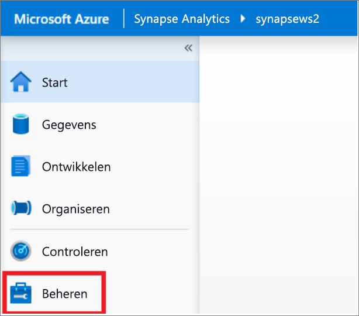
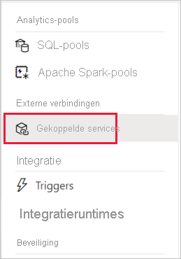
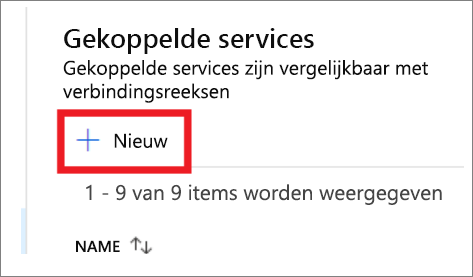
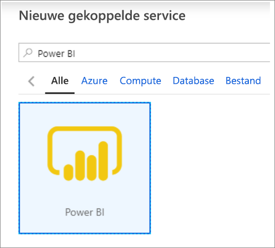
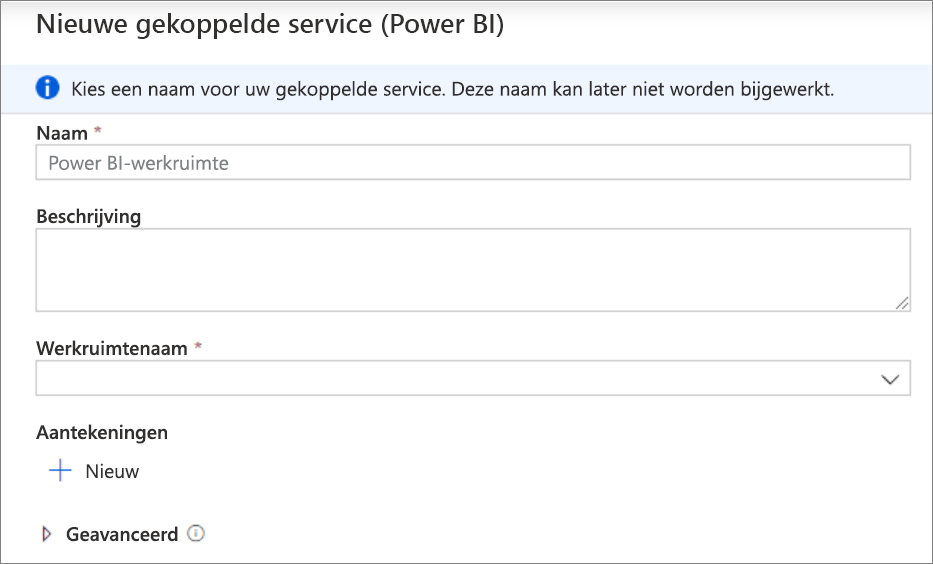
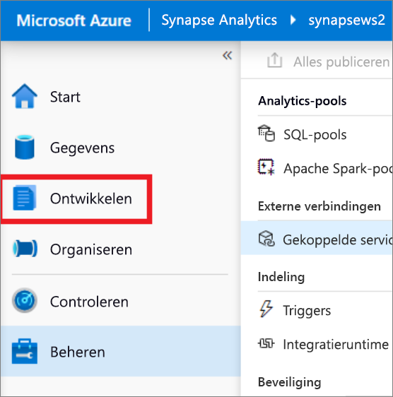
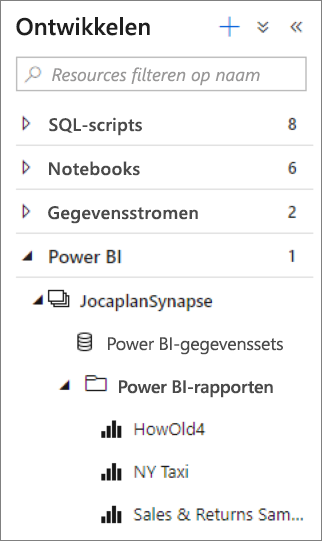
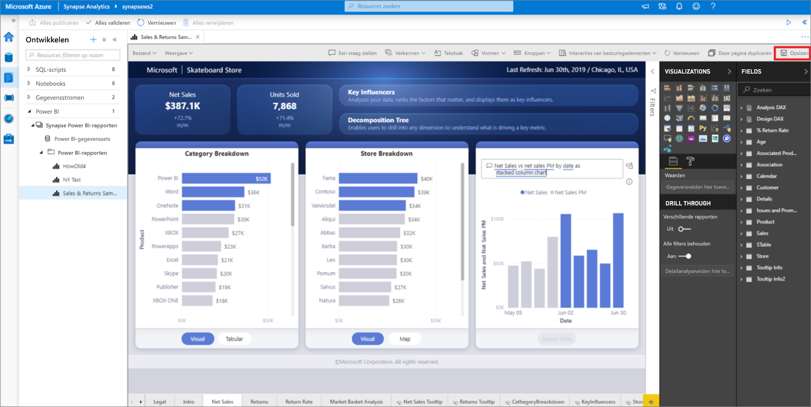

# Quickstart: Een Power BI-werkruimte koppelen aan een Synapse-werkruimte

In deze quickstart leert u hoe u een Power BI-werkruimte koppelt aan een Synapse Analytics-werkruimte om nieuwe Power BI-rapporten en -gegevenssets te maken vanuit Synapse Studio (preview-versie).

Als u geen Azure-abonnement hebt, [maakt u een gratis account voordat u begint](https://azure.microsoft.com/free/).

## Vereisten

- [Een Azure Synapse-werkruimte en een gekoppeld opslagaccount maken](quickstart-create-workspace.md)
- [Een Power BI Professional- of Premium-werkruimte](https://docs.microsoft.com/power-bi/service-create-the-new-workspaces)

## Uw Power BI-werkruimte koppelen aan uw Synapse-werkruimte

1. Klik in Synapse Studio op **Manage**.

    

2. Klik onder **External Connections**op **Linked services**.

    

3. Klik op **+ New**.

    

4. Klik op **Power BI** en klik op **Continue**.

    

5. Voer een naam in voor de gekoppelde service en selecteer een werkruimte in de vervolgkeuzelijst.

    

6. Klik op **Create**.

## Power BI-werkruimte weergeven in Synapse Studio

Zodra uw werkruimten zijn gekoppeld, kunt u door de Power BI-gegevenssets bladeren en nieuwe Power BI-rapporten bewerken en maken vanuit Synapse Studio.

1. Klik op **Develop**.

    

2. Vouw Power BI en de werkruimte uit die u wilt gebruiken.

    

U kunt nieuwe rapporten maken door te klikken op **+** boven in het tabblad **Develop**. Bestaande rapporten kunnen worden bewerkt door te klikken op de naam van het rapport. Opgeslagen wijzigingen worden teruggeschreven naar de Power BI-werkruimte.

## Volgende stappen

Meer informatie over [het maken van een Power BI-rapport voor bestanden die zijn opgeslagen op Azure Storage](sql/tutorial-connect-power-bi-desktop.md).
