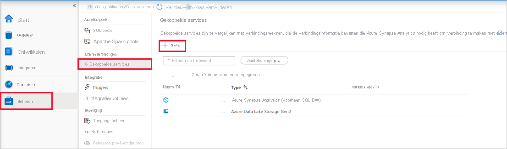
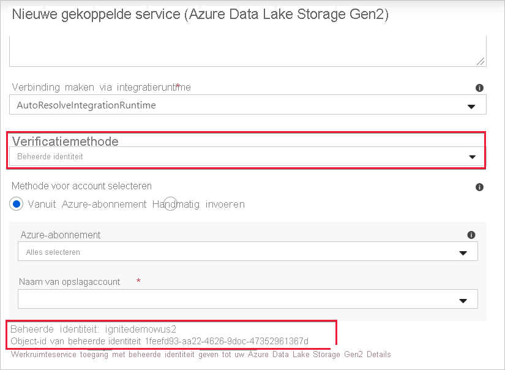

# Beheerde identiteit voor Azure Synapse-werkruimte (preview)

In dit artikel vindt u meer informatie over beheerde identiteiten in de Azure Synapse-werkruimte.

## Beheerde identiteiten

Beheerde identiteit voor Azure-resources is een functie van Azure Active Directory. De functie biedt Azure-services met een automatisch beheerde identiteit in Azure AD. U kunt de functie Beheerde identiteit gebruiken voor verificatie bij services die ondersteuning bieden voor Azure AD-verificatie.

Beheerde identiteiten voor Azure-resources is de nieuwe naam voor de service die eerder de naam Managed Service Identity (MSI) had. Zie [Beheerde identiteiten](../../active-directory/managed-identities-azure-resources/overview.md?toc=/azure/synapse-analytics/toc.json&bc=/azure/synapse-analytics/breadcrumb/toc.json) voor meer informatie.

## Beheerde identiteit voor Azure Synapse-werkruimte

Er wordt een door het systeem toegewezen beheerde identiteit gemaakt voor uw Azure Synapse-werkruimte wanneer u de werkruimte maakt.

>[!NOTE]
>Deze beheerde identiteit van de werkruimte wordt aangeduid als beheerde identiteit in de rest van dit document.

Azure Synapse gebruikt de beheerde identiteit om pijplijnen te organiseren. De levenscyclus van beheerde identiteiten is rechtstreeks gekoppeld aan de Azure Synapse-werkruimte. Als u de Azure Synapse-werkruimte verwijdert, wordt de beheerde identiteit ook opgeschoond.

De beheerde identiteit van de werkruimte heeft machtigingen nodig om bewerkingen uit te voeren in de pijplijnen. U kunt de object-id of de naam van uw Azure Synapse-werkruimte gebruiken om naar de beheerde identiteit te zoeken wanneer u machtigingen verleent.

## Beheerde identiteit ophalen in de Azure-portal

U kunt de beheerde identiteit ophalen in de Azure-portal. Open de Azure Synapse-werkruimte in de Azure-portal en selecteer **Overzicht** in de linkernavigatievenster. De object-id van de beheerde identiteit wordt weergegeven in het hoofdscherm.

De informatie over de beheerde identiteit wordt ook weergegeven wanneer u een gekoppelde service maakt die verificatie van beheerde identiteiten ondersteunt vanuit Azure Synapse Studio.

Start **Azure Synapse Studio** en selecteer het tabblad **Beheren** in het linkernavigatievenster. Selecteer nu **Gekoppelde services** en kies de optie **+ Nieuw** om een nieuwe gekoppelde service te maken.

Typ *Azure Data Lake Storage Gen2* in het venster **Nieuwe gekoppelde service**. Selecteer in de onderstaande lijst het resourcetype **Azure Data Lake Storage Gen2** en kies **Doorgaan**.

Kies in het volgende venster **Beheerde identiteit** bij **Verificatiemethode**. U ziet de **Naam** en de **Object-id** van de beheerde identiteit.

## Volgende stappen

[Machtigingen verlenen voor de beheerde identiteit van de Azure Synapse-werkruimte](./how-to-grant-workspace-managed-identity-permissions.md)
