# <a name="quickstart-create-and-query-a-synapse-sql-pool-using-the-azure-portal"></a>Quickstart: Een Synapse SQL-pool maken en query uitvoeren met behulp van de Azure-portal

Maak en zoek snel een Synapse SQL-pool (Data Warehouse) in Azure Synapse Analytics (voorheen SQL DW) met behulp van de Azure-portal.

## <a name="prerequisites"></a>Vereisten

1. Als u nog geen Azure-abonnement hebt, maakt u een [gratis account](https://azure.microsoft.com/free/) voordat u begint.

   > [!NOTE]
   > Het maken van een SQL-pool in Azure Synapse kan leiden tot een nieuwe factureerbare service. Zie [Prijzen voor Azure Synapse Analytics](https://azure.microsoft.com/pricing/details/synapse-analytics/) voor meer informatie.

2. Download en installeer de nieuwste versie van [SSMS](/sql/ssms/download-sql-server-management-studio-ssms?toc=/azure/synapse-analytics/sql-data-warehouse/toc.json&bc=/azure/synapse-analytics/sql-data-warehouse/breadcrumb/toc.json&view=azure-sqldw-latest) (SQL Server Management Studio).

## <a name="sign-in-to-the-azure-portal"></a>Aanmelden bij Azure Portal

Meld u aan bij de [Azure-portal](https://portal.azure.com/).

## <a name="create-a-sql-pool"></a>Een SQL-pool maken

Datawarehouses worden gemaakt met behulp van SQL-pool in Azure Synapse Analytics. Een Azure SQL-pool wordt gemaakt met een gedefinieerde set [compute-resources](memory-concurrency-limits.md). De database wordt gemaakt in een [Azure-resourcegroep](../../azure-resource-manager/management/overview.md?toc=/azure/synapse-analytics/sql-data-warehouse/toc.json&bc=/azure/synapse-analytics/sql-data-warehouse/breadcrumb/toc.json) en in een [logische SQL-server](../../azure-sql/database/logical-servers.md?toc=/azure/synapse-analytics/sql-data-warehouse/toc.json&bc=/azure/synapse-analytics/sql-data-warehouse/breadcrumb/toc.json).

Volg de stappen om een SQL-pool te maken die de voorbeelddatabase **AdventureWorksDW** bevat.

1. selecteer in de linkerbovenhoek van de Azure-portal **Een resource maken**.

   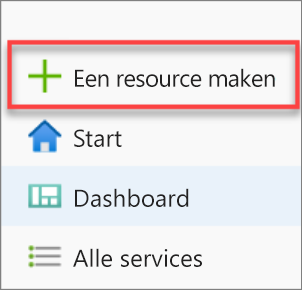

2. Selecteer **Databases** op de pagina **Nieuw** en selecteer **Azure Synapse Analytics (voorheen SQL DW)** in de lijst **Aanbevolen**.

   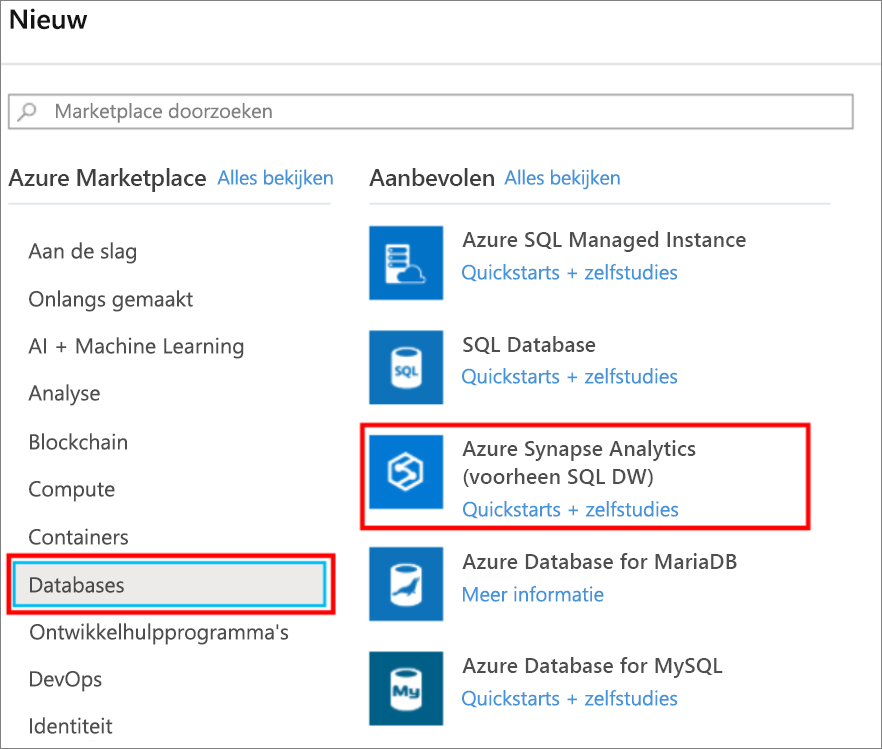

3. Geef uw abonnement, de resourcegroep, de naam van de SQL-pool en de servernaam op in **Basisinstellingen**:

   | Instelling | Voorgestelde waarde | Beschrijving |
   | :------ | :-------------- | :---------- |
   | **Abonnement** | Uw abonnement | Zie [Abonnementen](https://account.windowsazure.com/Subscriptions) voor meer informatie over uw abonnementen. |
   | **Resourcegroep** | myResourceGroup | Zie [Naming conventions](/azure/architecture/best-practices/resource-naming?toc=/azure/synapse-analytics/sql-data-warehouse/toc.json&bc=/azure/synapse-analytics/sql-data-warehouse/breadcrumb/toc.json) (Naamgevingsconventies) voor geldige resourcegroepnamen. |
   | **Naam van SQL-pool** | Een wereldwijd unieke naam (een voorbeeld is *mySampleDataWarehouse*) | Zie [Database-id's](/sql/relational-databases/databases/database-identifiers?toc=/azure/synapse-analytics/sql-data-warehouse/toc.json&bc=/azure/synapse-analytics/sql-data-warehouse/breadcrumb/toc.json&view=azure-sqldw-latest) voor geldige databasenamen. Opmerking: een SQL-pool is een type database. |
   | **Server** | Een wereldwijd unieke naam | Selecteer bestaande server of maak een nieuwe servernaam, selecteer **Nieuwe maken**. Zie [Naming conventions](/azure/architecture/best-practices/resource-naming?toc=/azure/synapse-analytics/sql-data-warehouse/toc.json&bc=/azure/synapse-analytics/sql-data-warehouse/breadcrumb/toc.json) (Naamgevingsconventies) voor geldige servernamen. |

   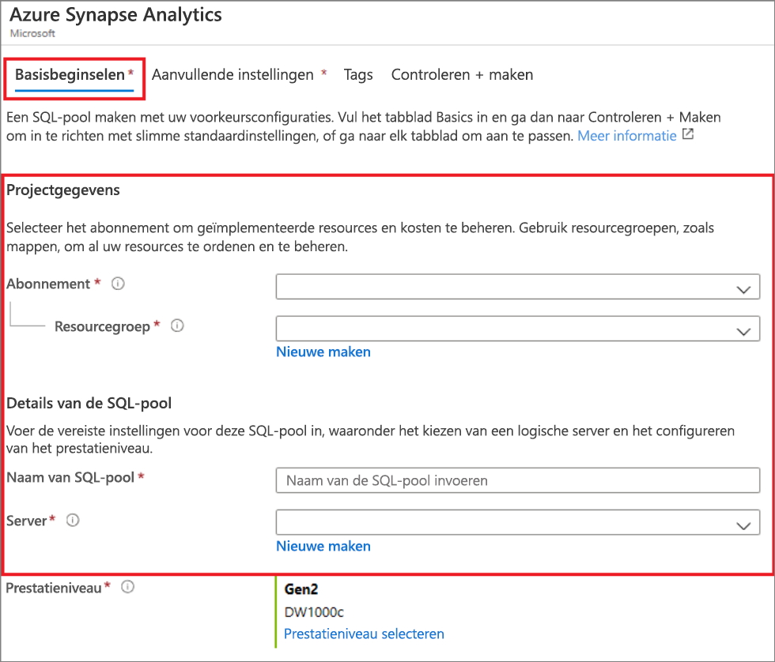

4. Selecteer onder **Prestatieniveau** **Prestatieniveau selecteren** om eventueel uw configuratie te wijzigen met een schuifregelaar.

   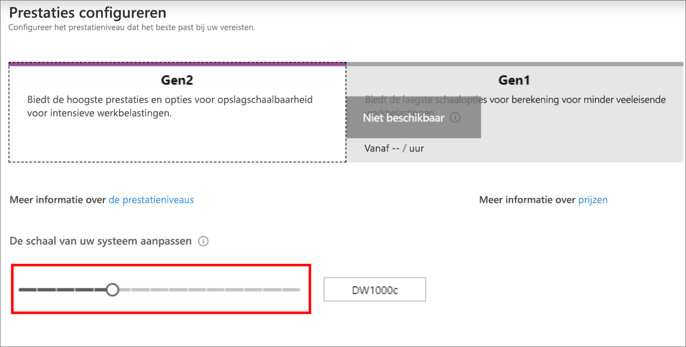  

   Zie [Rekenproces beheren in Azure Synapse Analytics](sql-data-warehouse-manage-compute-overview.md) voor meer informatie over prestatieniveaus.

5. Selecteer **Extra instellingen**, onder **Bestaande gegevens gebruiken**, **Voorbeeld**, zodat AdventureWorksDW als de voorbeelddatabase wordt gemaakt.

    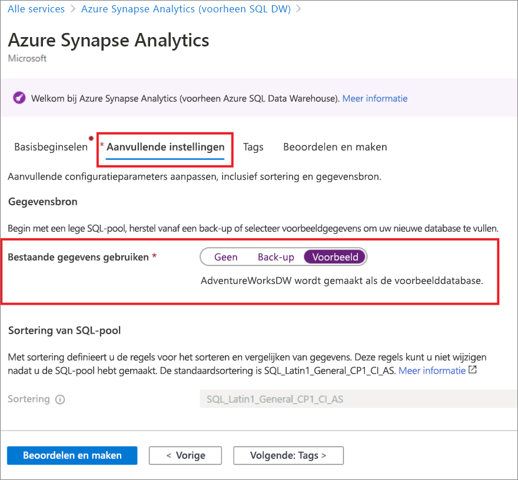 

6. Nu u het tabblad Basisinstellingen van het formulier Azure Synapse Analytics hebt voltooid, selecteert u **Controleren + maken** en vervolgens **Maken** om de SQL-pool te maken. De inrichting duurt een paar minuten.

   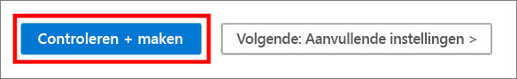

   

7. Selecteer **Meldingen** op de werkbalk om het implementatieproces te bewaken.

   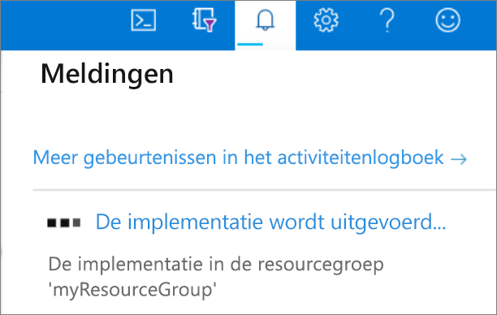

## <a name="create-a-server-level-firewall-rule"></a>Een serverfirewallregel maken

De service Azure Synapse maakt een firewall op serverniveau. Deze firewall voorkomt dat externe toepassingen en hulpprogramma's verbinding maken met de server of databases op de server. Als u de connectiviteit wilt inschakelen, kunt u firewallregels toevoegen waarmee connectiviteit voor bepaalde IP-adressen wordt ingeschakeld. Volg deze stappen om een [firewallregel op serverniveau](../../azure-sql/database/firewall-configure.md?toc=/azure/synapse-analytics/sql-data-warehouse/toc.json&bc=/azure/synapse-analytics/sql-data-warehouse/breadcrumb/toc.json) te maken voor het IP-adres van uw client.

> [!NOTE]
> Azure Synapse communiceert via poort 1433. Als u verbinding wilt maken vanuit een bedrijfsnetwerk, is uitgaand verkeer via poort 1433 mogelijk niet toegestaan vanwege de firewall van het netwerk. In dat geval kunt u alleen verbinding maken met uw server als uw IT-afdeling poort 1433 openstelt.

1. Nadat de implementatie is voltooid, selecteert u **Alle services** in het linkermenu. Selecteer **Databases**, selecteer de ster naast **Azure Synapse Analytics** om Azure Synapse Analytics toe te voegen aan uw favorieten.

2. Selecteer **Azure Synapse Analytics** in het menu aan de linkerkant en selecteer vervolgens **mySampleDataWarehouse** op de pagina **Azure Synapse Analytics**. De overzichtspagina voor de database wordt geopend, met de volledig gekwalificeerde servernaam (bijvoorbeeld **sqlpoolservername.database.windows.net**) en biedt opties voor verdere configuratie.

3. Kopieer deze volledig gekwalificeerde servernaam om in deze en andere quickstarts verbinding te maken met de server en de bijbehorende databases. Selecteer de servernaam om de serverinstellingen te openen.

   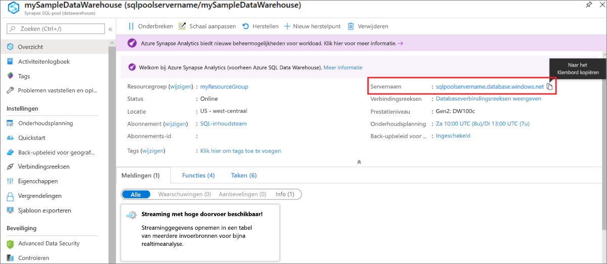

4. Selecteer **Firewallinstellingen weergeven**.

   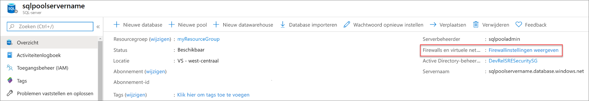

5. De pagina **Firewallinstellingen** voor de server wordt geopend.

   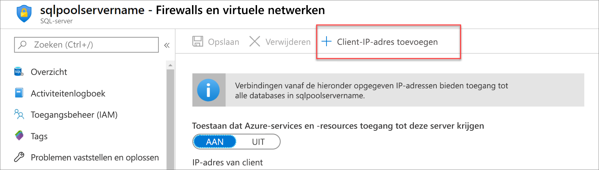

6. Selecteer **IP van client toevoegen** op de werkbalk om uw huidige IP-adres aan een nieuwe firewallregel toe te voegen. Een firewallregel kan poort 1433 openen voor een afzonderlijk IP-adres of voor een aantal IP-adressen.

7. selecteer **Opslaan**. Er wordt een firewallregel op serverniveau gemaakt voor uw huidige IP-adres, waarbij poort 1433 wordt geopend op de server.

8. selecteer **OK** en sluit de pagina **Firewallinstellingen**.

U kunt nu via dit IP-adres verbinding maken met de server en de bijbehorende SQL-pools. De verbinding werkt met SQL Server Management Studio of een ander hulpprogramma van uw keuze. Wanneer u verbinding maakt, gebruikt u het ServerAdmin-account dat u eerder hebt gemaakt.

> [!IMPORTANT]
> Voor alle Azure-services is toegang via de SQL Database-firewall standaard ingeschakeld. Selecteer **UIT** op deze pagina en selecteer vervolgens op **Opslaan** om de firewall uit te schakelen voor alle Azure-services.

## <a name="get-the-fully-qualified-server-name"></a>De volledig gekwalificeerde servernaam ophalen

Haal de volledig gekwalificeerde servernaam van uw server op uit de Azure-portal. Later gebruikt u de volledig gekwalificeerde servernaam bij het verbinding maken met de server.

1. Meld u aan bij de [Azure-portal](https://portal.azure.com/).

2. Selecteer **Azure Synapse Analytics** in het menu aan de linkerkant en selecteer op de pagina **Azure Synapse Analytics**.

3. In het deelvenster **Essentials** van de Azure Portal-pagina van uw database kopieert u de **servernaam**. In dit voorbeeld is de volledig gekwalificeerde servernaam sqlpoolservername.database.windows.net.

    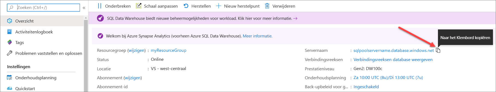

## <a name="connect-to-the-server-as-server-admin"></a>Als serverbeheerder verbinding maken met de server

In deze sectie wordt gebruikgemaakt van [SSMS](/sql/ssms/download-sql-server-management-studio-ssms?toc=/azure/synapse-analytics/sql-data-warehouse/toc.json&bc=/azure/synapse-analytics/sql-data-warehouse/breadcrumb/toc.json&view=azure-sqldw-latest) (SQL Server Management Studio) om een verbinding tot stand te brengen met de server.

1. Open SQL Server Management Studio.

2. Voer in het dialoogvenster **Verbinding maken met server** de volgende informatie in:

   | Instelling | Voorgestelde waarde | Beschrijving |
   | :------ | :-------------- | :---------- |
   | Servertype | Database-engine | Deze waarde is verplicht |
   | Servernaam | De volledig gekwalificeerde servernaam | Hier volgt een voorbeeld: **sqlpoolservername.database.windows.net**. |
   | Verificatie | SQL Server-verificatie | SQL-verificatie is het enige verificatietype dat in deze zelfstudie is geconfigureerd. |
   | Aanmelden | Het beheerdersaccount voor de server | Account dat u hebt opgegeven tijdens het maken van de server. |
   | Wachtwoord | Het wachtwoord voor het beheerdersaccount voor de server | Wachtwoord dat u hebt opgegeven tijdens het maken van de server. |
   ||||

   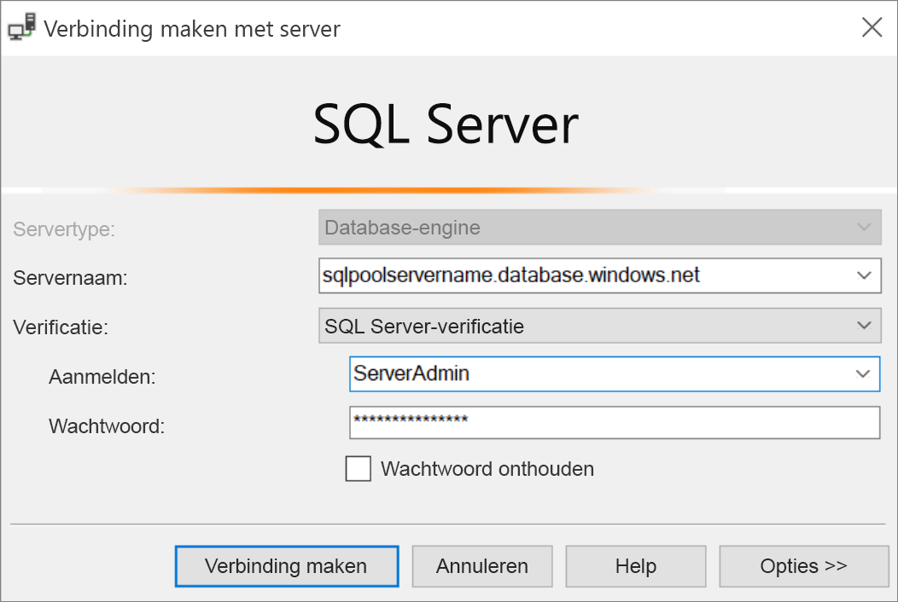

3. selecteer **Verbinden**. Het venster Objectverkenner wordt geopend in SQL Server Management Studio.

4. Vouw **Databases** uit in Objectverkenner. Vouw vervolgens **mySampleDatabase** uit om de objecten in uw nieuwe database weer te geven.

   

## <a name="run-some-queries"></a>Een aantal query's uitvoeren

Het is niet raadzaam om grote query's uit te voeren terwijl u bent geregistreerd als de serverbeheerder, omdat deze rol gebruikmaakt van een [beperkte resourceklasse](resource-classes-for-workload-management.md). In plaats daarvan configureert u de [Isolatie van workloads](https://docs.microsoft.com/azure/synapse-analytics/sql-data-warehouse/quickstart-configure-workload-isolation-tsql) zoals [aangegeven in de zelfstudies](https://docs.microsoft.com/azure/synapse-analytics/sql-data-warehouse/load-data-wideworldimportersdw#create-a-user-for-loading-data).

SQL Data Warehouse maakt gebruik van T-SQL als querytaal. Gebruik de volgende stappen om een queryvenster te openen en een aantal T-SQL-query’s uit te voeren:

1. Selecteer met de rechtermuisknop **mySampleDataWarehouse** en selecteer **Nieuwe query**. Een nieuwe queryvenster wordt geopend.

2. Voer in het queryvenster de volgende opdracht in om een lijst met databases te zien.

    ```sql
    SELECT * FROM sys.databases
    ```

3. selecteer **Uitvoeren**. De queryresultaten bevatten twee databases: **hoofd** en **mySampleDataWarehouse**.

   

4. Als u wat gegevens wilt bekijken, gebruikt u de volgende opdracht om het aantal klanten te zien met de achternaam Adams en met drie kinderen. De resultaten bestaan uit zes klanten.

    ```sql
    SELECT LastName, FirstName FROM dbo.dimCustomer
    WHERE LastName = 'Adams' AND NumberChildrenAtHome = 3;
    ```

   

## <a name="clean-up-resources"></a>Resources opschonen

Er worden kosten in rekening gebracht voor datawarehouse-eenheden en gegevens die zijn opgeslagen in uw SQL-pool. Deze compute- en opslagresources worden apart in rekening gebracht.

- Als u de gegevens in de opslag wilt houden, kunt u het berekenen onderbreken wanneer u de SQL-pool niet gebruikt. Als u het berekenen onderbreekt, worden er alleen kosten in rekening gebracht voor de gegevensopslag. U kunt het berekenen hervatten wanneer u klaar bent om de gegevens te verwerken.

- Als u in de toekomst geen kosten meer wilt hebben, kunt u de SQL-pool verwijderen.

Volg deze stappen om de resources op te schonen die u niet meer nodig hebt.

1. Aanmelden bij de [Azure-portal](https://portal.azure.com) en de SQL-pool selecteren.

   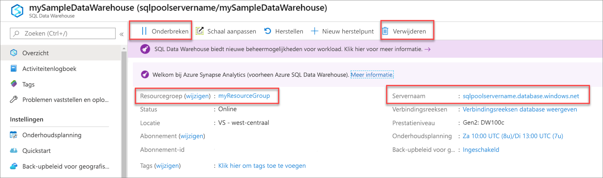

2. Als u het berekenen wilt onderbreken, selecteert u de knop **Onderbreken**. Wanneer de SQL-pool is onderbroken, ziet u een **Hervatten**-knop. Als u de berekening wilt hervatten, selecteert u **Hervatten**.

3. Als u de SQL-pool wilt verwijderen zodat er geen kosten in rekening worden gebracht voor berekenen of opslaan, selecteert u **Verwijderen**.

4. Als u de door u gemaakte server wilt verwijderen, klikt u op **select sqlpoolservername.database.windows.net** in de vorige afbeelding. Selecteer vervolgens **Verwijderen**. Wees voorzichtig met verwijderen. Als u de server verwijdert, worden ook alle databases verwijderd die zijn toegewezen aan de server.

5. Als u de resourcegroep wilt verwijderen, selecteert u **myResourceGroup**. Selecteer vervolgens **Resourcegroep verwijderen**.

## <a name="next-steps"></a>Volgende stappen

Voor meer informatie over het laden van gegevens in uw SQL-pool, gaat u door naar het artikel [Gegevens in SQL-pool laden](load-data-from-azure-blob-storage-using-polybase.md).
