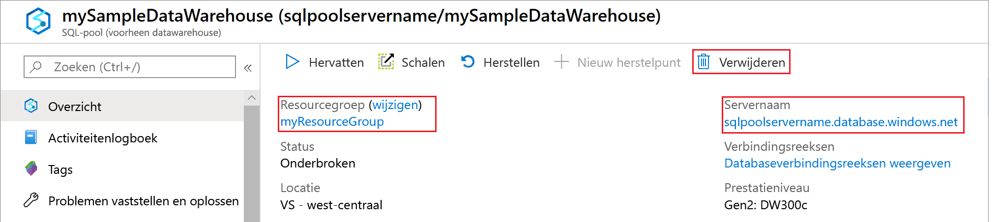

# <a name="tutorial-load-the-new-york-taxicab-dataset"></a>Zelf studie: de over taxi's-gegevensset van New York laden

In deze zelf studie wordt de [instructie Copy](https://docs.microsoft.com/sql/t-sql/statements/copy-into-transact-sql?view=azure-sqldw-latest) gebruikt voor het laden van een New York over taxi's-gegevensset vanuit een Azure Blob Storage-account. De zelfstudie gebruikt [Azure Portal](https://portal.azure.com) en [SQL Server Management Studio](/sql/ssms/download-sql-server-management-studio-ssms?toc=/azure/synapse-analytics/sql-data-warehouse/toc.json&bc=/azure/synapse-analytics/sql-data-warehouse/breadcrumb/toc.json&view=azure-sqldw-latest) (SSMS) voor het volgende:

> [!div class="checklist"]
>
> * Een SQL-groep maken in de Azure Portal
> * Een serverfirewallregel ingesteld in Azure Portal
> * Verbinding maken met het datawarehouse met SMMS
> * Een gebruiker maken die wordt aangewezen om gegevens te laden
> * De tabellen voor de voor beeld-gegevensset maken 
> * De instructie COPY T-SQL gebruiken om gegevens in uw data warehouse te laden
> * De voortgang van de gegevens weergeven terwijl deze worden geladen

Als u geen abonnement op Azure hebt, maakt u een [gratis account](https://azure.microsoft.com/free/) voordat u begint.

## <a name="before-you-begin"></a>Voordat u begint

Download en installeer voordat u met deze zelfstudie begint de nieuwste versie van [SSMS](/sql/ssms/download-sql-server-management-studio-ssms?toc=/azure/synapse-analytics/sql-data-warehouse/toc.json&bc=/azure/synapse-analytics/sql-data-warehouse/breadcrumb/toc.json&view=azure-sqldw-latest) (SQL Server Management Studio).

## <a name="log-in-to-the-azure-portal"></a>Aanmelden bij Azure Portal

Meld u aan bij [Azure Portal](https://portal.azure.com/).

## <a name="create-a-blank-database"></a>Een lege database maken

Een Azure SQL-pool wordt gemaakt met een gedefinieerde set [compute-resources](memory-concurrency-limits.md). De database wordt gemaakt in een [Azure-resourcegroep](../../azure-resource-manager/management/overview.md?toc=/azure/synapse-analytics/sql-data-warehouse/toc.json&bc=/azure/synapse-analytics/sql-data-warehouse/breadcrumb/toc.json) en in een [logische SQL-server](../../azure-sql/database/logical-servers.md?toc=/azure/synapse-analytics/sql-data-warehouse/toc.json&bc=/azure/synapse-analytics/sql-data-warehouse/breadcrumb/toc.json).

Volg deze stappen om een lege database te maken.

1. Selecteer in de linkerbovenhoek van de Azure Portal **een resource maken** .

2. Selecteer **data bases** op de pagina **Nieuw** en selecteer **Azure Synapse Analytics** onder **Aanbevolen** op de pagina **Nieuw** .

    

3. Vul het formulier in met de volgende gegevens:

   | Instelling            | Voorgestelde waarde       | Beschrijving                                                  |
   | ------------------ | --------------------- | ------------------------------------------------------------ |
   | *Naam**            | mySampleDataWarehouse | Zie [Database-id's](/sql/relational-databases/databases/database-identifiers?toc=/azure/synapse-analytics/sql-data-warehouse/toc.json&bc=/azure/synapse-analytics/sql-data-warehouse/breadcrumb/toc.json&view=azure-sqldw-latest) voor geldige databasenamen. |
   | **Abonnement**   | Uw abonnement     | Zie [Abonnementen](https://account.windowsazure.com/Subscriptions) voor meer informatie over uw abonnementen. |
   | **Resourcegroep** | myResourceGroup       | Zie [Naming conventions](/azure/architecture/best-practices/resource-naming?toc=/azure/synapse-analytics/sql-data-warehouse/toc.json&bc=/azure/synapse-analytics/sql-data-warehouse/breadcrumb/toc.json) (Naamgevingsconventies) voor geldige resourcegroepnamen. |
   | **Bron selecteren**  | Lege database        | Geeft aan dat er een lege database wordt gemaakt. Opmerking: een datawarehouse is een type database. |

    

4. Selecteer **Server** als u een nieuwe server voor de nieuwe database wilt maken en configureren. Vul het **nieuwe serverformulier** in met de volgende gegevens:

    | Instelling                | Voorgestelde waarde          | Beschrijving                                                  |
    | ---------------------- | ------------------------ | ------------------------------------------------------------ |
    | **Servernaam**        | Een wereldwijd unieke naam | Zie [Naming conventions](/azure/architecture/best-practices/resource-naming?toc=/azure/synapse-analytics/sql-data-warehouse/toc.json&bc=/azure/synapse-analytics/sql-data-warehouse/breadcrumb/toc.json) (Naamgevingsconventies) voor geldige servernamen. |
    | **Aanmeldgegevens van serverbeheerder** | Een geldige naam           | Zie [Database-id's](/sql/relational-databases/databases/database-identifiers?toc=/azure/synapse-analytics/sql-data-warehouse/toc.json&bc=/azure/synapse-analytics/sql-data-warehouse/breadcrumb/toc.json&view=azure-sqldw-latest) voor geldige aanmeldingsnamen. |
    | **Wachtwoord**           | Een geldig wachtwoord       | Uw wachtwoord moet uit minstens acht tekens bestaan en moet tekens bevatten uit drie van de volgende categorieën: hoofdletters, kleine letters, cijfers en niet-alfanumerieke tekens. |
    | **Locatie**           | Een geldige locatie       | Zie [Azure-regio's](https://azure.microsoft.com/regions/) voor informatie over regio's. |

    

5. Selecteer **Selecteren**.

6. Selecteer **prestatie niveau** om op te geven of het Data Warehouse gen1 of Gen2 is en het aantal data warehouse-eenheden.

7. Voor deze zelf studie selecteert u de SQL-groep **Gen2**. De schuif regelaar wordt standaard ingesteld op **DW1000c** .  Verplaats de regelaar omhoog en omlaag om te zien hoe dit werkt.

    

8. Selecteer **Toepassen**.
9. Selecteer op de Blade inrichten een **sortering** voor de lege data base. Gebruik voor deze zelfstudie de standaardwaarde. Zie [Collations](/sql/t-sql/statements/collations?toc=/azure/synapse-analytics/sql-data-warehouse/toc.json&bc=/azure/synapse-analytics/sql-data-warehouse/breadcrumb/toc.json&view=azure-sqldw-latest) (Sorteringen) voor meer informatie over sorteringen

10. Nu u het formulier hebt ingevuld, selecteert u **maken** om de data base in te richten. De inrichting duurt een paar minuten.

11. Selecteer **Meldingen** op de werkbalk om het implementatieproces te bewaken.
  
     

## <a name="create-a-server-level-firewall-rule"></a>Een serverfirewallregel maken

Een firewall op server niveau die voor komt dat externe toepassingen en hulpprogram ma's verbinding maken met de server of data bases op de server. Als u de connectiviteit wilt inschakelen, kunt u firewallregels toevoegen waarmee connectiviteit voor bepaalde IP-adressen wordt ingeschakeld.  Volg deze stappen om een [firewallregel op serverniveau](../../azure-sql/database/firewall-configure.md?toc=/azure/synapse-analytics/sql-data-warehouse/toc.json&bc=/azure/synapse-analytics/sql-data-warehouse/breadcrumb/toc.json) te maken voor het IP-adres van uw client.

> [!NOTE]
> SQL Database Warehouse communiceert via poort 1433. Als u verbinding wilt maken vanuit een bedrijfsnetwerk, is uitgaand verkeer via poort 1433 mogelijk niet toegestaan vanwege de firewall van het netwerk. In dat geval kunt u alleen verbinding maken met uw server als uw IT-afdeling poort 1433 openstelt.

1. Nadat de implementatie is voltooid, selecteert u **SQL-data bases** in het menu aan de linkerkant en selecteert u vervolgens **mySampleDatabase** op de pagina **SQL-data bases** . De overzichts pagina voor de data base wordt geopend, met de volledig gekwalificeerde server naam (zoals **mynewserver-20180430.database.Windows.net**) en biedt opties voor verdere configuratie.

2. Kopieer deze volledig gekwalificeerde servernaam om in volgende Quick Starts verbinding te maken met de server en de bijbehorende databases. Selecteer vervolgens de server naam om de server instellingen te openen.

    

3. Selecteer de server naam om de server instellingen te openen.

    

4. Selecteer **Firewallinstellingen weergeven**. De pagina **Firewallinstellingen** voor de server wordt geopend.

    

5. Selecteer **IP van client toevoegen** op de werkbalk om uw huidige IP-adres aan een nieuwe firewallregel toe te voegen. Een firewallregel kan poort 1433 openen voor een afzonderlijk IP-adres of voor een aantal IP-adressen.

6. Selecteer **Opslaan**. Er wordt een firewallregel op serverniveau gemaakt voor uw huidige IP-adres, waarbij poort 1433 wordt geopend op de server.

7. Selecteer **OK** en sluit vervolgens de pagina **firewall instellingen** .

U kunt nu verbinding maken met de server en de bijbehorende data warehouses met behulp van dit IP-adres. De verbinding werkt met SQL Server Management Studio of een ander hulpprogramma van uw keuze. Wanneer u verbinding maakt, gebruikt u het ServerAdmin-account dat u eerder hebt gemaakt.  

> [!IMPORTANT]
> Voor alle Azure-services is toegang via de SQL Database-firewall standaard ingeschakeld. Selecteer **uit** op deze pagina en selecteer vervolgens **Opslaan** om de firewall voor alle Azure-Services uit te scha kelen.

## <a name="get-the-fully-qualified-server-name"></a>De volledig gekwalificeerde servernaam ophalen

Haal de volledig gekwalificeerde servernaam van uw server op uit de Azure-portal. Later gebruikt u de volledig gekwalificeerde servernaam bij het maken van verbinding met de server.

1. Meld u aan bij [Azure Portal](https://portal.azure.com/).
2. Selecteer **Azure Synapse Analytics** in het menu aan de linkerkant en selecteer uw Data Base op de pagina **Azure Synapse Analytics** .
3. In het deelvenster **Essentials** van de Azure Portal-pagina van uw database kopieert u de **servernaam**. In dit voor beeld is de volledig gekwalificeerde naam mynewserver-20180430.database.windows.net.

      

## <a name="connect-to-the-server-as-server-admin"></a>Als serverbeheerder verbinding maken met de server

In deze sectie wordt gebruikgemaakt van [SSMS](/sql/ssms/download-sql-server-management-studio-ssms?toc=/azure/synapse-analytics/sql-data-warehouse/toc.json&bc=/azure/synapse-analytics/sql-data-warehouse/breadcrumb/toc.json&view=azure-sqldw-latest) (SQL Server Management Studio) om een verbinding tot stand te brengen met de server.

1. Open SQL Server Management Studio.

2. Voer in het dialoogvenster **Verbinding maken met server** de volgende informatie in:

    | Instelling        | Voorgestelde waarde                            | Beschrijving                                                  |
    | -------------- | ------------------------------------------ | ------------------------------------------------------------ |
    | Servertype    | Database-engine                            | Deze waarde is verplicht                                       |
    | Servernaam    | De volledig gekwalificeerde servernaam            | De naam moet er ongeveer als volgt uitzien: **mynewserver-20180430.database.Windows.net**. |
    | Verificatie | SQL Server-verificatie                  | SQL-verificatie is het enige verificatietype dat we in deze zelfstudie hebben geconfigureerd. |
    | Aanmelden          | Het beheerdersaccount voor de server                   | Dit is het account dat u hebt opgegeven tijdens het maken van de server. |
    | Wachtwoord       | Het wachtwoord voor het beheerdersaccount voor de server | Dit is het wachtwoord dat u hebt opgegeven tijdens het maken van de server. |

    

3. Selecteer **Verbinding maken**. Het venster Objectverkenner wordt geopend in SQL Server Management Studio.

4. Vouw **Databases** uit in Objectverkenner. Vouw **Systeemdatabases** en **Hoofd** uit om de objecten in de hoofddatabase weer te geven.  Vouw **mySampleDatabase** uit om de objecten in uw nieuwe database weer te geven.

    

## <a name="create-a-user-for-loading-data"></a>Een gebruiker maken voor het laden van gegevens

De serverbeheerdersaccount is bedoeld voor het uitvoeren van beheerbewerkingen en is niet geschikt voor het uitvoeren van query's op gebruikersgegevens. Het laden van gegevens is een geheugenintensieve bewerking. Geheugen limieten worden gedefinieerd op basis van de geconfigureerde [Data Warehouse-eenheden](what-is-a-data-warehouse-unit-dwu-cdwu.md) en de [resource klasse](resource-classes-for-workload-management.md) .

Het is raadzaam een aanmelding en gebruiker te maken die speciaal wordt toegewezen voor het laden van gegevens. Voeg vervolgens de ladende gebruiker toe aan een [bronklasse](resource-classes-for-workload-management.md). Hiermee wordt een maximale hoeveelheid geheugen ingesteld.

Omdat u momenteel bent aangemeld als serverbeheerder, kunt u aanmeldingen en gebruikers maken. Gebruik deze stappen om een aanmelding en gebruiker te maken met de naam **LoaderRC20**. Wijs de gebruiker vervolgens toe aan de bronklasse **staticrc20**.

1. Klik in SSMS met de rechter muisknop op **model** om een vervolg keuzelijst weer te geven en kies **nieuwe query**. Een nieuwe queryvenster wordt geopend.

    

2. Voer in het queryvenster deze T-SQL-opdrachten in om een aanmelding en een gebruiker te maken met de naam LoaderRC20, waarbij u uw eigen wachtwoord vervangt door 'een123STERKwachtwoord!'.

    ```sql
    CREATE LOGIN LoaderRC20 WITH PASSWORD = 'a123STRONGpassword!';
    CREATE USER LoaderRC20 FOR LOGIN LoaderRC20;
    ```

3. Selecteer **Uitvoeren**.

4. Klik met de rechtermuisknop op **mySampleDataWarehouse** en kies **Nieuwe query**. Er wordt een nieuw queryvenster geopend.  

    

5. Voer de volgende T-SQL-opdrachten in om een databasegebruiker met de naam LoaderRC20 te maken voor de aanmelding LoaderRC20. De tweede regel verleent de nieuwe gebruiker beheermachtigingen voor het nieuwe datawarehouse.  Deze machtigingen zijn vergelijkbaar met de machtigingen als u de gebruiker de eigenaar van de database maakt. De derde regel voegt de nieuwe gebruiker toe als lid van de [bronklasse](resource-classes-for-workload-management.md) staticrc20.

    ```sql
    CREATE USER LoaderRC20 FOR LOGIN LoaderRC20;
    GRANT CONTROL ON DATABASE::[mySampleDataWarehouse] to LoaderRC20;
    EXEC sp_addrolemember 'staticrc20', 'LoaderRC20';
    ```

6. Selecteer **Uitvoeren**.

## <a name="connect-to-the-server-as-the-loading-user"></a>Verbinding maken met de server als de ladende gebruiker

De eerste stap voor het laden van gegevens bestaat uit aanmelding als LoaderRC20.  

1. Selecteer in Objectverkenner de vervolg keuzelijst **verbinding maken** en selecteer **Data base-engine**. Het dialoogvenster **Verbinding maken met server** wordt geopend.

    

2. Voer de volledig gekwalificeerde servernaam in en voer **LoaderRC20** als de aanmelding in.  Voer uw wachtwoord in voor LoaderRC20.

3. Selecteer **Verbinding maken**.

4. Wanneer de verbinding gereed is, ziet u twee serververbindingen in Objectverkenner. Eén verbinding als de serverbeheerder en één verbinding als MedRCLogin.

    

## <a name="create-tables-for-the-sample-data"></a>Tabellen maken voor de voorbeeld gegevens

U bent klaar om te beginnen met het laden van gegevens in uw nieuwe datawarehouse. In dit deel van de zelf studie ziet u hoe u de instructie COPY kunt gebruiken om de gegevens van het nieuwe taxi-CAB-bestand in de Utrecht te laden vanuit een Azure Storage-blob. Zie het [overzicht van laden](design-elt-data-loading.md)voor meer informatie over het ophalen van uw gegevens naar Azure Blob-opslag of het rechtstreeks laden vanuit uw bron.

Voer de volgende SQL-scripts uit en geef informatie op over de gegevens die u wilt laden. Deze informatie omvat de locatie waar de gegevens zich bevinden, de indeling van de inhoud van de gegevens en de tabeldefinitie voor de gegevens.

1. In de vorige sectie hebt u zich bij uw datawarehouse aangemeld als LoaderRC20. Klik in SMMS met de rechtermuisknop op uw LoaderRC20-verbinding en selecteer **Nieuwe query**.  Er wordt een nieuw queryvenster geopend.

    

2. Vergelijk uw queryvenster met de vorige afbeelding.  Controleer of uw nieuwe queryvenster wordt uitgevoerd als LoaderRC20 en query's uitvoert op uw MySampleDataWarehouse-database. Gebruik dit queryvenster om alle laadstappen uit te voeren.

7. Voer de volgende T-SQL-instructies uit om de tabellen te maken:

    ```sql
    CREATE TABLE [dbo].[Date]
    (
        [DateID] int NOT NULL,
        [Date] datetime NULL,
        [DateBKey] char(10) COLLATE SQL_Latin1_General_CP1_CI_AS NULL,
        [DayOfMonth] varchar(2) COLLATE SQL_Latin1_General_CP1_CI_AS NULL,
        [DaySuffix] varchar(4) COLLATE SQL_Latin1_General_CP1_CI_AS NULL,
        [DayName] varchar(9) COLLATE SQL_Latin1_General_CP1_CI_AS NULL,
        [DayOfWeek] char(1) COLLATE SQL_Latin1_General_CP1_CI_AS NULL,
        [DayOfWeekInMonth] varchar(2) COLLATE SQL_Latin1_General_CP1_CI_AS NULL,
        [DayOfWeekInYear] varchar(2) COLLATE SQL_Latin1_General_CP1_CI_AS NULL,
        [DayOfQuarter] varchar(3) COLLATE SQL_Latin1_General_CP1_CI_AS NULL,
        [DayOfYear] varchar(3) COLLATE SQL_Latin1_General_CP1_CI_AS NULL,
        [WeekOfMonth] varchar(1) COLLATE SQL_Latin1_General_CP1_CI_AS NULL,
        [WeekOfQuarter] varchar(2) COLLATE SQL_Latin1_General_CP1_CI_AS NULL,
        [WeekOfYear] varchar(2) COLLATE SQL_Latin1_General_CP1_CI_AS NULL,
        [Month] varchar(2) COLLATE SQL_Latin1_General_CP1_CI_AS NULL,
        [MonthName] varchar(9) COLLATE SQL_Latin1_General_CP1_CI_AS NULL,
        [MonthOfQuarter] varchar(2) COLLATE SQL_Latin1_General_CP1_CI_AS NULL,
        [Quarter] char(1) COLLATE SQL_Latin1_General_CP1_CI_AS NULL,
        [QuarterName] varchar(9) COLLATE SQL_Latin1_General_CP1_CI_AS NULL,
        [Year] char(4) COLLATE SQL_Latin1_General_CP1_CI_AS NULL,
        [YearName] char(7) COLLATE SQL_Latin1_General_CP1_CI_AS NULL,
        [MonthYear] char(10) COLLATE SQL_Latin1_General_CP1_CI_AS NULL,
        [MMYYYY] char(6) COLLATE SQL_Latin1_General_CP1_CI_AS NULL,
        [FirstDayOfMonth] date NULL,
        [LastDayOfMonth] date NULL,
        [FirstDayOfQuarter] date NULL,
        [LastDayOfQuarter] date NULL,
        [FirstDayOfYear] date NULL,
        [LastDayOfYear] date NULL,
        [IsHolidayUSA] bit NULL,
        [IsWeekday] bit NULL,
        [HolidayUSA] varchar(50) COLLATE SQL_Latin1_General_CP1_CI_AS NULL
    )
    WITH
    (
        DISTRIBUTION = ROUND_ROBIN,
        CLUSTERED COLUMNSTORE INDEX
    );
    
    CREATE TABLE [dbo].[Geography]
    (
        [GeographyID] int NOT NULL,
        [ZipCodeBKey] varchar(10) COLLATE SQL_Latin1_General_CP1_CI_AS NOT NULL,
        [County] varchar(50) COLLATE SQL_Latin1_General_CP1_CI_AS NULL,
        [City] varchar(50) COLLATE SQL_Latin1_General_CP1_CI_AS NULL,
        [State] varchar(50) COLLATE SQL_Latin1_General_CP1_CI_AS NULL,
        [Country] varchar(50) COLLATE SQL_Latin1_General_CP1_CI_AS NULL,
        [ZipCode] varchar(50) COLLATE SQL_Latin1_General_CP1_CI_AS NULL
    )
    WITH
    (
        DISTRIBUTION = ROUND_ROBIN,
        CLUSTERED COLUMNSTORE INDEX
    );
    
    CREATE TABLE [dbo].[HackneyLicense]
    (
        [HackneyLicenseID] int NOT NULL,
        [HackneyLicenseBKey] varchar(50) COLLATE SQL_Latin1_General_CP1_CI_AS NOT NULL,
        [HackneyLicenseCode] varchar(50) COLLATE SQL_Latin1_General_CP1_CI_AS NULL
    )
    WITH
    (
        DISTRIBUTION = ROUND_ROBIN,
        CLUSTERED COLUMNSTORE INDEX
    );
    
    CREATE TABLE [dbo].[Medallion]
    (
        [MedallionID] int NOT NULL,
        [MedallionBKey] varchar(50) COLLATE SQL_Latin1_General_CP1_CI_AS NOT NULL,
        [MedallionCode] varchar(50) COLLATE SQL_Latin1_General_CP1_CI_AS NULL
    )
    WITH
    (
        DISTRIBUTION = ROUND_ROBIN,
        CLUSTERED COLUMNSTORE INDEX
    );
    
    CREATE TABLE [dbo].[Time]
    (
        [TimeID] int NOT NULL,
        [TimeBKey] varchar(8) COLLATE SQL_Latin1_General_CP1_CI_AS NOT NULL,
        [HourNumber] tinyint NOT NULL,
        [MinuteNumber] tinyint NOT NULL,
        [SecondNumber] tinyint NOT NULL,
        [TimeInSecond] int NOT NULL,
        [HourlyBucket] varchar(15) COLLATE SQL_Latin1_General_CP1_CI_AS NOT NULL,
        [DayTimeBucketGroupKey] int NOT NULL,
        [DayTimeBucket] varchar(100) COLLATE SQL_Latin1_General_CP1_CI_AS NOT NULL
    )
    WITH
    (
        DISTRIBUTION = ROUND_ROBIN,
        CLUSTERED COLUMNSTORE INDEX
    );
    
    CREATE TABLE [dbo].[Trip]
    (
        [DateID] int NOT NULL,
        [MedallionID] int NOT NULL,
        [HackneyLicenseID] int NOT NULL,
        [PickupTimeID] int NOT NULL,
        [DropoffTimeID] int NOT NULL,
        [PickupGeographyID] int NULL,
        [DropoffGeographyID] int NULL,
        [PickupLatitude] float NULL,
        [PickupLongitude] float NULL,
        [PickupLatLong] varchar(50) COLLATE SQL_Latin1_General_CP1_CI_AS NULL,
        [DropoffLatitude] float NULL,
        [DropoffLongitude] float NULL,
        [DropoffLatLong] varchar(50) COLLATE SQL_Latin1_General_CP1_CI_AS NULL,
        [PassengerCount] int NULL,
        [TripDurationSeconds] int NULL,
        [TripDistanceMiles] float NULL,
        [PaymentType] varchar(50) COLLATE SQL_Latin1_General_CP1_CI_AS NULL,
        [FareAmount] money NULL,
        [SurchargeAmount] money NULL,
        [TaxAmount] money NULL,
        [TipAmount] money NULL,
        [TollsAmount] money NULL,
        [TotalAmount] money NULL
    )
    WITH
    (
        DISTRIBUTION = ROUND_ROBIN,
        CLUSTERED COLUMNSTORE INDEX
    );
    
    CREATE TABLE [dbo].[Weather]
    (
        [DateID] int NOT NULL,
        [GeographyID] int NOT NULL,
        [PrecipitationInches] float NOT NULL,
        [AvgTemperatureFahrenheit] float NOT NULL
    )
    WITH
    (
        DISTRIBUTION = ROUND_ROBIN,
        CLUSTERED COLUMNSTORE INDEX
    );
    ```
    

## <a name="load-the-data-into-your-data-warehouse"></a>De gegevens in uw datawarehouse laden

In deze sectie wordt de [instructie Copy gebruikt om](https://docs.microsoft.com/sql/t-sql/statements/copy-into-transact-sql?view=azure-sqldw-latest) de voorbeeld gegevens van Azure Storage BLOB te laden.  

> [!NOTE]
> In deze zelfstudie worden de gegevens rechtstreeks in de definitieve tabel geladen. Normaal gesp roken laadt u in een faserings tabel voor de werk belasting van uw productie. U kunt alle benodigde transformaties uitvoeren wanneer de gegevens zich in de faseringstabel bevinden. 

1. Voer de volgende instructies uit om de gegevens te laden:

    ```sql
    COPY INTO [dbo].[Date]
    FROM 'https://nytaxiblob.blob.core.windows.net/2013/Date'
    WITH
    (
        FILE_TYPE = 'CSV',
        FIELDTERMINATOR = ',',
        FIELDQUOTE = ''
    )
    OPTION (LABEL = 'COPY : Load [dbo].[Date] - Taxi dataset');
    
    
    COPY INTO [dbo].[Geography]
    FROM 'https://nytaxiblob.blob.core.windows.net/2013/Geography'
    WITH
    (
        FILE_TYPE = 'CSV',
        FIELDTERMINATOR = ',',
        FIELDQUOTE = ''
    )
    OPTION (LABEL = 'COPY : Load [dbo].[Geography] - Taxi dataset');
    
    COPY INTO [dbo].[HackneyLicense]
    FROM 'https://nytaxiblob.blob.core.windows.net/2013/HackneyLicense'
    WITH
    (
        FILE_TYPE = 'CSV',
        FIELDTERMINATOR = ',',
        FIELDQUOTE = ''
    )
    OPTION (LABEL = 'COPY : Load [dbo].[HackneyLicense] - Taxi dataset');
    
    COPY INTO [dbo].[Medallion]
    FROM 'https://nytaxiblob.blob.core.windows.net/2013/Medallion'
    WITH
    (
        FILE_TYPE = 'CSV',
        FIELDTERMINATOR = ',',
        FIELDQUOTE = ''
    )
    OPTION (LABEL = 'COPY : Load [dbo].[Medallion] - Taxi dataset');
    
    COPY INTO [dbo].[Time]
    FROM 'https://nytaxiblob.blob.core.windows.net/2013/Time'
    WITH
    (
        FILE_TYPE = 'CSV',
        FIELDTERMINATOR = ',',
        FIELDQUOTE = ''
    )
    OPTION (LABEL = 'COPY : Load [dbo].[Time] - Taxi dataset');
    
    COPY INTO [dbo].[Weather]
    FROM 'https://nytaxiblob.blob.core.windows.net/2013/Weather'
    WITH
    (
        FILE_TYPE = 'CSV',
        FIELDTERMINATOR = ',',
        FIELDQUOTE = '',
        ROWTERMINATOR='0X0A'
    )
    OPTION (LABEL = 'COPY : Load [dbo].[Weather] - Taxi dataset');
    
    COPY INTO [dbo].[Trip]
    FROM 'https://nytaxiblob.blob.core.windows.net/2013/Trip2013'
    WITH
    (
        FILE_TYPE = 'CSV',
        FIELDTERMINATOR = '|',
        FIELDQUOTE = '',
        ROWTERMINATOR='0X0A',
        COMPRESSION = 'GZIP'
    )
    OPTION (LABEL = 'COPY : Load [dbo].[Trip] - Taxi dataset');
    ```

2. Bekijk uw gegevens tijdens het laden. U laadt verschillende GB van gegevens en comprimeert deze in zeer krachtige, geclusterde column Store-indexen. Voer de volgende query uit, die gebruikmaakt van dynamische beheerweergaven (DMV's) om de status van de belasting weer te geven.

    ```sql
    SELECT  r.[request_id]                           
    ,       r.[status]                               
    ,       r.resource_class                         
    ,       r.command
    ,       sum(bytes_processed) AS bytes_processed
    ,       sum(rows_processed) AS rows_processed
    FROM    sys.dm_pdw_exec_requests r
                  JOIN sys.dm_pdw_dms_workers w
                         ON r.[request_id] = w.request_id
    WHERE [label] = 'COPY : Load [dbo].[Date] - Taxi dataset' OR
        [label] = 'COPY : Load [dbo].[Geography] - Taxi dataset' OR
        [label] = 'COPY : Load [dbo].[HackneyLicense] - Taxi dataset' OR
        [label] = 'COPY : Load [dbo].[Medallion] - Taxi dataset' OR
        [label] = 'COPY : Load [dbo].[Time] - Taxi dataset' OR
        [label] = 'COPY : Load [dbo].[Weather] - Taxi dataset' OR
        [label] = 'COPY : Load [dbo].[Trip] - Taxi dataset' 
    and session_id <> session_id() and type = 'WRITER'
    GROUP BY r.[request_id]                           
    ,       r.[status]                               
    ,       r.resource_class                         
    ,       r.command;
    ```
    
3. Bekijk alle systeemquery's.

    ```sql
    SELECT * FROM sys.dm_pdw_exec_requests;
    ```

4. Al uw gegevens zijn netjes geladen in uw datawarehouse.

    

## <a name="clean-up-resources"></a>Resources opschonen

Er kunnen kosten in rekening worden gebracht voor rekenresources en gegevens die in uw datawarehouse worden geladen. Deze worden afzonderlijk gefactureerd.

* Als u de gegevens in de opslag wilt houden, kunt u het berekenen onderbreken wanneer u het datawarehouse niet gebruikt. Door de berekening te onderbreken, worden alleen kosten voor gegevensopslag in rekening gebracht en kunt u de berekening hervatten wanneer u weer met de gegevens wilt gaan werken.
* Als u in de toekomst geen kosten meer wilt hebben, kunt u de datawarehouse verwijderen.

Volg deze stappen om de resources op te schonen zoals gewenst.

1. Meld u aan bij de [Azure Portal](https://portal.azure.com)en selecteer uw data warehouse.

    

2. Als u het berekenen wilt onderbreken, selecteert u de knop **Onderbreken**. Als het datawarehouse is onderbroken, ziet u de knop **Start**.  Als u de berekening wilt hervatten, selecteert u **Starten**.

3. Selecteer **verwijderen**om het Data Warehouse te verwijderen, zodat er geen kosten in rekening worden gebracht voor berekenen of opslag.

4. Als u de server die u hebt gemaakt, wilt verwijderen, selecteert u **mynewserver-20180430.database.Windows.net** in de vorige installatie kopie en selecteert u vervolgens **verwijderen**.  Wees hiermee voorzichtig. Als u de server verwijdert, worden ook alle databases verwijderd die zijn toegewezen aan de server.

5. Als u de resourcegroep wilt verwijderen, selecteert u **myResourceGroup**. Selecteer vervolgens **Resourcegroep verwijderen**.

## <a name="next-steps"></a>Volgende stappen

In deze zelfstudie hebt u geleerd hoe u een datawarehouse en een gebruiker voor het laden van gegevens maakt. U hebt de [instructie Simple Copy](https://docs.microsoft.com/sql/t-sql/statements/copy-into-transact-sql?view=azure-sqldw-latest#examples) gebruikt voor het laden van gegevens in uw data warehouse.

U hebt het volgende gedaan:
> [!div class="checklist"]
>
> * Een datawarehouse gemaakt in Azure Portal
> * Een serverfirewallregel ingesteld in Azure Portal
> * Verbinding gemaakt met het datawarehouse met SMMS
> * Een gebruiker gemaakt die wordt aangewezen om gegevens te laden
> * De tabellen voor de voorbeeld gegevens zijn gemaakt
> * De COPY T-SQL-instructie is gebruikt om gegevens in uw data warehouse te laden
> * De voortgang van de gegevens weergegeven terwijl deze werden geladen

Ga naar het overzicht voor ontwikkel aars voor meer informatie over het migreren van een bestaande Data Base naar Azure Synapse Analytics:

> [!div class="nextstepaction"]
> [Ontwerp beslissingen voor het migreren van een bestaande Data Base naar Azure Synapse Analytics](sql-data-warehouse-overview-develop.md)

Raadpleeg de volgende documentatie voor meer informatie over het laden van voor beelden en verwijzingen:

- [Naslag documentatie over het kopiëren van instructies](https://docs.microsoft.com/sql/t-sql/statements/copy-into-transact-sql?view=azure-sqldw-latest#syntax)
- [Voor beelden kopiëren voor elke authenticatie methode](https://docs.microsoft.com/azure/synapse-analytics/sql-data-warehouse/quickstart-bulk-load-copy-tsql-examples)
- [Quick start voor één tabel kopiëren](https://docs.microsoft.com/azure/synapse-analytics/sql-data-warehouse/quickstart-bulk-load-copy-tsql)
