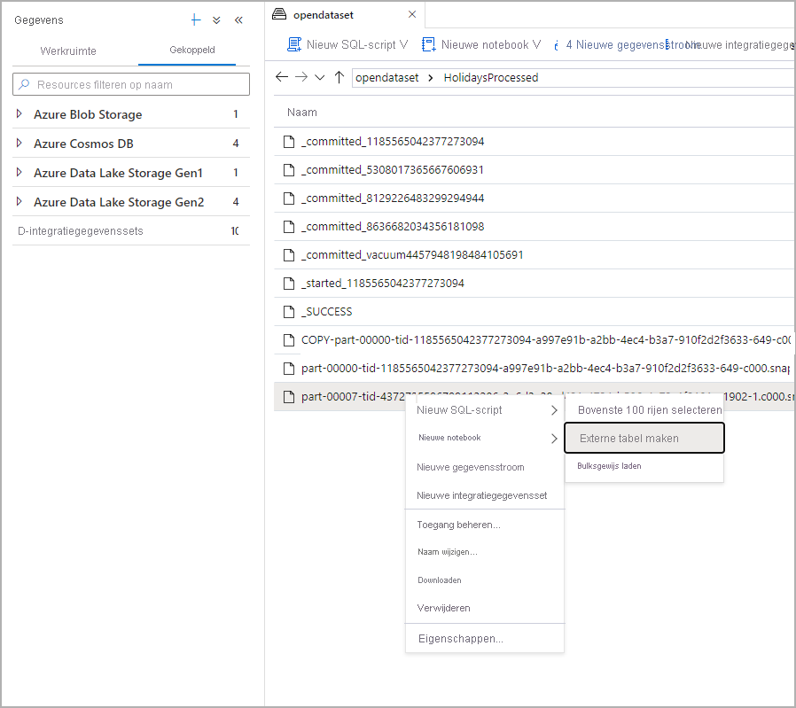

# <a name="use-external-tables-with-synapse-sql"></a>Externe tabellen gebruiken met Synapse SQL

Een externe tabel verwijst naar gegevens die zich in Hadoop, Azure Storage Blob of Azure Data Lake Storage bevinden. Externe tabellen worden gebruikt voor het lezen van gegevens uit bestanden of het schrijven van gegevens naar bestanden in Azure Storage. Met Synapse SQL kunt u externe tabellen gebruiken om gegevens te lezen uit en te schrijven naar SQL-pool of SQL on-demand (preview).

## <a name="external-tables-in-synapse-sql-pool-and-on-demand"></a>Externe tabellen in Synapse SQL-pool en on-demand

### <a name="sql-pool"></a>[SQL-pool](#tab/sql-pool) 

In SQL-pool kunt u een externe tabel gebruiken voor het volgende:

- Query's uitvoeren op Azure Blob Storage en Azure Data Lake Gen2 met Transact-SQL-instructies.
- Gegevens uit Azure Blob Storage en Azure Data Lake Storage importeren en opslaan in SQL-pool.

Wanneer deze wordt gebruikt in combinatie met de instructie [CREATE TABLE AS SELECT](../sql-data-warehouse/sql-data-warehouse-develop-ctas.md?toc=/azure/synapse-analytics/toc.json&bc=/azure/synapse-analytics/breadcrumb/toc.json), worden bij de selectie uit een externe tabel gegevens geïmporteerd in de SQL-pool. Naast de [instructie COPY](/sql/t-sql/statements/copy-into-transact-sql?toc=/azure/synapse-analytics/toc.json&bc=/azure/synapse-analytics/breadcrumb/toc.json&view=azure-sqldw-latest) zijn externe tabellen handig voor het laden van gegevens. 

Raadpleeg [PolyBase gebruiken om gegevens vanuit Azure Blob Storage te laden](../sql-data-warehouse/load-data-from-azure-blob-storage-using-polybase.md?toc=/azure/synapse-analytics/toc.json&bc=/azure/synapse-analytics/breadcrumb/toc.json) voor een zelfstudie over het laden van gegevens.

### <a name="sql-on-demand"></a>[SQL on-demand](#tab/sql-on-demand)

Voor SQL on-demand gebruikt u een externe tabel voor het volgende:

- Query's uitvoeren op gegevens in Azure Blob Storage of Azure Data Lake Storage met Transact-SQL-instructies
- Queryresultaten voor SQL on-demand opslaan in bestanden in Azure Blob Storage of Azure Data Lake Storage met behulp van [CETAS](develop-tables-cetas.md)

U kunt aan de hand van de volgende stappen externe tabellen maken met behulp van SQL on-demand:

1. CREATE EXTERNAL DATA SOURCE
2. CREATE EXTERNAL FILE FORMAT
3. CREATE EXTERNAL TABLE

---

### <a name="security"></a>Beveiliging

De gebruiker moet over de machtiging `SELECT` voor de externe tabel beschikken om de gegevens te kunnen lezen.
Een externe tabel heeft toegang tot de onderliggende Azure Storage met behulp van de referentie voor de database die is gedefinieerd in de gegevensbron aan de hand van de volgende regels:
- Een gegevensbron zonder referenties stelt externe tabellen in staat om toegang te krijgen tot openbaar beschikbare bestanden in Azure Storage.
- De gegevensbron kan referenties bevatten waarmee externe tabellen alleen toegang hebben tot de bestanden in Azure Storage met behulp van een SAS-token of beheerde identiteit van een werkruimte. Zie het artikel [Opslagtoegangsbeheer voor opslagbestanden ontwikkelen](develop-storage-files-storage-access-control.md#examples) voor voorbeelden.

> [!IMPORTANT]
> In SQL-pool kan een Microsoft Azure Active Directory-gebruiker door middel van een gegevensbron zonder referenties toegang krijgen tot opslagbestanden met hun Azure AD-identiteit. In SQL on-demand moet u een gegevensbron maken met een databasereferentie die de eigenschap `IDENTITY='User Identity'` bevat. Zie [hier voorbeelden](develop-storage-files-storage-access-control.md#examples).

## <a name="create-external-data-source"></a>CREATE EXTERNAL DATA SOURCE

Externe gegevensbronnen worden gebruikt om verbinding te maken met opslagaccounts. De volledige documentatie vindt u [hier](/sql/t-sql/statements/create-external-data-source-transact-sql?toc=/azure/synapse-analytics/toc.json&bc=/azure/synapse-analytics/breadcrumb/toc.json&view=azure-sqldw-latest).

### <a name="syntax-for-create-external-data-source"></a>Syntaxis voor CREATE EXTERNAL DATA SOURCE

#### <a name="sql-pool"></a>[SQL-pool](#tab/sql-pool)

```syntaxsql
CREATE EXTERNAL DATA SOURCE <data_source_name>
WITH
(    LOCATION         = '<prefix>://<path>'
     [, CREDENTIAL = <database scoped credential> ]
     , TYPE = HADOOP
)
[;]
```

#### <a name="sql-on-demand"></a>[SQL on-demand](#tab/sql-on-demand)

```syntaxsql
CREATE EXTERNAL DATA SOURCE <data_source_name>
WITH
(    LOCATION         = '<prefix>://<path>'
     [, CREDENTIAL = <database scoped credential> ]
)
[;]
```

---

### <a name="arguments-for-create-external-data-source"></a>Argumenten voor CREATE EXTERNAL DATA SOURCE

data_source_name

Hiermee geeft u de naam voor de gegevensbron op die door de gebruiker is gedefinieerd. De naam moet uniek zijn binnen de database.

#### <a name="location"></a>Locatie
LOCATION = `'<prefix>://<path>'`: geeft het verbindingsprotocol en het pad naar de externe gegevensbron aan. De volgende patronen kunnen worden gebruikt voor locatie:

| Externe gegevensbron        | Voorvoegsel voor locatie | Pad voor locatie                                         |
| --------------------------- | --------------- | ----------------------------------------------------- |
| Azure Blob Storage          | `wasb[s]`       | `<container>@<storage_account>.blob.core.windows.net` |
| Azure Blob Storage          | `http[s]`       | `<storage_account>.blob.core.windows.net/<container>/subfolders` |
| Azure Data Lake Store Gen 1 | `http[s]`       | `<storage_account>.azuredatalakestore.net/webhdfs/v1` |
| Azure Data Lake Store Gen 2 | `http[s]`       | `<storage_account>.dfs.core.windows.net/<container>/subfolders`  |

Met het voorvoegsel `https:` kunt u een submap gebruiken in het pad.

#### <a name="credential"></a>Referentie
CREDENTIAL = `<database scoped credential>` is een optionele referentie die wordt gebruikt voor verificatie in Azure Storage. Een externe gegevensbron zonder referentie heeft toegang tot een openbaar opslagaccount. 

Externe gegevensbronnen zonder referentie in SQL-pool kunnen ook gebruikmaken van de Microsoft Azure Active Directory-identiteit van de aanroeper om toegang te krijgen tot bestanden in de opslag. Een externe gegevensbron met een referentie gebruikt de id die is opgegeven in de referentie om toegang te krijgen tot bestanden.
- In SQL-pool kan een databasereferentie een aangepaste toepassings-id, beheerde identiteit voor de werkruimte of SAK-sleutel bevatten. 
- In SQL on-demand kan een databasereferentie een Microsoft Azure Active Directory-identiteit van de aanroeper, beheerde identiteit voor de werkruimte of SAS-sleutel bevatten. 

#### <a name="type"></a>TYPE
TYPE = `HADOOP` is een verplichte optie in de SQL-pool en geeft aan dat de Polybase-technologie wordt gebruikt voor toegang tot de onderliggende bestanden. Deze parameter kan niet worden gebruikt in de SQL on-demand-service die gebruikmaakt van een eigen ingebouwde lezer.

### <a name="example-for-create-external-data-source"></a>Voorbeeld van CREATE EXTERNAL DATA SOURCE

#### <a name="sql-pool"></a>[SQL-pool](#tab/sql-pool)

In het volgende voorbeeld wordt een externe gegevensbron gemaakt voor Azure Data Lake Gen2 die verwijst naar de gegevensset New York:

```sql
CREATE EXTERNAL DATA SOURCE AzureDataLakeStore
WITH
  -- Please note the abfss endpoint when your account has secure transfer enabled
  ( LOCATION = 'abfss://data@newyorktaxidataset.dfs.core.windows.net' ,
    CREDENTIAL = ADLS_credential ,
    TYPE = HADOOP
  ) ;
```

#### <a name="sql-on-demand"></a>[SQL on-demand](#tab/sql-on-demand)

In het volgende voorbeeld wordt een externe gegevensbron gemaakt voor Azure Data Lake Gen2 waartoe toegang kan worden verkregen met de SAS-referentie:

```sql
CREATE DATABASE SCOPED CREDENTIAL [sqlondemand]
WITH IDENTITY='SHARED ACCESS SIGNATURE',  
SECRET = 'sv=2018-03-28&ss=bf&srt=sco&sp=rl&st=2019-10-14T12%3A10%3A25Z&se=2061-12-31T12%3A10%3A00Z&sig=KlSU2ullCscyTS0An0nozEpo4tO5JAgGBvw%2FJX2lguw%3D'
GO

CREATE EXTERNAL DATA SOURCE SqlOnDemandDemo WITH (
    LOCATION = 'https://sqlondemandstorage.blob.core.windows.net',
    CREDENTIAL = sqlondemand
);
```

In het volgende voorbeeld wordt een externe gegevensbron gemaakt voor Azure Data Lake Gen2 die verwijst naar de openbaar beschikbare gegevensset New York:

```sql
CREATE EXTERNAL DATA SOURCE YellowTaxi
WITH ( LOCATION = 'https://azureopendatastorage.blob.core.windows.net/nyctlc/yellow/')
```
---

## <a name="create-external-file-format"></a>CREATE EXTERNAL FILE FORMAT

Hiermee maakt u een object voor externe bestandsindeling waarmee externe gegevens worden gedefinieerd die zijn opgeslagen in Azure Blob Storage of Azure Data Lake Storage. Als u een externe tabel wilt maken, moet u een externe bestandsindeling maken. De volledige documentatie vindt u [hier](/sql/t-sql/statements/create-external-file-format-transact-sql?toc=/azure/synapse-analytics/toc.json&bc=/azure/synapse-analytics/breadcrumb/toc.json&view=azure-sqldw-latest).

Door een externe bestandsindeling te maken, geeft u de opmaak aan van de gegevens waarnaar wordt verwezen door een externe tabel.

### <a name="syntax-for-create-external-file-format"></a>Syntaxis voor CREATE EXTERNAL FILE FORMAT

```syntaxsql
-- Create an external file format for PARQUET files.  
CREATE EXTERNAL FILE FORMAT file_format_name  
WITH (  
    FORMAT_TYPE = PARQUET  
    [ , DATA_COMPRESSION = {  
        'org.apache.hadoop.io.compress.SnappyCodec'  
      | 'org.apache.hadoop.io.compress.GzipCodec'      }  
    ]);  

--Create an external file format for DELIMITED TEXT files
CREATE EXTERNAL FILE FORMAT file_format_name  
WITH (  
    FORMAT_TYPE = DELIMITEDTEXT  
    [ , DATA_COMPRESSION = 'org.apache.hadoop.io.compress.GzipCodec' ]
    [ , FORMAT_OPTIONS ( <format_options> [ ,...n  ] ) ]  
    );  

<format_options> ::=  
{  
    FIELD_TERMINATOR = field_terminator  
    | STRING_DELIMITER = string_delimiter
    | First_Row = integer
    | USE_TYPE_DEFAULT = { TRUE | FALSE }
    | Encoding = {'UTF8' | 'UTF16'}
}
```

### <a name="arguments-for-create-external-file-format"></a>Argumenten voor CREATE EXTERNAL FILE FORMAT

file_format_name: hiermee geeft u een naam op voor de externe bestandsindeling.

FORMAT_TYPE = [ PARQUET | DELIMITEDTEXT]: hiermee geeft u de indeling van de externe gegevens op.

- PARQUET: Hiermee geeft u een Parquet-indeling op.
- DELIMITEDTEXT: hiermee geeft u een tekstindeling op met kolomscheidingstekens, ook wel veldeindtekens genoemd.

FIELD_TERMINATOR = *field_terminator*: alleen van toepassing op tekstbestanden met scheidingstekens. Het veldeindteken duidt een of meer tekens aan die het einde van elk veld (kolom) in het tekstbestand met scheidingstekens aangeven. De standaardwaarde is het sluisteken (ꞌ|ꞌ).

Voorbeelden:

- FIELD_TERMINATOR = '|'
- FIELD_TERMINATOR = ' '
- FIELD_TERMINATOR = ꞌ\tꞌ

STRING_DELIMITER = *string_delimiter*: hiermee geeft u het veldeindteken op voor gegevens van het type Tekenreeks (String) in het tekstbestand met scheidingstekens. De tekenreeksafsluiting bevat een of meer tekens en staat tussen enkele aanhalingstekens. De standaardwaarde is een lege tekenreeks ("").

Voorbeelden:

- STRING_DELIMITER = '"'
- STRING_DELIMITER = '*'
- STRING_DELIMITER = ꞌ,ꞌ

FIRST_ROW = *First_row_int*: hiermee geeft u het rijnummer op dat het eerst wordt gelezen en van toepassing is op alle bestanden. Als u de waarde instelt op twee, wordt de eerste rij in elk bestand (de koprij) overgeslagen wanneer de gegevens worden geladen. Rijen worden overgeslagen op basis van de rij-eindtekens (/r/n, /r, /n) die worden vermeld.

USE_TYPE_DEFAULT = { TRUE | **FALSE** }: hiermee geeft u op hoe ontbrekende waarden in tekstbestanden met scheidingstekens moeten worden verwerkt bij het ophalen van gegevens uit het tekstbestand.

TRUE: als u gegevens ophaalt uit het tekstbestand, slaat u elke ontbrekende waarde op met behulp van het gegevenstype van de standaardwaarde voor de betreffende kolom in de definitie van de externe tabel. Vervang een ontbrekende waarde bijvoorbeeld door:

- 0 als de kolom is gedefinieerd als een numerieke kolom. Decimale kolommen worden niet ondersteund en veroorzaken een fout.
- Een lege tekenreeks ("") als de kolom een tekenreekskolom is.
- 1900-01-01 als de kolom een datumkolom is.

FALSE: sla alle ontbrekende waarden op als NULL. NULL-waarden die zijn opgeslagen met behulp van het woord NULL in het tekstbestand met scheidingstekens worden geïmporteerd als de tekenreeks NULL.

Encoding = {'UTF8' | 'UTF16'}: SQL on-demand kan met UTF8 en UTF16 gecodeerde tekstbestanden met scheidingstekens lezen.

DATA_COMPRESSION = *data_compression_method*: met dit argument geeft u de gegevenscompressiemethode voor de externe gegevens op. 

Het bestandsindelingstype PARQUET ondersteunt de volgende compressiemethoden:

- DATA_COMPRESSION = org.apache.hadoop.io.compress.GzipCodec
- DATA_COMPRESSION = org.apache.hadoop.io.compress.SnappyCodec

Bij het lezen van externe PARQUET-tabellen wordt dit argument genegeerd, maar het wordt gebruikt bij het schrijven naar externe tabellen met [CETAS](develop-tables-cetas.md).

Het bestandsindelingstype DELIMITEDTEXT ondersteunt de volgende compressiemethode:

- DATA_COMPRESSION = org.apache.hadoop.io.compress.GzipCodec

### <a name="example-for-create-external-file-format"></a>Voorbeeld voor CREATE EXTERNAL FILE FORMAT

In het volgende voorbeeld wordt een externe bestandsindeling gemaakt voor volkstellingsbestanden:

```sql
CREATE EXTERNAL FILE FORMAT census_file_format
WITH
(  
    FORMAT_TYPE = PARQUET,
    DATA_COMPRESSION = 'org.apache.hadoop.io.compress.SnappyCodec'
)
```

## <a name="create-external-table"></a>CREATE EXTERNAL TABLE

Met de opdracht CREATE EXTERNAL TABLE maakt u een externe tabel voor Synapse SQL om toegang te krijgen tot gegevens die zijn opgeslagen in Azure Blob Storage of Azure Data Lake Storage. 

### <a name="syntax-for-create-external-table"></a>Syntaxis voor CREATE EXTERNAL TABLE

```sql
CREATE EXTERNAL TABLE { database_name.schema_name.table_name | schema_name.table_name | table_name }
    ( <column_definition> [ ,...n ] )  
    WITH (
        LOCATION = 'folder_or_filepath',  
        DATA_SOURCE = external_data_source_name,  
        FILE_FORMAT = external_file_format_name
    )  
[;]  

<column_definition> ::=
column_name <data_type>
    [ COLLATE collation_name ]
```

### <a name="arguments-create-external-table"></a>Argumenten voor CREATE EXTERNAL TABLE

*{ database_name.schema_name.table_name | schema_name.table_name | table_name }*

De uit een tot drie delen bestaande naam van de tabel die u wilt maken. Voor een externe tabel slaat SQL on-demand alleen de metagegevens van de tabel op. Er worden geen werkelijke gegevens verplaatst of opgeslagen in SQL on-demand.

<column_definition>, ...*n* ]

CREATE EXTERNAL TABLE ondersteunt de mogelijkheid om de kolomnaam, het gegevenstype, het toestaan van null-waarden en de sortering te configureren. U kunt de STANDAARDBEPERKING niet gebruiken voor externe tabellen.

>[!IMPORTANT]
>De kolomdefinities, waaronder de gegevenstypen en het aantal kolommen, moeten overeenkomen met de gegevens in de externe bestanden. Als deze niet overeenkomen, worden de bestandsrijen afgewezen bij het uitvoeren van query's op de werkelijke gegevens.

Bij het lezen van Parquet-bestanden kunt u alleen de kolommen opgeven die u wilt lezen en de rest overslaan.

LOCATION = *folder_or_filepath*

Hiermee geeft u de map of het bestandspad en de bestandsnaam op voor de werkelijke gegevens in Azure Blob Storage. De locatie gaat uit van de hoofdmap. De hoofdmap is de gegevenslocatie die is opgegeven in de externe gegevensbron.

Als u een map LOCATION opgeeft, wordt een SQL on-demand-query geselecteerd in de externe tabel en worden de bestanden opgehaald uit de map.

> [!NOTE]
> In tegenstelling tot Hadoop en PolyBase, retourneert SQL on-demand geen submappen. Het retourneert bestanden waarvan de bestandsnaam begint met een underscore (_) of een punt (.).

In dit voorbeeld worden door if LOCATION='/webdata/', een SQL on -demand-query, rijen uit mydata.txt en _hidden.txt geretourneerd. Het retourneert niet mydata2.txt en mydata3.txt omdat deze bestanden zich in een submap bevinden.


DATA_SOURCE = *external_data_source_name*: hiermee geeft u de naam op van de externe gegevensbron die de locatie van de externe gegevens bevat. Als u een externe gegevensbron wilt maken, gebruikt u [CREATE EXTERNAL DATA SOURCE](#create-external-data-source).

FILE_FORMAT = *external_file_format_name*: hiermee geeft u de naam op van het object voor de externe bestandsindeling, waarin het bestandstype en de compressiemethode voor de externe gegevens worden opgeslagen. Als u een externe bestandsindeling wilt maken, gebruikt u [CREATE EXTERNAL FILE FORMAT](#create-external-file-format).

### <a name="permissions-create-external-table"></a>Machtigingen voor CREATE EXTERNAL TABLE

Als u een externe tabel wilt selecteren, moet u over de juiste referenties met weergave- en leesmachtigingen beschikken.

### <a name="example-create-external-table"></a>Voorbeeld van CREATE EXTERNAL TABLE

In het volgende voorbeeld wordt een externe tabel gemaakt. Hiermee wordt de eerste rij geretourneerd:

```sql
CREATE EXTERNAL TABLE census_external_table
(
    decennialTime varchar(20),
    stateName varchar(100),
    countyName varchar(100),
    population int,
    race varchar(50),
    sex    varchar(10),
    minAge int,
    maxAge int
)  
WITH (
    LOCATION = '/parquet/',
    DATA_SOURCE = population_ds,  
    FILE_FORMAT = census_file_format
)
GO

SELECT TOP 1 * FROM census_external_table
```

## <a name="create-and-query-external-tables-from-a-file-in-azure-data-lake"></a>Externe tabellen maken en hierop query's uitvoeren via een bestand in Azure Data Lake

Met de verkenningsmogelijkheden van Data Lake kunt u nu een externe tabel maken en hierop query's uitvoeren met SQL-pool of SQL on-demand door eenvoudig met de rechtermuisknop op het bestand te klikken.

### <a name="prerequisites"></a>Vereisten

- U moet toegang hebben tot de werkruimte met ten minste de ARM-toegangsrol Storage Blob Data Contributor voor het ADLS Gen2-account

- U moet ten minste over [machtigingen beschikken voor het maken](/sql/t-sql/statements/create-external-table-transact-sql?toc=/azure/synapse-analytics/toc.json&bc=/azure/synapse-analytics/breadcrumb/toc.json&view=azure-sqldw-latest#permissions-2) van externe tabellen en het uitvoeren van query's hierop in de SQL-pool of SQL on-demand

- De gekoppelde service die aan het ADLS Gen2-account is gekoppeld, **moet toegang hebben tot het bestand**. Als de verificatiemethode van de gekoppelde service bijvoorbeeld beheerde identiteit is, moet de beheerde identiteit voor de werkruimte ten minste over de machtiging Lezer van Storage Blob beschikken voor het opslagaccount

Selecteer in het deelvenster Gegevens het bestand waaruit u de externe tabel wilt maken:
> [!div class="mx-imgBorder"]
>

Er wordt een dialoogvenster geopend. Selecteer SQL-pool of SQL on-demand, geef de tabel een naam en selecteer Script openen:

> [!div class="mx-imgBorder"]
>

Het SQL-script wordt automatisch gegenereerd, waarbij het schema wordt afgeleid van het bestand:
> [!div class="mx-imgBorder"]
>

Voer het script uit. Het script voert automatisch een Select Top 100 *. uit:
> [!div class="mx-imgBorder"]
>

De externe tabel wordt nu gemaakt. In het vervolg kan de gebruiker de inhoud van deze externe tabel bekijken door rechtstreeks vanuit het deelvenster Gegevens query's hierop uit te voeren:
> [!div class="mx-imgBorder"]
>

## <a name="next-steps"></a>Volgende stappen

Raadpleeg het [CETAS](develop-tables-cetas.md)-artikel om te zien hoe u de queryresultaten in een externe tabel in Azure Storage opslaat. U kunt ook beginnen met het uitvoeren van query's op [externe tabellen van Apache Spark voor Azure Synapse](develop-storage-files-spark-tables.md).
