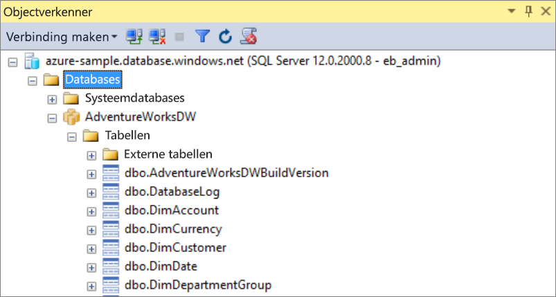
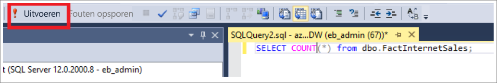
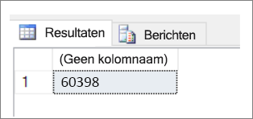

# <a name="connect-to-synapse-sql-with-sql-server-management-studio-ssms"></a>Verbinding maken met Synapse SQL met behulp van SQL Server Management Studio (SSMS)
> [!div class="op_single_selector"]
> * [Azure Data Studio](get-started-azure-data-studio.md)
> * [Power BI](get-started-power-bi-professional.md)
> * [Visual Studio](../sql-data-warehouse/sql-data-warehouse-query-visual-studio.md?toc=/azure/synapse-analytics/toc.json&bc=/azure/synapse-analytics/breadcrumb/toc.json)
> * [sqlcmd](../sql/get-started-connect-sqlcmd.md)
> * [SSMS](get-started-ssms.md)
> 
> 

U kunt [SQL Server Management Studio (SSMS)](/sql/ssms/download-sql-server-management-studio-ssms) gebruiken om verbinding te maken met Synapse SQL en query's uit te voeren op Azure Synapse Analytics via SQL on-demand (preview) of SQL-poolresources. 

### <a name="supported-tools-for-sql-on-demand-preview"></a>Ondersteunde hulpprogramma's voor SQL on-demand (preview)

[Azure Data Studio](/sql/azure-data-studio/download-azure-data-studio) wordt volledig ondersteund vanaf versie 1.18.0. SSMS wordt gedeeltelijk ondersteund vanaf versie 18.5, maar u kunt het hulpprogramma gebruiken om alleen verbinding te maken en query's uit te voeren.

> [!NOTE]
> Als voor een AAD-aanmelding een verbinding is geopend die langer dan één uur duurt tijdens het uitvoeren van de query, mislukken alle query's die afhankelijk zijn van AAD. Dit omvat het uitvoeren van query's in opslag met AAD Pass-through en instructies die communiceren met AAD (zoals CREATE EXTERNAL PROVIDER). Dit is van invloed op elk hulpprogramma dat verbindingen openhoudt, zoals de query-editor in SSMS en ADS. Hulpprogramma's waarmee nieuwe verbindingen worden geopend om een query uit te voeren, zoals Synapse Studio, worden niet beïnvloed.
> U kunt SSMS opnieuw starten of een verbinding maken en weer verbreken in ADS om dit probleem te verhelpen. .
## <a name="prerequisites"></a>Vereisten

Zorg ervoor dat u voordat u begint over het volgende beschikt:  

* [SQL Server Management Studio (SSMS)](/sql/ssms/download-sql-server-management-studio-ssms). 
* Voor de SQL-pool hebt u een bestaand datawarehouse nodig. Zie [Een SQL-pool maken](../quickstart-create-sql-pool-portal.md) voor informatie over het maken van een datawarehouse. Voor SQL on-demand is er tijdens het maken al een in uw werkruimte ingericht. 
* De volledig gekwalificeerde SQL-servernaam. Zie [Verbinding maken met Synapse SQL](connect-overview.md) om deze te vinden.

## <a name="connect"></a>Verbinding maken

### <a name="sql-pool"></a>SQL-pool

Voer de volgende stappen uit om verbinding te maken met Synapse SQL met behulp van de SQL-pool: 

1. Open SQL Server Management Studio (SSMS). 
1. Vul in het dialoogvenster **Verbinding maken met server** de velden in en selecteer vervolgens **Verbinding maken**: 
  
    
   
   * **Servernaam**: Voer de eerder vastgestelde **servernaam** in.
   * **Verificatie**:  Kies een verificatietype, zoals **SQL Server-verificatie** of **Geïntegreerde Active Directory-verificatie**.
   * **Gebruikersnaam** en **Wachtwoord**: Voer uw gebruikersnaam en wachtwoord in als u hierboven SQL Server-verificatie hebt geselecteerd.

1. Vouw uw Azure SQL Server uit in **Objectverkenner**. U kunt de databases weergeven die zijn gekoppeld aan de server, zoals de voorbeelddatabase AdventureWorksDW. U kunt de database uitvouwen om de tabellen te bekijken:
   
    


### <a name="sql-on-demand-preview"></a>SQL on-demand (preview)

Voer de volgende stappen uit om verbinding te maken met Synapse SQL met behulp van SQL on-demand: 

1. Open SQL Server Management Studio (SSMS).
1. Vul in het dialoogvenster **Verbinding maken met server** de velden in en selecteer vervolgens **Verbinding maken**: 
   
    
   
   * **Servernaam**: Voer de eerder vastgestelde **servernaam** in.
   * **Verificatie**: Kies een verificatietype, zoals **SQL Server-verificatie** of **Geïntegreerde Active Directory-verificatie**:
   * **Gebruikersnaam** en **Wachtwoord**: Voer uw gebruikersnaam en wachtwoord in als u hierboven SQL Server-verificatie hebt geselecteerd.
   * Klik op **Verbinden**.

4. U kunt de Azure SQL-server uitvouwen als u deze wilt verkennen. U kunt de databases weergeven die aan de server zijn gekoppeld. Vouw *demo* uit om de inhoud in de voorbeelddatabase te bekijken.
   
    


## <a name="run-a-sample-query"></a>Een voorbeeldquery uitvoeren

### <a name="sql-pool"></a>SQL-pool

Nu u een databaseverbinding tot stand hebt gebracht, kunt u een query uitvoeren op de gegevens.

1. Klik met de rechtermuisknop op de database in SQL Server-objectverkenner.
2. Selecteer **New Query** (Nieuwe query). Een nieuwe queryvenster wordt geopend.
   
    
3. Kopieer deze T-SQL-query naar het queryvenster:
   
    ```sql
    SELECT COUNT(*) FROM dbo.FactInternetSales;
    ```
4. Voer de query uit. Klik hiertoe op `Execute` of gebruik de volgende snelkoppeling: `F5`.
   
    
5. Bekijk de resultaten van de query. In dit voorbeeld heeft de tabel FactInternetSales 60398 rijen.
   
    

### <a name="sql-on-demand"></a>SQL on-demand

Nu u een databaseverbinding tot stand hebt gebracht, kunt u een query uitvoeren op de gegevens.

1. Klik met de rechtermuisknop op de database in SQL Server-objectverkenner.
2. Selecteer **New Query** (Nieuwe query). Een nieuwe queryvenster wordt geopend.
   
    
3. Kopieer de volgende T-SQL-query in het queryvenster:
   
    ```sql
    SELECT COUNT(*) FROM demo.dbo.usPopulationView
    ```
4. Voer de query uit. Klik hiertoe op `Execute` of gebruik de volgende snelkoppeling: `F5`.
   
    
5. Bekijk de resultaten van de query. In dit voorbeeld heeft de weergave usPopulationView 3664512 rijen.
   
    

## <a name="next-steps"></a>Volgende stappen
Nu u weet hoe u verbinding maakt en een query uitvoert, kunt u proberen [de gegevens te visualiseren met Power BI](get-started-power-bi-professional.md).

Zie [Verifiëren bij Synapse SQL](../sql-data-warehouse/sql-data-warehouse-authentication.md?toc=/azure/synapse-analytics/toc.json&bc=/azure/synapse-analytics/breadcrumb/toc.json) om uw omgeving te configureren voor Azure Active Directory-verificatie.

